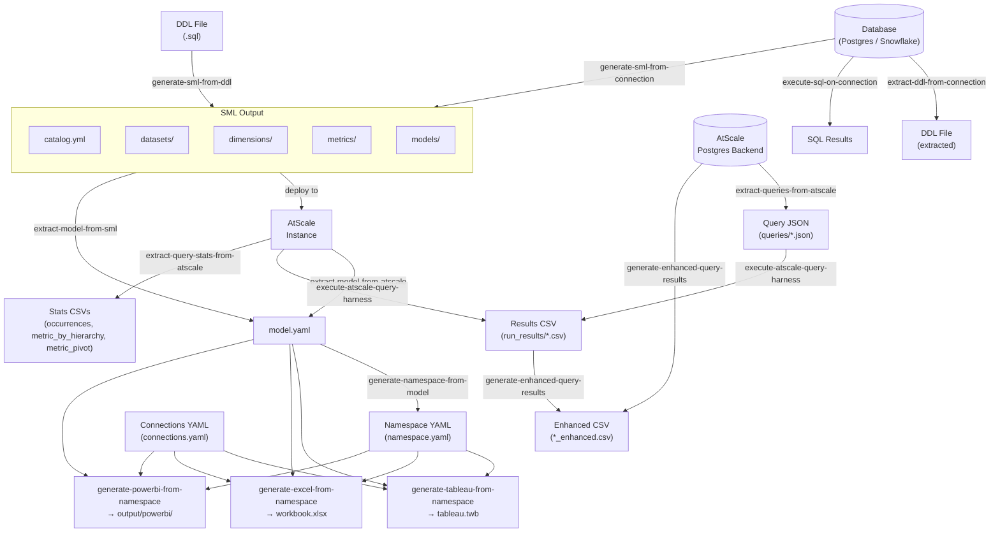

# GitHub Actions Guide

This document describes how to run every CLI operation as a GitHub Actions workflow via the **composite action** (`action.yml`) bundled in this repository.



## Table of Contents

- [Prerequisites](#prerequisites)
  - [Required secrets](#required-secrets)
  - [Using the composite action](#using-the-composite-action)
- [Operations](#operations)
  - Model Extraction
    - [`extract-model-from-atscale`](#extract-model-from-atscale)
    - [`extract-model-from-sml`](#extract-model-from-sml)
  - SML Creation and Manipulation
    - [`execute-sql-on-connection`](#execute-sql-on-connection)
    - [`extract-ddl-from-connection`](#extract-ddl-from-connection)
    - [`generate-sml-from-connection`](#generate-sml-from-connection)
    - [`generate-sml-from-ddl`](#generate-sml-from-ddl)
    - [`generate-sml-from-xml`](#generate-sml-from-xml)
    - [`generate-metrics-from-model`](#generate-metrics-from-model)
  - Synthetic Data Generation
    - [`extract-data-shape-from-connection`](#extract-data-shape-from-connection)
    - [`generate-ddl-from-data-shape`](#generate-ddl-from-data-shape)
    - [`generate-data-from-data-shape`](#generate-data-from-data-shape)
    - [`generate-data-from-data-shape-to-connection`](#generate-data-from-data-shape-to-connection)
  - Visualization and Namespace Processing
    - [`generate-namespace-from-model`](#generate-namespace-from-model)
    - [`generate-tableau-from-namespace`](#generate-tableau-from-namespace)
    - [`generate-excel-from-namespace`](#generate-excel-from-namespace)
    - [`generate-powerbi-from-namespace`](#generate-powerbi-from-namespace)
  - Testing / Query Processing
    - [`generate-queries-from-sml`](#generate-queries-from-sml)
    - [`generate-queries-from-model`](#generate-queries-from-model)
    - [`extract-query-stats-from-atscale`](#extract-query-stats-from-atscale)
    - [`extract-queries-from-atscale`](#extract-queries-from-atscale)
    - [`execute-atscale-query-harness`](#execute-atscale-query-harness)
    - [`execute-query-on-connection`](#execute-query-on-connection)
    - [`generate-enhanced-query-results`](#generate-enhanced-query-results)
    - [`execute-run-analysis`](#execute-run-analysis)
  - AtScale Config
    - [`generate-atscale-install-yaml`](#generate-atscale-install-yaml)
    - [`atscale-list-data-sources`](#atscale-list-data-sources)
    - [`atscale-create-data-source`](#atscale-create-data-source)
    - [`atscale-list-repos`](#atscale-list-repos)
    - [`atscale-create-repo`](#atscale-create-repo)
    - [`atscale-list-deployments`](#atscale-list-deployments)
    - [`atscale-deploy-catalog`](#atscale-deploy-catalog)
    - [`atscale-list-model-errors`](#atscale-list-model-errors)
    - [`deploy-atscale-microk8s`](#deploy-atscale-microk8s)
- [End-to-end pipelines](#end-to-end-pipelines)
  - [DDL → Tableau (fully offline)](#ddl--tableau-fully-offline)
  - [Database → Tableau](#database--tableau)
  - [AtScale → Tableau](#atscale--tableau)
  - [AtScale → Excel](#atscale--excel)
  - [AtScale → Power BI](#atscale--power-bi)
  - [DDL → SML → AtScale → Tableau](#ddl--sml--atscale--tableau)
  - [SQL migration on every push](#sql-migration-on-every-push)

---

## Prerequisites

### Required secrets

Add secrets at **Settings → Secrets and variables → Actions → New repository secret**.

| Secret | Used by | Contents |
|---|---|---|
| `CONNECTIONS_FILE` | `extract-model-from-atscale`, `generate-sml-from-connection`, `generate-tableau-from-namespace`, `generate-excel-from-namespace`, `generate-powerbi-from-namespace`, `execute-sql-on-connection`, `extract-ddl-from-connection`, `extract-query-stats-from-atscale`, `extract-queries-from-atscale`, `execute-atscale-query-harness`, `atscale-list-data-sources`, `atscale-create-data-source`, `atscale-list-repos`, `atscale-create-repo`, `atscale-list-deployments`, `atscale-deploy-catalog`, `atscale-list-model-errors` | Full contents of your `connections.yaml` file (or a `systems.properties` file for the query harness operations) |
| `VM_ADMIN_PASSWORD` | `deploy-atscale-microk8s` | Password for the `atscale` OS user on the target VM |

A single `CONNECTIONS_FILE` secret can serve all operations because they all read from the same connections YAML format. See [Connection YAML](README.md#connection-yaml-connectionsyaml) for the full format reference.

> **Security:** Never commit `connections.yaml` to source control. Always supply it via a secret.

---

### Using the composite action

`action.yml` at the root of this repository is a GitHub [composite action](https://docs.github.com/en/actions/sharing-automations/creating-actions/creating-a-composite-action). It handles Node.js setup, dependency installation, build, and credential writing automatically.

```yaml
- uses: AtScaleInc/ps-template@main
  with:
    operation: extract-model-from-atscale
    connection-file: ${{ secrets.CONNECTIONS_FILE }}
    connection-name: my_connection
    model: MyModel
    output-model-file: model.yaml
```

The `operation` input is required. All other inputs are optional and operation-specific — see each operation section below for the full `with:` block.

---

## Operations

### `extract-model-from-atscale`

Connects to a live AtScale instance via MDX and extracts a model's metrics and attributes into `model.yaml`.

**Requires:** `CONNECTIONS_FILE` secret with an `mdx:` block in the named connection.

#### Using the composite action

```yaml
- uses: AtScaleInc/ps-template@main
  with:
    operation: extract-model-from-atscale
    connection-file: ${{ secrets.CONNECTIONS_FILE }}
    connection-name: ats_connection
    model: Telemetry
    output-model-file: model.yaml
```

---

### `extract-model-from-sml`

Reads a local SML directory and outputs a `model.yaml` in the same format as `extract-model-from-atscale`. Use this when an SML directory is already present in the repository (e.g. committed or produced by a prior step) and no live AtScale connection is available.

**Requires:** No secrets if the SML directory is committed to the repo.

#### Using the composite action

```yaml
- uses: actions/checkout@v4

- uses: AtScaleInc/ps-template@main
  with:
    operation: extract-model-from-sml
    sml-dir: sml-output
    model-name: SalesModel        # optional — omit to use first model found
    output-model-file: model.yaml
```

---

### `generate-metrics-from-model`

Reads a `model.yaml` file, reconstructs a SemanticModel from its `mdx` and `sql` sections, and runs the analysis-suggestions engine to produce a ranked list of suggested metric × dimension combinations. Each suggestion includes a relevance score, analysis type, measure details, and the dimensions to slice by. Useful for quickly discovering the most analytically valuable queries a model supports.

**Output formats:**
- `text` (default) — human-readable numbered list
- `yaml` — structured YAML suitable for downstream processing

**Requires:** No secrets — only a `model.yaml` file produced by a prior step or committed to the repo.

#### Parameters

| Parameter | Default | Description |
|---|---|---|
| `model-file` | — | Path to the `model.yaml` file (**required**) |
| `model-name` | first model | Model name when `model.yaml` contains multiple models |
| `sml-config-file` | `sml.style.yaml` | Path to the SML style config to read settings from. Effective settings are written to `sml.style.yaml` in the output file's directory after generation. |
| `max-suggestions` | `25` | Maximum number of suggestions to output. Can also be set in `sml.style.yaml`. |
| `min-score` | `0.5` | Minimum relevance score [0–1]. Can also be set in `sml.style.yaml`. |
| `include-tuples` | `true` | Include multi-dimension suggestions. Can also be set in `sml.style.yaml`. |
| `format` | `text` | Output format: `text` or `yaml` |
| `output-file` | stdout | File to write output to (omit to print to stdout) |

#### Using the composite action

```yaml
- uses: actions/checkout@v4

- uses: AtScaleInc/ps-template@main
  with:
    operation: generate-metrics-from-model
    model-file: model.yaml
    max-suggestions: "20"         # optional, default 25
    min-score: "0.6"              # optional, default 0.5
    include-tuples: "true"        # optional, default true
    output-file: suggestions.txt  # optional, prints to stdout if omitted
```

**Using a style config file** (persist settings between runs):

```yaml
- uses: AtScaleInc/ps-template@main
  with:
    operation: generate-metrics-from-model
    model-file: model.yaml
    sml-config-file: sml.style.yaml   # optional, default "sml.style.yaml"
    output-file: suggestions.txt
```

**YAML output** (for downstream scripting):

```yaml
- uses: AtScaleInc/ps-template@main
  with:
    operation: generate-metrics-from-model
    model-file: model.yaml
    format: yaml
    output-file: suggestions.yaml
```

---

### `generate-namespace-from-model`

Reads a `model.yaml` file and auto-generates a namespace YAML using the analysis-suggestions engine. Each suggestion becomes a worksheet (`line`, `bar`, or `text`). Time-based line charts include an `xAxisGranularity` field and the granularity is embedded in the worksheet title (e.g. "Sum Queries by Week"). The output is ready to pass directly to any BI generator.

**Requires:** No secrets — only a `model.yaml` file produced by a prior step or committed to the repo.

#### Using the composite action

```yaml
- uses: actions/checkout@v4

- uses: AtScaleInc/ps-template@main
  with:
    operation: generate-namespace-from-model
    model-file: model.yaml
    title: "Sales Analytics"      # optional
    max-suggestions: "20"         # optional, default 25
    min-score: "0.5"              # optional, default 0.5
    output-file: namespace.yaml
```

---

### `execute-sql-on-connection`

Reads a SQL file, splits it into individual statements (handling string literals, quoted identifiers, and comments), and executes each one against a named database connection. Supports DDL, DML, and mixed files. Use `--dry-run true` to preview without executing, and `--on-error continue` to log failures and keep going.

**Requires:** `CONNECTIONS_FILE` secret with a `sql:` block in the named connection.

#### Using the composite action

```yaml
- uses: actions/checkout@v4

- uses: AtScaleInc/ps-template@main
  with:
    operation: execute-sql-on-connection
    connection-file: ${{ secrets.CONNECTIONS_FILE }}
    connection-name: snow_demo
    sql-file: migrations/001_init.sql
    on-error: stop
```

**Dry-run mode** (preview statements without executing):

```yaml
- uses: AtScaleInc/ps-template@main
  with:
    operation: execute-sql-on-connection
    connection-file: ${{ secrets.CONNECTIONS_FILE }}
    connection-name: snow_demo
    sql-file: migrations/001_init.sql
    dry-run: "true"
```

---

### `extract-ddl-from-connection`

Connects to a live database, reads schema metadata for each table in the target schema, and writes `CREATE TABLE` DDL statements to a file. Use `--tables` to limit extraction to specific tables or wildcard patterns.

**Requires:** `CONNECTIONS_FILE` secret with a `sql:` block in the named connection.

#### Using the composite action

```yaml
- uses: actions/checkout@v4

- uses: AtScaleInc/ps-template@main
  with:
    operation: extract-ddl-from-connection
    connection-file: ${{ secrets.CONNECTIONS_FILE }}
    connection-name: snow_demo
    schema: PUBLIC
    output-file: schema/extracted.ddl
```

With table filtering:

```yaml
- uses: AtScaleInc/ps-template@main
  with:
    operation: extract-ddl-from-connection
    connection-file: ${{ secrets.CONNECTIONS_FILE }}
    connection-name: snow_demo
    schema: PUBLIC
    tables: "Dim*,FactInternetSales"
    output-file: schema/extracted.ddl
```

---

### `extract-data-shape-from-connection`

Connects to a live database, reads an SML model to understand the semantic layer structure, and extracts a statistical fingerprint of the data without reading any actual values. The fingerprint captures hierarchy level cardinalities, rollup ratios, leaf-level fact densities, measure distributions, and conformed dimension overlap.

All entity names are replaced with opaque sequential IDs (`D1`, `D1.H1`, `F1`, `F1.M2`). Large fact tables are automatically sampled via `TABLESAMPLE SYSTEM` or a `LIMIT`-based fallback.

**Requires:** `CONNECTIONS_FILE` secret with a `sql:` block in the named connection. An SML directory (from `generate-sml-from-connection` or `generate-sml-from-ddl`) must be available in the workspace.

#### Using the composite action

```yaml
- uses: actions/checkout@v4

- uses: AtScaleInc/ps-template@main
  with:
    operation: generate-sml-from-connection
    connection-file: ${{ secrets.CONNECTIONS_FILE }}
    connection-name: snow_demo
    output-dir: sml-output

- uses: AtScaleInc/ps-template@main
  with:
    operation: extract-data-shape-from-connection
    connection-file: ${{ secrets.CONNECTIONS_FILE }}
    connection-name: snow_demo
    sml-path: sml-output
    output-file: data-shape.yaml
```

With sampling tuning and MySQL (`--no-tablesample`):

```yaml
- uses: AtScaleInc/ps-template@main
  with:
    operation: extract-data-shape-from-connection
    connection-file: ${{ secrets.CONNECTIONS_FILE }}
    connection-name: mysql_prod
    sml-path: sml-output
    output-file: data-shape.yaml
    target-fact-rows: "50000"
    target-column-rows: "5000"
    tablesample: "false"
```

| Input | Required | Default | Description |
|---|---|---|---|
| `connection-name` | Yes | | Name of the connection entry in the connections file |
| `sml-path` | Yes | | Path to the SML output directory or a model.yml file |
| `connection-file` | Yes | | Contents of the connections YAML (pass via secret) |
| `output-file` | No | `data-shape.yaml` | Output path for the fingerprint YAML |
| `target-fact-rows` | No | `100000` | Target row count for fact table sampling (0 = no limit) |
| `target-column-rows` | No | `10000` | Target row count for measure column sampling (0 = no limit) |
| `tablesample` | No | `true` | Set to `"false"` to disable `TABLESAMPLE SYSTEM` (required for MySQL/MariaDB) |

**Output:** A `data-shape.yaml` fingerprint file with obfuscated statistics. See [STATISTICS.md](../STATISTICS.md) for the full algorithm description.

---

### `generate-ddl-from-data-shape`

Reads a `data-shape.yaml` fingerprint file and emits `CREATE TABLE` DDL. No database connection is required — the fingerprint contains all structural information needed to reconstruct the schema.

Dimension tables are emitted first so foreign key references are always valid. Table and column names are synthetic and deterministic: the same fingerprint always produces identical DDL.

**Requires:** No secrets. The fingerprint file must be present in the workspace (typically an artifact from a prior `extract-data-shape-from-connection` step).

#### Using the composite action

```yaml
# Typical pipeline: extract shape → generate DDL
- uses: AtScaleInc/ps-template@main
  with:
    operation: extract-data-shape-from-connection
    connection-file: ${{ secrets.CONNECTIONS_FILE }}
    connection-name: snow_demo
    sml-path: sml-output
    output-file: data-shape.yaml

- uses: AtScaleInc/ps-template@main
  with:
    operation: generate-ddl-from-data-shape
    input-file: data-shape.yaml
    output-file: schema.sql
```

With Snowflake dialect:

```yaml
- uses: AtScaleInc/ps-template@main
  with:
    operation: generate-ddl-from-data-shape
    input-file: data-shape.yaml
    dialect: snowflake
    output-file: schema_snowflake.sql
```

| Input | Required | Default | Description |
|---|---|---|---|
| `input-file` | No | `data-shape.yaml` | Path to the fingerprint YAML file |
| `output-file` | No | stdout | Output path for the generated DDL |
| `dialect` | No | `ansi` | SQL dialect: `ansi`, `postgresql`, `snowflake`, `mysql`, `bigquery` |

**Dialect notes:** `bigquery` omits `PRIMARY KEY`/`FOREIGN KEY` constraints. `snowflake` maps integers to `NUMBER(n,0)`. All others use standard ANSI types.

---

### `generate-data-from-data-shape`

Reads a `data-shape.yaml` fingerprint and generates statistically equivalent synthetic CSV data. No database connection is required.

**Requires:** No secrets. The fingerprint file must be present in the workspace.

#### Using the composite action

```yaml
- uses: AtScaleInc/ps-template@main
  with:
    operation: generate-data-from-data-shape
    input-file: data-shape.yaml
    output-dir: data
```

With scale factor and seed:

```yaml
- uses: AtScaleInc/ps-template@main
  with:
    operation: generate-data-from-data-shape
    input-file: data-shape.yaml
    output-dir: data
    scale-factor: "0.01"
    seed: "42"
```

| Input | Required | Default | Description |
|---|---|---|---|
| `input-file` | No | `data-shape.yaml` | Path to the fingerprint YAML file |
| `output-dir` | No | `data` | Directory where CSV files are written |
| `scale-factor` | No | `1.0` | Scale row and member counts |
| `seed` | No | — | Integer seed for reproducible output |
| `reports-dir` | No | `<output-dir>/_reports` | Directory for security audit artifacts |

**Output:** One CSV per table — dimensions first (`dim_1.csv`, …), facts second (`fact_1.csv`, …). A `_reports/` subdirectory also receives `pipeline_isolation_report.json`, `generation_manifest.json`, and `integrity_report.json` — the audit artifacts required by the cube promotion checklist (see [STATISTICS.md §Security & Compliance Controls](STATISTICS.md#security--compliance-controls)).

---

### `generate-data-from-data-shape-to-connection`

End-to-end pipeline: reads a `data-shape.yaml` fingerprint, generates synthetic data in memory, and loads it into a live database. Optionally drops and recreates the schema first.

**Requires:** `CONNECTIONS_FILE` secret with a `sql:` block for the named connection.

#### Using the composite action

Minimal — insert into existing tables:

```yaml
- uses: AtScaleInc/ps-template@main
  with:
    operation: generate-data-from-data-shape-to-connection
    connection-file: ${{ secrets.CONNECTIONS_FILE }}
    connection-name: snow_demo
    input-file: data-shape.yaml
```

Full pipeline — extract shape, generate DDL, populate:

```yaml
- uses: AtScaleInc/ps-template@main
  with:
    operation: extract-data-shape-from-connection
    connection-file: ${{ secrets.CONNECTIONS_FILE }}
    connection-name: snow_prod
    sml-path: sml-output
    output-file: data-shape.yaml

- uses: AtScaleInc/ps-template@main
  with:
    operation: generate-data-from-data-shape-to-connection
    connection-file: ${{ secrets.CONNECTIONS_FILE }}
    connection-name: snow_sandbox
    input-file: data-shape.yaml
    drop-if-exists: "true"
    dialect: snowflake
    schema: PUBLIC
    scale-factor: "0.1"
    seed: "42"
```

| Input | Required | Default | Description |
|---|---|---|---|
| `connection-file` | Yes | — | Connections YAML secret |
| `connection-name` | Yes | — | Name of the target connection |
| `input-file` | No | `data-shape.yaml` | Path to the fingerprint YAML file |
| `scale-factor` | No | `1.0` | Scale row and member counts |
| `seed` | No | — | Integer seed for reproducible output |
| `create-tables` | No | `false` | Emit `CREATE TABLE` before inserting |
| `drop-if-exists` | No | `false` | `DROP TABLE IF EXISTS` before creating — implies `create-tables` |
| `dialect` | No | `ansi` | SQL dialect: `ansi`, `postgresql`, `snowflake`, `mysql`, `bigquery` |
| `batch-size` | No | `500` | Rows per `INSERT` statement |
| `schema` | No | — | Schema prefix to qualify table names (e.g. `PUBLIC`) |
| `reports-dir` | No | `_reports` | Directory for security audit artifacts |

**Operation order:** DROP facts → DROP dims → CREATE dims → CREATE facts → INSERT dims → INSERT facts. This order ensures FK constraints are respected throughout.

**Security artifacts:** a `_reports/` directory is emitted alongside the working directory containing `pipeline_isolation_report.json`, `generation_manifest.json`, and `integrity_report.json`. These satisfy the cube promotion checklist and confirm (a) no real data was accessed during generation, (b) every `_key` column value is a positive integer allocated in-process, and (c) every fact FK value resolves to a dimension leaf key. See [STATISTICS.md §Security & Compliance Controls](STATISTICS.md#security--compliance-controls) for the full list.

---

### `generate-sml-from-connection`

Connects to a live database, introspects its schema, runs semantic model inference, and writes a complete SML directory.

**Inference highlights:** composite primary/foreign keys, FK graph-topology classification, bridge/junction table detection (classified as shared dimensions), naming convention patterns (`dim_*`, `fct_*`, `lkp_*`, `bridge_*`, `xref_*`, etc.), `information_schema` FK queries with driver-level fallback, one model relationship per hierarchy leaf level.

**Requires:** `CONNECTIONS_FILE` secret with a `sql:` block in the named connection.

Style parameters (`pii-severity`, `fact-tables`, `catalog-name`, `camel-case-files`, `camel-case-measures`, `sample-size`, `min-hierarchies-per-dim`, `max-hierarchies-per-dim`) can also be set in `sml.style.yaml` (see [SML Style Config](../README.md#sml-style-config-smlstyleyaml)). CLI inputs take priority over the file. Effective settings are always written to `<output-dir>/sml.style.yaml` regardless of the input config path.

#### Using the composite action

```yaml
- uses: AtScaleInc/ps-template@main
  with:
    operation: generate-sml-from-connection
    connection-file: ${{ secrets.CONNECTIONS_FILE }}
    connection-name: snow_demo
    model-name: SalesModel
    output-dir: sml-output
    sml-config-file: sml.style.yaml                   # optional — input settings file
    pii-severity: MEDIUM                              # optional
    schema: PUBLIC                                    # optional
    fact-tables: "FactInternetSales,FactResellerSales" # optional — override auto-classification
    camel-case-files: "true"                          # optional — camelCase filenames
    camel-case-measures: "true"                       # optional — camelCase metric labels
    min-hierarchies-per-dim: "1"                      # optional — drop dimensions with fewer hierarchies
    max-hierarchies-per-dim: "4"                      # optional — cap hierarchies per dimension
```

---

### `generate-sml-from-ddl`

Parses a SQL DDL file from the repository and generates SML files without a live database connection. No secrets required.

All inference capabilities from `generate-sml-from-connection` apply — composite keys, bridge detection, naming patterns, and one-relationship-per-hierarchy. FK constraints in the DDL (`FOREIGN KEY (…) REFERENCES …`) are parsed and used for relationship inference.

**Requires:** No secrets — the DDL file must be present in the repository.

Style parameters (`pii-severity`, `fact-tables`, `catalog-name`, `camel-case-files`, `camel-case-measures`, `min-hierarchies-per-dim`, `max-hierarchies-per-dim`) can also be set in `sml.style.yaml` (see [SML Style Config](../README.md#sml-style-config-smlstyleyaml)). CLI inputs take priority over the file. Effective settings are always written to `<output-dir>/sml.style.yaml` regardless of the input config path.

#### Using the composite action

```yaml
- uses: actions/checkout@v4

- uses: AtScaleInc/ps-template@main
  with:
    operation: generate-sml-from-ddl
    ddl-file: schema/sales.sql
    model-name: SalesModel        # optional
    output-dir: sml-output
    connection-name: snow_demo    # optional — embedded in SML files
    sml-config-file: sml.style.yaml  # optional — input settings file
    pii-severity: MEDIUM          # optional
    fact-tables: "FactInternetSales,FactResellerSales" # optional — override auto-classification
    camel-case-files: "true"      # optional — camelCase filenames
    camel-case-measures: "true"   # optional — camelCase metric labels
    min-hierarchies-per-dim: "1"  # optional — drop dimensions with fewer hierarchies
    max-hierarchies-per-dim: "4"  # optional — cap hierarchies per dimension
```

---

### `generate-sml-from-xml`

Reads an AtScale XML project file (`project_2_0` format) and converts it to AtScale SML YAML files. No database connection or secrets required — the conversion runs entirely from the XML model definition.

**Requires:** No secrets — the XML file must be present in the repository.

#### Using the composite action

```yaml
- uses: actions/checkout@v4

- uses: AtScaleInc/ps-template@main
  with:
    operation: generate-sml-from-xml
    xml-file: MyModel.xml
    output-dir: sml-output
    connection-name: my_bq_conn       # optional — auto-detected from XML if omitted
    connection-type: bigquery         # optional — written to connection file
    connection-db: my-project-id      # optional — database/project in connection file
    connection-schema: my_dataset     # optional — schema/dataset in connection file
    catalog-name: "My Catalog"        # optional — overrides the XML schema name
```

| Input | Required | Default | Description |
|---|---|---|---|
| `xml-file` | Yes | | Path to the AtScale XML project file |
| `output-dir` | Yes | | Directory to write SML files |
| `connection-name` | No | Auto-detected from XML | Connection `unique_name` to embed in generated files |
| `connection-type` | No | | Database dialect for the connection file (e.g. `snowflake`, `bigquery`) |
| `connection-db` | No | | Database/project name written to the connection file; when set, datasets use a plain table name |
| `connection-schema` | No | | Schema/dataset name written to the connection file; when set, datasets use a plain table name |
| `catalog-name` | No | XML schema name | Override the catalog label |

---

### `generate-tableau-from-namespace`

Generates a Tableau `.twb` workbook from a namespace YAML and a model YAML.

**Requires:** `CONNECTIONS_FILE` secret with a `sql:` block in the named connection.

#### Using the composite action

```yaml
- uses: actions/checkout@v4

- uses: AtScaleInc/ps-template@main
  with:
    operation: generate-tableau-from-namespace
    connection-file: ${{ secrets.CONNECTIONS_FILE }}
    connection-name: ats_connection
    namespace-file: namespace.yaml
    model-file: model.yaml
    aliases-file: aliases.yaml    # optional
    tableau-version: "2025"       # optional, default 2025
    target-file: tableau.twb
```

| Input | Required | Default | Description |
|---|---|---|---|
| `connection-file` | Yes | | Contents of the connections YAML (pass via secret) |
| `connection-name` | No | `default` | Connection name in the file |
| `namespace-file` | No | `analysis/namespace.yaml` | Path to the namespace YAML |
| `model-file` | No | `model.yaml` | Path to the model YAML |
| `aliases-file` | No | | Path to an optional column aliases YAML |
| `tableau-version` | No | `2025` | Target Tableau version: `2025` or `2024` |
| `target-file` | No | `tableau.twb` | Output path for the workbook |

---

### `generate-excel-from-namespace`

Generates an Excel workbook (`.xlsx`) from a namespace YAML and a model YAML. Each dashboard in the namespace becomes a visible sheet containing:

- One chart per tile styled according to `graphType` (`bar`, `line`, `pie`, `area`)
- CUBE formula data sections in far-right columns — Excel evaluates these against AtScale via MDX/XMLA
- An OLAP pivot table on the hidden `_Connections` sheet — click **Data → Refresh All** to load live data
- Number formatting from the worksheet `format` field (`integer`, `decimal:N`, `percent:N`, `currency:N`)

**Requires:** `CONNECTIONS_FILE` secret with an `mdx:` block in the named connection.

#### Using the composite action

```yaml
- uses: actions/checkout@v4

- uses: AtScaleInc/ps-template@main
  with:
    operation: generate-excel-from-namespace
    connection-file: ${{ secrets.CONNECTIONS_FILE }}
    connection-name: ats_connection
    namespace-file: analysis/namespace.yaml
    model-file: model.yaml
    aliases-file: aliases.yaml    # optional
    target-file: analysis/workbook.xlsx
```

| Input | Required | Default | Description |
|---|---|---|---|
| `connection-file` | Yes | | Contents of the connections YAML (pass via secret) |
| `connection-name` | No | `default` | Connection name in the file |
| `namespace-file` | No | `analysis/namespace.yaml` | Path to the namespace YAML |
| `model-file` | No | `model.yaml` | Path to the model YAML |
| `aliases-file` | No | | Path to an optional column aliases YAML |
| `target-file` | No | `analysis/workbook.xlsx` | Output path for the Excel workbook |

---

### `generate-powerbi-from-namespace`

Generates a Power BI project folder (`.pbip`) from a namespace YAML and a model YAML. One page is created per worksheet. The `graphType` maps to Power BI visual types: `bar` → `columnChart` or `barChart` (based on whether `xAxis` is a measure), `line` → `lineChart`, `text` → `cardVisual`.

The output is written to `output/<target-folder>/` and can be opened directly in Power BI Desktop.

**Requires:** `CONNECTIONS_FILE` secret with an `mdx:` block, and the referenced user must have a `token` field (Power BI uses token-based MDX auth, not password).

#### Using the composite action

```yaml
- uses: actions/checkout@v4

- uses: AtScaleInc/ps-template@main
  with:
    operation: generate-powerbi-from-namespace
    connection-file: ${{ secrets.CONNECTIONS_FILE }}
    connection-name: ats_connection
    namespace-file: analysis/namespace.yaml
    model-file: model.yaml
    aliases-file: aliases.yaml    # optional
    target-folder: powerbi
```

| Input | Required | Default | Description |
|---|---|---|---|
| `connection-file` | Yes | | Contents of the connections YAML (pass via secret) |
| `connection-name` | No | `default` | Connection name in the file |
| `namespace-file` | No | `analysis/namespace.yaml` | Path to the namespace YAML |
| `model-file` | No | `model.yaml` | Path to the model YAML |
| `aliases-file` | No | | Path to an optional column aliases YAML |
| `target-folder` | No | `powerbi` | Report folder name (written under `output/`) |

---

### `extract-query-stats-from-atscale`

Paginates through the AtScale query history REST API for a given time window and writes a CSV occurrence matrix showing how many user queries involved each (dimension attribute × measure) pair. Mirrors the analysis in `query_histogram_updated.ipynb`.

**Requires:** `CONNECTIONS_FILE` secret with an `mdx:` block in the named connection.

#### Using the composite action

```yaml
- uses: AtScaleInc/ps-template@main
  with:
    operation: extract-query-stats-from-atscale
    connection-file: ${{ secrets.CONNECTIONS_FILE }}
    connection-name: ats_connection
    model: MyModel
    output-dir: query-stats
    window-days: "30"         # optional — look-back window (default 30)
    monthly: "true"           # optional — also write month-by-month CSV
    monthly-year: "2025"      # optional — year for monthly breakdown
```

| Input | Required | Default | Description |
|---|---|---|---|
| `connection-file` | Yes | | Contents of the connections YAML (pass via secret) |
| `connection-name` | Yes | | Connection name in the file |
| `model` | Yes | | AtScale model (cube) name to analyse |
| `output-dir` | No | `.` | Directory to write the output CSV files |
| `window-days` | No | `30` | Days to look back when no explicit date range is given |
| `start-date` | No | | Explicit window start (ISO-8601, e.g. `2025-01-01T00:00:00Z`). Overrides `window-days`. |
| `end-date` | No | now | Explicit window end (ISO-8601). Only used when `start-date` is set. |
| `monthly` | No | `false` | When `true`, also writes `{catalog}_{model}_monthly_occurrences.csv` |
| `monthly-year` | No | current year | Calendar year for the monthly breakdown |
| `limit` | No | `100` | Page size for the query history API |
| `num-queries` | No | `10` | Max sample query IDs retained per (attribute, measure) pair |

**Outputs:**
- `{output-dir}/{catalog}_{model}_occurrences.csv` — occurrence count for every (attribute, measure) pair in the model
- `{output-dir}/{catalog}_{model}_metric_by_hierarchy.csv` — long-form table: dimension, hierarchy, level, metric, and occurrence count for every observed combination
- `{output-dir}/{catalog}_{model}_metric_pivot.csv` — pivot table with metrics as rows, `"Hierarchy > Level"` pairs as columns, and occurrence counts as cell values
- `{output-dir}/{catalog}_{model}_monthly_occurrences.csv` — month-by-month counts for all 12 months of `monthly-year` (only when `monthly: "true"`)

---

### `extract-queries-from-atscale`

Connects to the AtScale internal Postgres backend and extracts deduplicated query history for one or more models. Outputs one JSON file per (model, protocol) pair for use with `execute-atscale-query-harness`. Accepts both `connections.yaml` and `systems.properties`.

**Requires:** `CONNECTIONS_FILE` secret containing either a `connections.yaml` file (with a `sql:` block pointing at the AtScale Postgres backend) or a `systems.properties` file.

#### Using the composite action

```yaml
- uses: AtScaleInc/ps-template@main
  with:
    operation: extract-queries-from-atscale
    connection-file: ${{ secrets.CONNECTIONS_FILE }}
    connection-name: ats_postgres
    models: "SalesModel,InventoryModel"
    days: "60"                  # optional, default 60
    protocol: all               # optional — sql, xmla, or all
    min-executions: "2"         # optional — exclude queries seen < N times
    output-dir: queries         # optional, default queries
```

| Input | Required | Default | Description |
|---|---|---|---|
| `connection-file` | Yes | | Contents of `connections.yaml` or a `systems.properties` file (pass via secret) |
| `connection-name` | No | `default` | Connection name within `connections.yaml` (ignored for `.properties` files) |
| `models` | No* | | Comma-separated model/cube names. Required for YAML mode; overrides `atscale.models` for `.properties` mode |
| `days` | No | `60` | Look-back window in days |
| `output-dir` | No | `queries` | Directory to write output JSON files |
| `protocol` | No | `all` | Protocol to extract: `sql`, `xmla`, or `all` |
| `min-executions` | No | `1` | Exclude queries seen fewer than N times |
| `db-schema` | No | connection schema, then `atscale`/`engine` | Postgres schema prefix. Defaults to the `schema` field in the connection entry, then `atscale` (installer) or `engine` (container) based on the `installer` flag. |

\* Required when using a `connections.yaml` file.

**Outputs:** JSON files in `output-dir`, one per (model, protocol) pair — `{model}_sql_queries.json`, `{model}_sql_installer_queries.json`, `{model}_xmla_queries.json`.

---

### `execute-atscale-query-harness`

Replays extracted queries against a live AtScale instance, measuring response time and row count for each. Supports SQL and XMLA/MDX protocols, concurrent workers, throttling, and timed-duration run modes. Accepts query input as a JSON file (from `extract-queries-from-atscale`), an ingest CSV, or an executor task YAML/JSON.

**Requires:** `CONNECTIONS_FILE` secret containing either a `connections.yaml` file or a `systems.properties` file.

#### Using the composite action

```yaml
# Direct mode — replay a query JSON file
- uses: AtScaleInc/ps-template@main
  with:
    operation: execute-atscale-query-harness
    connection-file: ${{ secrets.CONNECTIONS_FILE }}
    connection-name: ats_connection
    query-file: queries/SalesModel_xmla_queries.json
    protocol: xmla
    concurrent-users: "5"
    output-dir: run_results
```

```yaml
# Task-file mode — run all executor tasks
- uses: AtScaleInc/ps-template@main
  with:
    operation: execute-atscale-query-harness
    connection-file: ${{ secrets.CONNECTIONS_FILE }}
    connection-name: SalesModel
    task-file: executor_tasks/tasks.yaml
```

| Input | Required | Default | Description |
|---|---|---|---|
| `connection-file` | Yes | | Contents of `connections.yaml` or a `systems.properties` file (pass via secret) |
| `connection-name` | Yes | | Connection name (YAML mode) or model name (`.properties` mode) |
| `query-file` | No | | JSON file from `extract-queries-from-atscale` |
| `ingest-file` | No | | Ingest CSV (`sampler_name,sql_text` or `sampler_name,atscale_query_id,sql_text`) |
| `task-file` | No | | Executor task YAML or JSON |
| `protocol` | No | `xmla` | Query protocol: `xmla` or `sql` (ignored in task-file mode) |
| `concurrent-users` | No | `1` | Number of parallel workers (ignored in task-file mode) |
| `throttle-ms` | No | `5` | Minimum ms between dispatches per worker |
| `run-id` | No | | Label embedded in every output row (auto-generated if omitted) |
| `output-dir` | No | `run_results` | Directory to write the output CSV |
| `redact` | No | `false` | When `"true"`, omits inbound query text from log output |
| `duration-minutes` | No | `0` | Run for this many minutes cycling the query list (0 = one pass) |
| `annotate-queries` | No | `true` | When `"true"`, prepends a `/* {run_query_uuid, original_text_hash} */` comment to each executed query so AtScale's query log carries correlation fields. Set to `"false"` to send queries unmodified. |

**Output CSV columns:** `run_id`, `task_name`, `model`, `query_name`, `run_query_uuid`, `original_atscale_query_id`, `protocol`, `status`, `duration_ms`, `row_count`, `checksum`, `error`, `timestamp`, `original_text_hash`

- **`run_query_uuid`** — UUID generated per individual query execution; correlates this CSV row with the comment injected into the executed query (when `annotate-queries: "true"`)
- **`original_atscale_query_id`** — the query ID recorded in AtScale's query log when the query was originally captured
- **`row_count`** — number of rows returned (SQL) or number of `<Value>` elements within `<CellData>` in the XMLA response (MDX). `0` when no data is returned or on error.
- **`checksum`** — SHA1 hex digest of the result data. For SQL, computed over all rows serialised deterministically (columns sorted alphabetically, values tab-separated, rows newline-separated). For XMLA, computed over the SOAP `<Body>` content only (the `<Header>` is excluded because it contains per-request session IDs and timestamps). Empty when `row_count = 0` or when the query fails.

---

### `execute-query-on-connection`

Executes one or more queries from a query file against a live connection and writes the results to output file(s). Useful for ad-hoc inspection and debugging without the overhead of a full harness run.

`query-name` supports shell-style wildcards: `*` matches any sequence of characters, `?` matches exactly one character. When the pattern matches a single query, results are written to `output-file` directly. When it matches multiple queries, each result is written to `{dir(output-file)}/{query_name}{ext(output-file)}`.

Accepts the same query file formats as `execute-atscale-query-harness`:
- **JSON** — array of `QueryRecord` objects produced by `extract-queries-from-atscale`
- **CSV** — Gatling ingest format (`sampler_name,sql_text` or `sampler_name,atscale_query_id,sql_text`)

Output format depends on protocol: **SQL** → CSV with column headers and data rows; **XMLA** → raw SOAP XML response body.

#### Using the composite action

```yaml
# Execute one query by exact name
- uses: AtScaleInc/ps-template@main
  with:
    operation: execute-query-on-connection
    connection-file: ${{ secrets.CONNECTIONS_FILE }}
    connection-name: ats_connection
    query-file: queries/SalesModel_xmla_queries.json
    protocol: xmla
    query-name: "Total Revenue by Region"
    output-file: output/revenue_by_region.xml

# Execute all queries whose names start with "sales_" — writes one file per query
- uses: AtScaleInc/ps-template@main
  with:
    operation: execute-query-on-connection
    connection-file: ${{ secrets.CONNECTIONS_FILE }}
    connection-name: ats_connection
    query-file: queries/SalesModel_sql_queries.json
    protocol: sql
    query-name: "sales_*"
    output-file: output/placeholder.csv
```

| Input | Required | Default | Description |
|---|---|---|---|
| `connection-file` | Yes | | Contents of `connections.yaml` or `systems.properties` (pass via secret) |
| `connection-name` | Yes | | Connection name (YAML mode) or model name (`.properties` mode) |
| `query-file` | Yes | | JSON file from `extract-queries-from-atscale` or a Gatling ingest CSV |
| `protocol` | No | `xmla` | Query protocol: `xmla` or `sql` |
| `query-name` | Yes | | Name or wildcard pattern (`*`, `?`) to select queries from the file |
| `output-file` | Yes | | Output path for a single match; used as dir+extension template for multiple matches |

---

### `generate-enhanced-query-results`

Enriches a run-results CSV from `execute-atscale-query-harness` with the AtScale `query_id`, outbound SQL, and optionally the execution plan from the target data source. Connects to the AtScale internal Postgres backend, searches the `queries` and `subqueries` tables for the annotation comment injected by the harness, and joins the result back. When `target-connection-name` is provided the operation additionally runs `EXPLAIN` against the target database for each outbound query.

**Requires:** `CONNECTIONS_FILE` secret. `annotate-queries` must have been `true` (the default) during the harness run.

#### Using the composite action

```yaml
- uses: AtScaleInc/ps-template@main
  with:
    operation: generate-enhanced-query-results
    connection-file: ${{ secrets.CONNECTIONS_FILE }}
    connection-name: ats_connection
    results-file: run_results/2026-04-21-ABC123_ats_connection.csv
```

| Input | Required | Default | Description |
|---|---|---|---|
| `connection-file` | Yes | | Contents of `connections.yaml` (pass via secret) |
| `connection-name` | Yes | | Connection name; uses `metadata:` block if present, otherwise `sql:` block |
| `results-file` | Yes | | Path to the CSV from `execute-atscale-query-harness` |
| `output-file` | No | `{stem}_enhanced.csv` | Output file path |
| `db-schema` | No | auto | Postgres schema for AtScale backend tables (`atscale` or `engine`) |
| `days` | No | `7` | Look-back window when searching the AtScale query log |
| `target-connection-name` | No | | Connection name for the target data source. When provided, fetches an execution plan (EXPLAIN) for each outbound query and stores it in the `execution_plan` column. Supports `snowflake`, `postgres`, `redshift`. |

**Output:** Input CSV with the following columns appended on the right. Rows with no match have empty values.

| Column | Populated | Description |
|---|---|---|
| `run_atscale_query_id` | Always | AtScale's internal `query_id` for the inbound query |
| `run_inbound_query_id` | Always | AtScale's `query_id` for the inbound annotated query (same source as `run_atscale_query_id`) |
| `run_outbound_text` | Always | SQL AtScale sent to the underlying data source (multiple subqueries joined by `\n---\n`) |
| `run_outbound_execution_plan` | When `target-connection-name` is set | Dialect-specific EXPLAIN output: JSON for Snowflake (`SYSTEM$EXPLAIN_PLAN_JSON`) and PostgreSQL (`EXPLAIN (FORMAT JSON)`), text for Redshift |
| `run_used_agg` | Always | `true` if any subquery references an AtScale aggregate table (`as_agg_*`), `false` otherwise |
| `run_duration_ms` | When matched | Total wall-clock time from query receipt to last result row (ms). Computed as `query_results.finished − queries.received`. Falls back to `finished − planning_started` if `received` is unavailable. |
| `run_inbound_ms` | Best-effort | **INBOUND phase** — time from query receipt to start of planning (ms). Computed as `queries_planned.planning_started − queries.received`. Matches the "INBOUND" metric in the AtScale query monitor. |
| `run_query_planning_ms` | Best-effort | **QUERY PLANNING phase** — time AtScale spent planning the query (ms). Computed as `queries_planned.<finish_col> − planning_started`. Matches the "QUERY PLANNING" metric in the AtScale query monitor. |
| `run_outbound_ms` | Best-effort | **OUTBOUND total** — time from planning completion to last subquery result (ms). Computed as `MAX(subquery_finished) − planning_completed`. Matches the "OUTBOUND SUMMARY" metric in the AtScale query monitor. |
| `run_wait_ms` | Best-effort | **WAIT phase** — time from planning completion to first subquery execution start (ms). Computed as `MIN(subquery_started) − planning_completed`. Matches the "WAIT" metric in the AtScale query monitor. |
| `run_execute` | Best-effort | **EXECUTE phase** — total DB execution time across all subqueries (ms). Computed as `SUM(subquery_fetch_started − subquery_started)`. Matches the "EXECUTE" metric in the AtScale query monitor. |
| `run_fetch_ms` | Best-effort | **FETCH phase** — total time to retrieve result rows across all subqueries (ms). Computed as `SUM(subquery_finished − subquery_fetch_started)`. Matches the "FETCH" metric in the AtScale query monitor. |

---

### `execute-run-analysis`

Compares two run logs from `execute-atscale-query-harness`, or two enhanced CSVs from `generate-enhanced-query-results`, on a query-by-query basis. Queries are matched by a configurable join key. Writes a plain-text summary report and a row-by-row comparison CSV.

When the same join-key value appears multiple times in a file, rows are sorted by timestamp and paired positionally; extra occurrences that cannot be paired are reported as unmatched.

#### Using the composite action

```yaml
- uses: AtScaleInc/ps-template@main
  with:
    operation: execute-run-analysis
    file-a: run_results/2026-04-21-ABC123_model.csv
    file-b: run_results/2026-04-22-DEF456_model.csv
    duration-variance-pct: "20"
    summary-file: analysis/summary.txt
    comparison-file: analysis/comparison.csv
    outliers-file: analysis/outliers.csv
```

| Input | Required | Default | Description |
|---|---|---|---|
| `file-a` | Yes | | First run log or enhanced output CSV |
| `file-b` | Yes | | Second run log or enhanced output CSV |
| `join-key` | No | `original_text_hash` | Column to join on: `original_text_hash` or `original_atscale_query_id` |
| `duration-variance-pct` | No | `20` | Flag pairs where `|(b−a)/a| × 100` exceeds this percentage |
| `summary-file` | Yes | | Path to write the plain-text summary report |
| `comparison-file` | Yes | | Path to write the row-by-row comparison CSV |
| `outliers-file` | Yes | | Path to write the filtered outliers CSV (row-count and duration mismatches only) |

**Comparison / Outliers CSV columns:** `join_key_value`, `query_name`, `occurrence`, `row_count_mismatch`, `duration_outside_variance`, `error_mismatch`, `a_status`, `b_status`, `a_duration_ms`, `b_duration_ms`, `duration_delta_ms`, `duration_delta_pct`, `a_row_count`, `b_row_count`, `a_checksum`, `b_checksum`, `a_error`, `b_error`, `a_timestamp`, `b_timestamp`, plus `a_`/`b_` prefixed enhanced timing columns when present in either input.

---

### `generate-queries-from-sml`

Reads an SML directory and generates XMLA (MDX) and SQL query JSON files, both compatible with `execute-atscale-query-harness`. Each file covers every metric as a grand-total query and every hierarchy level as a per-level breakdown query selecting all model metrics.

#### Using the composite action

```yaml
- uses: AtScaleInc/ps-template@main
  with:
    operation: generate-queries-from-sml
    sml-dir: sml
    xmla-output-file: queries/model_xmla.json
    sql-output-file: queries/model_sql.json
```

| Input | Required | Default | Description |
|---|---|---|---|
| `sml-dir` | Yes | | Path to the SML directory |
| `model-name` | No | First model found | Model `label` or `unique_name` to use |
| `cube-name` | No | Model label | Override the cube name used in MDX `FROM` and SQL `FROM` clauses |
| `xmla-output-file` | Yes | | Path to write the XMLA (MDX) query JSON |
| `sql-output-file` | Yes | | Path to write the SQL query JSON |

---

### `generate-queries-from-model`

Reads a `model.yaml` file (output of `extract-model-from-atscale` or `extract-model-from-sml`) and generates the same XMLA and SQL query JSON files as `generate-queries-from-sml`. Use this when a `model.yaml` is already available instead of a raw SML directory.

#### Using the composite action

```yaml
- uses: AtScaleInc/ps-template@main
  with:
    operation: generate-queries-from-model
    model-file: model.yaml
    xmla-output-file: queries/model_xmla.json
    sql-output-file: queries/model_sql.json
```

| Input | Required | Default | Description |
|---|---|---|---|
| `model-file` | Yes | | Path to the `model.yaml` file |
| `model-name` | No | First model found | Top-level model key when the file contains multiple models |
| `cube-name` | No | Model name | Override the cube name used in MDX `FROM` and SQL `FROM` clauses |
| `xmla-output-file` | Yes | | Path to write the XMLA (MDX) query JSON |
| `sql-output-file` | Yes | | Path to write the SQL query JSON |

---

### `generate-atscale-install-yaml`

Generates a Helm `values.yaml` for deploying AtScale on Kubernetes. If no TLS certificate is supplied, a self-signed RSA-2048 / SHA-256 certificate is generated automatically for the provided hostname (valid 365 days). The `tlsCrt` and `tlsKey` fields are base64-encoded PEM strings as required by the AtScale Helm chart.

**Requires:** No secrets — all inputs are plain parameters.

#### Using the composite action

```yaml
- uses: actions/checkout@v4

- uses: AtScaleInc/ps-template@main
  with:
    operation: generate-atscale-install-yaml
    hostname: ${{ inputs.hostname }}
    output-file: values.yaml   # optional, default values.yaml
    enable-mcp: "true"         # optional, default false
    minimal: "true"            # optional, default false
```

```yaml
# With an existing certificate and license key stored as secrets
- uses: AtScaleInc/ps-template@main
  with:
    operation: generate-atscale-install-yaml
    hostname: ${{ inputs.hostname }}
    tls-cert-file: tls.crt
    tls-key-file:  tls.key
    license-key:   ${{ secrets.ATSCALE_LICENSE_KEY }}
    enable-mcp:    "true"
```

| Input | Required | Default | Description |
|---|---|---|---|
| `hostname` | Yes | | FQDN or IP for the AtScale ingress domain and certificate CN/SAN |
| `tls-cert-file` | No | | Path to an existing PEM certificate file |
| `tls-key-file` | No | | Path to an existing PEM private key file (required when `tls-cert-file` is set) |
| `license-key` | No | | AtScale license key (`atscale-entitlement.entitlement.licenseKey`). Store as `secrets.ATSCALE_LICENSE_KEY`. |
| `enable-mcp` | No | `false` | Enable the AtScale MCP server sub-chart. Accepts `true`/`false`, `yes`/`no`, `1`/`0`, `on`/`off`. |
| `minimal` | No | `false` | Emit additional values to reduce hardware footprint (disables telemetry, removes Redis replica, reduces PVC sizes). |
| `output-file` | No | `values.yaml` | Output path for the generated `values.yaml` |

**What it does:**
1. If `tls-cert-file` is omitted, generates a self-signed certificate for `hostname` using Node's built-in `crypto` module (no external dependencies)
2. Base64-encodes the PEM cert and key (double-encodes as required by the Helm chart)
3. Renders `values.yaml` with `ingressDomain`, `tlsCrt`, `tlsKey`, optional `licenseKey`, and `atscale-mcp.enabled` filled in

---

### `atscale-list-data-sources`

Lists the data warehouses (data sources) registered in an AtScale instance and writes the result as JSON to stdout.

**Requires:** `CONNECTIONS_FILE` secret with an `atscale:` block in the named connection. Set `apiToken` to a Design Center API token (profile icon → API Token → Generate) — it is automatically exchanged for a JWT via `POST /v1/token`. See [Connection YAML](README.md#atscale-rest-atscale-fields).

#### Using the composite action

```yaml
- uses: AtScaleInc/ps-template@main
  with:
    operation: atscale-list-data-sources
    connection-file: ${{ secrets.CONNECTIONS_FILE }}
    atscale-connection-name: my_atscale
```

| Input | Required | Default | Description |
|---|---|---|---|
| `atscale-connection-name` | Yes | | Name of the AtScale connection entry in the connections file |
| `connection-file` | Yes | | Contents of the connections YAML (pass via secret) |
| `insecure` | No | `true` | Skip TLS certificate verification. Overrides the `insecure` field in the connections file. |

**Output:** Pretty-printed JSON array to stdout. Each entry contains `id`, `name`, `connectionId`, and a `connections` array of `{id, name}` sub-connections.

The named connection must have an `atscale:` block with `url` and credentials (`user` referencing the `users` block, or inline `username`/`password`):

```yaml
connections:
  my_atscale:
    atscale:
      url: https://atscale.example.com
      user: admin
      # clientId: atscale-modeler   # override if atscale-ai-link gives 'invalid_grant'
      # clientSecret: "<secret>"    # required if the client gives 'unauthorized_client'
      # insecure: false             # set false to enforce TLS validation (default: true)

users:
  admin:
    username: admin
    password: "<password>"
```

**Keycloak client troubleshooting:**

| Error | Meaning | Fix |
|---|---|---|
| `invalid_grant` | Client doesn't have Direct Access Grants enabled, or wrong credentials | Try `clientId: atscale-modeler` (or another client with ROPC enabled) |
| `unauthorized_client` | Client requires a `client_secret` | Add `clientSecret` — find it in Keycloak admin → Clients → \<client\> → Credentials tab |
| `Invalid token format` (from AtScale API) | The AtScale API does not accept Keycloak JWT Bearer tokens | Set `authType: basic` in the `atscale:` block |

---

### `atscale-create-data-source`

Registers a data warehouse (data source) in an AtScale instance using the SQL connection details from the connections file. The dialect (`snowflake`, `databricks`, `bigquery`) is detected automatically from `sql.dialect`.

**Requires:** `CONNECTIONS_FILE` secret with an `atscale:` block (including `apiToken`) on the AtScale connection entry and a `sql:` block on the SQL connection entry. The API token is automatically exchanged for a JWT via `POST /v1/token`.

#### Using the composite action

```yaml
- uses: AtScaleInc/ps-template@main
  with:
    operation: atscale-create-data-source
    connection-file: ${{ secrets.CONNECTIONS_FILE }}
    atscale-connection-name: my_atscale
    new-connection-name: snow_prod
    aggregate-schema: ATSCALE_AGGS
```

With all options:

```yaml
- uses: AtScaleInc/ps-template@main
  with:
    operation: atscale-create-data-source
    connection-file: ${{ secrets.CONNECTIONS_FILE }}
    atscale-connection-name: my_atscale
    new-connection-name: snow_prod
    aggregate-schema: ATSCALE_AGGS
    name: "Production Snowflake"
    connection-id: snow_prod
    access-users: "admin,atscale-user"
```

| Input | Required | Default | Description |
|---|---|---|---|
| `atscale-connection-name` | Yes | | Name of the AtScale connection entry (must have an `atscale:` block) |
| `new-connection-name` | Yes | | Name of the SQL connection entry to register (must have a `sql:` block) |
| `aggregate-schema` | Yes | | Schema (or BigQuery dataset) for aggregate table storage |
| `connection-file` | Yes | | Contents of the connections YAML (pass via secret) |
| `name` | No | `new-connection-name` | Display name for the data warehouse in AtScale (max 128 chars) |
| `connection-id` | No | `new-connection-name` | Logical connection ID embedded in SML files |
| `access-users` | No | `""` (everyone group) | Comma-separated AtScale usernames to grant access. Empty string grants access to the built-in `everyone` group. |
| `aggregate-project-id` | No | `sql.project` | BigQuery only: GCP project ID for aggregate storage |
| `insecure` | No | `true` | Skip TLS certificate verification. Overrides the `insecure` field in the connections file. |

**Output:** JSON response from AtScale (`{id, created}`) written to stdout.

---

### `atscale-list-repos`

Lists the git repositories registered in an AtScale instance.

**Requires:** `CONNECTIONS_FILE` secret with an `atscale:` block (including `apiToken`) in the named connection.

```yaml
- uses: AtScaleInc/ps-template@main
  with:
    operation: atscale-list-repos
    connection-file: ${{ secrets.CONNECTIONS_FILE }}
    atscale-connection-name: my_atscale
```

| Input | Required | Default | Description |
|---|---|---|---|
| `atscale-connection-name` | Yes | | Name of the AtScale connection entry in the connections file |
| `connection-file` | Yes | | Contents of the connections YAML (pass via secret) |
| `insecure` | No | `true` | Skip TLS certificate verification. Overrides the `insecure` field in the connections file. |

**Output:** Pretty-printed JSON array. Each entry contains `id`, `name`, `url`, and optional `visibleBranchesPattern` and `defaultBranch`.

---

### `atscale-create-repo`

Registers a git repository in an AtScale instance.

**Requires:** `CONNECTIONS_FILE` secret with an `atscale:` block (including `apiToken`) in the named connection.

```yaml
- uses: AtScaleInc/ps-template@main
  with:
    operation: atscale-create-repo
    connection-file: ${{ secrets.CONNECTIONS_FILE }}
    atscale-connection-name: my_atscale
    repo-name: my-sml-repo
    repo-url: https://github.com/myorg/sml.git
    default-branch: main
```

| Input | Required | Default | Description |
|---|---|---|---|
| `atscale-connection-name` | Yes | | Name of the AtScale connection entry (must have an `atscale:` block) |
| `repo-name` | Yes | | Human-readable name for the repository |
| `repo-url` | Yes | | Git remote URL (HTTPS or SSH) |
| `connection-file` | Yes | | Contents of the connections YAML (pass via secret) |
| `repo-type` | No | `catalog` | Repository type: `catalog` or `global_settings` |
| `visible-branches-pattern` | No | | Glob pattern controlling which branches are visible in the UI |
| `default-branch` | No | | Default branch name (e.g. `main`) |
| `insecure` | No | `true` | Skip TLS certificate verification. Overrides the `insecure` field in the connections file. |

**Output:** JSON response containing the created repository `{id, name, url, type}`.

---

### `atscale-list-deployments`

Lists the deployed catalogs (semantic models) in an AtScale instance.

**Requires:** `CONNECTIONS_FILE` secret with an `atscale:` block (including `apiToken`) in the named connection.

```yaml
- uses: AtScaleInc/ps-template@main
  with:
    operation: atscale-list-deployments
    connection-file: ${{ secrets.CONNECTIONS_FILE }}
    atscale-connection-name: my_atscale
```

| Input | Required | Default | Description |
|---|---|---|---|
| `atscale-connection-name` | Yes | | Name of the AtScale connection entry in the connections file |
| `connection-file` | Yes | | Contents of the connections YAML (pass via secret) |
| `insecure` | No | `true` | Skip TLS certificate verification. Overrides the `insecure` field in the connections file. |

**Output:** Pretty-printed JSON array. Each entry contains `id`, `name`, `caption`, `publishedAt`, `publishedBy`, and a `models` array.

---

### `atscale-deploy-catalog`

Reads local SML files, uploads them to an AtScale git-backed repository, and publishes the catalog. The `auth_session` cookie required by the deploy endpoint is acquired automatically via Keycloak — no manually-obtained browser cookie is needed.

**Requires:** `CONNECTIONS_FILE` secret with an `atscale:` block containing `apiToken` **and** `user` (or inline `username`/`password`) in the named connection. The API token is used for `/wapi/p/` endpoints; the username/password are used to acquire the session cookie for the deploy endpoint.

```yaml
- uses: actions/checkout@v4

- uses: AtScaleInc/ps-template@main
  with:
    operation: atscale-deploy-catalog
    connection-file: ${{ secrets.CONNECTIONS_FILE }}
    atscale-connection-name: my_atscale
    sml-dir: ./sml-output
    repo-name: my-sml-repo
```

Either `repo-id` or `repo-name` must be provided. When only `repo-name` is given, the operation calls `atscale-list-repos` to look up the corresponding UUID.

| Input | Required | Default | Description |
|---|---|---|---|
| `atscale-connection-name` | Yes | | Name of the AtScale connection entry (must have an `atscale:` block) |
| `sml-dir` | Yes | | Path to the local SML directory (all `*.yml` files are uploaded) |
| `repo-id` | One of | | UUID of the git repository already configured in AtScale (from `atscale-list-repos`) |
| `repo-name` | One of | | Name of the git repository already configured in AtScale. Looked up automatically if `repo-id` is omitted. |
| `project-name` | No | `{catalog.unique_name}_{defaultBranch}` | Override the catalog project name |
| `connection-file` | Yes | | Contents of the connections YAML (pass via secret) |
| `tableau-servers` | No | | JSON array of Tableau servers to publish to, e.g. `[{"name":"ts1","sites":["Default"]}]` |
| `insecure` | No | `true` | Skip TLS certificate verification. Overrides the `insecure` field in the connections file. |

**Output:** JSON response from AtScale, e.g. `{"tableau":[],"permissions":{"isSuccessful":true}}`.

---

### `atscale-list-model-errors`

Validates an SML model against the AtScale engine and reports any problems.

Runs two validation phases:
1. **Structural** (always) — local YAML cross-reference check: verifies that all datasets, columns, dimensions, and level attributes referenced in the model and relationships actually exist in the SML files.
2. **Engine** (if Phase 1 passes) — POSTs column-joinability and uniqueness checks to AtScale's `POST /catalog/validate-model` API; reports `Incorrect` results as errors and `Warning` results as warnings.

**Requires:** `CONNECTIONS_FILE` secret with an `atscale:` block (including `apiToken`) in the named connection.

Supports two source modes — provide exactly one:
- **Local** (`sml-dir`): validate SML files already checked out in the workflow workspace (typical CI/CD pre-deploy gate).
- **Remote** (`repo-name` or `repo-id`): AtScale clones the connected git repository and validates a specific branch.

#### Local mode (CI/CD pre-deploy)

```yaml
- uses: AtScaleInc/ps-template@main
  with:
    operation: atscale-list-model-errors
    connection-file: ${{ secrets.CONNECTIONS_FILE }}
    atscale-connection-name: my_atscale
    sml-dir: ./sml
    model-name: sales_demo
```

#### Remote mode (post-connect inspection)

```yaml
- uses: AtScaleInc/ps-template@main
  with:
    operation: atscale-list-model-errors
    connection-file: ${{ secrets.CONNECTIONS_FILE }}
    atscale-connection-name: my_atscale
    repo-name: my-sml-repo
    branch: main
    model-name: sales_demo
```

| Input | Required | Default | Description |
|---|---|---|---|
| `atscale-connection-name` | Yes | | Name of the AtScale connection entry (must have an `atscale:` block) |
| `sml-dir` | †One of | | Path to the SML directory (must contain `models/`, `dimensions/`, `datasets/`) |
| `repo-name` | †One of | | Name of an AtScale-connected git repository to validate |
| `repo-id` | †One of | | UUID of an AtScale-connected git repository to validate |
| `branch` | No | repo default | Branch to check out (remote mode only) |
| `model-name` | No | first model found | Model `label` or `unique_name` to validate |
| `connection-file` | Yes | `connections.yaml` | Contents of the connections YAML (pass via secret) |
| `insecure` | No | `true` | Skip TLS certificate verification |

† Provide exactly one of `sml-dir`, `repo-name`, or `repo-id`.

**Output:** JSON with `model`, `problems` array (each with `phase`, `severity`, `message`, optional `location`), and `summary` counts.

---

### `generate-ddl-from-atscale`

Generates DDL (`CREATE TABLE` statements) by reading table and column metadata directly from an AtScale data source via the REST API. No direct database connection is required — AtScale acts as the metadata broker.

**Requires:** `CONNECTIONS_FILE` secret with an `atscale:` block. Set `apiToken` to a Design Center API token — it is automatically exchanged for a JWT via `POST /v1/token`.

#### Using the composite action

```yaml
- uses: actions/checkout@v4

- uses: AtScaleInc/ps-template@main
  with:
    operation: generate-ddl-from-atscale
    connection-file:          ${{ secrets.CONNECTIONS_FILE }}
    atscale-connection-name:  my_atscale
    data-source-name:         snowflake_prod
    database:                 MY_DATABASE
    schema:                   PUBLIC
    output-file:              schema.ddl   # optional, omit to print to stdout
```

With a table filter:

```yaml
- uses: AtScaleInc/ps-template@main
  with:
    operation: generate-ddl-from-atscale
    connection-file:          ${{ secrets.CONNECTIONS_FILE }}
    atscale-connection-name:  my_atscale
    data-source-name:         snowflake_prod
    database:                 MY_DATABASE
    schema:                   PUBLIC
    tables:                   "fact_*,dim_*"
    output-file:              schema.ddl
```

| Input | Required | Default | Description |
|---|---|---|---|
| `atscale-connection-name` | Yes | | Name of the AtScale connection entry in the connections file |
| `connection-file` | Yes | | Contents of the connections YAML (pass via secret) |
| `data-source-name` | Yes | | Name of the data source as registered in AtScale (display name or `connectionId`) |
| `database` | Yes | | Database (catalog) name to read tables from |
| `schema` | Yes | | Schema name to read tables from |
| `tables` | No | all tables | Comma-separated table names or glob patterns (`*`, `?`) — e.g. `"fact_*,dim_*"` |
| `output-file` | No | stdout | Output file path for the generated DDL |
| `insecure` | No | `true` | Skip TLS certificate verification |

**Output:** One `CREATE TABLE` statement per matched table, preceded by a header comment identifying the data source, database, schema, and timestamp.

**Discovery flow:**
1. Calls `GET /wapi/p/data-warehouses` to resolve `data-source-name` → `connectionId`
2. Calls `GET /v1/data-sources/conn/{connectionId}/databases/{database}/schemas/{schema}/tables` to enumerate tables
3. Calls `GET /v1/data-sources/conn/{connectionId}/databases/{database}/schemas/{schema}/tables/{table}/info` per table for column metadata

**Foreign keys:** The AtScale data-source metadata API exposes column-level information only — FK relationships are not available. The DDL header will include a comment noting this. Use `extract-ddl-from-connection` for FK support via a direct database connection.

The connections file must have an `atscale:` block in the named entry:

```yaml
connections:
  my_atscale:
    atscale:
      url: https://atscale.example.com
      apiToken: "<Design Center API token>"   # recommended
      # or: username / password with Keycloak
```

---

### `deploy-atscale-microk8s`

Installs MicroK8s, configures it, and deploys AtScale via Helm on a remote VM over SSH. The VM must already exist and be reachable (see `1_create-vm` for provisioning). `genCerts.sh` and `values.yaml` must be present in the repository root.

**Requires:** `VM_ADMIN_PASSWORD` secret passed as `vm-admin-password`.

#### Using the composite action

```yaml
- uses: actions/checkout@v4

- uses: AtScaleInc/ps-template@main
  with:
    operation: deploy-atscale-microk8s
    microk8s-hostname: ${{ inputs.hostname }}
    vm-admin-password: ${{ secrets.VM_ADMIN_PASSWORD }}
    atscale-version: "2026.1.0"   # optional, default 2026.1.0
```

| Input | Required | Default | Description |
|---|---|---|---|
| `microk8s-hostname` | Yes | | IP address or hostname of the target VM |
| `vm-admin-password` | Yes | | Password for the `atscale` OS user (pass via secret) |
| `atscale-version` | No | `2026.1.0` | AtScale Helm chart version to install |

**What it does:**
1. Copies `genCerts.sh` and `values.yaml` from the repo to `/home/atscale/` on the remote host via SCP
2. Installs `microk8s`, `kubectl`, `helm`, `yq`, and `net-tools` via SSH
3. Generates TLS certs, enables `hostpath-storage` and `metallb`, patches the ingress gateway service, and deploys AtScale via `helm install`

---

## End-to-end pipelines

The pipelines below use the composite action for each step. Each `uses: AtScaleInc/ps-template@main` call handles setup, install, and build internally — no separate setup steps are needed.

### DDL → Tableau (fully offline)

Takes a DDL file committed to the repository all the way to a Tableau workbook with no live connections or secrets required. Ideal for CI validation and offline model development.

```
schema.sql
  → generate-sml-from-ddl   → sml-output/
  → extract-model-from-sml  → model.yaml
  → generate-namespace-from-model → namespace.yaml
  → generate-tableau-from-namespace → tableau.twb
```

```yaml
# .github/workflows/ddl-to-tableau.yml
name: DDL to Tableau (Offline)

on:
  push:
    paths:
      - 'schema/**/*.sql'
  workflow_dispatch:
    inputs:
      ddl-file:
        description: Path to the DDL file
        required: false
        type: string
        default: schema/schema.sql
      model-name:
        description: Semantic model name
        required: false
        type: string
        default: MyModel
      connection-name:
        description: Connection name to embed in SML and workbook
        required: false
        type: string
        default: my_connection

jobs:
  build:
    runs-on: ubuntu-latest
    env:
      DDL_FILE:   ${{ inputs.ddl-file || 'schema/schema.sql' }}
      MODEL_NAME: ${{ inputs.model-name || 'MyModel' }}
      CONN_NAME:  ${{ inputs.connection-name || 'my_connection' }}

    steps:
      - uses: actions/checkout@v4

      - uses: AtScaleInc/ps-template@main
        with:
          operation: generate-sml-from-ddl
          ddl-file: ${{ env.DDL_FILE }}
          model-name: ${{ env.MODEL_NAME }}
          output-dir: sml-output
          connection-name: ${{ env.CONN_NAME }}

      - uses: AtScaleInc/ps-template@main
        with:
          operation: extract-model-from-sml
          sml-dir: sml-output
          output-model-file: model.yaml

      - uses: AtScaleInc/ps-template@main
        with:
          operation: generate-namespace-from-model
          model-file: model.yaml
          title: "${{ env.MODEL_NAME }} Analysis"
          output-file: namespace.yaml

      - uses: AtScaleInc/ps-template@main
        with:
          operation: generate-tableau-from-namespace
          connection-file: ${{ secrets.CONNECTIONS_FILE }}
          connection-name: ${{ env.CONN_NAME }}
          namespace-file: namespace.yaml
          model-file: model.yaml
          target-file: tableau.twb

      - name: Upload artifacts
        uses: actions/upload-artifact@v4
        with:
          name: tableau-package
          path: |
            model.yaml
            namespace.yaml
            tableau.twb
```

---

### Database → Tableau

Connects to a live database to introspect the schema, then generates a Tableau workbook. The `CONNECTIONS_FILE` secret must include a `sql:` block.

```
Database
  → generate-sml-from-connection → sml-output/
  → extract-model-from-sml       → model.yaml
  → generate-namespace-from-model → namespace.yaml
  → generate-tableau-from-namespace → tableau.twb
```

```yaml
# .github/workflows/database-to-tableau.yml
name: Database to Tableau

on:
  workflow_dispatch:
    inputs:
      connection-name:
        description: Connection name within CONNECTIONS_FILE
        required: true
        type: string
      model-name:
        description: Semantic model name
        required: true
        type: string

jobs:
  build:
    runs-on: ubuntu-latest
    steps:
      - uses: AtScaleInc/ps-template@main
        with:
          operation: generate-sml-from-connection
          connection-file: ${{ secrets.CONNECTIONS_FILE }}
          connection-name: ${{ inputs.connection-name }}
          model-name: ${{ inputs.model-name }}
          output-dir: sml-output

      - uses: AtScaleInc/ps-template@main
        with:
          operation: extract-model-from-sml
          sml-dir: sml-output
          output-model-file: model.yaml

      - uses: AtScaleInc/ps-template@main
        with:
          operation: generate-namespace-from-model
          model-file: model.yaml
          title: "${{ inputs.model-name }} Analysis"
          output-file: namespace.yaml

      - uses: AtScaleInc/ps-template@main
        with:
          operation: generate-tableau-from-namespace
          connection-file: ${{ secrets.CONNECTIONS_FILE }}
          connection-name: ${{ inputs.connection-name }}
          namespace-file: namespace.yaml
          model-file: model.yaml
          target-file: tableau.twb

      - name: Upload artifacts
        uses: actions/upload-artifact@v4
        with:
          name: tableau-package
          path: |
            model.yaml
            namespace.yaml
            tableau.twb
```

---

### AtScale → Tableau

Extracts the model directly from a live AtScale instance. The `CONNECTIONS_FILE` secret must include both an `mdx:` block (for extraction) and a `sql:` block (for workbook generation).

```
AtScale Instance
  → extract-model-from-atscale      → model.yaml
  → generate-namespace-from-model   → namespace.yaml
  → generate-tableau-from-namespace → tableau.twb
```

```yaml
# .github/workflows/atscale-to-tableau.yml
name: AtScale to Tableau

on:
  workflow_dispatch:
    inputs:
      model:
        description: AtScale model/cube name
        required: true
        type: string
      connection-name:
        description: Connection name within CONNECTIONS_FILE
        required: true
        type: string

jobs:
  build:
    runs-on: ubuntu-latest
    steps:
      - uses: AtScaleInc/ps-template@main
        with:
          operation: extract-model-from-atscale
          connection-file: ${{ secrets.CONNECTIONS_FILE }}
          connection-name: ${{ inputs.connection-name }}
          model: ${{ inputs.model }}
          output-model-file: model.yaml

      - uses: AtScaleInc/ps-template@main
        with:
          operation: generate-namespace-from-model
          model-file: model.yaml
          title: "${{ inputs.model }} Analysis"
          output-file: namespace.yaml

      - uses: AtScaleInc/ps-template@main
        with:
          operation: generate-tableau-from-namespace
          connection-file: ${{ secrets.CONNECTIONS_FILE }}
          connection-name: ${{ inputs.connection-name }}
          namespace-file: namespace.yaml
          model-file: model.yaml
          target-file: tableau.twb

      - name: Upload artifacts
        uses: actions/upload-artifact@v4
        with:
          name: tableau-package
          path: |
            model.yaml
            namespace.yaml
            tableau.twb
```

---

### AtScale → Excel

Extracts the model from a live AtScale instance and generates an Excel workbook with OLAP pivot tables and charts.

```
AtScale Instance
  → extract-model-from-atscale      → model.yaml
  → generate-namespace-from-model   → namespace.yaml
  → generate-excel-from-namespace   → workbook.xlsx
```

```yaml
# .github/workflows/atscale-to-excel.yml
name: AtScale to Excel

on:
  workflow_dispatch:
    inputs:
      model:
        description: AtScale model/cube name
        required: true
        type: string
      connection-name:
        description: Connection name within CONNECTIONS_FILE
        required: true
        type: string

jobs:
  build:
    runs-on: ubuntu-latest
    steps:
      - uses: AtScaleInc/ps-template@main
        with:
          operation: extract-model-from-atscale
          connection-file: ${{ secrets.CONNECTIONS_FILE }}
          connection-name: ${{ inputs.connection-name }}
          model: ${{ inputs.model }}
          output-model-file: model.yaml

      - uses: AtScaleInc/ps-template@main
        with:
          operation: generate-namespace-from-model
          model-file: model.yaml
          title: "${{ inputs.model }} Analysis"
          output-file: namespace.yaml

      - uses: AtScaleInc/ps-template@main
        with:
          operation: generate-excel-from-namespace
          connection-file: ${{ secrets.CONNECTIONS_FILE }}
          connection-name: ${{ inputs.connection-name }}
          namespace-file: namespace.yaml
          model-file: model.yaml
          target-file: workbook.xlsx

      - name: Upload artifacts
        uses: actions/upload-artifact@v4
        with:
          name: excel-package
          path: |
            model.yaml
            namespace.yaml
            workbook.xlsx
```

---

### AtScale → Power BI

Extracts the model from a live AtScale instance and generates a Power BI project folder. The connection must include a user `token` for MDX auth.

```
AtScale Instance
  → extract-model-from-atscale        → model.yaml
  → generate-namespace-from-model     → namespace.yaml
  → generate-powerbi-from-namespace   → output/powerbi/
```

```yaml
# .github/workflows/atscale-to-powerbi.yml
name: AtScale to Power BI

on:
  workflow_dispatch:
    inputs:
      model:
        description: AtScale model/cube name
        required: true
        type: string
      connection-name:
        description: Connection name within CONNECTIONS_FILE
        required: true
        type: string

jobs:
  build:
    runs-on: ubuntu-latest
    steps:
      - uses: AtScaleInc/ps-template@main
        with:
          operation: extract-model-from-atscale
          connection-file: ${{ secrets.CONNECTIONS_FILE }}
          connection-name: ${{ inputs.connection-name }}
          model: ${{ inputs.model }}
          output-model-file: model.yaml

      - uses: AtScaleInc/ps-template@main
        with:
          operation: generate-namespace-from-model
          model-file: model.yaml
          title: "${{ inputs.model }} Analysis"
          output-file: namespace.yaml

      - uses: AtScaleInc/ps-template@main
        with:
          operation: generate-powerbi-from-namespace
          connection-file: ${{ secrets.CONNECTIONS_FILE }}
          connection-name: ${{ inputs.connection-name }}
          namespace-file: namespace.yaml
          model-file: model.yaml
          target-folder: powerbi

      - name: Upload artifacts
        uses: actions/upload-artifact@v4
        with:
          name: powerbi-package
          path: output/powerbi/
```

---

### DDL → SML → AtScale → Tableau

Full pipeline: generate SML from a DDL file, commit it, deploy to AtScale, then extract the live model and produce a workbook. The deploy step is a placeholder — fill in your AtScale deployment mechanism.

```
schema.sql
  → generate-sml-from-ddl        → sml-output/  (committed to repo)
  → [deploy sml-output to AtScale]
  → extract-model-from-atscale   → model.yaml
  → generate-namespace-from-model → namespace.yaml
  → generate-tableau-from-namespace → tableau.twb
```

```yaml
# .github/workflows/ddl-to-atscale-to-tableau.yml
name: DDL → AtScale → Tableau

on:
  workflow_dispatch:
    inputs:
      ddl-file:
        description: Path to the DDL file
        required: true
        type: string
      model-name:
        description: AtScale model/cube name
        required: true
        type: string
      connection-name:
        description: Connection name within CONNECTIONS_FILE
        required: true
        type: string

jobs:
  build:
    runs-on: ubuntu-latest
    steps:
      - uses: actions/checkout@v4

      - uses: AtScaleInc/ps-template@main
        with:
          operation: generate-sml-from-ddl
          ddl-file: ${{ inputs.ddl-file }}
          model-name: ${{ inputs.model-name }}
          output-dir: sml-output
          connection-name: ${{ inputs.connection-name }}

      - name: Commit SML files
        run: |
          git config user.name  "github-actions[bot]"
          git config user.email "github-actions[bot]@users.noreply.github.com"
          git add sml-output
          git diff --cached --quiet || git commit -m "chore: regenerate SML from ${{ inputs.ddl-file }}"
          git push

      # Replace this step with your AtScale deployment process
      - name: Deploy SML to AtScale
        run: echo "Deploy sml-output/ to AtScale here"

      - uses: AtScaleInc/ps-template@main
        with:
          operation: extract-model-from-atscale
          connection-file: ${{ secrets.CONNECTIONS_FILE }}
          connection-name: ${{ inputs.connection-name }}
          model: ${{ inputs.model-name }}
          output-model-file: model.yaml

      - uses: AtScaleInc/ps-template@main
        with:
          operation: generate-namespace-from-model
          model-file: model.yaml
          title: "${{ inputs.model-name }} Analysis"
          output-file: namespace.yaml

      - uses: AtScaleInc/ps-template@main
        with:
          operation: generate-tableau-from-namespace
          connection-file: ${{ secrets.CONNECTIONS_FILE }}
          connection-name: ${{ inputs.connection-name }}
          namespace-file: namespace.yaml
          model-file: model.yaml
          target-file: tableau.twb

      - name: Upload artifacts
        uses: actions/upload-artifact@v4
        with:
          name: tableau-package
          path: |
            model.yaml
            namespace.yaml
            tableau.twb
```

---

### SQL migration on every push

Runs all changed SQL files in a `migrations/` directory against a target database whenever they are pushed, then regenerates the SML and Tableau workbook so the BI layer stays in sync with the schema.

```yaml
# .github/workflows/migrate-and-rebuild.yml
name: Migrate and Rebuild

on:
  push:
    paths:
      - 'migrations/**/*.sql'

jobs:
  migrate:
    runs-on: ubuntu-latest
    steps:
      - uses: actions/checkout@v4
        with:
          fetch-depth: 2   # needed to diff against previous commit

      - name: Execute changed migrations
        run: |
          git diff --name-only HEAD~1 HEAD -- 'migrations/**/*.sql' | sort | while read f; do
            echo "==> $f"
            # Run each changed file as a separate composite-action call is not
            # possible inside a loop, so we use the CLI directly here.
            # Install once outside the loop in a real workflow.
            ./atscale-utils execute-sql-on-connection \
              --sql-file "$f" \
              --connection-file connections.yml \
              --connection-name "${{ vars.CONNECTION_NAME }}" \
              --on-error stop
          done
        # Requires a prior build step; see note below.

  rebuild:
    needs: migrate
    runs-on: ubuntu-latest
    steps:
      - uses: actions/checkout@v4

      - uses: AtScaleInc/ps-template@main
        with:
          operation: generate-sml-from-connection
          connection-file: ${{ secrets.CONNECTIONS_FILE }}
          connection-name: ${{ vars.CONNECTION_NAME }}
          model-name: ${{ vars.MODEL_NAME }}
          output-dir: sml-output

      - uses: AtScaleInc/ps-template@main
        with:
          operation: extract-model-from-sml
          sml-dir: sml-output
          output-model-file: model.yaml

      - uses: AtScaleInc/ps-template@main
        with:
          operation: generate-namespace-from-model
          model-file: model.yaml
          title: "${{ vars.MODEL_NAME }} Analysis"
          output-file: namespace.yaml

      - uses: AtScaleInc/ps-template@main
        with:
          operation: generate-tableau-from-namespace
          connection-file: ${{ secrets.CONNECTIONS_FILE }}
          connection-name: ${{ vars.CONNECTION_NAME }}
          namespace-file: namespace.yaml
          model-file: model.yaml
          target-file: tableau.twb

      - name: Commit updated artifacts
        run: |
          git config user.name  "github-actions[bot]"
          git config user.email "github-actions[bot]@users.noreply.github.com"
          git add sml-output model.yaml namespace.yaml tableau.twb
          git diff --cached --quiet || git commit -m "chore: rebuild SML and workbook after migration"
          git push

      - name: Upload artifacts
        uses: actions/upload-artifact@v4
        with:
          name: rebuilt-package
          path: |
            model.yaml
            namespace.yaml
            tableau.twb
```

> **Note:** `vars.CONNECTION_NAME` and `vars.MODEL_NAME` are repository variables (not secrets). Set them at **Settings → Variables → Actions → New repository variable**.
>
> The `migrate` job's loop calls the CLI directly rather than via `uses: AtScaleInc/ps-template@main` because composite actions cannot be invoked inside a shell loop. For a single-file migration, replace the loop with a single `uses: AtScaleInc/ps-template@main` step using `operation: execute-sql-on-connection`.
