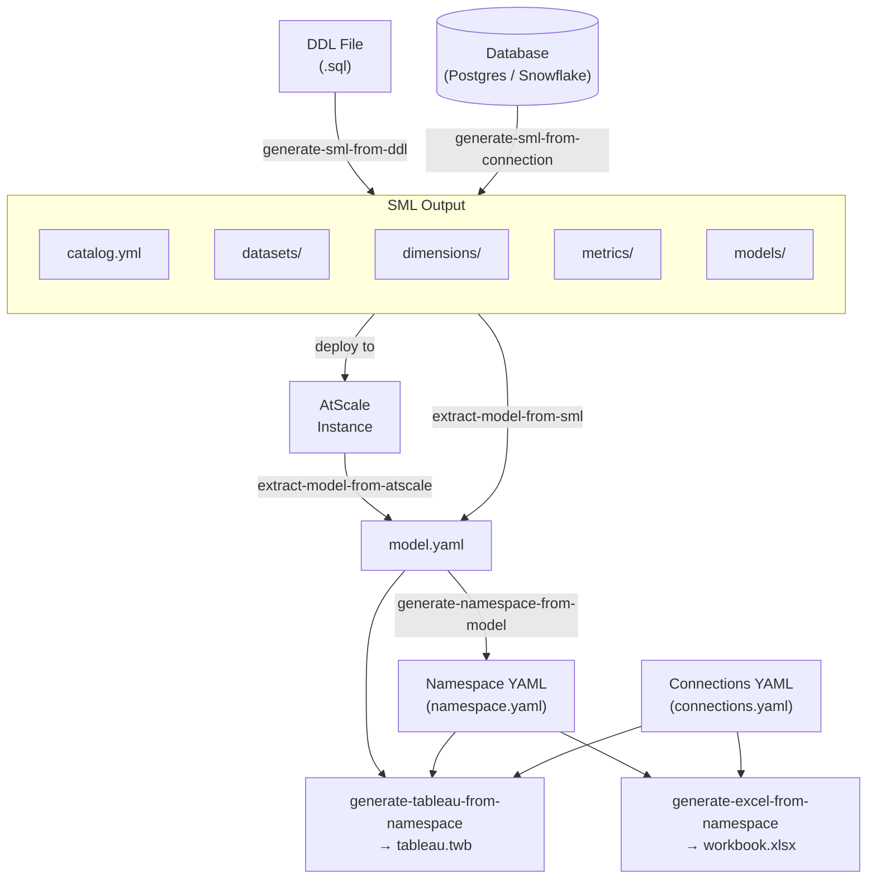

# AtScale PS Template CLI

CLI tool for extracting AtScale models, generating SML semantic models, and generating Tableau workbooks.

Upcoming features:
1. PBI
2. Additional BI Tools / Jupyter, Excel, Sheets
3. Query Testing; python (match Gatling)
4. Extract Queries
5. Stat Analysis
6. Rudy's aggregate util
7. Complete GitActions
8. Incorporate atscale-cli for deploy
9. Investigate sml/converters
10. SSO




## Table of Contents

- [Setup](#setup)
- [Operations](#operations)
  - [`extract-model-from-atscale`](#extract-model-from-atscale)
  - [`extract-model-from-sml`](#extract-model-from-sml)
  - [`generate-namespace-from-model`](#generate-namespace-from-model)
  - [`execute-sql-on-connection`](#execute-sql-on-connection)
  - [`extract-ddl-from-connection`](#extract-ddl-from-connection)
  - [`generate-sml-from-connection`](#generate-sml-from-connection)
  - [`generate-sml-from-ddl`](#generate-sml-from-ddl)
  - [BI Tool Feature Comparison](#bi-tool-feature-comparison)
  - [`generate-tableau-from-namespace`](#generate-tableau-from-namespace)
  - [`generate-excel-from-namespace`](#generate-excel-from-namespace)
- [Extract AtScale Model Workflow](#extract-atscale-model-workflow)
- [Connection YAML (`connections.yaml`)](#connection-yaml-connectionsyaml)
- [Model YAML (`model.yaml`)](#model-yaml-modelyaml)
- [Namespace YAML (`namespace.yaml`)](#namespace-yaml-namespaceyaml)

---

## Setup

```bash
npm install
npm run build
```

## Operations

### `extract-model-from-atscale`

Connects to a live AtScale instance via MDX and extracts a model's metrics and attributes into a `model.yaml` file. This file is the input for `generate-tableau-from-namespace`.

```bash
./atscale-utils extract-model-from-atscale \
  --model "Telemetry" \
  --connection-file "./connections.yaml" \
  --connection-name "ats_connection" \
  --output-model-file "./model.yaml"
```

| Parameter | Required | Default | Description |
|---|---|---|---|
| `--model` | Yes | | AtScale model/cube name |
| `--connection-file` | Yes | | Path to connections file |
| `--connection-name` | Yes | | Connection name in the file |
| `--output-model-file` | No | stdout | Output path for the model YAML |

**GitHub Actions workflow:** See [Extract AtScale Model Workflow](#extract-model-from-atscale-workflow).

---

### `extract-model-from-sml`

Reads a local SML directory (produced by `generate-sml-from-connection` or `generate-sml-from-ddl`) and outputs a `model.yaml` file in the same format as `extract-model-from-atscale`. Use this to generate a Tableau workbook without a live AtScale connection.

```bash
./atscale-utils extract-model-from-sml \
  --sml-dir "./sml-output" \
  --output-model-file "./model.yaml"
```

With optional overrides:

```bash
./atscale-utils extract-model-from-sml \
  --sml-dir "./sml-output" \
  --model-name "SalesModel" \
  --connection-name "snow_demo" \
  --output-model-file "./model.yaml"
```

| Parameter | Required | Default | Description |
|---|---|---|---|
| `--sml-dir` | Yes | | Path to the SML directory |
| `--model-name` | No | First model found | Model label or `unique_name` to extract |
| `--connection-name` | No | From connections file | Override the `data_source` in the output |
| `--output-model-file` | No | stdout | Output path for the model YAML |

---

### `generate-sml-from-connection`

Connects to a live database, introspects its schema, runs semantic model inference, and writes a complete set of AtScale SML files to a directory.

```bash
./atscale-utils generate-sml-from-connection \
  --connection-file "./connections.yaml" \
  --connection-name "ats_connection" \
  --model-name "Telemetry" \
  --output-dir "./sml-output"
```

With optional overrides:

```bash
./atscale-utils generate-sml-from-connection \
  --connection-file "./connections.yaml" \
  --connection-name "snow_demo" \
  --model-name "SalesModel" \
  --output-dir "./sml-output" \
  --schema "SALES" \
  --catalog-name "Sales Analytics" \
  --pii-severity "HIGH" \
  --sample-size 500 \
  --fact-tables "FactInternetSales,FactResellerSales" \
  --camel-case-files true \
  --camel-case-measures true
```

| Parameter | Required | Default | Description |
|---|---|---|---|
| `--connection-file` | No | `connections.yaml` | Path to connections file |
| `--connection-name` | Yes | | Connection name in the file |
| `--model-name` | Yes | | Name for the generated semantic model |
| `--output-dir` | Yes | | Directory to write SML files |
| `--schema` | No | From connection config | Override the database schema to introspect |
| `--catalog-name` | No | `model-name` | Display name for the generated catalog |
| `--pii-severity` | No | `MEDIUM` | Minimum PII severity to exclude: `HIGH`, `MEDIUM`, `LOW`, or `none` |
| `--sample-size` | No | `250` | Rows to sample per table for type inference (`0` to disable) |
| `--fact-tables` | No | Auto-detected | Comma-separated table names to treat as facts, overriding automatic classification |
| `--camel-case-files` | No | `false` | When `true`, dataset and dimension filenames use camelCase of the source table name |
| `--camel-case-measures` | No | `false` | When `true`, metric labels use camelCase of the source column name |

**Output layout:**

```
<output-dir>/
  catalog.yml
  connections/<connectionName>.yml
  datasets/<table>.yml
  dimensions/<dimension>.yml
  metrics/<metric>.yml
  models/<modelName>.yml
```

---

### `generate-sml-from-ddl`

Parses a SQL DDL file (`CREATE TABLE` / `CREATE VIEW` statements) and generates AtScale SML files without a live database connection. Useful for offline model generation and CI pipelines.

```bash
./atscale-utils generate-sml-from-ddl \
  --ddl-file "./schema.sql" \
  --output-dir "./sml-output"
```

With optional overrides:

```bash
./atscale-utils generate-sml-from-ddl \
  --ddl-file "./schema.sql" \
  --model-name "SalesModel" \
  --output-dir "./sml-output" \
  --connection-name "my_warehouse" \
  --catalog-name "Sales Analytics" \
  --schema "SALES" \
  --pii-severity "LOW" \
  --fact-tables "FactInternetSales,FactResellerSales" \
  --camel-case-files true \
  --camel-case-measures true
```

| Parameter | Required | Default | Description |
|---|---|---|---|
| `--ddl-file` | Yes | | Path to the SQL DDL file |
| `--model-name` | No | DDL filename stem | Name for the generated semantic model |
| `--output-dir` | Yes | | Directory to write SML files |
| `--connection-name` | No | `my_connection` | Connection name to embed in SML files |
| `--catalog-name` | No | `model-name` | Display name for the generated catalog |
| `--schema` | No | | Filter DDL to only tables in this schema |
| `--database` | No | | Database name to embed in the SML connection file |
| `--dialect` | No | Auto-detected from filename | Database dialect (`snowflake`, `postgresql`). When `snowflake`, dataset table names are uppercased. |
| `--pii-severity` | No | `MEDIUM` | Minimum PII severity to exclude: `HIGH`, `MEDIUM`, `LOW`, or `none` |
| `--fact-tables` | No | Auto-detected | Comma-separated table names to treat as facts, overriding automatic classification |
| `--camel-case-files` | No | `false` | When `true`, dataset and dimension filenames use camelCase of the source table name |
| `--camel-case-measures` | No | `false` | When `true`, metric labels use camelCase of the source column name |

**Output layout:** Same as `generate-sml-from-connection`.

---

### `generate-namespace-from-model`

Reads a `model.yaml` file and automatically generates a namespace YAML by running the analysis-suggestions engine against the model's measures and dimensions. The output is ready to pass directly to `generate-tableau-from-namespace`.

Each suggestion becomes a worksheet:
- **trend** → `graphType: line` (measure over time)
- **comparison** → `graphType: line` with `colorField` (measure over time, broken down by a second dimension)
- **breakdown / distribution** → `graphType: bar`
- **ranking** → `graphType: bar` with `limit: 10` and `sortDirection: desc`

Up to six summary-statistic scorecards (`graphType: text`) are prepended automatically. All worksheets are arranged in a single auto-sized dashboard.

```bash
./atscale-utils generate-namespace-from-model \
  --model-file "./model.yaml" \
  --output-file "./namespace.yaml"
```

With optional overrides:

```bash
./atscale-utils generate-namespace-from-model \
  --model-file "./model.yaml" \
  --model-name "SalesModel" \
  --title "Sales Analytics" \
  --max-suggestions 20 \
  --min-score 0.6 \
  --output-file "./namespace.yaml"
```

| Parameter | Required | Default | Description |
|---|---|---|---|
| `--model-file` | Yes | | Path to the `model.yaml` file |
| `--model-name` | No | First model | Model name when `model.yaml` contains multiple models |
| `--title` | No | `<ModelName> Analysis` | Workbook title written into the namespace |
| `--max-suggestions` | No | `25` | Maximum number of analysis suggestions to generate |
| `--min-score` | No | `0.5` | Minimum relevance score `[0–1]` for a suggestion to be included |
| `--output-file` | No | stdout | Output path for the namespace YAML |

---

### `execute-sql-on-connection`

Reads a SQL file, splits it into individual statements, and executes each one against a named database connection. Works with DDL (`CREATE TABLE`, `DROP TABLE`, `ALTER TABLE`, `CREATE VIEW`), DML (`INSERT`, `UPDATE`, `DELETE`), and mixed files.

```bash
./atscale-utils execute-sql-on-connection \
  --sql-file "./schema/migrations/001_init.sql" \
  --connection-file "./connections.yaml" \
  --connection-name "snow_demo"
```

Preview statements without running them:

```bash
./atscale-utils execute-sql-on-connection \
  --sql-file "./schema.sql" \
  --connection-name "snow_demo" \
  --dry-run true
```

Skip failed statements and continue:

```bash
./atscale-utils execute-sql-on-connection \
  --sql-file "./schema.sql" \
  --connection-name "snow_demo" \
  --on-error continue
```

| Parameter | Required | Default | Description |
|---|---|---|---|
| `--sql-file` | Yes | | Path to the SQL file to execute |
| `--connection-file` | No | `connections.yaml` | Path to connections file |
| `--connection-name` | Yes | | Connection name in the file |
| `--on-error` | No | `stop` | `stop` halts on first failure; `continue` logs errors and proceeds |
| `--dry-run` | No | | Pass `true` to print statements without executing them |

---

### `extract-ddl-from-connection`

Connects to a live database, reads JDBC metadata for each table in the target schema, and writes `CREATE TABLE` DDL statements to a file (or stdout). Useful for capturing schema snapshots, seeding DDL files for `generate-sml-from-ddl`, or comparing schema drift.

```bash
./atscale-utils extract-ddl-from-connection \
  --connection-file "./connections.yaml" \
  --connection-name "snow_demo" \
  --schema "PUBLIC" \
  --output-file "./schema.ddl"
```

Extract only specific tables or wildcard patterns:

```bash
./atscale-utils extract-ddl-from-connection \
  --connection-file "./connections.yaml" \
  --connection-name "snow_demo" \
  --schema "PUBLIC" \
  --tables "Dim*,FactInternetSales" \
  --output-file "./schema.ddl"
```

| Parameter | Required | Default | Description |
|---|---|---|---|
| `--connection-name` | Yes | | Connection name in the file |
| `--schema` | Yes | | Database schema to introspect |
| `--connection-file` | No | `connections.yaml` | Path to connections file |
| `--tables` | No | All tables | Comma-separated table names or wildcard patterns (`*` = any chars, `?` = one char). Matching is case-insensitive. |
| `--output-file` | No | stdout | Output path for the DDL |

---

### BI Tool Feature Comparison
[Link to the header](#BI-Tool-Feature-Comparison)

| Feature | Tableau Desktop | PowerBI Desktop | Excel | Jupyter | Sheets
|---|---|---|---|---|---|
| Test Output | Yes | Yes |---|---|---|
| Bar Chart | Yes | Yes |---|---|---|
| &nbsp;&nbsp; Ticks as color | Yes | |---|---|---|
| &nbsp;&nbsp; Filter Nulls | Yes | |---|---|---|
| &nbsp;&nbsp; Sort Categories | Yes | |---|---|---|
| Line Chart | Yes | Yes |---|---|---|
| &nbsp;&nbsp; Ticks as color | Yes | |---|---|---|
| Text | Yes | Yes |Yes|---|---|
| &nbsp;&nbsp; Format Options | --- | --- | Yes |---|---|


---

### `generate-tableau-from-namespace`

Generates a Tableau `.twb` workbook from a namespace YAML definition and a model YAML file.

```bash
./atscale-utils generate-tableau-from-namespace \
  --namespace-file "./resources/namespaces/telemetry/overview.yaml" \
  --model-file "./model.yaml" \
  --connection-file "./connections.yaml" \
  --connection-name "ats_connection" \
  --tableau-version 2025 \
  --target-file "./tableau.twb"
```

| Parameter | Required | Default | Description |
|---|---|---|---|
| `--namespace-file` | No | `analysis/namespace.yaml` | Path to the namespace YAML |
| `--model-file` | No | `model.yaml` | Path to the model YAML |
| `--connection-file` | No | `connections.yaml` | Path to the connections file |
| `--connection-name` | No | `default` | Connection name in the file |
| `--tableau-version` | No | `2025` | Target Tableau version: `2025` or `2024` |
| `--target-file` | No | `tableau.twb` | Output path for the generated workbook |

See [Namespace YAML](#namespace-yaml-namespaceyaml) for the full namespace format reference.

---

### `generate-excel-from-namespace`

Generates an Excel workbook (`.xlsx`) from a namespace YAML and a model YAML. Requires Python 3; `openpyxl` is installed automatically if not already present.

Each dashboard in the namespace produces one sheet containing:
- An **OLAP pivot table** connected to AtScale via MDX/XMLA — click **Refresh All** in Excel to populate live data
- One **chart** per dashboard tile (`bar`, `line`, `pie`, or `area`) styled from the worksheet `graphType`
- A hidden **`_Connections`** sheet with the full MDX connection string

```bash
./atscale-utils generate-excel-from-namespace \
  --namespace-file "analysis/namespace.yaml" \
  --model-file     "model.yaml" \
  --connection-file "connections.yaml" \
  --connection-name "ats_connection" \
  --target-file    "analysis/workbook.xlsx"
```

| Parameter | Required | Default | Description |
|---|---|---|---|
| `--namespace-file` | No | `analysis/namespace.yaml` | Path to the namespace YAML |
| `--model-file` | No | `model.yaml` | Path to the model YAML |
| `--connection-file` | No | `connections.yaml` | Path to the connections file |
| `--connection-name` | No | `default` | Connection name in the file |
| `--target-file` | No | `analysis/workbook.xlsx` | Output path for the Excel workbook |

The MDX connection in the workbook uses `Provider=MSOLAP.8` pointed at the AtScale XMLA endpoint (`<mdx.url>/xmla/<organization_id>`). Open the workbook in Excel and click **Data → Refresh All** to load live data into the pivot tables.

---

## Extract AtScale Model Workflow

The `extract-model-from-atscale` workflow (`.github/workflows/extract-model-from-atscale.yml`) runs manually from the Actions tab.

### Setup

Add a repository secret named `ATSCALE_CONNECTION_FILE` containing the full contents of your connections YAML:

> Settings → Secrets and variables → Actions → New repository secret

### Inputs

| Input | Required | Description |
|---|---|---|
| `model` | Yes | AtScale model identifier |
| `connection-name` | Yes | Connection name within the connection file |
| `output-model-file` | No | Output file path (defaults to `model.yml`) |

### Running the workflow

1. Go to **Actions → Extract AtScale Model → Run workflow**
2. Fill in the inputs and click **Run workflow**
3. Download the extracted model from the **Artifacts** section of the run

### Calling from another workflow

```yaml
- uses: actions/checkout@v4
- uses: actions/setup-node@v4
  with:
    node-version: 20
    cache: npm
- run: npm install && npm run build
- name: Write connection file
  run: echo "${{ secrets.ATSCALE_CONNECTION_FILE }}" > connection.yml
- name: Extract AtScale model
  run: |
    ./atscale-utils extract-model-from-atscale \
      --model "Telemetry" \
      --connection-file connection.yml \
      --connection-name "ats_connection" \
      --output-model-file "model.yml"
```

---

## Connection YAML (`connections.yaml`)

Passed to operations via `--connection-file`. Contains user credentials and named connection definitions.

> **Security:** Do not commit this file to source control. Add it to `.gitignore` or supply it via a CI secret.

### Structure

```yaml
users:
  <user_key>:
    ...           # credentials — see below

connections:
  <connection_name>:
    installer: true | false     # optional: marks as an AtScale installer connection
    mdx:                        # optional: required for extract-model-from-atscale
      url: http://<atscale_host>
      user: <user_key>
      organization_id: default
      catalog_name: <AtScale catalog name>
    sql:                        # required for SML generation and Tableau generation
      dialect: postgres | snowflake
      ...
```

### User credentials

#### Password authentication (Postgres)

```yaml
users:
  admin:
    username: admin
    password: "@Scale800"
```

#### Key-pair authentication (Snowflake)

```yaml
users:
  snowflake_user:
    username: USER@EXAMPLE.COM
    privateKeyPath: resources/keys/snowflake_key.p8   # PKCS8 private key file
    privateKeyPassword: ""                             # empty string if unencrypted
    # Alternative: pre-encoded PKCS8 DER base64
    privateKeyBase64: "<base64-der-pkcs8>"
```

### Postgres `sql` fields

| Field | Required | Description |
|---|---|---|
| `dialect` | Yes | `postgres` |
| `server` | Yes | Hostname or IP |
| `port` | Yes | Port number (e.g. `15432`) |
| `database` | Yes | Database name |
| `schema` | Yes | Schema name |
| `user` | Yes | Key from `users` section |
| `libpath` | No | Additional JDBC driver JAR path(s). All JARs in `resources/drivers/` are loaded automatically. |

### Snowflake `sql` fields

| Field | Required | Description |
|---|---|---|
| `dialect` | Yes | `snowflake` |
| `account` | Yes | Snowflake account identifier |
| `warehouse` | Yes | Warehouse name |
| `database` | Yes | Database name |
| `schema` | Yes | Schema name |
| `snowflake_user` | Yes | Key from `users` section |
| `role` | No | Snowflake role (e.g. `SYSADMIN`) |
| `authenticator` | No | Authentication method |
| `libpath` | No | Additional JDBC driver JAR path(s). All JARs in `resources/drivers/` are loaded automatically. |

### Full Postgres example

```yaml
users:
  admin:
    username: admin
    password: "@Scale800"

connections:
  ats_connection:
    installer: true
    mdx:
      url: http://template.atscale-se-demo.com
      user: admin
      organization_id: default
      catalog_name: Telemetry
    sql:
      dialect: postgres
      server: template.atscale-se-demo.com
      port: 15432
      database: atscale
      schema: Telemetry
      user: admin
```

### Full Snowflake example

```yaml
users:
  snowflake_user:
    username: USER@EXAMPLE.COM
    privateKeyPath: resources/keys/snowflake_key.p8
    privateKeyPassword: ""

connections:
  snow_demo:
    installer: true
    sql:
      dialect: snowflake
      account: da37161
      warehouse: COMPUTE_WH
      database: MY_DATABASE
      schema: MY_SCHEMA
      role: SYSADMIN
      snowflake_user: snowflake_user
```

---

## Model YAML (`model.yaml`)

Auto-generated by `extract-model-from-atscale`. Describes one or more AtScale models with two parallel sections per model: `mdx` (MDX query metadata) and `sql` (column metadata used by the Tableau generator).

### Structure

```yaml
<ModelName>:
  data_source: <connection-name>
  mdx:
    metrics: [...]
    attributes: {...}
  sql:
    table_name: <ModelName>
    columns:
      <column_name>:
        alias: false
        name: <column_name>
        data_type: <DATA_TYPE>
        label: <Human-readable label>
        description: ""
        role: measure | dimension
        type: quantitative | nominal | ordinal
        aggregation: sum | avg | min | max | count | countd   # measures only
        folder: ""
```

Column names in `sql.columns` are what you reference in namespace YAML fields (`xAxis`, `yAxis`, `measures`, `colorField`, `filters[].field`).

### Supported `data_type` values

| `data_type` | Tableau type | Notes |
|---|---|---|
| `WSTR`, `STRING`, `BSTR`, `GUID` | string | Dimensions |
| `BOOL` | boolean | Dimensions |
| `INT1`–`INT8`, `INT_UNSIGNED1`–`INT_UNSIGNED8` | integer | Measures |
| `FLOAT32`, `FLOAT64` | real | Measures |
| `DATE_DOUBLE` | date | Must use `role: dimension`, `type: ordinal` |
| `DATETIME` | datetime | Dimensions; supports `xAxisGranularity` in line charts |
| `DECIMAL`, `NUMERIC` | decimal/numeric | Measures |

### Example

```yaml
Telemetry:
  data_source: ats_connection
  sql:
    table_name: Telemetry
    columns:
      m_query_id_count:
        alias: false
        name: m_query_id_count
        data_type: INT8
        label: Total Queries
        description: ""
        role: measure
        type: quantitative
        aggregation: count
        folder: ""
      query_hour:
        alias: false
        name: query_hour
        data_type: DATETIME
        label: Query Hour
        description: ""
        role: dimension
        type: nominal
        folder: ""
```

---

## Namespace YAML (`namespace.yaml`)

Drives the Tableau workbook generator. Defines worksheets and dashboards.

### Structure

```yaml
version: 1
title: <Workbook title>
description: <Description>

worksheets:
  <worksheet_key>:
    title: <Display name in Tableau>
    model: <ModelName>          # key from model.yaml
    graphType: bar | line | text
    ...

dashboards:
  <dashboard_key>:
    ...
```

### `graphType: bar`

Horizontal bar chart. `xAxis` = measure (bar length), `yAxis` = dimension (bar labels).

```yaml
top_users:
  title: Top 10 Most Active Users
  model: Telemetry
  graphType: bar
  xAxis: m_query_id_count       # measure column
  yAxis: user_hash              # dimension column
  limit: 10                     # optional: top-N rows
  sortDirection: desc           # optional: asc | desc
  colorField: service           # optional: dimension for color encoding
  format: integer               # optional: integer | decimal:N | percent:N | currency:N
  filters:
    - field: user_hash
      excludeNull: true
```

### `graphType: line`

Time-series line chart.

```yaml
queries_over_time:
  title: Queries Over Time
  model: Telemetry
  graphType: line
  xAxis: query_hour             # typically a DATETIME dimension
  xAxisGranularity: week        # optional: day | week | month | quarter | year
  yAxis: m_query_id_count       # measure (Y axis)
  colorField: service           # optional: dimension for series breakdown
  filters:
    - field: succeeded
      excludeNull: true
```

### `graphType: text`

Single-number KPI scorecard.

```yaml
total_queries:
  title: Total Queries
  model: Telemetry
  graphType: text
  measures:
    - m_query_id_count
  format: integer
```

### `filters` array

```yaml
filters:
  - field: <column_name>        # must exist in model's sql.columns
    excludeNull: true           # exclude null/blank members
```

### Dashboard definition

```yaml
dashboards:
  my_dashboard:
    title: Telemetry Dashboard
    description: ""

    size:
      width: 1800               # total pixel width
      height: 4900              # total pixel height
      hSegments: 3              # grid columns
      vSegments: 49             # grid rows

    categoryHeaders:            # optional: full-width section title zones
      - label: "Summary Statistics"
        x: 0
        y: 0
        colSpan: 3
        rowSpan: 1

    tiles:
      - worksheet: total_queries
        x: 0                    # grid column (0-based)
        y: 1                    # grid row (0-based)
        colSpan: 1
        rowSpan: 2
        category: Summary Statistics
```

Grid cell size = `width / hSegments` × `height / vSegments` px. `x + colSpan` must not exceed `hSegments`.

### Full example

See [`resources/namespaces/telemetry/overview.yaml`](resources/namespaces/telemetry/overview.yaml).
