# AtScale Architecture

## Table of Contents

- [Overview](#overview)
- [Architecture Diagrams](#architecture-diagrams)
  - [Request Routing](#request-routing)
  - [Internal Storage Connections](#internal-storage-connections)
  - [Data Warehouse Connections](#data-warehouse-connections)
  - [External Service Connections](#external-service-connections)
- [Component Reference](#component-reference)
  - [Ingress](#ingress)
  - [Core Pods](#core-pods)
  - [Internal Services](#internal-services)
- [Helm Chart Component Diagram](#helm-chart-component-diagram)
  - [Helm Subchart Reference](#helm-subchart-reference)
  - [External Connections](#external-connections)
- [Architectural Decisions](#architectural-decisions)
  - [Decision 1 — Business Unit Specific Namespaces](#decision-1--business-unit-specific-namespaces)
  - [Decision 2 — External PostgreSQL](#decision-2--external-postgresql)
  - [Decision 3 — External Keycloak](#decision-3--external-keycloak)
  - [Decision 4 — External Load Balancer](#decision-4--external-load-balancer)
  - [Decision 5 — Persistent Volume Support](#decision-5--persistent-volume-support)
  - [Decision 6 — Automatic Horizontal Elasticity](#decision-6--automatic-horizontal-elasticity)

---

## Overview

AtScale runs as a Kubernetes deployment (installed via Helm) that sits between BI tools and data sources, providing a universal semantic layer. BI tools connect via XMLA/MDX or SQL; AtScale translates queries to native SQL and pushes them down to the underlying data warehouse.

## Architecture Diagrams

### Request Routing

How external clients reach AtScale services through the Nginx ingress.

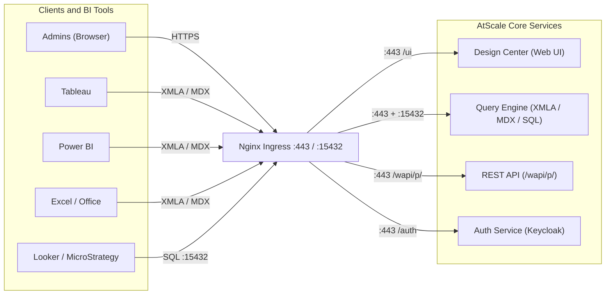

### Internal Storage Connections

How core services read and write to internal storage.

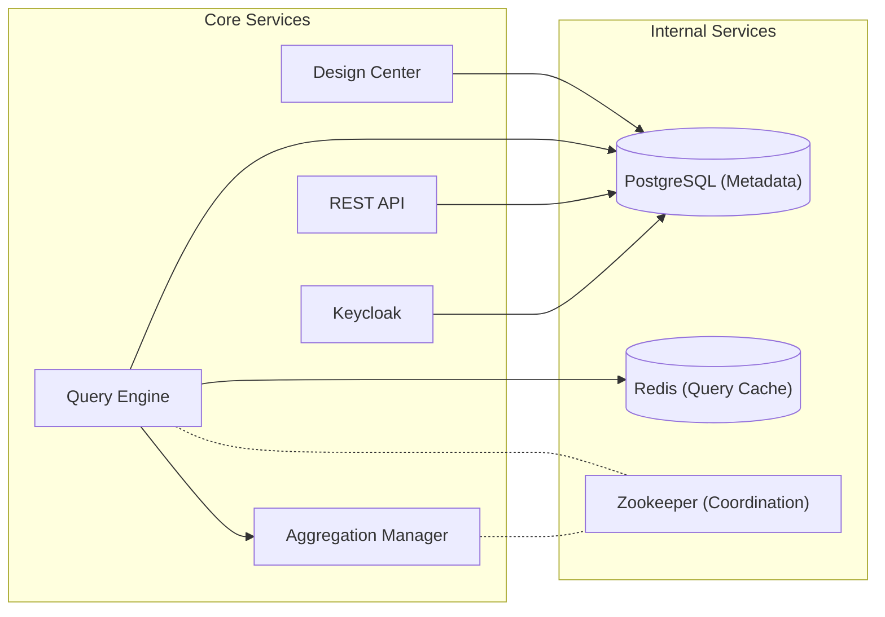

### Data Warehouse Connections

How the Query Engine and Aggregation Manager interact with external data sources.

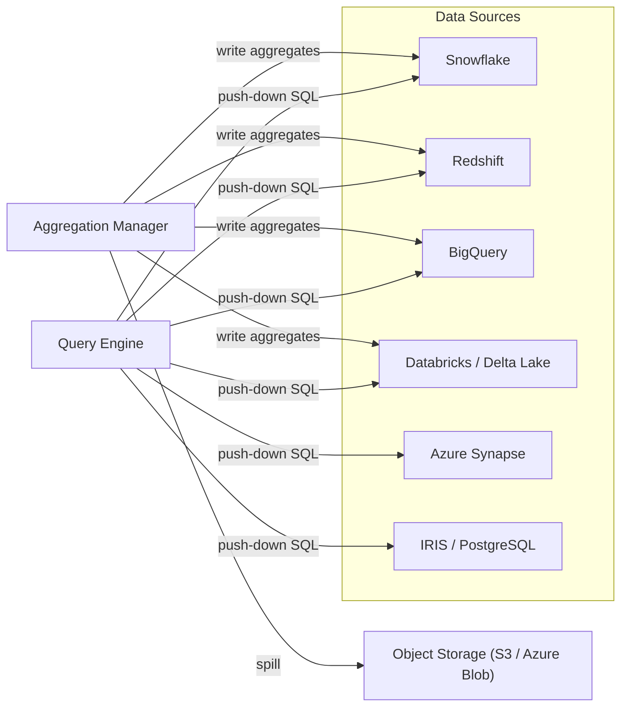

### External Service Connections

How AtScale integrates with Git, identity providers, and observability.

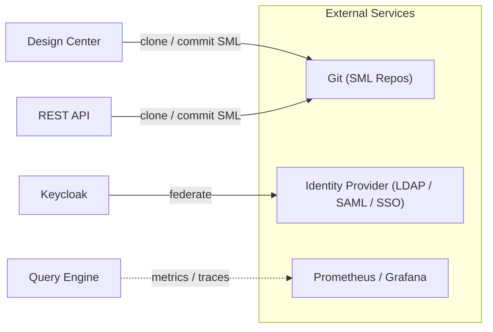

## Component Reference

### Ingress

| Component | Detail |
|---|---|
| **Nginx Ingress** | Entry point for all external traffic. Routes `:443` to Design Center, XMLA/MDX engine, REST API, and Auth. Routes `:15432` (Postgres-compatible) to the SQL Analytics interface of the Query Engine. |

### Core Pods

| Component | Detail |
|---|---|
| **Design Center** | Browser-based semantic layer designer. Used to build and manage SML models, connections, and deployments. Reads/writes model files to Git and model metadata to PostgreSQL. |
| **Query Engine** | Receives MDX/XMLA queries from BI tools and SQL queries from direct clients. Translates semantic queries to native SQL dialects and executes them against the connected data source via push-down. Returns results through the originating protocol. |
| **Aggregation Manager** | Monitors query patterns and cost estimates. Plans, creates, and refreshes pre-computed aggregate tables in the data warehouse to accelerate repeated queries. Coordinates with the Query Engine via Zookeeper. |
| **REST API (wapi)** | Management API served at `/wapi/p/`. Used to programmatically create connections, deploy models, list catalogs, and trigger operations. All `ps-utils` AtScale config operations call this API. |
| **Auth Service (Keycloak)** | Handles all authentication and session management. Delegates to external identity providers via LDAP or SAML/SSO. Issues short-lived JWTs consumed by the REST API and Design Center. |

### Internal Services

| Component | Detail |
|---|---|
| **PostgreSQL (Metadata)** | Stores model definitions, connection configurations, deployment state, query statistics, and user/role assignments. Central store for all AtScale state. |
| **Zookeeper** | Provides distributed coordination between Query Engine replicas and the Aggregation Manager. Manages leader election and shared configuration. |
| **Redis (Query Cache)** | Caches query results to avoid redundant push-down executions against the data warehouse. TTL-based invalidation. |

## Helm Chart Component Diagram

The diagram below reflects the actual subcharts and inter-service wiring in the `atscale` Helm chart (v2026.4.0).

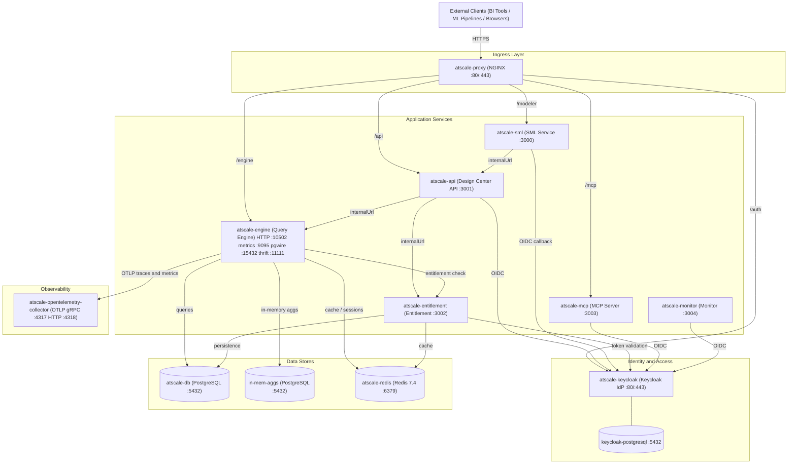

### Helm Subchart Reference

| Subchart | Alias | Role | Default Port(s) | Conditional |
|---|---|---|---|---|
| `atscale-proxy` | `atscale-proxy` | NGINX reverse proxy, TLS termination | 80 / 443 | `atscale-proxy.enabled` |
| `atscale-api` | `atscale-api` | Design Center REST API | 3001 | Always |
| `atscale-engine` | `atscale-engine` | XMLA / MDX / SQL query engine | 10502 (HTTP), 15432 (pgwire), 11111 (thrift), 9095 (metrics) | Always |
| `atscale-sml` | `atscale-sml` | Semantic Model Layer service | 3000 | Always |
| `atscale-entitlement` | `atscale-entitlement` | License and entitlement enforcement | 3002 | Always |
| `atscale-mcp` | `atscale-mcp` | MCP (AI tool) server | 3003 | `atscale-mcp.enabled` |
| `atscale-monitor` | `atscale-monitor` | Ops monitoring service | 3004 | `atscale-monitor.enabled` |
| `atscale-keycloak` | `keycloak` | Identity provider (OIDC / OAuth2) | 80 / 443 | `keycloak.enabled` |
| `atscale-db` | `db` | Main PostgreSQL database | 5432 | `db.enabled` |
| `atscale-db` | `in-mem-aggs` | PostgreSQL for in-memory aggregations | 5432 | `in-mem-aggs.enabled` |
| `atscale-redis` | `redis` | Redis cache and session store | 6379 | `redis.enabled` |
| `atscale-opentelemetry-collector` | `telemetry` | Telemetry aggregator (OTLP) | 4317 (gRPC), 4318 (HTTP) | `global.atscale.telemetry.enabled` |

### External Connections

| Entity | Protocol / Interface | Direction |
|---|---|---|
| **Tableau Server** | XMLA / MDX over HTTPS | Inbound to Nginx |
| **Power BI** | XMLA / MDX over HTTPS | Inbound to Nginx |
| **Excel / Office** | MDX over OLE DB for OLAP | Inbound to Nginx |
| **Looker / MicroStrategy / Custom** | XMLA or SQL (`:15432`) | Inbound to Nginx |
| **Users / Admins** | Browser (HTTPS) or REST API | Inbound to Nginx |
| **Snowflake** | Push-down SQL (JDBC/ODBC) | Outbound from Query Engine |
| **Redshift** | Push-down SQL (JDBC) | Outbound from Query Engine |
| **BigQuery** | Push-down SQL (REST/JDBC) | Outbound from Query Engine |
| **Databricks / Delta Lake** | Push-down SQL (JDBC) | Outbound from Query Engine |
| **Azure Synapse** | Push-down SQL (JDBC) | Outbound from Query Engine |
| **IRIS** | Push-down SQL | Outbound from Query Engine |
| **PostgreSQL** | Push-down SQL | Outbound from Query Engine |
| **Git** | HTTPS (clone / push SML files) | Outbound from Design Center and REST API |
| **Identity Provider** | LDAP or SAML 2.0 / OIDC | Outbound from Auth Service |
| **Object Storage (S3 / Blob)** | Cloud SDK | Outbound from Aggregation Manager (aggregate spill) |
| **Prometheus / Grafana** | Prometheus scrape endpoint | Outbound from Query Engine (optional) |

## Architectural Decisions

This section documents key deployment decisions that arise when operating AtScale in production. Each decision includes a before/after diagram showing the topology change, a description of what changes, and an analysis of trade-offs.

### Decision 1 — Business Unit Specific Namespaces

> **Recommendation: ✅ Recommended**

#### Before — Single Shared Namespace

All business units share one AtScale deployment in a single Kubernetes namespace. There is one proxy, one query engine, one PostgreSQL metadata store, and one entitlement service. BUs are differentiated only by their SML models and connection configurations inside the shared instance — not by infrastructure boundaries.

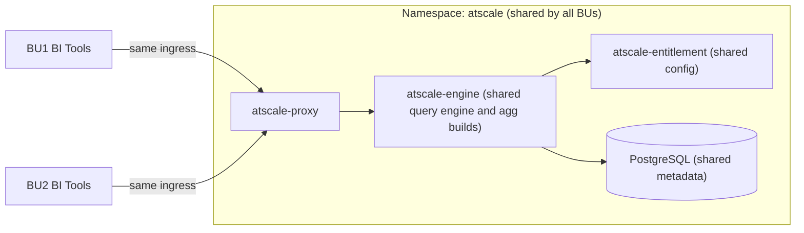

#### After — Per-Business-Unit Namespaces

Each business unit gets its own Kubernetes namespace with an isolated Helm release. Each namespace has its own proxy, engine, entitlement service, and PostgreSQL. Namespace-level RBAC, resource quotas, and network policies apply independently.

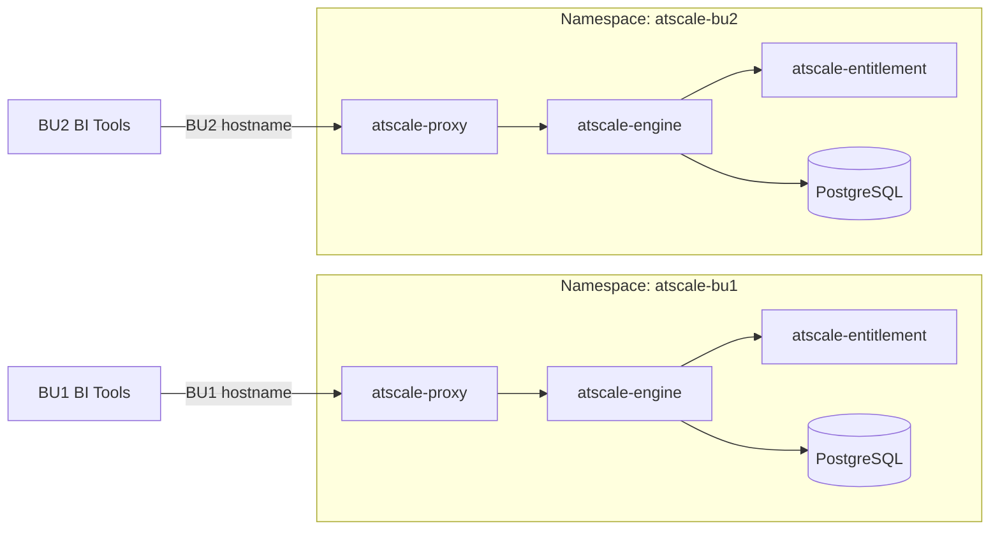

#### What Changes

Each business unit receives its own Helm release deployed into a dedicated namespace (e.g., `atscale-bu1`, `atscale-bu2`). Ingress hostnames or path prefixes route traffic to the correct namespace. Each BU gets its own query engine, aggregate build capacity, entitlement configuration, and metadata store. Kubernetes RBAC grants are scoped per namespace, so BU administrators cannot affect other namespaces. Environment promotion (dev → UAT → PROD) is performed per namespace rather than per cluster.

| | Before | After |
|---|---|---|
| Namespace count | 1 shared | 1 per BU per environment |
| Helm releases | 1 shared | 1 per BU per environment |
| Query engine | Shared — BUs compete for engine threads and agg builds | Isolated per BU |
| Entitlement and config | Shared — all BUs see the same configuration | Isolated per BU |
| RBAC scope | Cluster-wide or shared | Per-namespace |
| Upgrade blast radius | All BUs affected | Single BU affected |

#### Advantages / Disadvantages

| Advantages | Disadvantages |
|---|---|
| BU teams can upgrade independently without coordinating across BUs | More namespaces to manage — tooling (ArgoCD, Flux) helps |
| Isolated query engines prevent one BU's heavy queries from starving other BUs | Duplicate infrastructure (proxy, Redis, PostgreSQL) increases resource overhead per BU |
| Aggregate builds are scoped per BU — no cross-BU scheduling conflicts | Each BU namespace must be bootstrapped with secrets, pull credentials, and configuration |
| Entitlement and configuration changes for one BU do not affect others | Logging and observability must aggregate across namespaces |
| Network policies can restrict cross-namespace traffic | |
| Rollback of one BU release does not affect others | |

---

### Decision 2 — External PostgreSQL

> **Recommendation: ✅ Recommended**

#### Before — Embedded PostgreSQL (Helm Subchart)

Each BU namespace runs its own `atscale-db` pod. Data is stored on a local PVC tied to the node where each pod schedules. There is no shared backing store and no replication between namespaces.

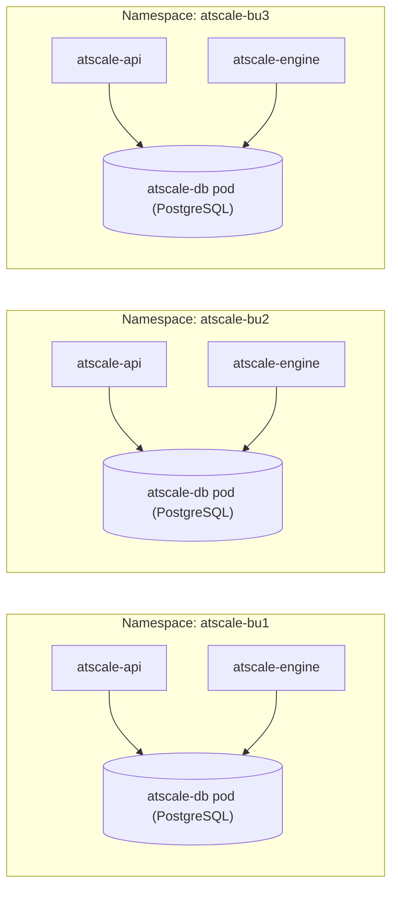

#### After — External Managed PostgreSQL

`db.enabled` is set to `false` in each BU's `values.yaml`. All namespaces point to a single externally managed PostgreSQL instance (RDS, Azure Database, AlloyDB, or self-hosted), with each BU using a separate database or schema. The connection string is supplied via a Kubernetes secret in each namespace.

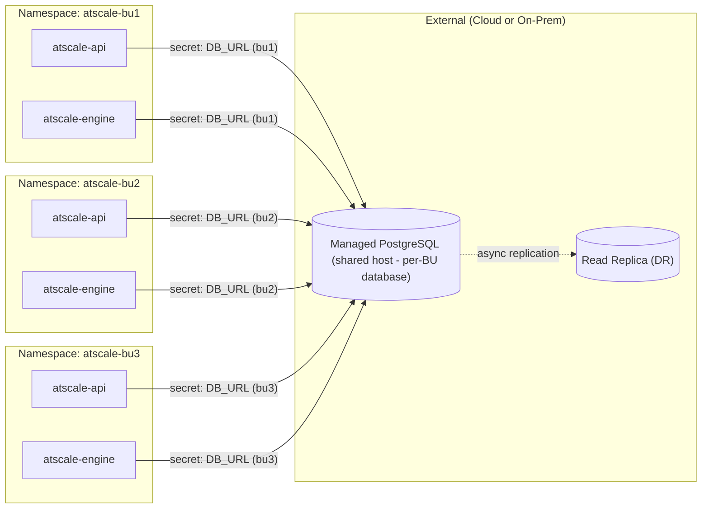

#### What Changes

Set `db.enabled: false` in `values.yaml` and supply `global.atscale.db.host`, `global.atscale.db.port`, `global.atscale.db.name`, and credentials via a Kubernetes secret. The managed database is provisioned, backed up, and monitored outside the Helm chart lifecycle.

| | Before | After |
|---|---|---|
| PostgreSQL lifecycle | Helm manages pod | External team / cloud provider manages |
| Backup and recovery | Manual PVC snapshots | Provider-native (automated snapshots, PITR) |
| High availability | Single pod | Multi-AZ standby available |
| Disaster recovery replication | Not supported | Async replica to secondary region |

#### Advantages / Disadvantages

| Advantages | Disadvantages |
|---|---|
| Supports DR replication to a secondary region | Additional infrastructure to provision and maintain |
| Provider-managed backups and point-in-time recovery | Latency between AtScale pods and external DB (mitigated by VPC peering or Private Link) |
| Multi-AZ standby reduces unplanned downtime | Credentials rotation requires coordinated secret updates |
| Removes PVC dependency — pods reschedule freely across nodes | May incur additional cloud service cost |
| Database version upgrades are decoupled from AtScale upgrades | |

---

### Decision 3 — External Keycloak

> **Recommendation: ❌ Not Recommended**

#### Before — Embedded Keycloak (Helm Subchart)

Each AtScale Helm release includes its own `atscale-keycloak` subchart. Each release owns its realm, clients, and user federation configuration.

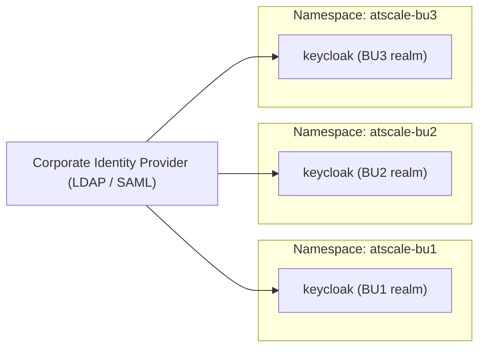

#### After — Shared External Keycloak

A single externally managed Keycloak instance hosts one realm per AtScale release (or a shared realm with per-client isolation). AtScale releases disable their embedded Keycloak and point to the external instance.

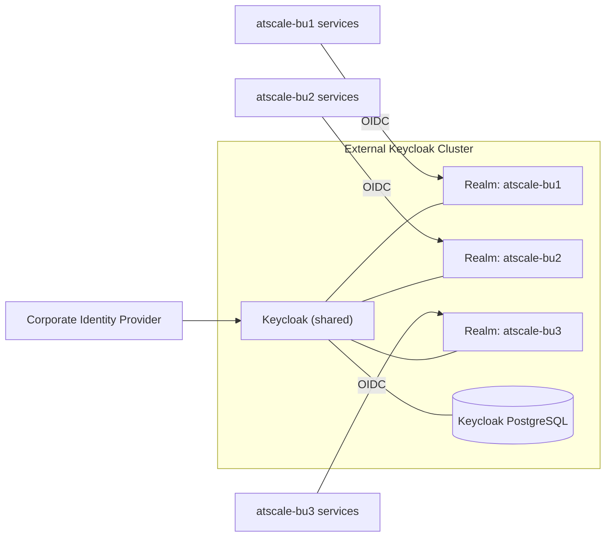

#### What Changes

Set `keycloak.enabled: false` and supply `global.atscale.keycloak.url`, client IDs, and client secrets via Kubernetes secrets. The external Keycloak instance must be pre-configured with a realm and OIDC clients matching AtScale's expected client registration. The Keycloak realm configuration used by the embedded subchart must be exported and re-imported into the external instance.

| | Before | After |
|---|---|---|
| Keycloak instances | 1 per AtScale release | 1 shared (multiple realms) |
| Realm count | 1 per release | 1 per release (same) |
| Configuration ownership | AtScale Helm manages | External Keycloak team manages |
| Upgrade coordination | Keycloak upgrades with AtScale | Separate upgrade cadence |

#### Advantages / Disadvantages

| Advantages | Disadvantages |
|---|---|
| Single Keycloak cluster to patch and monitor | Realm management complexity does not decrease — 4 environments × 4+ BUs = 16+ realms still needed |
| Potential SSO token reuse across AtScale instances | External Keycloak becomes a shared blast radius — an outage affects all BUs simultaneously |
| Centralized audit log for authentication events | Realm configuration must be maintained outside the Helm chart, increasing operational overhead |
| | AtScale Keycloak realm bootstrap (clients, mappers, federation) is already automated by the embedded subchart; externalizing it requires replicating that automation |
| | Version compatibility between AtScale's expected Keycloak API and the shared cluster must be actively managed |

**Summary:** The operational savings of a shared Keycloak are largely offset by the realm count remaining the same and the risk of a shared blast radius. The recommended approach is to keep Keycloak embedded per release and invest instead in automating realm configuration (e.g., Keycloak Terraform provider or realm export/import in CI).

---

### Decision 4 — External Load Balancer

> **Recommendation: ✅ Recommended**

#### Before — NGINX Proxy Pod as Ingress

The `atscale-proxy` Helm subchart provides an NGINX pod that handles TLS termination and routing. A Kubernetes `LoadBalancer` service type exposes it directly, and the cloud provider assigns a dynamic IP.

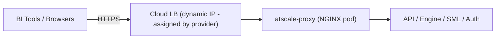

#### After — External Load Balancer or Ingress Controller

Customer-managed infrastructure (AWS ALB, Azure Application Gateway, GCP Load Balancer, or an Nginx/Traefik ingress controller) terminates TLS and routes traffic. The `atscale-proxy` pod is either replaced or sits behind the external LB as a plain backend.

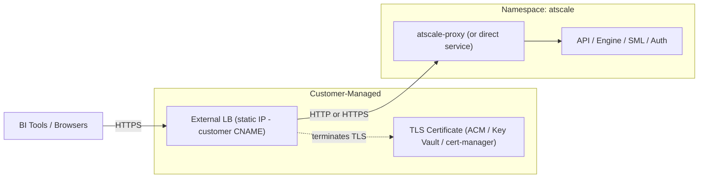

#### What Changes

The customer creates a static IP or DNS-managed CNAME entry pointing to the external load balancer. TLS certificates are managed in the customer's certificate store (ACM, Azure Key Vault, or cert-manager). The `atscale-proxy` pod routes internal traffic; TLS termination moves upstream. Health checks, WAF rules, and rate limiting are configured on the external LB.

| | Before | After |
|---|---|---|
| IP address | Dynamic (cloud-assigned) | Static (customer-controlled) |
| TLS certificate | Managed inside pod or K8s secret | Managed by cloud certificate service |
| DNS / CNAME ownership | AtScale deployment | Customer |
| Failover control | Kubernetes pod restart | LB target group / health check |

#### Advantages / Disadvantages

| Advantages | Disadvantages |
|---|---|
| Customer controls IP, CNAME, and DNS TTL — enables blue/green AtScale upgrades via DNS failover | Customer team must provision and maintain the external LB configuration |
| TLS certificates managed by cloud-native services (auto-renewal, hardware HSM) | Additional network path adds one hop; must ensure VPC routing is correct |
| WAF, DDoS protection, and rate limiting available at the LB layer | Certificate rotation and LB listener updates are outside the Helm chart lifecycle |
| Enables global routing (Route 53 latency routing, Azure Traffic Manager) | |
| Static IP simplifies firewall rules on the BI tool side | |

#### TCP Traffic Configuration (L4 Load Balancer)

AtScale exposes two distinct traffic types that require different load balancer layers:

| Traffic type | Protocol | Port | Load balancer layer | `values.yaml` key |
|---|---|---|---|---|
| HTTP — Design Center, REST API, XMLA/MDX | HTTPS (L7) | 443 | Application / L7 LB | `ingressDomain` |
| SQL — JDBC, TDS, pgwire | TCP (L4) | 15432 | Network / L4 LB | `ingressTCPDomain` |

If `ingressTCPDomain` is not set, all traffic (including TCP on `:15432`) falls back to `ingressDomain`. This works only when both the HTTP and TCP traffic share the same Network Load Balancer (single-LB option below). If they are split across separate load balancers, `ingressTCPDomain` must be explicitly set.

After deployment, downloaded `.tds` Tableau data-source files automatically reference `ingressTCPDomain` as the pgwire connection host.

##### Option A — Single Network Load Balancer (AWS NLB)

One NLB handles both HTTPS and TCP traffic. TLS termination for HTTPS occurs at the `atscale-proxy` pod. This is the simpler option when a single DNS hostname for all traffic is acceptable.

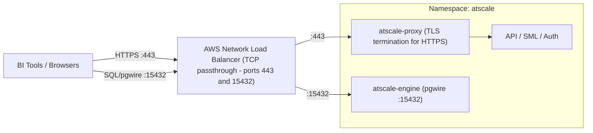

Annotate the `atscale-proxy` Kubernetes Service in `values.yaml`:

```yaml
ingressDomain: atscale.example.com      # single hostname for all traffic
# ingressTCPDomain is left unset — falls back to ingressDomain

atscale-proxy:
  service:
    type: LoadBalancer
    annotations:
      service.beta.kubernetes.io/aws-load-balancer-type: nlb
      service.beta.kubernetes.io/aws-load-balancer-nlb-target-type: instance
      service.beta.kubernetes.io/aws-load-balancer-cross-zone-load-balancing-enabled: "true"
```

##### Option B — Dual Load Balancer (L7 for HTTP + L4 for TCP)

An L7 Application Load Balancer (ALB / GCP HTTPS LB / Azure App Gateway) handles HTTPS traffic. A separate L4 Network Load Balancer (or a `LoadBalancer`-type Kubernetes Service) handles raw TCP on `:15432`. This is the preferred option when WAF, path-based routing, or Google GCE ingress is required.

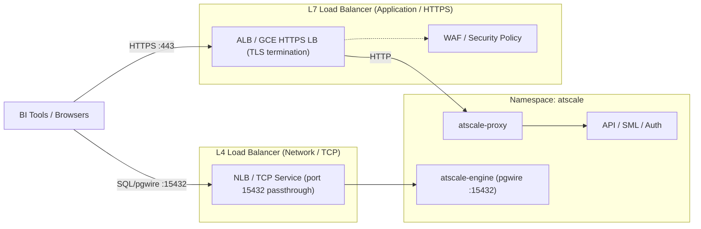

Set separate domain values in `values.yaml` and configure a dedicated `LoadBalancer` Service for the engine TCP port:

```yaml
ingressDomain: atscale.example.com       # hostname for HTTPS / Design Center / XMLA
ingressTCPDomain: sql.atscale.example.com  # hostname for JDBC / TDS / pgwire

# L7 ingress — GCE example (adjust for ALB / App Gateway as needed)
atscale-proxy:
  ingress:
    enabled: true
    ingressClassName: gce
    annotations:
      kubernetes.io/ingress.allow-http: "false"
    tls:
      - secretName: atscale-tls
        hosts:
          - atscale.example.com

# L4 service for raw TCP on port 15432
atscale-engine:
  tcpService:
    enabled: true
    type: LoadBalancer
    port: 15432
    targetPort: 15432
    loadBalancerSourceRanges:          # restrict to known BI tool / office CIDRs
      - 10.0.0.0/8
      - 203.0.113.0/24
```

`loadBalancerSourceRanges` is strongly recommended on the L4 service — unlike the L7 layer there is no WAF or path-based policy to restrict access.

##### Health Check Port

Both load balancer options require a health check against the `atscale-proxy` HTTP port. Configure the health check target as port `8888` (the NGINX stub-status endpoint) rather than `:443`, which requires TLS negotiation and adds latency to health probe cycles.

---

### Decision 5 — Persistent Volume Support

> **Recommendation: ⚠️ TBD**

#### Before — No Persistent Volumes (Ephemeral Pod Storage)

AtScale pods use ephemeral storage only. State is stored in PostgreSQL and Redis. Pod restarts or rescheduling do not require volume reattachment.

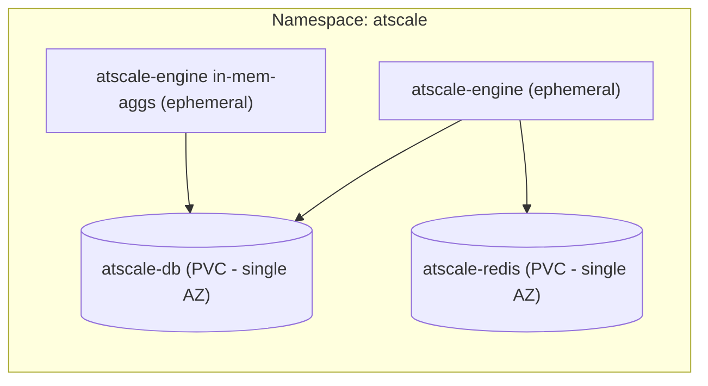

#### After — Persistent Volumes with Cross-Zone Storage Class

PVCs are backed by a storage class that supports cross-zone replication (e.g., AWS EFS, Azure Files, GCP Filestore, or Portworx). The database and Redis pods can reschedule across availability zones without data loss.

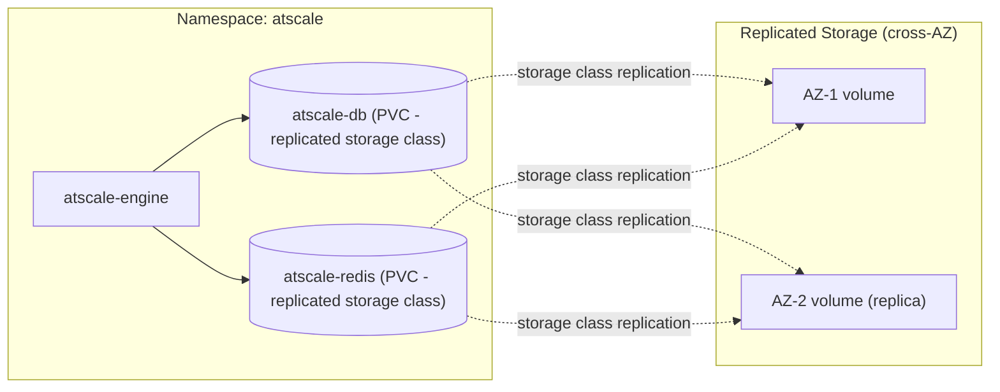

#### What Changes

PVC storage classes for `atscale-db` and `atscale-redis` are changed from the default single-AZ block storage (e.g., `gp2`, `managed-premium`) to a cross-AZ replicated class (e.g., `efs-sc`, `azurefile`, `portworx-replicated`). The database and cache pods gain AZ portability at the cost of storage I/O latency introduced by the replication protocol.

| | Before | After |
|---|---|---|
| Storage class | Single-AZ block (gp2, managed-premium) | Cross-AZ replicated (EFS, Portworx, Azure Files) |
| Pod AZ portability | No — pod pinned to AZ where PVC was created | Yes — pod can reschedule to any AZ |
| I/O latency | Low (local block device) | Higher (network-attached or replicated) |
| Cross-region replication | Not supported | Not supported (cross-region remains out of scope) |

#### Advantages / Disadvantages

| Advantages | Disadvantages |
|---|---|
| Database and cache pods reschedule across AZs after a node failure | Replicated storage class introduces higher I/O latency vs. local block storage |
| Eliminates AZ pinning for stateful pods | PostgreSQL and Redis are write-intensive; NFS-based storage classes (EFS, Azure Files) may not meet throughput requirements |
| Simplifies multi-AZ cluster topology | Cross-region replication is not addressed by this decision — see Decision 2 (External PostgreSQL) for DR replication |
| | Replicated storage classes are typically more expensive per GB than block storage |
| | Not all storage classes support all access modes — ReadWriteMany may conflict with PostgreSQL's single-writer model |

**Note:** Cross-zone replication within a region is achievable with the right storage class. Cross-region replication has different characteristics and may not meet recovery time or consistency expectations; for cross-region DR, externalizing PostgreSQL (Decision 2) is the preferred path.

---

### Decision 6 — Automatic Horizontal Elasticity

> **Recommendation: ❌ Not Recommended for Initial Deployment — add later once baseline is stable**

#### Before — Fixed Single Engine Replica

The `atscale-engine` deployment runs as a single pod with a fixed resource allocation. Query capacity is static regardless of demand. If the pod is rescheduled or restarts, query serving is interrupted until the pod is ready again.

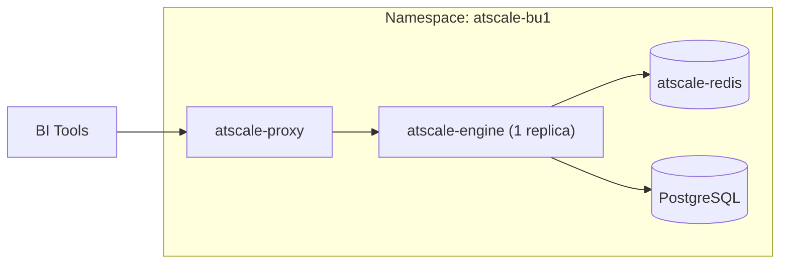

#### After — Horizontally Scaled Engine with HPA

A Kubernetes `HorizontalPodAutoscaler` manages the `atscale-engine` deployment, scaling the replica count up and down based on CPU and memory utilisation. The ingress layer must be configured with session affinity (sticky sessions) for XMLA/MDX connections, which are stateful. Redis and PostgreSQL are shared across all engine replicas.

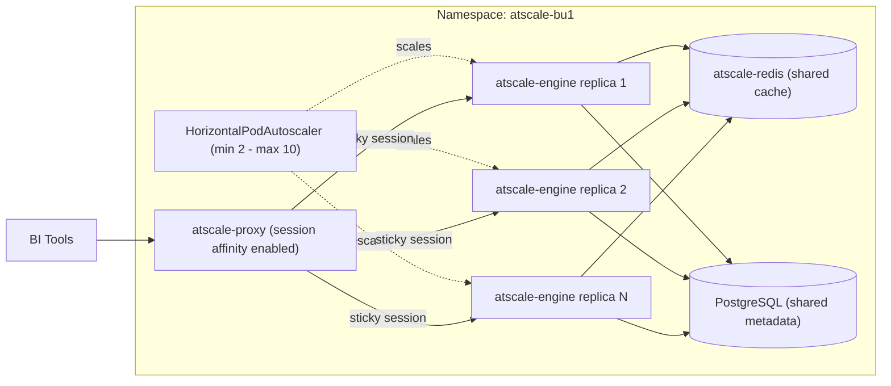

#### What Changes

A `HorizontalPodAutoscaler` resource is created targeting the `atscale-engine` deployment. The engine's `Deployment` must have CPU and memory `requests` and `limits` defined — HPA cannot function without `requests`. The `atscale-proxy` (or external load balancer) must enable session affinity so that XMLA/MDX sessions, which are stateful, continue to reach the same engine pod for the duration of the session. Redis is shared across all replicas for query result caching.

| | Before | After |
|---|---|---|
| Engine replicas | 1 (fixed) | 2–10 (HPA-managed) |
| Query capacity | Fixed | Scales with demand |
| XMLA/MDX session handling | Single pod — no affinity needed | Requires sticky sessions at ingress |
| Cache sharing | Single pod — local | Redis shared across all replicas |
| Resource requirements | No `requests`/`limits` required | `requests` mandatory for HPA metrics |

#### Kubernetes Commands

**Imperative — quick start:**

```bash
# Enable HPA on the engine deployment (requires metrics-server to be installed)
kubectl autoscale deployment atscale-engine \
  --namespace atscale-bu1 \
  --min=2 \
  --max=10 \
  --cpu-percent=70

# Check HPA status and current replica count
kubectl get hpa atscale-engine -n atscale-bu1

# Watch scaling events in real time
kubectl describe hpa atscale-engine -n atscale-bu1
```

**Declarative — recommended for production:**

```yaml
# hpa-atscale-engine.yaml
apiVersion: autoscaling/v2
kind: HorizontalPodAutoscaler
metadata:
  name: atscale-engine
  namespace: atscale-bu1
spec:
  scaleTargetRef:
    apiVersion: apps/v1
    kind: Deployment
    name: atscale-engine
  minReplicas: 2
  maxReplicas: 10
  metrics:
    - type: Resource
      resource:
        name: cpu
        target:
          type: Utilization
          averageUtilization: 70
    - type: Resource
      resource:
        name: memory
        target:
          type: Utilization
          averageUtilization: 80
  behavior:
    scaleDown:
      stabilizationWindowSeconds: 300   # wait 5 min before scaling down
      policies:
        - type: Pods
          value: 1
          periodSeconds: 120            # remove at most 1 pod every 2 min
    scaleUp:
      stabilizationWindowSeconds: 30
      policies:
        - type: Pods
          value: 2
          periodSeconds: 60             # add at most 2 pods per minute
```

```bash
kubectl apply -f hpa-atscale-engine.yaml

# Verify the engine Deployment has resource requests set (required for HPA)
kubectl get deployment atscale-engine -n atscale-bu1 \
  -o jsonpath='{.spec.template.spec.containers[0].resources}'

# Remove HPA if needed (returns deployment to manual replica control)
kubectl delete hpa atscale-engine -n atscale-bu1
```

**Enable session affinity on the engine Service** (required for XMLA/MDX statefulness):

```bash
kubectl patch service atscale-engine -n atscale-bu1 \
  --type='merge' \
  -p '{"spec":{"sessionAffinity":"ClientIP","sessionAffinityConfig":{"clientIP":{"timeoutSeconds":10800}}}}'
```

#### Advantages / Disadvantages

| Advantages | Disadvantages |
|---|---|
| Query throughput scales automatically with BI tool load | XMLA/MDX connections are stateful — session affinity must be correctly configured at the ingress and service layer, or active sessions drop on reschedule |
| Multiple engine replicas provide redundancy — a single pod failure does not interrupt all queries | Aggregate build coordination across replicas adds operational complexity |
| Scale-down during off-peak hours reduces node cost | CPU and memory `requests` must be carefully tuned before HPA targets are meaningful — under-specified requests cause premature scaling; over-specified cause over-provisioning |
| Can be applied per BU namespace independently | Kubernetes Metrics Server (or Prometheus Adapter for custom metrics) must be installed and healthy in the cluster |
| | Debugging query failures becomes harder — errors may occur on one replica but not others, requiring per-pod log correlation |
| | Not suitable as an initial deployment configuration — baseline resource sizing and session handling must be validated first |

**Note:** Horizontal scaling applies to `atscale-engine` only. Read replicas for PostgreSQL and Redis cluster mode are separately possible but address different bottlenecks (metadata read throughput and cache capacity respectively) and are independent of this decision.
