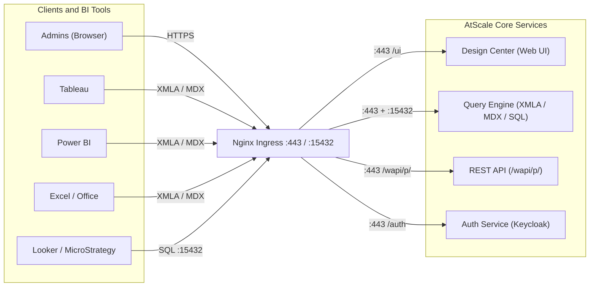
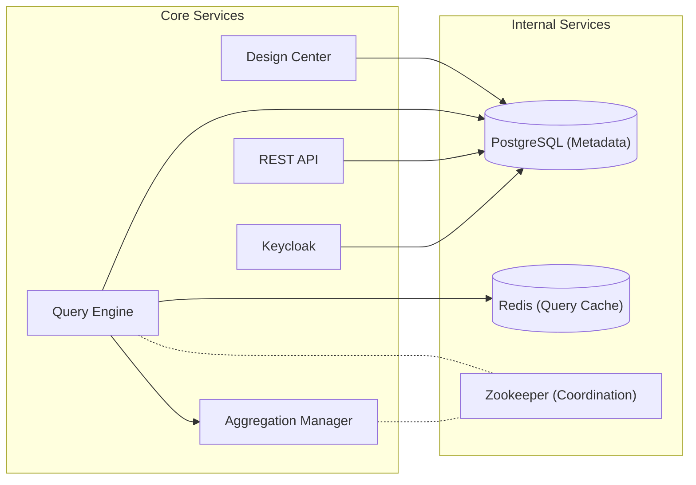
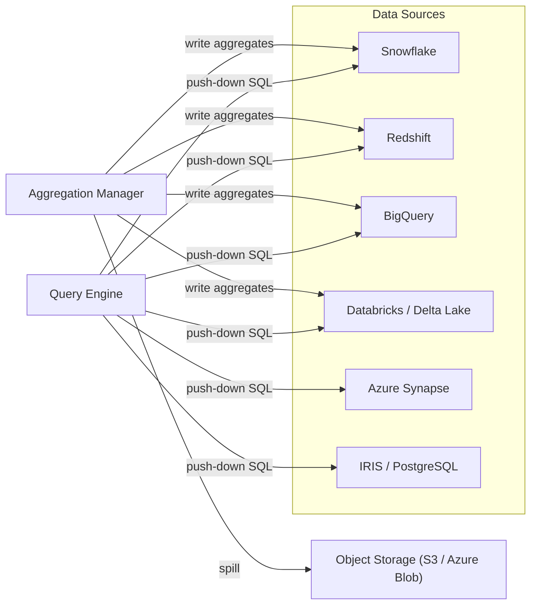
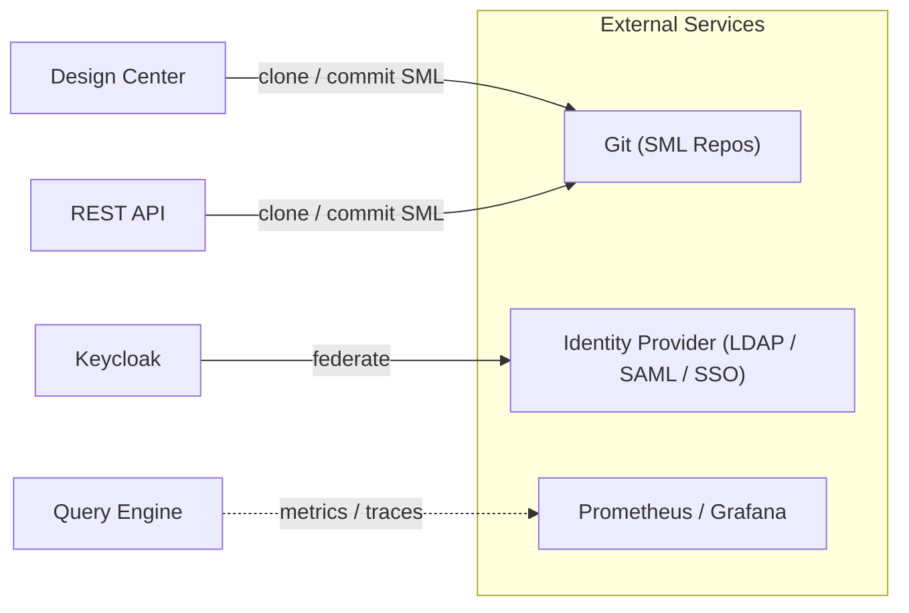
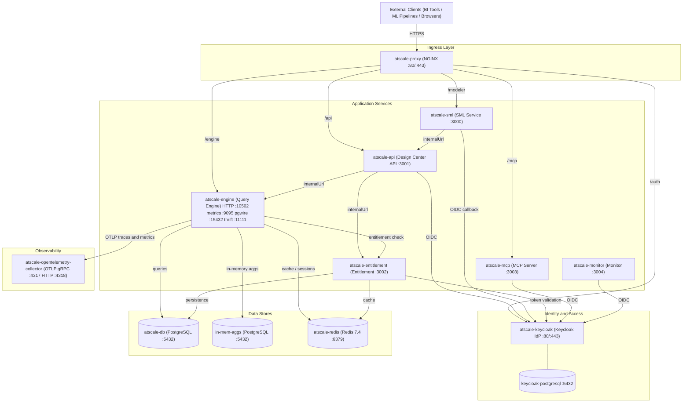

# AtScale Architecture

## Overview

AtScale runs as a Kubernetes deployment (installed via Helm) that sits between BI tools and data sources, providing a universal semantic layer. BI tools connect via XMLA/MDX or SQL; AtScale translates queries to native SQL and pushes them down to the underlying data warehouse.

## Architecture Diagrams

### Request Routing

How external clients reach AtScale services through the Nginx ingress.

### Internal Storage Connections

How core services read and write to internal storage.

### Data Warehouse Connections

How the Query Engine and Aggregation Manager interact with external data sources.

### External Service Connections

How AtScale integrates with Git, identity providers, and observability.

## Component Reference

### Ingress

| Component | Detail |
|---|---|
| **Nginx Ingress** | Entry point for all external traffic. Routes `:443` to Design Center, XMLA/MDX engine, REST API, and Auth. Routes `:15432` (Postgres-compatible) to the SQL Analytics interface of the Query Engine. |

### Core Pods

| Component | Detail |
|---|---|
| **Design Center** | Browser-based semantic layer designer. Used to build and manage SML models, connections, and deployments. Reads/writes model files to Git and model metadata to PostgreSQL. |
| **Query Engine** | Receives MDX/XMLA queries from BI tools and SQL queries from direct clients. Translates semantic queries to native SQL dialects and executes them against the connected data source via push-down. Returns results through the originating protocol. |
| **Aggregation Manager** | Monitors query patterns and cost estimates. Plans, creates, and refreshes pre-computed aggregate tables in the data warehouse to accelerate repeated queries. Coordinates with the Query Engine via Zookeeper. |
| **REST API (wapi)** | Management API served at `/wapi/p/`. Used to programmatically create connections, deploy models, list catalogs, and trigger operations. All `ps-utils` AtScale config operations call this API. |
| **Auth Service (Keycloak)** | Handles all authentication and session management. Delegates to external identity providers via LDAP or SAML/SSO. Issues short-lived JWTs consumed by the REST API and Design Center. |

### Internal Services

| Component | Detail |
|---|---|
| **PostgreSQL (Metadata)** | Stores model definitions, connection configurations, deployment state, query statistics, and user/role assignments. Central store for all AtScale state. |
| **Zookeeper** | Provides distributed coordination between Query Engine replicas and the Aggregation Manager. Manages leader election and shared configuration. |
| **Redis (Query Cache)** | Caches query results to avoid redundant push-down executions against the data warehouse. TTL-based invalidation. |

## Helm Chart Component Diagram

The diagram below reflects the actual subcharts and inter-service wiring in the `atscale` Helm chart (v2026.4.0).

### Helm Subchart Reference

| Subchart | Alias | Role | Default Port(s) | Conditional |
|---|---|---|---|---|
| `atscale-proxy` | `atscale-proxy` | NGINX reverse proxy, TLS termination | 80 / 443 | `atscale-proxy.enabled` |
| `atscale-api` | `atscale-api` | Design Center REST API | 3001 | Always |
| `atscale-engine` | `atscale-engine` | XMLA / MDX / SQL query engine | 10502 (HTTP), 15432 (pgwire), 11111 (thrift), 9095 (metrics) | Always |
| `atscale-sml` | `atscale-sml` | Semantic Model Layer service | 3000 | Always |
| `atscale-entitlement` | `atscale-entitlement` | License and entitlement enforcement | 3002 | Always |
| `atscale-mcp` | `atscale-mcp` | MCP (AI tool) server | 3003 | `atscale-mcp.enabled` |
| `atscale-monitor` | `atscale-monitor` | Ops monitoring service | 3004 | `atscale-monitor.enabled` |
| `atscale-keycloak` | `keycloak` | Identity provider (OIDC / OAuth2) | 80 / 443 | `keycloak.enabled` |
| `atscale-db` | `db` | Main PostgreSQL database | 5432 | `db.enabled` |
| `atscale-db` | `in-mem-aggs` | PostgreSQL for in-memory aggregations | 5432 | `in-mem-aggs.enabled` |
| `atscale-redis` | `redis` | Redis cache and session store | 6379 | `redis.enabled` |
| `atscale-opentelemetry-collector` | `telemetry` | Telemetry aggregator (OTLP) | 4317 (gRPC), 4318 (HTTP) | `global.atscale.telemetry.enabled` |

### External Connections

| Entity | Protocol / Interface | Direction |
|---|---|---|
| **Tableau Server** | XMLA / MDX over HTTPS | Inbound to Nginx |
| **Power BI** | XMLA / MDX over HTTPS | Inbound to Nginx |
| **Excel / Office** | MDX over OLE DB for OLAP | Inbound to Nginx |
| **Looker / MicroStrategy / Custom** | XMLA or SQL (`:15432`) | Inbound to Nginx |
| **Users / Admins** | Browser (HTTPS) or REST API | Inbound to Nginx |
| **Snowflake** | Push-down SQL (JDBC/ODBC) | Outbound from Query Engine |
| **Redshift** | Push-down SQL (JDBC) | Outbound from Query Engine |
| **BigQuery** | Push-down SQL (REST/JDBC) | Outbound from Query Engine |
| **Databricks / Delta Lake** | Push-down SQL (JDBC) | Outbound from Query Engine |
| **Azure Synapse** | Push-down SQL (JDBC) | Outbound from Query Engine |
| **IRIS** | Push-down SQL | Outbound from Query Engine |
| **PostgreSQL** | Push-down SQL | Outbound from Query Engine |
| **Git** | HTTPS (clone / push SML files) | Outbound from Design Center and REST API |
| **Identity Provider** | LDAP or SAML 2.0 / OIDC | Outbound from Auth Service |
| **Object Storage (S3 / Blob)** | Cloud SDK | Outbound from Aggregation Manager (aggregate spill) |
| **Prometheus / Grafana** | Prometheus scrape endpoint | Outbound from Query Engine (optional) |
