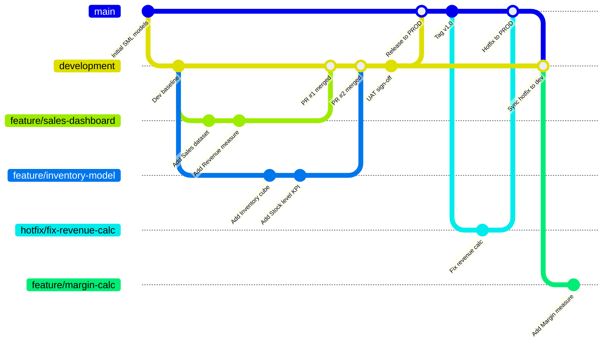
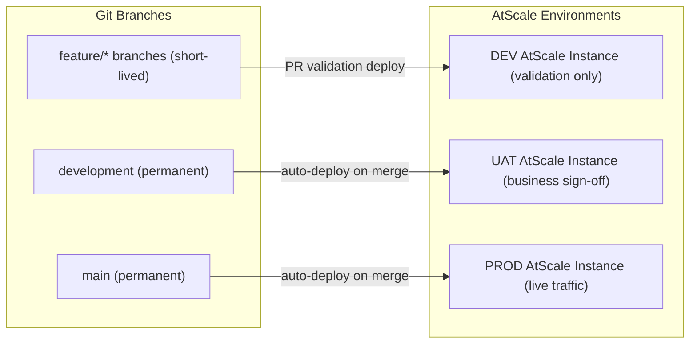
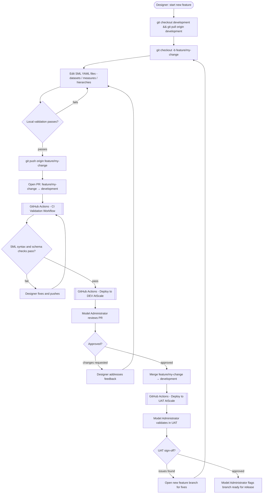
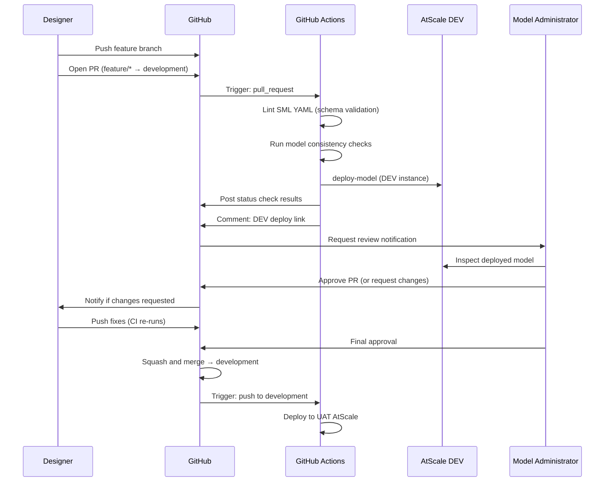
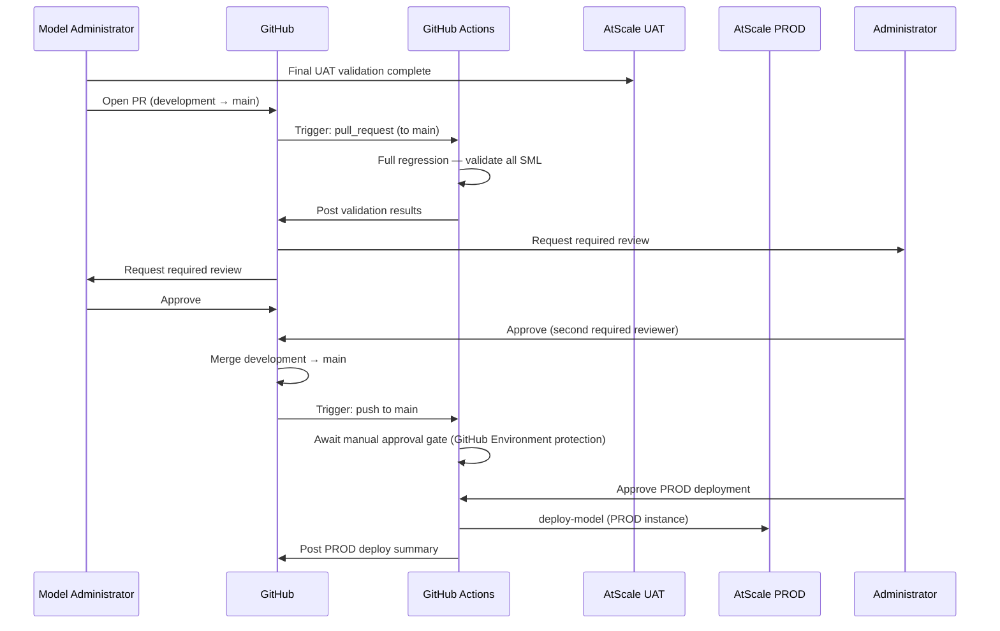
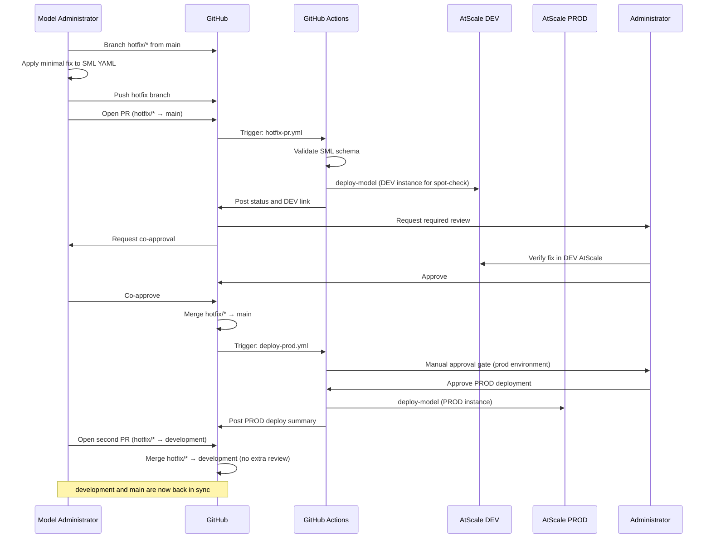
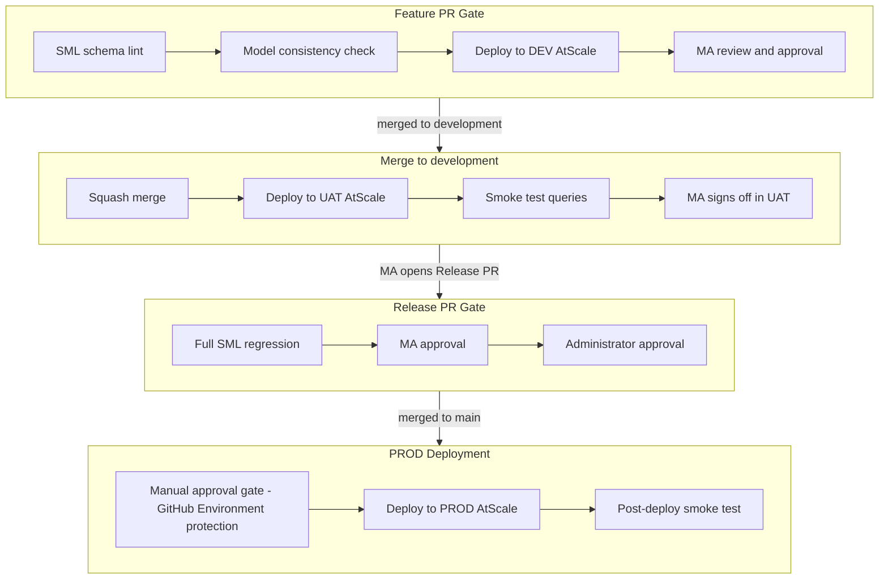
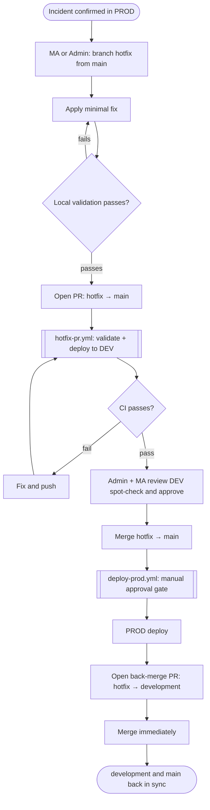
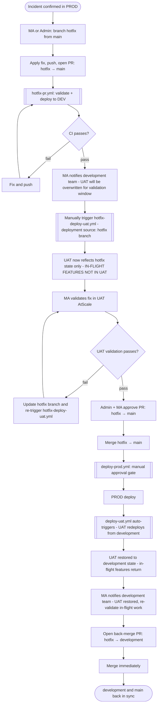
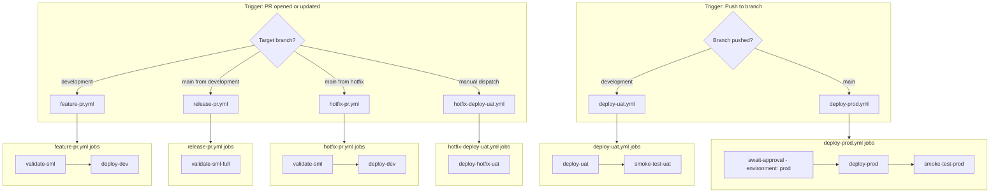

# AtScale SML Git Branching and PR Strategy

## Table of Contents

- [Overview](#overview)
- [Branch Structure](#branch-structure)
- [Personas and Responsibilities](#personas-and-responsibilities)
- [Branch–Environment Mapping](#branchenvironment-mapping)
- [Feature Development Workflow](#feature-development-workflow)
- [Pull Request Process](#pull-request-process)
- [Environment Promotion Pipeline](#environment-promotion-pipeline)
- [Patch (Hotfix) Workflow](#patch-hotfix-workflow)
- [Step-by-Step Instructions](#step-by-step-instructions)
  - [Administrator: Repository Setup](#administrator-repository-setup)
  - [Designer: Day-to-Day Workflow](#designer-day-to-day-workflow)
  - [Model Administrator: Review and Promote](#model-administrator-review-and-promote)
- [GitHub Actions Automation](#github-actions-automation)
- [Best Practices](#best-practices)

---

## Overview

AtScale stores semantic models as YAML files (SML) in Git. Treating these files as code — with branches, peer review, and automated deployment — ensures model changes are traceable, peer-reviewed, and promoted safely across environments.

This document defines:

- The branch topology and what each branch represents
- Which persona owns each stage of the process
- How pull requests trigger automated validation and deployment
- How the `development` and `main` branches map to UAT and PROD

---

## Branch Structure



| Branch | Lifetime | Created by | Merged into |
|---|---|---|---|
| `main` | Permanent | Administrator (at repo creation) | — (receives merges from `development` and `hotfix/*`) |
| `development` | Permanent | Administrator | `main` (via Release PR) |
| `feature/<name>` | Short-lived | Designer or Model Administrator | `development` (via Feature PR) |
| `hotfix/<name>` | Short-lived | Model Administrator or Administrator | `main` AND `development` (via Hotfix PRs) |

### Branch naming conventions

Feature branches follow the pattern `feature/<short-description>` using kebab-case. Hotfix branches follow the same convention with a `hotfix/` prefix:

```
feature/add-sales-revenue-measures
feature/inventory-cube-redesign
feature/fix-margin-calculation
feature/q3-product-hierarchy

hotfix/fix-revenue-calc-divide-by-zero
hotfix/correct-date-hierarchy-sort
hotfix/remove-broken-calculated-member
```

---

## Personas and Responsibilities

### Administrator

The Administrator owns the repository infrastructure, branch protection rules, environment secrets, and GitHub Actions workflows. They do not typically make SML changes day-to-day.

| Responsibility | Detail |
|---|---|
| Repository setup | Creates the repo, initialises `main` and `development`, configures branch protection |
| Branch protection | Enforces required reviewers, status checks, and merge restrictions on `main` and `development` |
| Environment secrets | Stores AtScale connection credentials (API tokens, hostnames) as GitHub Secrets per environment |
| Workflow authoring | Writes and maintains `.github/workflows/` files |
| Release PRs | Opens and approves PRs from `development` → `main` for PROD releases |

### Model Administrator

The Model Administrator is responsible for the quality and consistency of the semantic layer. They review Designer PRs, ensure naming conventions and business logic are correct, and coordinate UAT sign-off before releasing to PROD.

| Responsibility | Detail |
|---|---|
| Feature PR review | Reviews and approves PRs from `feature/*` → `development` |
| UAT validation | Validates deployed models in the UAT AtScale instance after a feature merges |
| Release coordination | Confirms readiness for PROD, co-approves the `development` → `main` PR |
| Model standards | Enforces SML naming conventions, measure definitions, and hierarchy standards |

### Designer

Designers create and modify SML model files. They work exclusively on `feature/*` branches and submit PRs to `development`.

| Responsibility | Detail |
|---|---|
| Feature branches | Creates a `feature/*` branch from `development` for each unit of work |
| SML authoring | Edits datasets, dimensions, hierarchies, measures, and calculated members |
| Self-review | Validates SML locally before opening a PR |
| PR description | Documents what changed and why (business context, impacted reports) |

---

## Branch–Environment Mapping



| Environment | Source Branch | Deploy Trigger | Approval Required |
|---|---|---|---|
| DEV | `feature/*` or `hotfix/*` (PR head) | PR opened / updated | None — automated only |
| UAT | `development` | Merge to `development` | Model Administrator (PR review) |
| PROD | `main` | Merge to `main` | Administrator + Model Administrator (both required) |

**Key rule:** PROD only ever receives a deploy from `main`. UAT only ever receives a deploy from `development`. The only branches that may merge into `main` are `development` (planned releases) and `hotfix/*` (emergency patches). `hotfix/*` branches must also be merged back into `development` immediately after.

---

## Feature Development Workflow

This diagram shows the full lifecycle of a single feature, from branch creation through PROD.



---

## Pull Request Process

### Feature PR (feature/* → development)



### Release PR (development → main)



### Hotfix PR (hotfix/* → main)



---

## Environment Promotion Pipeline



The standard promotion path is strictly one-directional:

```
feature/* → development → main
     ↓             ↓         ↓
    DEV           UAT       PROD
```

Hotfix branches provide a fast lane directly to PROD, bypassing UAT, with an immediate back-merge to keep `development` in sync:

```
hotfix/* → main → development
     ↓       ↓
    DEV     PROD
```

Models can never be deployed to PROD by pushing directly to `main`. Branch protection enforces that `main` only accepts merges from `development` or `hotfix/*` via a PR.

---

## Patch (Hotfix) Workflow

A hotfix branch is the only authorised path for patching `main` and PROD outside of the normal `feature/* → development → main` promotion cycle. It is reserved for production incidents that cannot wait for the next planned release.

**When to use a hotfix:**

- A measure in PROD is returning incorrect results affecting live reports
- A broken calculated member is causing PROD query failures
- A data source connection change requires an immediate model update

**When NOT to use a hotfix:**

- Improvements or new features, however small — use a `feature/*` branch
- Changes that can wait until the next planned UAT window
- Anything that has not been confirmed broken in PROD

### Two Hotfix Paths

The urgency and risk of the fix determines whether it bypasses UAT or is validated there first:

| Path | When to use | UAT validation | Approximate time to PROD |
|---|---|---|---|
| **Emergency — bypass UAT** | PROD is actively broken, business impact every minute | DEV only | ~30 minutes |
| **UAT-validated** | Fix is non-trivial or touches widely-used measures, 1–4 hours acceptable | DEV + UAT | ~2–4 hours |

Both paths use the same `hotfix/*` branch and both require the Administrator + Model Administrator dual approval. The difference is whether UAT is used as a validation gate before merging to `main`.

#### Path 1: Emergency (bypass UAT)

Use when the incident is severe enough that any UAT delay is unacceptable.



#### Path 2: UAT-Validated Hotfix

Use when the fix is broad enough that DEV validation alone is insufficient, but the full `development → main` release cycle is too slow.

**The core complication:** UAT is a shared environment that normally tracks the `development` branch. An active development cycle means UAT already contains in-flight features that have not yet shipped to PROD. Deploying the hotfix branch to UAT will **temporarily overwrite those in-flight features** from UAT, disrupting any ongoing UAT testing by Designers and Model Administrators.



**Managing the UAT disruption:** Overwriting UAT is unavoidable on this path. The steps to minimise impact are:

1. **Notify before overwriting.** The Model Administrator must message the development team (Slack, Teams, or GitHub comment on open PRs) before triggering `hotfix-deploy-uat.yml`. Include an estimated validation window duration.
2. **Keep the window short.** Aim to complete UAT validation and merge the hotfix within 2 hours. The longer UAT sits on the hotfix state, the more development work is blocked.
3. **Confirm restoration.** After the hotfix merges to `main`, `deploy-uat.yml` automatically redeploys from `development`. Notify the development team when this completes so they can re-validate their in-flight work.
4. **Do not merge any `feature/*` PRs to `development` during the UAT window.** This would change what UAT redeploys to after the hotfix, potentially masking UAT failures with new changes.

| Step | Who | Emergency path | UAT-validated path |
|---|---|---|---|
| 1 | MA or Admin | Branch `hotfix/*` from `main` | Branch `hotfix/*` from `main` |
| 2 | MA or Admin | Apply fix, push, open PR → `main` | Apply fix, push, open PR → `main` |
| 3 | CI | Validate SML + deploy to DEV | Validate SML + deploy to DEV |
| 4 | MA | Spot-check fix in DEV AtScale | Notify dev team: UAT will be overwritten |
| 5 | MA | — | Manually trigger `hotfix-deploy-uat.yml` |
| 6 | MA | — | Validate fix in UAT AtScale |
| 7 | Admin + MA | Approve PR → `main` | Approve PR → `main` |
| 8 | Admin | Approve PROD gate | Approve PROD gate |
| 9 | CI | Deploy to PROD | Deploy to PROD; UAT auto-redeploys from `development` |
| 10 | MA | — | Notify dev team: UAT restored |
| 11 | MA or Admin | Open back-merge PR: `hotfix/*` → `development` | Open back-merge PR: `hotfix/*` → `development` |
| 12 | Any approver | Merge immediately | Merge immediately |

**Critical rule — sync back to `development`:** Every hotfix merged to `main` must immediately be merged into `development` as well. Skipping this step causes `development` to diverge from `main`, which will produce merge conflicts on the next Release PR and may cause the same bug to reappear after the next planned release.

---

## Step-by-Step Instructions

### Administrator: Repository Setup

#### 1. Initialise the repository

```bash
git init atscale-models
cd atscale-models
# Add initial SML files (copy from existing AtScale export or template)
git add .
git commit -m "feat: initial SML model structure"
git push -u origin main
```

#### 2. Create the permanent `development` branch

```bash
git checkout -b development
git push -u origin development
```

#### 3. Configure branch protection rules

In GitHub → Settings → Branches → Add rule:

**For `main`:**

| Setting | Value |
|---|---|
| Require a pull request before merging | ✅ |
| Required approvals | 2 (Model Administrator + Administrator) |
| Dismiss stale reviews on push | ✅ |
| Require status checks to pass | ✅ — `validate-sml`, `deploy-dev` |
| Require branches to be up to date | ✅ |
| Restrict who can push | Administrators only |
| Allow only squash merging | ✅ |

**For `development`:**

| Setting | Value |
|---|---|
| Require a pull request before merging | ✅ |
| Required approvals | 1 (Model Administrator) |
| Require status checks to pass | ✅ — `validate-sml` |
| Allow only squash merging | ✅ |

#### 4. Create GitHub Environments and secrets

In GitHub → Settings → Environments, create three environments: `dev`, `uat`, `prod`.

For `prod`, add a **Required reviewers** protection rule (list the Administrator GitHub usernames). This creates the manual approval gate before PROD deploys.

Add the following secrets to each environment:

| Secret | Description |
|---|---|
| `ATSCALE_HOST` | Hostname of the AtScale instance for this environment |
| `ATSCALE_API_TOKEN` | API token for the AtScale instance |
| `ATSCALE_ORG` | AtScale organisation name |

#### 5. Commit the GitHub Actions workflow files

See [GitHub Actions Automation](#github-actions-automation) for the full workflow YAML files. Commit them to `.github/workflows/` on both `main` and `development`.

---

### Designer: Day-to-Day Workflow

#### 1. Start a new feature

Always branch from the latest `development`:

```bash
git checkout development
git pull origin development
git checkout -b feature/add-revenue-measures
```

#### 2. Edit SML model files

SML models live as YAML files in your repository. Modify per your requirements.


#### 3. Validate locally

```bash
# Validate SML YAML files with your preferred YAML linter
yamllint ./models
```

#### 4. Push and open a PR

```bash
git add .
git commit -m "feat: add revenue measures to sales dataset"
git push origin feature/add-revenue-measures
```

Open a pull request on GitHub: `feature/add-revenue-measures` → `development`.

**PR description should include:**

- What changed (which models, datasets, measures)
- Why the change was made (business requirement, report impacted)
- Which dashboards or queries to test in DEV
- Any breaking changes (renamed measures, removed columns)

#### 5. Address review feedback

If the Model Administrator requests changes:

```bash
# Make edits, then:
git add .
git commit -m "fix: rename measure per naming convention feedback"
git push origin feature/add-revenue-measures
# CI re-runs automatically; reviewer is notified
```

---

### Model Administrator: Review and Promote

#### Reviewing a Feature PR

1. Open the PR on GitHub and read the description carefully
2. Review the file diff — check:
   - Measure names follow conventions (`Title Case`, no abbreviations)
   - SQL expressions reference valid columns
   - No duplicate measure names across datasets
   - Hierarchies have correct level ordering
3. Check the automated CI comment for the DEV deploy link
4. Open the DEV AtScale Design Center and validate:
   - Model deploys without errors
   - Spot-check measures return expected values
   - Run a sample MDX/SQL query to confirm logic
5. Approve the PR (or request changes with specific comments)

#### UAT Sign-off After Merge

Once a feature PR merges to `development`, the UAT deploy runs automatically. After CI completes:

1. Open the UAT AtScale instance
2. Run the affected reports or dashboards end-to-end
3. Confirm business stakeholders have signed off
4. Mark the feature ready for release (GitHub issue, Jira ticket, or a comment on the PR)

#### Opening a Release PR

When one or more features are UAT-approved and ready for PROD:

```bash
# Ensure development is up to date
git checkout development
git pull origin development

# Open PR via GitHub CLI or UI
gh pr create \
  --base main \
  --head development \
  --title "release: promote UAT-validated models to PROD" \
  --body "$(cat <<'EOF'
## Changes included
- feat: add revenue measures to sales dataset (#12)
- feat: inventory cube redesign (#15)

## UAT sign-off
- [ ] Revenue measures validated by Finance team
- [ ] Inventory cube validated by Supply Chain team

## Checklist
- [ ] All CI checks passing on development
- [ ] No breaking changes to existing reports
- [ ] PROD deploy scheduled during low-traffic window
EOF
)"
```

#### Applying a Hotfix (Emergency — bypass UAT)

Use this path only for confirmed PROD incidents that cannot wait for a planned release.

```bash
# 1. Branch from main (not development)
git checkout main
git pull origin main
git checkout -b hotfix/fix-revenue-calc

# 2. Apply the minimal targeted fix, then validate
yamllint ./models

# 3. Commit and push
git add .
git commit -m "fix: correct revenue calc divide-by-zero on null orders"
git push origin hotfix/fix-revenue-calc

# 4. Open PR targeting main
gh pr create \
  --base main \
  --head hotfix/fix-revenue-calc \
  --title "hotfix: correct revenue calc divide-by-zero" \
  --body "$(cat <<'EOF'
## Incident
Revenue measure returning NULL for orders with zero quantity. Affects all PROD dashboards.

## Fix
Added NULLIF guard to the revenue SQL expression.

## Checklist
- [ ] Validated in DEV AtScale via CI deploy link
- [ ] No other measures affected
- [ ] Back-merge PR to development opened immediately after merge
EOF
)"

# 5. After hotfix merges to main, immediately open the back-merge PR
git checkout development
git pull origin development
gh pr create \
  --base development \
  --head hotfix/fix-revenue-calc \
  --title "chore: sync hotfix/fix-revenue-calc back to development" \
  --body "Back-merge of hotfix merged to main. No additional review required."
```

#### Applying a Hotfix (UAT-Validated)

Use when the fix needs UAT sign-off before reaching PROD. Follow the emergency steps above through pushing the hotfix branch and opening the PR to `main`, then pause before requesting approvals and do the following instead:

```bash
# After the hotfix PR is open and hotfix-pr.yml CI has passed on DEV:

# 1. Notify the development team before touching UAT
#    Post in your team channel:
#    "Deploying hotfix/fix-description to UAT for validation.
#     UAT will not reflect in-flight development work during this window (~2h).
#     Please hold merges to development until I confirm UAT is restored."

# 2. Trigger the manual UAT deploy via GitHub CLI
gh workflow run hotfix-deploy-uat.yml \
  --field hotfix_branch=hotfix/fix-revenue-calc \
  --field reason="Revenue calc returning NULL on zero-quantity orders — PROD incident"

# 3. Validate the fix in UAT AtScale
#    Open UAT Design Center, run the affected queries, confirm the fix is correct.

# 4. Once UAT sign-off is complete, request PR approvals and proceed to merge
#    deploy-prod.yml fires on merge to main.
#    deploy-uat.yml also fires, restoring UAT from development automatically.

# 5. After UAT is restored, notify the development team
#    "UAT has been restored to the development branch. You can resume UAT testing."

# 6. Open the back-merge PR as usual
git checkout development
git pull origin development
gh pr create \
  --base development \
  --head hotfix/fix-revenue-calc \
  --title "chore: sync hotfix/fix-revenue-calc back to development"
```

---

## GitHub Actions Automation

### Workflow overview



### `.github/workflows/feature-pr.yml`

Runs on every push to a `feature/*` PR targeting `development`. Validates SML and deploys to the DEV AtScale instance for reviewer inspection.

```yaml
name: Feature PR — Validate and Deploy to DEV

on:
  pull_request:
    branches:
      - development

jobs:
  validate-sml:
    name: Validate SML
    runs-on: ubuntu-latest
    steps:
      - uses: actions/checkout@v4

      - name: Validate SML YAML schema
        run: |
          # Replace with your preferred SML/YAML validation tool
          yamllint ./models

  deploy-dev:
    name: Deploy to DEV AtScale
    needs: validate-sml
    runs-on: ubuntu-latest
    environment: dev
    steps:
      - uses: actions/checkout@v4

      - name: Deploy model to DEV
        env:
          ATSCALE_HOST: ${{ secrets.ATSCALE_HOST }}
          ATSCALE_API_TOKEN: ${{ secrets.ATSCALE_API_TOKEN }}
          ATSCALE_ORG: ${{ secrets.ATSCALE_ORG }}
        run: |
          # Authenticate and deploy via AtScale REST API
          TOKEN=$(curl -s -X POST "https://${ATSCALE_HOST}/v1/token" \
            -H "Authorization: Bearer ${ATSCALE_API_TOKEN}" \
            -H "Content-Type: application/json" | jq -r '.token')
          curl -s -X POST "https://${ATSCALE_HOST}/wapi/p/catalogs" \
            -H "Authorization: Bearer ${TOKEN}" \
            -H "Content-Type: application/json" \
            -d "{\"org\": \"${ATSCALE_ORG}\", \"smlRoot\": \"./models\"}"

      - name: Post DEV link to PR
        uses: actions/github-script@v7
        with:
          script: |
            github.rest.issues.createComment({
              issue_number: context.issue.number,
              owner: context.repo.owner,
              repo: context.repo.repo,
              body: `✅ **DEV deploy complete.** Review at: https://${{ secrets.ATSCALE_HOST }}/ui`
            })
```

### `.github/workflows/deploy-uat.yml`

Runs automatically when a PR merges into `development`. Deploys all models to the UAT AtScale instance.

```yaml
name: Deploy to UAT

on:
  push:
    branches:
      - development

jobs:
  deploy-uat:
    name: Deploy to UAT AtScale
    runs-on: ubuntu-latest
    environment: uat
    steps:
      - uses: actions/checkout@v4

      - name: Deploy model to UAT
        env:
          ATSCALE_HOST: ${{ secrets.ATSCALE_HOST }}
          ATSCALE_API_TOKEN: ${{ secrets.ATSCALE_API_TOKEN }}
          ATSCALE_ORG: ${{ secrets.ATSCALE_ORG }}
        run: |
          TOKEN=$(curl -s -X POST "https://${ATSCALE_HOST}/v1/token" \
            -H "Authorization: Bearer ${ATSCALE_API_TOKEN}" \
            -H "Content-Type: application/json" | jq -r '.token')
          curl -s -X POST "https://${ATSCALE_HOST}/wapi/p/catalogs" \
            -H "Authorization: Bearer ${TOKEN}" \
            -H "Content-Type: application/json" \
            -d "{\"org\": \"${ATSCALE_ORG}\", \"smlRoot\": \"./models\"}"

  smoke-test-uat:
    name: Smoke Test UAT
    needs: deploy-uat
    runs-on: ubuntu-latest
    environment: uat
    steps:
      - uses: actions/checkout@v4

      - name: Run MDX smoke tests
        env:
          ATSCALE_HOST: ${{ secrets.ATSCALE_HOST }}
          ATSCALE_API_TOKEN: ${{ secrets.ATSCALE_API_TOKEN }}
        run: |
          # Execute a known MDX query against UAT and assert non-empty results
          # Replace with your own test queries and assertion logic
          TOKEN=$(curl -s -X POST "https://${ATSCALE_HOST}/v1/token" \
            -H "Authorization: Bearer ${ATSCALE_API_TOKEN}" \
            -H "Content-Type: application/json" | jq -r '.token')
          curl -s -X POST "https://${ATSCALE_HOST}/xmla" \
            -H "Authorization: Bearer ${TOKEN}" \
            -H "Content-Type: text/xml" \
            -d '<Execute xmlns="urn:schemas-microsoft-com:xml-analysis"><Command><Statement>SELECT [Measures].[Total Revenue] ON 0 FROM [Sales]</Statement></Command><Properties/></Execute>'
```

### `.github/workflows/deploy-prod.yml`

Runs when `development` is merged into `main`. Requires manual approval via the `prod` GitHub Environment before deploying.

```yaml
name: Deploy to PROD

on:
  push:
    branches:
      - main

jobs:
  deploy-prod:
    name: Deploy to PROD AtScale
    runs-on: ubuntu-latest
    environment: prod          # GitHub Environment with required reviewer protection
    steps:
      - uses: actions/checkout@v4

      - name: Deploy model to PROD
        env:
          ATSCALE_HOST: ${{ secrets.ATSCALE_HOST }}
          ATSCALE_API_TOKEN: ${{ secrets.ATSCALE_API_TOKEN }}
          ATSCALE_ORG: ${{ secrets.ATSCALE_ORG }}
        run: |
          TOKEN=$(curl -s -X POST "https://${ATSCALE_HOST}/v1/token" \
            -H "Authorization: Bearer ${ATSCALE_API_TOKEN}" \
            -H "Content-Type: application/json" | jq -r '.token')
          curl -s -X POST "https://${ATSCALE_HOST}/wapi/p/catalogs" \
            -H "Authorization: Bearer ${TOKEN}" \
            -H "Content-Type: application/json" \
            -d "{\"org\": \"${ATSCALE_ORG}\", \"smlRoot\": \"./models\"}"

  smoke-test-prod:
    name: Smoke Test PROD
    needs: deploy-prod
    runs-on: ubuntu-latest
    environment: prod
    steps:
      - uses: actions/checkout@v4

      - name: Run PROD smoke tests
        env:
          ATSCALE_HOST: ${{ secrets.ATSCALE_HOST }}
          ATSCALE_API_TOKEN: ${{ secrets.ATSCALE_API_TOKEN }}
        run: |
          TOKEN=$(curl -s -X POST "https://${ATSCALE_HOST}/v1/token" \
            -H "Authorization: Bearer ${ATSCALE_API_TOKEN}" \
            -H "Content-Type: application/json" | jq -r '.token')
          curl -s -X POST "https://${ATSCALE_HOST}/xmla" \
            -H "Authorization: Bearer ${TOKEN}" \
            -H "Content-Type: text/xml" \
            -d '<Execute xmlns="urn:schemas-microsoft-com:xml-analysis"><Command><Statement>SELECT [Measures].[Total Revenue] ON 0 FROM [Sales]</Statement></Command><Properties/></Execute>'

      - name: Notify on success
        uses: actions/github-script@v7
        with:
          script: |
            const sha = context.sha.substring(0, 7);
            console.log(`PROD deploy of ${sha} complete.`);
```

### `.github/workflows/release-pr.yml`

Runs full regression validation on PRs targeting `main`. No deploy — validation only.

```yaml
name: Release PR — Full Regression

on:
  pull_request:
    branches:
      - main

jobs:
  validate-sml-full:
    name: Full SML Regression
    runs-on: ubuntu-latest
    steps:
      - uses: actions/checkout@v4
        with:
          fetch-depth: 0

      - name: Validate entire SML tree
        run: |
          # Replace with your preferred SML/YAML validation tool
          yamllint --strict ./models

      - name: Check for breaking changes
        run: |
          # Diff against main to detect renamed or removed measures
          git diff origin/main...HEAD -- ./models | grep -E '^-\s+(name|sql):' | \
            grep -v '^---' || echo "No breaking measure changes detected"
```

### `.github/workflows/hotfix-pr.yml`

Runs on PRs from `hotfix/*` branches targeting `main`. Validates SML and deploys to DEV for the reviewer to spot-check the fix before it reaches PROD.

```yaml
name: Hotfix PR — Validate and Deploy to DEV

on:
  pull_request:
    branches:
      - main
    # Only run this workflow for hotfix branches; release-pr.yml handles development → main
    # GitHub does not support per-branch filtering on source here, so both workflows run
    # on PRs to main. The validate-sml job is harmless to run twice.

jobs:
  validate-sml:
    name: Validate SML
    runs-on: ubuntu-latest
    steps:
      - uses: actions/checkout@v4
        with:
          fetch-depth: 0

      - name: Validate SML schema
        run: |
          yamllint ./models

      - name: Check for breaking changes against main
        run: |
          git diff origin/main...HEAD -- ./models | grep -E '^-\s+(name|sql):' | \
            grep -v '^---' || echo "No breaking measure changes detected"

  deploy-dev:
    name: Deploy hotfix to DEV for spot-check
    needs: validate-sml
    runs-on: ubuntu-latest
    environment: dev
    steps:
      - uses: actions/checkout@v4

      - name: Deploy hotfix to DEV
        env:
          ATSCALE_HOST: ${{ secrets.ATSCALE_HOST }}
          ATSCALE_API_TOKEN: ${{ secrets.ATSCALE_API_TOKEN }}
          ATSCALE_ORG: ${{ secrets.ATSCALE_ORG }}
        run: |
          TOKEN=$(curl -s -X POST "https://${ATSCALE_HOST}/v1/token" \
            -H "Authorization: Bearer ${ATSCALE_API_TOKEN}" \
            -H "Content-Type: application/json" | jq -r '.token')
          curl -s -X POST "https://${ATSCALE_HOST}/wapi/p/catalogs" \
            -H "Authorization: Bearer ${TOKEN}" \
            -H "Content-Type: application/json" \
            -d "{\"org\": \"${ATSCALE_ORG}\", \"smlRoot\": \"./models\"}"

      - name: Post DEV link to PR
        uses: actions/github-script@v7
        with:
          script: |
            github.rest.issues.createComment({
              issue_number: context.issue.number,
              owner: context.repo.owner,
              repo: context.repo.repo,
              body: `🚨 **Hotfix DEV deploy complete.** Verify the fix at: https://${{ secrets.ATSCALE_HOST }}/ui before approving.`
            })
```

### `.github/workflows/hotfix-deploy-uat.yml`

Manually triggered workflow that deploys a `hotfix/*` branch directly to UAT. Used only for the UAT-validated hotfix path. This intentionally overwrites the normal `development`-based UAT state for the duration of the validation window.

```yaml
name: Hotfix — Deploy to UAT (manual)

on:
  workflow_dispatch:
    inputs:
      hotfix_branch:
        description: "Hotfix branch to deploy to UAT (e.g. hotfix/fix-revenue-calc)"
        required: true
        type: string
      reason:
        description: "Brief description of the incident requiring UAT validation"
        required: true
        type: string

jobs:
  deploy-hotfix-uat:
    name: Deploy hotfix to UAT
    runs-on: ubuntu-latest
    environment: uat
    steps:
      - uses: actions/checkout@v4
        with:
          ref: ${{ inputs.hotfix_branch }}

      - name: Warn that UAT is being overwritten
        uses: actions/github-script@v7
        with:
          script: |
            const msg = [
              `⚠️ **UAT is being overwritten by hotfix branch \`${{ inputs.hotfix_branch }}\`**`,
              `**Reason:** ${{ inputs.reason }}`,
              `**Triggered by:** @${{ github.actor }}`,
              `UAT will not reflect in-flight development work until this hotfix merges to \`main\` and \`deploy-uat.yml\` redeploys from \`development\`.`,
              `Do not merge any \`feature/*\` PRs to \`development\` until UAT is restored.`
            ].join('\n\n');
            // Post as a GitHub commit status comment or notify via your team's channel
            console.log(msg);

      - name: Deploy hotfix branch to UAT
        env:
          ATSCALE_HOST: ${{ secrets.ATSCALE_HOST }}
          ATSCALE_API_TOKEN: ${{ secrets.ATSCALE_API_TOKEN }}
          ATSCALE_ORG: ${{ secrets.ATSCALE_ORG }}
        run: |
          TOKEN=$(curl -s -X POST "https://${ATSCALE_HOST}/v1/token" \
            -H "Authorization: Bearer ${ATSCALE_API_TOKEN}" \
            -H "Content-Type: application/json" | jq -r '.token')
          curl -s -X POST "https://${ATSCALE_HOST}/wapi/p/catalogs" \
            -H "Authorization: Bearer ${TOKEN}" \
            -H "Content-Type: application/json" \
            -d "{\"org\": \"${ATSCALE_ORG}\", \"smlRoot\": \"./models\"}"
```

---

## Best Practices

### For all personas

- **One feature per branch.** Keep branches focused on a single logical change. Mixing unrelated changes makes review harder and rollback impossible.
- **Pull `development` before branching.** Always `git pull origin development` before creating a feature branch to minimise merge conflicts.
- **Never commit directly to `main` or `development`.** Branch protection enforces this, but the discipline matters regardless.
- **Write meaningful PR descriptions.** Include the business reason for the change, what to test, and whether any existing reports are impacted.

### For Designers

- **Validate locally before pushing.** Run your YAML linter locally to catch syntax errors before CI runs them.
- **Name measures consistently.** Follow the project naming conventions (Title Case, no abbreviations). The Model Administrator will request changes otherwise.
- **Keep commits small and atomic.** One commit per logical change makes the diff easier to review. Use `git commit --fixup` to amend related changes before opening the PR.

### For Model Administrators

- **Review diffs, not just intent.** Check the YAML diff line-by-line, not just the description. Subtle changes (a missing `type:` field, wrong `sql:` expression) can break reports silently.
- **Always validate in DEV AtScale before approving.** The automated deploy link in the PR comment makes this quick — open it, run a query, then approve.
- **Coordinate UAT windows.** Multiple features merging to `development` in quick succession can make it hard to attribute UAT failures. Batch features into planned UAT windows where possible.

### For Administrators

- **Protect the `prod` GitHub Environment.** The required reviewer gate on the `prod` environment is your last defence before a bad deploy reaches live traffic. Never bypass it.
- **Rotate API tokens regularly.** Each environment's `ATSCALE_API_TOKEN` secret should be rotated on a schedule and immediately after any personnel change.
- **Tag releases on `main`.** After each PROD deploy, tag the commit: `git tag -a v2026.4.1 -m "release: Q3 model updates"`. This makes rollbacks straightforward.
- **Test rollback procedures.** Know how to redeploy the previous tag to PROD using the workflow's `workflow_dispatch` trigger before you need to do it under pressure.
- **Enforce the hotfix back-merge.** After every hotfix merges to `main`, verify the back-merge PR to `development` is opened and merged the same day. A diverged `development` branch is a future incident waiting to happen.
