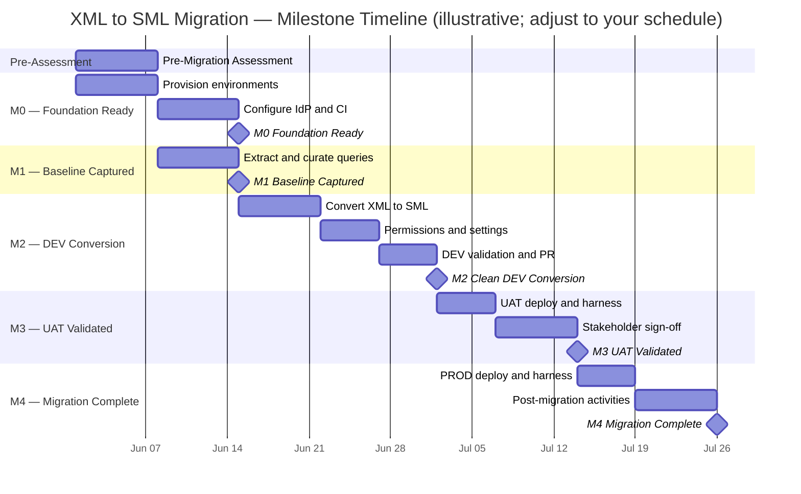
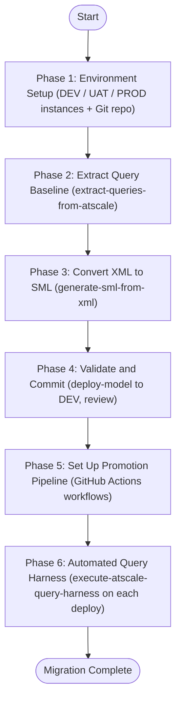
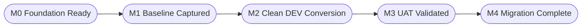
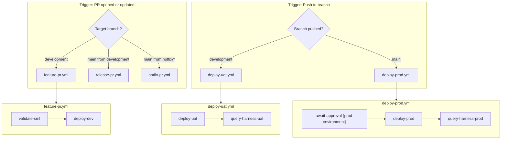

# AtScale XML to SML Migration Guide



## Table of Contents

- [Overview](#overview)
- [Milestones](#milestones)
- [Prerequisites](#prerequisites)
  - [Pre-Migration Assessment](#pre-migration-assessment)
- [Phase 1: Environment Setup](#phase-1-environment-setup)
  - [1.1 Provision Three AtScale Instances](#11-provision-three-atscale-instances)
  - [1.2 Initialise the Git Repository](#12-initialise-the-git-repository)
  - [1.3 Configure GitHub Environments and Secrets](#13-configure-github-environments-and-secrets)
  - [1.4 Configure Branch Protection](#14-configure-branch-protection)
  - [1.5 Configure Identity Provider and SSO](#15-configure-identity-provider-and-sso)
  - [1.6 Migrate Global Engine Settings and Aggregate Schema](#16-migrate-global-engine-settings-and-aggregate-schema)
- [Phase 2: Extract a Query Baseline from the XML Installation](#phase-2-extract-a-query-baseline-from-the-xml-installation)
  - [2.1 Configure the Connections File](#21-configure-the-connections-file)
  - [2.2 Run the Query Extraction](#22-run-the-query-extraction)
  - [2.3 Review and Curate the Query Set](#23-review-and-curate-the-query-set)
  - [2.4 Commit the Query Set](#24-commit-the-query-set)
- [Phase 3: Convert XML Models to SML](#phase-3-convert-xml-models-to-sml)
  - [3.1 Run the Conversion](#31-run-the-conversion)
  - [3.2 Review the Generated SML](#32-review-the-generated-sml)
  - [3.3 Adjust the Connection File and SML Environment Variables](#33-adjust-the-connection-file-and-sml-environment-variables)
  - [3.4 Migrate Runtime Permissions](#34-migrate-runtime-permissions)
  - [3.5 Port Cube-Level Settings to model_settings.yml](#35-port-cube-level-settings-to-model_settingsyml)
  - [3.6 Evaluate Packages for Shared Semantic Objects](#36-evaluate-packages-for-shared-semantic-objects)
- [Phase 4: Validate and Commit the SML](#phase-4-validate-and-commit-the-sml)
  - [4.1 Deploy to DEV and Verify](#41-deploy-to-dev-and-verify)
  - [4.2 Commit on a Migration Branch](#42-commit-on-a-migration-branch)
  - [4.3 Prepare BI Tool Endpoints and Go/No-Go Criteria](#43-prepare-bi-tool-endpoints-and-gonogo-criteria)
- [Phase 5: Promote Through Environments with GitHub Actions](#phase-5-promote-through-environments-with-github-actions)
  - [5.1 Workflow Overview](#51-workflow-overview)
  - [5.2 Feature PR Workflow (DEV)](#52-feature-pr-workflow-dev)
  - [5.3 UAT Deployment Workflow](#53-uat-deployment-workflow)
  - [5.4 PROD Deployment Workflow](#54-prod-deployment-workflow)
  - [5.5 Release PR Regression Workflow](#55-release-pr-regression-workflow)
- [Phase 6: Automated Query Harness](#phase-6-automated-query-harness)
  - [6.1 Harness Workflow on Merge to development](#61-harness-workflow-on-merge-to-development)
  - [6.2 Harness Workflow on Merge to main](#62-harness-workflow-on-merge-to-main)
  - [6.3 Interpreting Results](#63-interpreting-results)
- [Branching and Merge Strategy](#branching-and-merge-strategy)
- [Rollback](#rollback)
- [Post-Migration Activities](#post-migration-activities)
- [Migration Checklist](#migration-checklist)

---

## Overview

[↑ Table of Contents](#table-of-contents)

This guide walks through migrating an AtScale project from the XML installer format to the SML (Semantic Modeling Language) YAML format, and establishing a three-environment promotion pipeline — **DEV**, **UAT**, and **PROD** — backed by Git and GitHub Actions.

The migration consists of six sequential phases:



After migration, all model changes follow the GitOps workflow described in [docs/GIT.md](GIT.md): feature branches are reviewed, deployed to DEV, merged to `development` (which auto-deploys to UAT), and finally promoted to `main` (which auto-deploys to PROD after a manual approval gate). The query harness runs automatically on every UAT and PROD deploy to catch regressions against the captured baseline.

---

## Milestones

[↑ Table of Contents](#table-of-contents)

The migration is divided into five agile milestones. Each milestone represents a shippable, verifiable state that the team can use for sprint planning and stakeholder communication. Work within a milestone can be planned as one or more sprints depending on model complexity and team size.

| Milestone | Name | Owner | Achieved when |
|---|---|---|---|
| **M0** | Foundation Ready | Administrator | Three AtScale environments running, repository initialised, branch protection configured, GitHub Environments and Secrets in place, all CI workflow files committed and green on a test commit |
| **M1** | Regression Baseline Captured | Model Administrator | Deduplicated query history extracted from the legacy XML installation, curated, and committed to `development` |
| **M2** | Clean DEV Conversion | Designer + Model Administrator | SML conversion deploys without errors to DEV, spot-check queries return expected results, and the migration PR is approved |
| **M3** | UAT Validated | Model Administrator + Business Stakeholders | Migration branch merged to `development`, automated UAT deploy and query harness pass with zero errors, business stakeholders have signed off |
| **M4** | Migration Complete | Administrator | Release PR merged to `main`, PROD deployed successfully, PROD query harness passes with zero errors, legacy XML installation decommissioned |



**Definition of Done for each milestone:** all checklist items for that milestone in the [Migration Checklist](#migration-checklist) are checked, and the exit criteria in the table above are met. No milestone may be considered done while a blocking defect is open against it.

---

## Prerequisites

[↑ Table of Contents](#table-of-contents)

Before starting, ensure the following are available:

| Requirement | Notes |
|---|---|
| **AtScale XML project file** | The `.xml` file exported from the installer-based AtScale instance (schema version `project_2_0`) |
| **Three AtScale instances** | Separate hostnames for DEV, UAT, and PROD (see Phase 1) |
| **API tokens for each instance** | One per environment; must have `admin` or `model-admin` scope |
| **GitHub repository** | A new or existing repo where SML files will live |
| **Node.js 18 or later** | Required to run `ps-utils` locally |
| **`ps-utils` installed** | `npm install -g @atscale/ps-utils` or use `npx @atscale/ps-utils` |
| **Access to AtScale Postgres backend** | Port `10520`, database `atscale` — needed only for Phase 2 query extraction |

### Pre-Migration Assessment

[↑ Table of Contents](#table-of-contents)

Before any technical work begins, complete this assessment. It informs the migration approach, surfaces blockers early, and determines the prioritisation order for multi-cube projects.

#### Current State Inventory

[↑ Table of Contents](#table-of-contents)

| Area | Questions to answer |
|---|---|
| **Organisations** | How many AtScale organisations exist? Are their engine settings, identity provider configurations, or data warehouse connections different across orgs? |
| **Projects and cubes** | How many projects/cubes exist? What is their query utilisation (use `extract-query-stats-from-atscale` to analyse)? Which can be rationalised or decommissioned? |
| **Data platforms** | Which databases do the cubes connect to? Any legacy platforms (Hadoop, DB2, Hive) that require extra attention? |
| **BI and analytic tools** | Which tools connect to AtScale (Tableau, Power BI, Excel, Looker, custom JDBC)? What endpoints and drivers do they currently use? |
| **API and webhook integrations** | Are any client systems calling the AtScale API directly? Note: webhooks are deprecated in the container version. |
| **Aggregate definitions** | Document existing aggregate schemas and their physical locations — the installer and container instances must use **separate** aggregate schemas during the parallel-run period. |
| **Existing pain points** | Capture known issues in the installer version; confirm which are resolved in the container version before cutting over. |

#### Gap Analysis — Deprecated and Changed Features

[↑ Table of Contents](#table-of-contents)

Review the following known differences between installer-based and container-based AtScale before planning the conversion:

| Feature | Status in container version | Action required |
|---|---|---|
| **Webhooks** | Deprecated | Remove webhook-triggered integrations before cutover |
| **AtScale Organisations** | Deprecated | Flatten multi-org setups into separate repos or catalogs |
| **Vanity URLs** | Deprecated | Update any bookmarks or BI tool connection strings |
| **Hive thrift endpoint (port 11111)** | Replaced by PGWire (port 15432) | Migrate all BI tool connections before cutover (see section 4.3) |
| **Snapshots** | Replaced by Git history | Document any snapshot-based restore procedures |
| **Security Restricted Measures** | Under development | Validate current workarounds before cutover |
| **`security.xml` runtime permissions** | Must be manually re-entered in Keycloak | Plan a permissions migration sprint (see section 3.4) |
| **Cube-level engine overrides** | Moved to `model_settings.yml` | Port per-cube settings during conversion (see section 3.5) |
| **Global engine settings** | Moved to `global_settings.yml` in a dedicated Git repo | Port during environment setup (see section 1.6) |

#### Migration Approach

[↑ Table of Contents](#table-of-contents)

Choose one approach (or a hybrid) before starting Phase 1:

| Approach | When to choose | Trade-offs |
|---|---|---|
| **Rehost (lift and shift)** | Minimal cubes, or a tight timeline requiring quick business wins | Fastest path; misses opportunities to share dimensions or rationalise models |
| **Refactor** | Multiple cubes share domain objects (products, customers, dates); teams want Git-based collaboration | Upfront design time pays off in maintainability; requires shared dimension and package strategy |
| **Rebuild** | Existing cubes are considered sub-optimal; team wants to start fresh using new SML capabilities | Highest effort; best long-term outcome; does not use `generate-sml-from-xml` |

For a refactor or rebuild, identify which cubes can share dimensions using SML packages before writing any SML (see section 3.6).

#### Scheduling and Prioritisation

[↑ Table of Contents](#table-of-contents)

When migrating multiple cubes, sequence them to build a book of learnings before tackling complex cases:

- Start with cubes that are representative of the broader set but not the most complex
- Prioritise cubes with active business use over low-utilisation models
- Include at least one cube per distinct data platform and one per major BI tool in the initial batch
- Schedule one business unit at a time to manage stakeholder communication

---

## Phase 1: Environment Setup

[↑ Table of Contents](#table-of-contents)

### 1.1 Provision Three AtScale Instances

[↑ Table of Contents](#table-of-contents)

You need three independent AtScale instances, one per environment. They should be isolated: changes to DEV must not affect UAT or PROD.

| Environment | Purpose | Source branch | Deploy trigger |
|---|---|---|---|
| **DEV** | In-flight review; each PR gets a live preview | `feature/*` or `hotfix/*` (PR head) | PR opened / pushed |
| **UAT** | Business sign-off before PROD | `development` | Merge to `development` |
| **PROD** | Live traffic | `main` | Merge to `main` (manual gate) |

Record the hostname and API token for each instance — you will store them as GitHub Secrets in step 1.3.

### 1.2 Initialise the Git Repository

[↑ Table of Contents](#table-of-contents)

Follow the **Administrator: Repository Setup** steps in [docs/GIT.md](GIT.md#administrator-repository-setup). In brief:

```bash
git init atscale-sml-models
cd atscale-sml-models

# Create the initial directory structure
mkdir -p models/connections models/datasets models/dimensions models/metrics models/models
mkdir -p queries .github/workflows

# Commit the empty scaffold
git add .
git commit -m "chore: initial repository scaffold"
git push -u origin main

# Create the permanent development branch
git checkout -b development
git push -u origin development
```

All SML files will live under `models/`. The extracted query baseline (Phase 2) will live under `queries/`.

### 1.3 Configure GitHub Environments and Secrets

[↑ Table of Contents](#table-of-contents)

In **GitHub → Settings → Environments**, create three environments named exactly `dev`, `uat`, and `prod`.

For the `prod` environment, add a **Required reviewers** rule listing the Administrator GitHub usernames. This creates the manual approval gate before any PROD deploy runs.

Add the following secrets to **each** environment:

| Secret | Description |
|---|---|
| `ATSCALE_HOST` | Hostname of the AtScale instance (e.g. `atscale-dev.example.com`) |
| `ATSCALE_API_TOKEN` | API token for the AtScale instance |
| `ATSCALE_ORG` | AtScale organisation name |
| `ATSCALE_SQL_HOST` | Hostname for the AtScale Postgres backend (may be the same as `ATSCALE_HOST`) |
| `ATSCALE_SQL_PORT` | Postgres port for AtScale backend (typically `10520`) |
| `ATSCALE_SQL_PASSWORD` | Password for the AtScale Postgres backend |
| `ATSCALE_LEGACY_SQL_PASSWORD` | Password for the **legacy installer-based** AtScale Postgres backend — used in Phase 2 query extraction only; can be removed after M1 is complete |

`ATSCALE_SQL_*` secrets are only used in query extraction and harness workflows and only need to be set on the environment(s) where extraction runs (typically `uat` and `prod`). `ATSCALE_LEGACY_SQL_PASSWORD` is a repository-level secret (not per-environment) and is temporary — it grants read access to the legacy system solely to capture the query baseline.

### 1.4 Configure Branch Protection

[↑ Table of Contents](#table-of-contents)

See [docs/GIT.md — Configure branch protection rules](GIT.md#3-configure-branch-protection-rules) for the exact GitHub settings. The key rules:

- `development`: 1 required reviewer (Model Administrator), status checks `validate-sml` must pass
- `main`: 2 required reviewers (Model Administrator + Administrator), status checks `validate-sml` and `deploy-dev` must pass, only Administrators may push

### 1.5 Configure Identity Provider and SSO

[↑ Table of Contents](#table-of-contents)

Container-based AtScale uses Keycloak for identity brokering. This must be configured before any user can log in to the new instances.

1. **Choose the SSO protocol** — OIDC or SAML, depending on your identity provider (Azure AD, Okta, Google, etc.)
2. **Map IdP groups to AtScale roles** — Document the group names in your IdP that correspond to AtScale's `admin`, `model-admin`, and `designer` roles, then configure the group mappings in the Keycloak realm
3. **Verify SSO for the AtScale Design Center** — Confirm each persona can log in to each environment (DEV, UAT, PROD) using their existing corporate credentials before any model work begins
4. **Configure GitHub authentication** — When connecting AtScale to the SML Git repository, use a **GitHub App** rather than a personal access token (PAT). GitHub Apps provide organisation-scoped permissions and do not expire, which avoids mid-deployment authentication failures
5. **Adjust idle timeout and default settings** — Review Keycloak session timeouts and AtScale's default authentication settings; set idle timeout to match your corporate policy

### 1.6 Migrate Global Engine Settings and Aggregate Schema

[↑ Table of Contents](#table-of-contents)

**Global engine settings** in the installer version are stored in the AtScale UI and applied per-organisation. In the container version they are managed as a YAML file (`global_settings.yml`) in a dedicated Git repository.

1. Export the existing engine settings from each installer organisation (via the AtScale UI or admin API)
2. Create a `global_settings.yml` for each container environment; port the relevant settings, paying particular attention to query engine, aggregate, and connection settings
3. Apply the settings file via **Design Center → Settings → Global Settings → Apply Settings** — this requires a Superuser role and triggers an engine restart, so schedule it during a maintenance window
4. Verify the applied settings by comparing the Design Center settings page against the YAML file

**Aggregate schema separation** — During the parallel-run period the installer-based and container-based AtScale instances will both be active. They must point to **different** aggregate schemas in the data warehouse; sharing an aggregate schema between instances causes conflicts and incorrect query results.

| Instance | Aggregate schema (example) |
|---|---|
| Installer (legacy) | `atscale_aggs` |
| Container DEV | `atscale_aggs_dev` |
| Container UAT | `atscale_aggs_uat` |
| Container PROD | `atscale_aggs_prod` |

Create the new aggregate schemas in the data warehouse and configure them in each container environment's data warehouse settings before running any queries.

> **Milestone M0 — Foundation Ready**
>
> Phase 1 is complete when all three AtScale environments are reachable, the repository has `main` and `development` branches with protection rules enforced, GitHub Environments `dev`/`uat`/`prod` exist with all required secrets, and all four CI workflow files (added in Phase 5) have been committed to both `main` and `development` and have run green on at least one test commit.
>
> _Exit gate:_ The Administrator confirms the `prod` environment's required-reviewer gate fires correctly by triggering a dry-run deploy.

---

## Phase 2: Extract a Query Baseline from the XML Installation

[↑ Table of Contents](#table-of-contents)

Before converting the models, capture real query traffic from the running XML-based AtScale installation. This creates a test set that will be replayed against the SML-based installation on every UAT and PROD deploy to detect regressions.

### 2.1 Configure the Connections File

[↑ Table of Contents](#table-of-contents)

Create (or extend) `connections.yaml` in the repository root with an entry that points at the **existing XML-based** AtScale instance's Postgres backend:

```yaml
connections:
  - name: legacy-atscale-postgres
    sql:
      dialect: postgres
      host: atscale-legacy.example.com
      port: 10520
      database: atscale
      username: atscale
      password: "${ATSCALE_LEGACY_SQL_PASSWORD}"
      schema: engine
```

Export `ATSCALE_LEGACY_SQL_PASSWORD` in your shell before running extraction locally, or store it in a GitHub Secret if running extraction from a workflow.

### 2.2 Run the Query Extraction

[↑ Table of Contents](#table-of-contents)

Use `extract-queries-from-atscale` to pull deduplicated query history from the legacy instance. Specify each cube/model name in `--models`:

```bash
npx @atscale/ps-utils extract-queries-from-atscale \
  --connection-file connections.yaml \
  --connection-name legacy-atscale-postgres \
  --models "SalesModel,InventoryModel,FinanceModel" \
  --days 90 \
  --protocol all \
  --min-executions 2 \
  --output-dir queries
```

**Parameter guidance:**

| Parameter | Recommended value | Reason |
|---|---|---|
| `--days` | `60`–`90` | Captures enough traffic to cover seasonal patterns without pulling stale one-off queries |
| `--min-executions` | `2`–`5` | Filters out ad-hoc exploratory queries that are unlikely to recur; keeps the harness run time manageable |
| `--protocol` | `all` | Captures both SQL (BI tool) and XMLA/MDX queries |

The command writes one JSON file per (model, protocol) pair into `queries/`:

```
queries/
  SalesModel_sql_queries.json
  SalesModel_xmla_queries.json
  InventoryModel_sql_queries.json
  ...
```

### 2.3 Review and Curate the Query Set

[↑ Table of Contents](#table-of-contents)

Open a sample file and review the `originalText` fields. Remove any queries that:

- Reference legacy-specific objects (e.g. temp tables, legacy calculated member names) that will not exist in the SML model
- Contain sensitive literal values (PII, customer IDs) that should not be stored in source control — set `--redact true` on the harness run instead
- Are synthetic test queries from the legacy QA process that do not reflect real business traffic

Keep the query files lean: 50–200 representative queries per model is sufficient for a regression baseline. A smaller, curated set runs faster and produces clearer signal.

### 2.4 Commit the Query Set

[↑ Table of Contents](#table-of-contents)

```bash
git add queries/
git commit -m "feat: add baseline query set extracted from legacy AtScale XML installation"
git push origin development
```

The `queries/` directory is now the canonical regression baseline and travels with the SML model through every environment.

> **Milestone M1 — Regression Baseline Captured**
>
> Phase 2 is complete when `queries/` contains at least one non-empty JSON file per model in scope, the files have been reviewed by the Model Administrator to remove legacy-specific and sensitive queries, and the directory is committed to `development`.
>
> _Exit gate:_ Model Administrator signs off on the curated query set. The number of queries per model and the rationale for any removals should be noted in the commit message or a linked issue.

---

## Phase 3: Convert XML Models to SML

[↑ Table of Contents](#table-of-contents)

### 3.1 Run the Conversion

[↑ Table of Contents](#table-of-contents)

Use `generate-sml-from-xml` to produce SML YAML files from the XML project file. Run this locally before opening any PR:

```bash
npx @atscale/ps-utils generate-sml-from-xml \
  --xml-file path/to/MyAtScaleProject.xml \
  --output-dir models \
  --connection-type snowflake \
  --connection-db my_database \
  --connection-schema my_schema \
  --catalog-name "My Catalog"
```

**Parameter guidance:**

| Parameter | Notes |
|---|---|
| `--xml-file` | The `.xml` export from the installer-based AtScale project |
| `--output-dir` | Use `models/` — the directory established in step 1.2 |
| `--connection-name` | Auto-detected from the XML `<connection id="...">` attribute; override only if the name must differ in SML |
| `--connection-type` | Database dialect used in generated connection file (`snowflake`, `bigquery`, `databricks`, etc.) |
| `--connection-db` | Database / project name; when provided, datasets use a flat `table:` reference instead of a nested `db/schema/table` object |
| `--connection-schema` | Schema / dataset name; same effect as `--connection-db` for the schema level |
| `--catalog-name` | Human-readable label for the catalog; defaults to the XML schema name |

The converter produces the following layout under `models/`:

```
models/
  catalog.yml
  connections/<connection-name>.yml
  datasets/<dataset-name>.yml     (one per XML <data-set>)
  dimensions/<dim-name>.yml       (one per referenced dimension)
  metrics/<metric-name>.yml       (one per measure or expression)
  calculations/<calc-name>.yml    (one per schema-level calculated member)
  models/<cube-name>.yml          (one per XML <cube>)
```

### 3.2 Review the Generated SML

[↑ Table of Contents](#table-of-contents)

After conversion, walk through the generated files and verify:

- **`catalog.yml`** — the catalog `unique_name` matches your intended project name
- **`connections/<name>.yml`** — the `host`, `database`, and `schema` fields point to the correct data warehouse for DEV (you will override these per-environment via the connections file in each environment, not by modifying the SML)
- **`datasets/`** — each dataset's `table:` or `db/schema/table` reference resolves to a real table in the DEV data warehouse
- **`dimensions/`** — hierarchy level columns are present in the referenced dataset
- **`models/`** — each model's dataset relationships (join paths) look correct; the converter infers relationships from the XML key-ref structure

Common issues to address manually:

| Issue | Cause | Fix |
|---|---|---|
| `table:` references a view, not a base table | XML model used database views | Update `table:` to reference the view, or create a corresponding view in the new environment |
| Missing calculated members | Legacy MDX scripts using CREATE MEMBER | Recreate as `calculations/<name>.yml` files |
| Broken hierarchy levels | XML dimension had an alias or role-played reference | Check the dimension YAML and correct the `key_attribute` and `attributes` |
| Connection `host:` points to legacy server | Auto-detected from XML | Update `connections/<name>.yml` to point to DEV data warehouse |

### 3.3 Adjust the Connection File and SML Environment Variables

[↑ Table of Contents](#table-of-contents)

The generated `models/connections/<name>.yml` should **not** contain environment-specific credentials. Move sensitive values to environment secrets and reference them via your connections file:

```yaml
# models/connections/my_snowflake_conn.yml — committed to source control
unique_name: my_snowflake_conn
type: snowflake
database: my_database
schema: my_schema
# host, user, password are supplied at deploy time via the connections.yaml file
```

**SML environment variables** — Rather than maintaining separate connection files per environment, use SML's built-in `.env` variable substitution to parameterise database names, schemas, and connection labels across DEV, UAT, and PROD. Create a `.env` file at the root of the SML repository (it is automatically git-ignored):

```bash
# .env — not committed to source control; set per environment in CI secrets
DATABASE=my_prod_database
SCHEMA=my_prod_schema
```

Reference variables in connection and dataset files using `${VARIABLE}`:

```yaml
# models/connections/my_snowflake_conn.yml
unique_name: my_snowflake_conn
type: snowflake
database: ${DATABASE}
schema: ${SCHEMA}
```

In GitHub Actions, write the `.env` file from secrets before deploying:

```yaml
- name: Write SML .env file
  run: |
    echo "DATABASE=${{ secrets.ATSCALE_DATABASE }}" >> models/.env
    echo "SCHEMA=${{ secrets.ATSCALE_SCHEMA }}" >> models/.env
```

Note: environment variables are supported in connection and dataset files only — they cannot be used in `object_type` or `unique_name` fields.

### 3.4 Migrate Runtime Permissions

[↑ Table of Contents](#table-of-contents)

Runtime permissions in the installer version are stored in `security.xml` and applied per-organisation. In the container version, they must be re-created manually as Keycloak groups and AtScale permission groups.

1. **Export `security.xml`** from the installer AtScale instance — this file lists user-to-role and group-to-role mappings per cube
2. **Create matching Keycloak groups** — for each access-control group in `security.xml`, create a corresponding group in Keycloak and add the relevant users
3. **Map Keycloak groups to AtScale permission groups** in the Design Center — navigate to **Settings → Access Control** in each environment and recreate the per-model permissions
4. **Design-time permissions** (who can edit models in the Design Center) should be managed via Git repository access controls (GitHub teams/permissions) rather than AtScale UI settings — move these policies to Git before cutover

> **Note:** AtScale is developing a path to store runtime permissions directly in SML YAML, which will enable a programmatic migration. Check the current release notes to see if this is available before performing manual Keycloak entry.

### 3.5 Port Cube-Level Settings to model_settings.yml

[↑ Table of Contents](#table-of-contents)

Any per-cube engine overrides configured in the installer version (e.g., factless query behaviour, aggregate settings, query timeout overrides) must be ported to a `model_settings.yml` file at the root of each SML repository. This file is the container equivalent of the installer's cube-level settings panel.

Create `models/model_settings.yml` and add the relevant overrides:

```yaml
# models/model_settings.yml
query:
  factless:
    ignoreIncidentalFilter: false
    useIncidentalFacts: true
aggregates:
  buildEnabled: true
```

Refer to the AtScale container documentation ([engine-level configuration settings](https://documentation.atscale.com/container/deploying-and-configuring-atscale/engine-level-configuration-settings/configuring-global-settings)) for the full list of supported keys. Settings not present in `model_settings.yml` inherit from `global_settings.yml`.

### 3.6 Evaluate Packages for Shared Semantic Objects

[↑ Table of Contents](#table-of-contents)

If multiple XML projects contain duplicated or near-identical dimensions (e.g., a shared Date dimension, a shared Customer dimension), the migration is an opportunity to consolidate them into a shared SML package rather than duplicating the YAML across multiple repositories.

A package is a separate Git repository whose SML objects are included in another repository as a read-only dependency via `package.yml`:

```yaml
# models/package.yml
packages:
  - name: shared-dimensions
    git: https://github.com/your-org/atscale-shared-dims
    branch: main
```

Decide on a package strategy **before** committing the initial SML, as retrofitting shared packages into already-deployed models is disruptive. A refactor approach (see Pre-Migration Assessment) makes the most use of this capability.

---

## Phase 4: Validate and Commit the SML

[↑ Table of Contents](#table-of-contents)

### 4.1 Deploy to DEV and Verify

[↑ Table of Contents](#table-of-contents)

Before committing, do a one-time manual deploy to DEV to confirm the converted models load without errors:

```bash
# Write a temporary local connections file (do not commit this file)
cat > /tmp/connections-dev.yaml <<EOF
connections:
  - name: dev
    atscale:
      host: atscale-dev.example.com
      apiToken: "${ATSCALE_DEV_API_TOKEN}"
      org: my-org
EOF

npx @atscale/ps-utils atscale-deploy-catalog \
  --connection-file /tmp/connections-dev.yaml \
  --atscale-connection-name dev \
  --sml-dir models \
  --repo-name my-sml-repo
```

Open the DEV AtScale Design Center at `https://atscale-dev.example.com/ui` and confirm:

- The catalog appears without deployment errors
- A representative sample of models and datasets are visible
- Running a spot-check SQL or MDX query returns results

Iterate on the SML files until the DEV deploy is clean.

### 4.2 Commit on a Migration Branch

[↑ Table of Contents](#table-of-contents)

Create a feature branch off `development` for the initial migration commit:

```bash
git checkout development
git pull origin development
git checkout -b feature/xml-to-sml-migration

git add models/ queries/
git commit -m "feat: initial SML conversion from XML installer project"
git push origin feature/xml-to-sml-migration
```

Open a PR from `feature/xml-to-sml-migration` → `development`. This will trigger the CI validation and DEV deploy workflows described in Phase 5. The Model Administrator reviews the generated SML and approves the PR.

### 4.3 Prepare BI Tool Endpoints and Go/No-Go Criteria

[↑ Table of Contents](#table-of-contents)

Before the migration PR is approved, document and test the new BI tool connection details for every tool in your inventory. This is a blocking dependency: end users and BI developers cannot connect to the container instance until this is complete.

#### New Endpoint Reference

[↑ Table of Contents](#table-of-contents)

| Tool | Legacy (installer) | Container |
|---|---|---|
| **Tableau** | Hive thrift, port `11111` | PGWire (PostgreSQL JDBC), port `15432`. Tableau Server and Desktop require the PostgreSQL JDBC driver — no ODBC driver available. If SSO to Tableau Server is required, the branded AtScale Tableau connector is also needed. |
| **Power BI** | Legacy AtScale connector URL | New URL + token-based auth or SSO via the Power BI Service connector |
| **Excel** | Legacy plugin or URL | New URL + token, or Excel plugin update |
| **Custom JDBC / API** | Legacy REST API paths | Map each existing API call to the container REST API equivalents; note that `/v1/` paths differ from `/wapi/p/` paths |

Prepare a short switch-over document for each BI tool your users rely on, showing the before/after connection steps. Distribute these before the UAT window opens so that business stakeholders can validate reports using the new connection details.

#### Go/No-Go Criteria

[↑ Table of Contents](#table-of-contents)

Define the acceptance thresholds before opening the Release PR. Recommended minimums:

| Criterion | Recommended threshold |
|---|---|
| Percentage of cubes migrated and deployable | 100% of in-scope cubes |
| Query harness success rate | 100% (zero harness failures) |
| Result parity (row counts match legacy) | 100% of validated queries |
| Performance regression | No query more than 10% slower than legacy baseline |
| UAT sign-off | All in-scope business units |
| Security testing | Vulnerability scan completed; no critical findings open |

If any criterion is not met, the Release PR must not be opened until the gap is resolved or formally accepted as a known risk by the Administrator.

> **Milestone M2 — Clean DEV Conversion**
>
> Phases 3 and 4 are complete when: `generate-sml-from-xml` has run cleanly, all post-conversion issues in the review table (section 3.2) have been resolved, the manual DEV deploy succeeds without errors, spot-check queries return expected results in DEV AtScale, and the `feature/xml-to-sml-migration` PR has been approved by the Model Administrator.
>
> _Exit gate:_ Model Administrator approves the migration PR. At least one SQL and one XMLA query per model must have been verified manually in the DEV AtScale Design Center before approval.

---

## Phase 5: Promote Through Environments with GitHub Actions

[↑ Table of Contents](#table-of-contents)

Commit all workflow files to `.github/workflows/` on both `main` and `development` before opening the first PR.

### 5.1 Workflow Overview

[↑ Table of Contents](#table-of-contents)



### 5.2 Feature PR Workflow (DEV)

[↑ Table of Contents](#table-of-contents)

`.github/workflows/feature-pr.yml` — validates SML and deploys to the DEV AtScale instance on every push to a feature branch PR targeting `development`.

```yaml
name: Feature PR — Validate and Deploy to DEV

on:
  pull_request:
    branches:
      - development

jobs:
  validate-sml:
    name: Validate SML
    runs-on: ubuntu-latest
    steps:
      - uses: actions/checkout@v4

      - name: Set up Node.js
        uses: actions/setup-node@v4
        with:
          node-version: "20"

      - name: Install ps-utils
        run: npm install -g @atscale/ps-utils

      - name: Validate SML schema
        run: |
          ps-utils validate-sml \
            --sml-root ./models \
            --fail-on-warning

  deploy-dev:
    name: Deploy to DEV AtScale
    needs: validate-sml
    runs-on: ubuntu-latest
    environment: dev
    steps:
      - uses: actions/checkout@v4

      - name: Write connections file
        run: |
          cat > /tmp/connections.yaml <<EOF
          connections:
            - name: dev
              atscale:
                host: ${{ secrets.ATSCALE_HOST }}
                apiToken: ${{ secrets.ATSCALE_API_TOKEN }}
                org: ${{ secrets.ATSCALE_ORG }}
          EOF

      - name: Deploy model to DEV
        uses: AtScaleInc/ps-utils@v1
        with:
          operation: atscale-deploy-catalog
          connection-file: /tmp/connections.yaml
          atscale-connection-name: dev
          sml-dir: ./models
          repo-name: ${{ github.event.repository.name }}

      - name: Post DEV link to PR
        uses: actions/github-script@v7
        with:
          script: |
            github.rest.issues.createComment({
              issue_number: context.issue.number,
              owner: context.repo.owner,
              repo: context.repo.repo,
              body: `✅ **DEV deploy complete.** Review the model at: https://${{ secrets.ATSCALE_HOST }}/ui`
            })
```

### 5.3 UAT Deployment Workflow

[↑ Table of Contents](#table-of-contents)

`.github/workflows/deploy-uat.yml` — runs automatically when a PR merges into `development`. Deploys all models to UAT and then runs the query harness against the baseline captured in Phase 2.

```yaml
name: Deploy to UAT

on:
  push:
    branches:
      - development
  workflow_dispatch:
    inputs:
      reason:
        description: "Reason for manual re-deploy (e.g. rollback to a previous commit on development)"
        required: true

jobs:
  deploy-uat:
    name: Deploy to UAT AtScale
    runs-on: ubuntu-latest
    environment: uat
    steps:
      - uses: actions/checkout@v4

      - name: Write connections file
        run: |
          cat > /tmp/connections.yaml <<EOF
          connections:
            - name: uat
              atscale:
                host: ${{ secrets.ATSCALE_HOST }}
                apiToken: ${{ secrets.ATSCALE_API_TOKEN }}
                org: ${{ secrets.ATSCALE_ORG }}
          EOF

      - name: Deploy model to UAT
        uses: AtScaleInc/ps-utils@v1
        with:
          operation: atscale-deploy-catalog
          connection-file: /tmp/connections.yaml
          atscale-connection-name: uat
          sml-dir: ./models
          repo-name: ${{ github.event.repository.name }}

  query-harness-uat:
    name: Run Query Harness on UAT
    needs: deploy-uat
    runs-on: ubuntu-latest
    environment: uat
    steps:
      - uses: actions/checkout@v4

      - name: Set up Node.js
        uses: actions/setup-node@v4
        with:
          node-version: "20"

      - name: Install ps-utils
        run: npm install -g @atscale/ps-utils

      - name: Write connections file
        run: |
          cat > /tmp/connections.yaml <<EOF
          connections:
            - name: uat
              atscale:
                host: ${{ secrets.ATSCALE_HOST }}
                apiToken: ${{ secrets.ATSCALE_API_TOKEN }}
                org: ${{ secrets.ATSCALE_ORG }}
          EOF

      - name: Run SQL query harness
        run: |
          for f in queries/*_sql_queries.json; do
            [ -f "$f" ] || continue
            ps-utils execute-atscale-query-harness \
              --connection-file /tmp/connections.yaml \
              --connection-name uat \
              --query-file "$f" \
              --protocol sql \
              --concurrent-users 4 \
              --output-dir run_results
          done

      - name: Run XMLA query harness
        run: |
          for f in queries/*_xmla_queries.json; do
            [ -f "$f" ] || continue
            ps-utils execute-atscale-query-harness \
              --connection-file /tmp/connections.yaml \
              --connection-name uat \
              --query-file "$f" \
              --protocol xmla \
              --concurrent-users 2 \
              --output-dir run_results
          done

      - name: Upload harness results
        uses: actions/upload-artifact@v4
        with:
          name: uat-harness-results-${{ github.run_id }}
          path: run_results/
          retention-days: 30

      - name: Check for query failures
        run: |
          if awk -F',' '
            FNR==1 { col=0; for(i=1;i<=NF;i++) if($i=="status") col=i; next }
            col && $col=="error" { found=1 }
            END { exit (found ? 1 : 0) }
          ' run_results/*.csv; then
            echo "All queries passed."
          else
            echo "::error::One or more queries failed in UAT. Check the uploaded harness results artifact."
            exit 1
          fi
```

### 5.4 PROD Deployment Workflow

[↑ Table of Contents](#table-of-contents)

`.github/workflows/deploy-prod.yml` — runs when `main` receives a push (i.e. after the Release PR merges). Requires a manual approval from the `prod` GitHub Environment before deploying.

```yaml
name: Deploy to PROD

on:
  push:
    branches:
      - main

jobs:
  deploy-prod:
    name: Deploy to PROD AtScale
    runs-on: ubuntu-latest
    environment: prod          # GitHub Environment with required reviewer protection
    steps:
      - uses: actions/checkout@v4

      - name: Write connections file
        run: |
          cat > /tmp/connections.yaml <<EOF
          connections:
            - name: prod
              atscale:
                host: ${{ secrets.ATSCALE_HOST }}
                apiToken: ${{ secrets.ATSCALE_API_TOKEN }}
                org: ${{ secrets.ATSCALE_ORG }}
          EOF

      - name: Deploy model to PROD
        uses: AtScaleInc/ps-utils@v1
        with:
          operation: atscale-deploy-catalog
          connection-file: /tmp/connections.yaml
          atscale-connection-name: prod
          sml-dir: ./models
          repo-name: ${{ github.event.repository.name }}

      - name: Tag the release commit
        run: |
          TAG="v$(date +'%Y.%m.%d')-$(git rev-parse --short HEAD)"
          git tag -a "$TAG" -m "release: PROD deploy $TAG"
          git push origin "$TAG"

  query-harness-prod:
    name: Run Query Harness on PROD
    needs: deploy-prod
    runs-on: ubuntu-latest
    environment: prod
    steps:
      - uses: actions/checkout@v4

      - name: Set up Node.js
        uses: actions/setup-node@v4
        with:
          node-version: "20"

      - name: Install ps-utils
        run: npm install -g @atscale/ps-utils

      - name: Write connections file
        run: |
          cat > /tmp/connections.yaml <<EOF
          connections:
            - name: prod
              atscale:
                host: ${{ secrets.ATSCALE_HOST }}
                apiToken: ${{ secrets.ATSCALE_API_TOKEN }}
                org: ${{ secrets.ATSCALE_ORG }}
          EOF

      - name: Run SQL query harness
        run: |
          for f in queries/*_sql_queries.json; do
            [ -f "$f" ] || continue
            ps-utils execute-atscale-query-harness \
              --connection-file /tmp/connections.yaml \
              --connection-name prod \
              --query-file "$f" \
              --protocol sql \
              --concurrent-users 2 \
              --output-dir run_results
          done

      - name: Run XMLA query harness
        run: |
          for f in queries/*_xmla_queries.json; do
            [ -f "$f" ] || continue
            ps-utils execute-atscale-query-harness \
              --connection-file /tmp/connections.yaml \
              --connection-name prod \
              --query-file "$f" \
              --protocol xmla \
              --concurrent-users 1 \
              --output-dir run_results
          done

      - name: Upload harness results
        uses: actions/upload-artifact@v4
        with:
          name: prod-harness-results-${{ github.run_id }}
          path: run_results/
          retention-days: 90

      - name: Check for query failures
        run: |
          if awk -F',' '
            FNR==1 { col=0; for(i=1;i<=NF;i++) if($i=="status") col=i; next }
            col && $col=="error" { found=1 }
            END { exit (found ? 1 : 0) }
          ' run_results/*.csv; then
            echo "All queries passed."
          else
            echo "::error::One or more queries failed in PROD. Review the harness results artifact immediately."
            exit 1
          fi

      - name: Post PROD deploy summary
        uses: actions/github-script@v7
        with:
          script: |
            const sha = context.sha.substring(0, 7);
            console.log(`PROD deploy of ${sha} complete. Query harness passed.`);
```

### 5.5 Release PR Regression Workflow

[↑ Table of Contents](#table-of-contents)

`.github/workflows/release-pr.yml` — runs full SML validation on PRs from `development` → `main`. No deploy — validation only. See [docs/GIT.md — release-pr.yml](GIT.md#githubworkflowsrelease-pryml) for the complete file.

---

## Phase 6: Automated Query Harness

[↑ Table of Contents](#table-of-contents)

The `execute-atscale-query-harness` operation replays the baseline query set (captured in Phase 2) against the newly deployed SML model. It runs automatically as part of `deploy-uat.yml` and `deploy-prod.yml` (Phase 5).

### 6.1 Harness Workflow on Merge to development

[↑ Table of Contents](#table-of-contents)

Every merge to `development` triggers `deploy-uat.yml`, which:

1. Deploys the updated SML to the UAT AtScale instance
2. Loops over all JSON files in `queries/` and runs the harness for each
3. Uploads the CSV results as a GitHub Actions artifact (retained 30 days)
4. Fails the workflow if any query returned an error, blocking the release pipeline

The Model Administrator should download and review the harness artifact when validating UAT. Pay particular attention to:

- Queries that previously succeeded but now return errors (broken models, renamed measures, missing columns)
- Queries whose row count (`avgResultSetSize`) has dropped to zero (silent data issues)
- Queries whose elapsed time has increased significantly compared to the baseline `elapsedTimeInSeconds` (performance regression)

> **Milestone M3 — UAT Validated**
>
> This milestone is achieved when: the `feature/xml-to-sml-migration` PR has merged to `development`, the automated UAT deploy has completed without errors, the query harness artifact shows zero failures across all models and protocols, and business stakeholders have formally signed off on the UAT AtScale instance.
>
> _Exit gate:_ Model Administrator opens the Release PR (`development` → `main`) and records the UAT sign-off — either as a comment on the PR or as a linked issue — before requesting the two required approvals. No Release PR may be opened while any harness failure is unresolved.

### 6.2 Harness Workflow on Merge to main

[↑ Table of Contents](#table-of-contents)

The PROD deploy workflow (`deploy-prod.yml`) mirrors the UAT harness, but with a lower `--concurrent-users` value to minimise load on the live instance. Results are retained for 90 days.

A PROD harness failure does not roll back the deploy automatically. The on-call Model Administrator must:

1. Download the artifact and identify the failing queries
2. Determine whether the failure is a model issue (open a `hotfix/*` branch per [docs/GIT.md](GIT.md#patch-hotfix-workflow)) or a data issue (investigate the warehouse directly)
3. If the model must be rolled back immediately, redeploy the previous Git tag via `workflow_dispatch` on `deploy-prod.yml`

> **Milestone M4 — Migration Complete**
>
> This milestone is achieved when: the Release PR has merged to `main`, the PROD deploy has completed and been tagged, the PROD query harness artifact shows zero failures across all models and protocols, and the legacy XML-based AtScale installation has been decommissioned.
>
> _Exit gate:_ Administrator confirms the PROD harness has passed, tags the release commit (`git tag -a vYYYY.MM.DD ...`), and decommissions the legacy instance. Decommissioning must not happen before the PROD harness clears — the legacy instance is the last rollback option if PROD data issues are discovered after go-live.

### 6.3 Interpreting Results

[↑ Table of Contents](#table-of-contents)

Each harness run writes one CSV per query file to `run_results/`. The columns are:

| Column | Description |
|---|---|
| `run_id` | Identifier for this harness run |
| `query_name` | `queryName` from the source JSON (e.g. `SQL Query 1 (abc123)`) |
| `query_language` | `pgsql`, `sql`, or `analysis` |
| `cube_name` | Model/cube name |
| `status` | `success` or `error` |
| `error_message` | Error detail if status is `error` |
| `elapsed_seconds` | Wall-clock time for this execution |
| `row_count` | Number of rows returned |
| `aggregate_used` | Whether an aggregate was used |

Compare the `elapsed_seconds` and `row_count` columns against the baseline `elapsedTimeInSeconds` and `avgResultSetSize` fields in the source JSON to detect regressions.

---

## Branching and Merge Strategy

[↑ Table of Contents](#table-of-contents)

All ongoing model development after the initial migration follows the strategy defined in [docs/GIT.md](GIT.md).

Key points relevant to migration:

- The initial migration commit lands on a `feature/xml-to-sml-migration` branch, is reviewed via PR, and merges to `development` — triggering the first UAT deploy and harness run.
- Once UAT passes, a Release PR (`development` → `main`) is opened, reviewed by both the Model Administrator and Administrator, and merged — triggering the first PROD deploy.
- After the first PROD deploy is confirmed clean, the XML-based installation can be decommissioned. Do not decommission it before the PROD harness passes.
- The branch `main` always reflects PROD. The branch `development` always reflects UAT. Feature branches are ephemeral.
- Hotfixes to the SML (e.g. a broken measure discovered post-migration) follow the [Patch (Hotfix) Workflow](GIT.md#patch-hotfix-workflow) in GIT.md — branch from `main`, not from `development`.

For the full branch diagram, persona responsibilities, PR templates, and hotfix procedures, refer to [docs/GIT.md](GIT.md).

---

## Rollback

[↑ Table of Contents](#table-of-contents)

If the SML models must be rolled back to a previous state:

### Rollback UAT

[↑ Table of Contents](#table-of-contents)

Find the last known-good commit SHA on `development`, then trigger `deploy-uat.yml` manually using `workflow_dispatch` (added in section 5.3):

```bash
# Find the good commit SHA
git log --oneline origin/development

# Re-deploy from that commit — workflow_dispatch accepts any branch, tag, or SHA
gh workflow run deploy-uat.yml \
  --ref <good-commit-sha> \
  --field reason="Rollback to <good-commit-sha> — reverting broken UAT deploy"
```

`deploy-uat.yml` will check out the specified SHA and redeploy, overwriting the current UAT state. Note that `development` itself is not rewound — the bad commit stays in branch history. If the bad commit should also be removed from `development`, open a revert PR against `development` after the UAT deploy stabilises.

### Rollback PROD

[↑ Table of Contents](#table-of-contents)

```bash
# List recent tags
git tag --sort=-creatordate | head -10

# Re-deploy from a previous release tag
gh workflow run deploy-prod.yml \
  --ref v2026.05.01-abc1234
```

If `deploy-prod.yml` does not expose a `workflow_dispatch` trigger, add one:

```yaml
on:
  push:
    branches:
      - main
  workflow_dispatch:
    inputs:
      reason:
        description: "Reason for manual re-deploy (e.g. rollback to previous tag)"
        required: true
```

Then trigger it via the GitHub Actions UI, selecting the desired tag ref.

---

## Post-Migration Activities

[↑ Table of Contents](#table-of-contents)

After the PROD harness passes (Milestone M4), complete the following before considering the migration closed.

### Monitoring

[↑ Table of Contents](#table-of-contents)

Set up production observability for the container AtScale instance before decommissioning the legacy system:

- **Prometheus / Grafana** — Container AtScale exposes metrics via OpenTelemetry (OTel). Ensure the AtScale pod can write OTel data to the filesystem, then configure a pipeline to forward metrics to your existing monitoring platform (Grafana, Datadog, Splunk, etc.)
- **Query performance baseline** — Establish a PROD query performance baseline in your monitoring system during the first two weeks post-cutover, while the legacy instance is still available for comparison
- **Alert thresholds** — Configure alerts for query error rate, aggregate build failures, and pod restart events before decommissioning the legacy instance

### User Training and Support

[↑ Table of Contents](#table-of-contents)

- **Technical roadshows** — Run a brief session for each BI team demonstrating the new Design Center, SML Git workflow, and any new capabilities (e.g., composite models, calculation groups) that were not available in the installer version
- **Developer training** — Ensure Designers have hands-on practice with the feature-branch → PR → merge workflow before they start making changes in the new system
- **Switch-over guides** — Distribute the BI-tool-specific switch-over documents prepared in section 4.3. Include the new connection strings, driver versions, and SSO steps

### Decommission the Legacy Installer Instance

[↑ Table of Contents](#table-of-contents)

Do not decommission until all of the following are true: PROD harness has passed, monitoring is active, and all business stakeholders have confirmed their reports are working on the container instance.

Decommission steps:
1. Disable user access to the legacy installer-based AtScale instance
2. Run a final query validation on PROD to confirm no traffic is still routing to the legacy instance
3. Delete the old aggregate schema(s) from the data warehouse (e.g., `DROP SCHEMA atscale_aggs CASCADE`)
4. Unprovision the Linux machines running the installer-based AtScale
5. Delete or archive the RPM installer files and legacy configuration backups
6. Close or archive any infrastructure tickets, firewall rules, and DNS entries associated with the legacy instance

### Lessons Learned

[↑ Table of Contents](#table-of-contents)

Hold a post-mortem review within two weeks of the PROD go-live. Document:

- What went well and should be repeated in future migrations
- Gaps discovered during migration that were not captured in this guide
- Any cubes or features that required workarounds — raise them with the AtScale product team
- Performance or data quality issues found post-cutover and how they were resolved

Update this document with any corrections or additions arising from the post-mortem before archiving the migration project.

---

## Migration Checklist

[↑ Table of Contents](#table-of-contents)

Items are grouped by milestone. Complete all items in a milestone before declaring it done and advancing to the next one.

---

**Pre-Migration Assessment** _(before Phase 1)_

- [ ] Current state inventory completed: organisations, projects/cubes, data platforms, BI tools, API integrations, webhooks, aggregate definitions
- [ ] Deprecated features gap analysis reviewed; affected integrations (webhooks, org-level settings, Hive endpoints) documented
- [ ] Migration approach selected: Rehost, Refactor, or Rebuild
- [ ] Cube migration priority order determined based on utilisation and business value
- [ ] BI tool inventory completed with current connection endpoints and driver versions

---

**Milestone M0 — Foundation Ready** _(Phase 1 + CI workflows)_

- [ ] DEV, UAT, and PROD AtScale instances provisioned with separate hostnames and independently accessible
- [ ] Separate aggregate schemas created in the data warehouse for each container environment
- [ ] Git repository initialised with `main` and `development` permanent branches
- [ ] Branch protection rules configured on `main` (2 required reviewers) and `development` (1 required reviewer)
- [ ] GitHub Environments `dev`, `uat`, `prod` created; `prod` has required-reviewer protection rule
- [ ] Secrets `ATSCALE_HOST`, `ATSCALE_API_TOKEN`, `ATSCALE_ORG` added to each environment
- [ ] Secrets `ATSCALE_SQL_HOST`, `ATSCALE_SQL_PORT`, `ATSCALE_SQL_PASSWORD` added to `uat` and `prod`
- [ ] Secrets `ATSCALE_DATABASE`, `ATSCALE_SCHEMA` (or equivalent SML env vars) added per environment
- [ ] Identity provider (OIDC/SAML) configured in Keycloak; IdP group mappings verified for all three environments
- [ ] SSO login verified for each persona (admin, model-admin, designer) in DEV
- [ ] GitHub App (preferred over PAT) configured for AtScale → Git repository access
- [ ] `global_settings.yml` ported from installer organisation settings and applied to each container environment
- [ ] `.github/workflows/feature-pr.yml` committed and validated green on a test commit
- [ ] `.github/workflows/deploy-uat.yml` committed
- [ ] `.github/workflows/deploy-prod.yml` committed (with `workflow_dispatch` for rollback)
- [ ] `.github/workflows/release-pr.yml` committed
- [ ] Administrator has verified the `prod` environment approval gate fires on a dry-run deploy

---

**Milestone M1 — Regression Baseline Captured** _(Phase 2)_

- [ ] `connections.yaml` entry added for the legacy AtScale Postgres backend (`dialect: postgres`, port `10520`)
- [ ] `extract-queries-from-atscale` run against the legacy instance for all models in scope
- [ ] Query JSON files reviewed; legacy-specific, sensitive, and synthetic queries removed
- [ ] 50–200 representative queries per model remain in each JSON file
- [ ] `queries/` directory committed to `development` with a message documenting the curation rationale
- [ ] Model Administrator has signed off on the curated query set

---

**Milestone M2 — Clean DEV Conversion** _(Phases 3–4)_

- [ ] `generate-sml-from-xml` run against the XML project file; output written to `models/`
- [ ] Generated SML reviewed: `catalog.yml`, `connections/`, `datasets/`, `dimensions/`, `metrics/`, `models/`
- [ ] All post-conversion issues (views, calculated members, broken hierarchies, legacy host) resolved
- [ ] `models/connections/<name>.yml` uses SML environment variables (`${DATABASE}`, `${SCHEMA}`) rather than hardcoded values
- [ ] `.env` file writing step added to all GitHub Actions deploy workflows
- [ ] Runtime permissions migrated from `security.xml` to Keycloak groups and AtScale permission groups
- [ ] Design-time permissions managed via Git repository access; removed from AtScale UI settings
- [ ] `models/model_settings.yml` created with cube-level overrides ported from the installer version
- [ ] Package strategy decided; `models/package.yml` created if shared dimensions are being extracted
- [ ] Manual deploy to DEV AtScale succeeded without errors
- [ ] At least one SQL and one XMLA query verified manually per model in DEV AtScale Design Center
- [ ] BI tool switch-over documents prepared for each tool in scope (Tableau, Power BI, Excel, etc.)
- [ ] Go/No-Go criteria thresholds agreed with Administrator and Model Administrator
- [ ] SML committed on `feature/xml-to-sml-migration` branch
- [ ] Feature PR opened (`feature/xml-to-sml-migration` → `development`); CI validation and DEV deploy passed
- [ ] Model Administrator has approved the migration PR

---

**Milestone M3 — UAT Validated** _(Phase 5 UAT + Phase 6.1)_

- [ ] `feature/xml-to-sml-migration` PR merged to `development`
- [ ] Automated UAT deploy (`deploy-uat.yml`) completed without errors
- [ ] SQL query harness on UAT completed with zero failures
- [ ] XMLA query harness on UAT completed with zero failures
- [ ] Harness results artifact downloaded and reviewed by Model Administrator
- [ ] Business stakeholders have formally signed off on the UAT AtScale instance
- [ ] Sign-off documented (PR comment, linked issue, or equivalent)
- [ ] Release PR opened (`development` → `main`) with UAT sign-off referenced in the PR body

---

**Milestone M4 — Migration Complete** _(Phase 5 PROD + Phase 6.2)_

- [ ] All Go/No-Go criteria met (100% cubes migrated, 100% harness pass rate, ≤10% performance regression, UAT sign-off from all BUs)
- [ ] Release PR approved by both required reviewers (Model Administrator + Administrator)
- [ ] Release PR merged to `main`
- [ ] PROD deploy approved via the manual `prod` environment gate
- [ ] PROD deploy (`deploy-prod.yml`) completed without errors
- [ ] SQL query harness on PROD completed with zero failures
- [ ] XMLA query harness on PROD completed with zero failures
- [ ] PROD harness results artifact downloaded and reviewed
- [ ] Release commit tagged on `main` (e.g. `v2026.05.15-abc1234`)
- [ ] BI tool switch-over documents distributed to end users and developers
- [ ] User training sessions (roadshows, developer training) completed
- [ ] PROD monitoring (OTel / Prometheus) active and alert thresholds configured
- [ ] Legacy installer AtScale user access disabled
- [ ] Old aggregate schema(s) deleted from the data warehouse
- [ ] Legacy Linux machines unprovisioned; RPM installer files deleted
- [ ] Post-mortem review completed and findings documented
