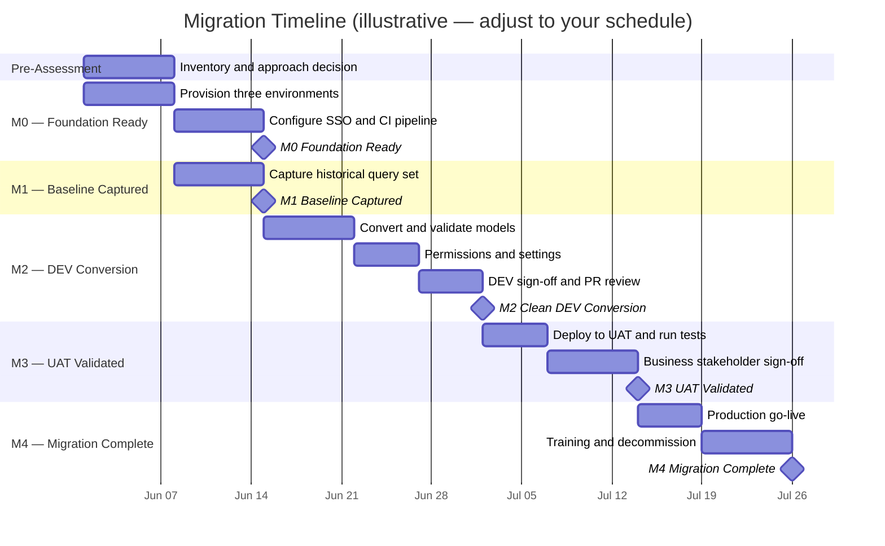
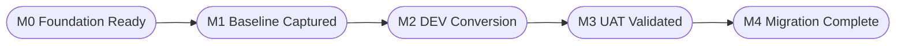

# AtScale Migration — Management Plan

> **Audience:** Project sponsors, business unit leads, and programme managers.
> For the full technical runbook, see [MIGRATE.md](MIGRATE.md).

## Table of Contents

- [Executive Summary](#executive-summary)
- [Why We Are Migrating](#why-we-are-migrating)
- [What Is Changing](#what-is-changing)
- [What Is Not Changing](#what-is-not-changing)
- [Timeline](#timeline)
- [Milestones](#milestones)
- [Roles and Responsibilities](#roles-and-responsibilities)
- [Impact on Business Users and BI Teams](#impact-on-business-users-and-bi-teams)
- [Risks and Mitigations](#risks-and-mitigations)
- [Decisions Required from Management](#decisions-required-from-management)
- [Go/No-Go Criteria](#gonogo-criteria)
- [Post-Migration Activities](#post-migration-activities)
- [Management Sign-Off Checklist](#management-sign-off-checklist)

---

## Executive Summary

We are migrating AtScale from its older installer-based deployment to a modern, container-based platform. As part of this migration, all semantic models — the definitions of business metrics, dimensions, and hierarchies that power our reports and dashboards — will be converted from a proprietary XML format to a version-controlled YAML format (called SML).

The migration runs through three isolated environments — Development, UAT, and Production — with automated quality checks at every stage. No single cutover window is required; the two systems run in parallel until all models are validated and business stakeholders have signed off.

**Expected duration:** approximately 10 weeks from kickoff to decommission of the legacy system, assuming a single project migration. Organisations with many models should expect additional time for scheduling multiple migration batches.

**Business impact:** minimal, if the plan is followed. End users will need to update their BI tool connections (new URLs and, for some tools, new drivers), but their reports and data will be unaffected after a successful cutover.

---

## Why We Are Migrating

| Reason | Business impact |
|---|---|
| **Installer version is being sunset** | Continued use of the legacy version means no new features, diminishing support, and eventual security exposure |
| **Modern infrastructure** | The container-based platform scales horizontally, recovers automatically from failures, and is easier to upgrade on a monthly cadence |
| **Version-controlled models** | Semantic models will be stored in Git, giving the organisation a full audit trail of every change, who made it, and why — the same standard applied to application code |
| **Automated regression testing** | An automated query harness replays historical business queries on every deployment, catching data and performance regressions before they reach production |
| **Improved governance** | Access control is unified with the corporate identity provider (SSO), eliminating per-user password management inside AtScale |
| **New modelling capabilities** | Composite models, shared dimension libraries, and calculation groups are available only in the container version |

---

## What Is Changing

| Area | What changes |
|---|---|
| **Infrastructure** | AtScale moves from Linux servers with a proprietary installer to a containerised Kubernetes deployment |
| **Model format** | Semantic models move from binary XML project files to human-readable YAML files stored in a Git repository |
| **Model governance** | Changes to models go through a review and approval process (pull request workflow) instead of direct edits in the AtScale UI |
| **Environments** | Three isolated AtScale instances — DEV, UAT, and PROD — replace the current deployment, with automated promotion between them |
| **BI tool connections** | Connection strings, ports, and in some cases drivers change for all BI tools (see [Impact on Business Users](#impact-on-business-users-and-bi-teams)) |
| **Access control** | User authentication is managed through the corporate identity provider (e.g. Azure AD, Okta) via SSO, rather than AtScale's internal user database |
| **Aggregate storage** | Query aggregates are stored in separate schemas per environment during the transition period; the legacy schema is retired after cutover |

---

## What Is Not Changing

- The underlying data warehouse (Snowflake, BigQuery, Databricks, etc.) is unchanged
- Business metric definitions, KPIs, hierarchies, and dimension structures are preserved during conversion
- Reports and dashboards continue to work as before, subject to UAT validation
- End users do not need to relearn their BI tools; only connection setup changes

---

## Timeline

The Gantt chart below shows an illustrative 10-week schedule. Adjust the start date to align with your resourcing and infrastructure availability.

---

## Milestones

Five milestones gate the migration. No milestone advances without the explicit sign-offs listed below. The technical team owns execution within each milestone; management owns the go/no-go decision at the gates marked with a star.

| Milestone | Name | What it means | Management gate |
|---|---|---|---|
| **M0** | Foundation Ready | All three environments are running, security is configured, and the automated deployment pipeline is operational | — (technical gate only) |
| **M1** | Regression Baseline Captured | A representative set of historical business queries has been captured from the legacy system and will be used to verify the migrated models behave identically | — (technical gate only) |
| **M2** | Clean DEV Conversion | All models have been converted and deploy cleanly to the DEV environment; individual queries have been spot-checked | — (technical gate only) |
| **M3** | UAT Validated | The migrated models are deployed to UAT, all automated tests pass, and **business stakeholders have confirmed their reports are correct** | ★ Business unit sign-off required before proceeding to PROD |
| **M4** | Migration Complete | Production is live, all automated tests pass, and the legacy system has been decommissioned | ★ Administrator approval required to open the production gate; programme sponsor confirms decommission |

---

## Roles and Responsibilities

| Role | Who | Responsibilities |
|---|---|---|
| **Programme Sponsor** | Senior management | Final approval for production go-live and decommission; resolves resource blockers; communicates timeline to end users |
| **Administrator** | Platform / infrastructure team | Provisions environments, manages credentials, owns the production deployment gate, rotates API tokens |
| **Model Administrator** | Data or analytics platform lead | Reviews converted models, coordinates UAT validation, signs off on harness results, manages the release PR |
| **Designer** | Data modellers / analytics engineers | Performs the XML-to-SML conversion, resolves technical issues, authors feature branches |
| **Business Stakeholders** | BI leads / report owners per business unit | Validate reports in UAT against the legacy system; provide formal sign-off before PROD cutover |
| **BI Developers / End Users** | Report consumers | Update BI tool connections at cutover; attend brief training session |

**Management's primary touchpoints in the process:**

1. Approve the migration approach and prioritisation order before work starts (see [Decisions Required from Management](#decisions-required-from-management))
2. Ensure business stakeholder availability for UAT sign-off (M3)
3. Approve the production deployment (M4 gate)
4. Communicate cutover timelines to end users

---

## Impact on Business Users and BI Teams

### What end users will notice

The primary change for end users is that **BI tool connections need to be updated** to point to the new AtScale instance. The data and metrics they query are the same — only the address they connect to changes.

| BI Tool | What changes |
|---|---|
| **Tableau** | The underlying connection protocol changes from Hive thrift (port `11111`) to PostgreSQL/PGWire (port `15432`). This requires: (1) installing the PostgreSQL JDBC driver on Tableau Server and Desktop, (2) updating every published data source and workbook to use the new port and connection type, and (3) republishing to Tableau Server. See the Tableau-specific risk below. |
| **Power BI** | Connection URL and authentication method change. Users connecting via Power BI Desktop will need to update their data source settings. |
| **Excel** | Connection URL or plugin configuration changes. |
| **Other JDBC/API tools** | Connection strings change; in some cases API paths change. |

Switch-over guides will be prepared for each tool before the UAT window opens, showing users the exact before-and-after steps.

### Tableau LOD and Calculated Field Risk

The legacy AtScale Hive thrift endpoint used HiveQL SQL dialect. The new PGWire endpoint uses PostgreSQL dialect. For most Tableau workbooks this is invisible — Tableau translates standard functions automatically. However, workbooks that use **database passthrough calculations** are directly affected:

- `RAWSQL_STR(...)`, `RAWSQL_INT(...)`, `RAWSQLAGG_*(...)` — these embed raw SQL strings that are sent verbatim to AtScale; any Hive-specific functions in those strings (e.g. `date_format`, `datediff`, `to_date`) will fail or return wrong results against the PostgreSQL dialect
- **Custom SQL data sources** — any Hive-specific syntax in the custom SQL query must be rewritten
- **LOD expressions** (FIXED / INCLUDE / EXCLUDE) — LODs themselves are Tableau-level and are not affected, but if an LOD references a `RAWSQL_*` calculated field, the underlying calculation must be reviewed

**What this means for the project:** the Tableau developer or BI team must audit all workbooks before UAT begins, identify any that use passthrough SQL, and validate those workbooks explicitly in UAT — a connection test alone is not sufficient. Workbooks with broken passthrough calculations will appear to connect successfully but return errors or wrong data when the affected sheet is opened.

This audit should be completed before the UAT window opens so that any rewriting of passthrough calculations can be included in the migration scope.

### What BI developers will notice

Model changes will no longer be made directly in the AtScale Design Center. Instead, changes go through a Git-based review process — edit, submit for review, get approval, and the change deploys automatically. This adds a lightweight governance layer but means no more ad-hoc edits in production.

### Timing of user impact

End users are not impacted until the production go-live (M4). During the migration period, the legacy system remains fully operational. Users only need to act at cutover — updating their BI tool connections — and that change takes a few minutes per tool with the switch-over guide.

---

## Risks and Mitigations

| Risk | Likelihood | Business impact | Mitigation |
|---|---|---|---|
| **A report returns different results after migration** | Low | High | The automated query harness compares results from the migrated system against the captured baseline; zero discrepancies are required before advancing to PROD |
| **Performance regression on critical reports** | Low | High | The harness measures query response times; the acceptance threshold (≤10% slower than legacy) is enforced before go-live |
| **BI tool disruption at cutover** | Medium | Medium | Switch-over guides distributed in advance; UAT window allows BI developers to test connections before PROD |
| **Tableau LOD / passthrough SQL breaks after dialect change** | Medium | High | Audit all workbooks for `RAWSQL_*` and custom SQL before UAT; explicitly validate flagged workbooks in UAT — a connection test alone does not catch broken passthrough calculations |
| **Permissions gaps — users lose access** | Medium | High | Permission mapping is a dedicated work stream (not an afterthought); SSO login is verified for every user role in DEV before UAT begins |
| **UAT sign-off takes longer than planned** | Medium | Medium | Schedule UAT windows per business unit; start with the highest-priority unit to build confidence early |
| **Infrastructure provisioning delays** | Low | High | Provisioning is the first milestone (M0) and runs in parallel with other early tasks; early start reduces the risk of it becoming a bottleneck |
| **Legacy system decommissioned too early** | Low | High | The legacy system remains live until the PROD harness passes and monitoring is active; decommission requires explicit management sign-off |
| **Key person dependency** | Medium | Medium | Document the model inventory and conversion decisions as they are made; avoid single-person ownership of critical cubes |

---

## Decisions Required from Management

The following decisions must be made before technical work begins. Delaying them delays the project.

### 1. Migration Approach

Choose one of three approaches. This affects timeline, cost, and long-term maintainability.

| Approach | What it means | Typical timeline | Best when |
|---|---|---|---|
| **Rehost (lift and shift)** | Convert existing models as-is with minimal changes | Shortest | Few models, tight timeline, or the existing models are well-structured |
| **Refactor** | Convert models and consolidate shared dimensions (e.g. a single Date or Customer dimension used across models) | Moderate | Multiple models share common concepts; team wants long-term maintainability |
| **Rebuild** | Redesign models from scratch using the new platform's capabilities | Longest | Existing models are acknowledged to be poorly structured or the organisation wants to standardise around a new semantic layer design |

A hybrid is possible: rehost high-priority models first for a quick win, then refactor others in subsequent sprints.

### 2. Prioritisation Order

Which business units or model groups should migrate first? Recommended sequencing:

- Start with a model that is representative but not the most complex — this builds team knowledge before tackling high-risk models
- Prioritise models whose business owners can participate actively in UAT
- Plan one business unit at a time to keep UAT sign-off manageable

**Management decision:** provide a prioritised list of business units and models by the start of Phase 1.

### 3. Go/No-Go Thresholds

The technical team has proposed minimum acceptance criteria (see [Go/No-Go Criteria](#gonogo-criteria)). Management should confirm whether the proposed thresholds are appropriate or adjust them to reflect business risk tolerance before UAT begins.

### 4. Communication Plan

End users need advance notice that:
- A parallel system exists and testing is under way
- Their BI tool connections will change on the go-live date
- Support will be available during the transition period

**Management decision:** nominate a communication owner and agree the communication timeline (recommend at least two weeks' notice before the production cutover date).

### 5. Decommission Approval

Decommissioning the legacy system releases infrastructure costs but is irreversible. Management must confirm the go-ahead after the production harness passes and monitoring is established.

---

## Go/No-Go Criteria

These criteria must all be met before the production deployment is approved. The Model Administrator and Administrator confirm each criterion; the Programme Sponsor makes the final go/no-go call.

| Criterion | Required threshold | Owner |
|---|---|---|
| All in-scope models migrated and deployable | 100% | Model Administrator |
| Automated query tests pass in PROD | 100% — zero failures | Model Administrator |
| Query results match legacy system | 100% of validated queries | Model Administrator |
| Query performance vs legacy baseline | No query more than 10% slower | Model Administrator |
| Business unit UAT sign-off | All in-scope business units | Business Stakeholders |
| Security scan completed | No critical findings open | Administrator |
| BI tool connections tested in UAT | All tools in scope | BI Developers |
| Monitoring active in PROD | Alerts configured and tested | Administrator |

If any criterion is not met, the production deployment does not proceed. The programme sponsor may accept a specific gap as a known risk in writing, but this must be an explicit decision, not an oversight.

---

## Post-Migration Activities

After the production go-live, three activities close out the project.

### Training and Enablement

Brief training sessions should be run for each BI team within two weeks of go-live, covering:
- The new Design Center and how model changes are now submitted for review
- New BI tool connection steps
- Any new analytical capabilities available in the container version (e.g. composite models, new calculation options)

Training materials should be prepared by the Model Administrator in advance; the Programme Sponsor should ensure attendance is treated as mandatory for BI developers.

### Monitoring

The platform team will configure production monitoring dashboards covering query success rates, response times, and system health. During the first two weeks after go-live, the legacy system remains available as a comparison baseline. The Programme Sponsor should confirm that the monitoring setup is satisfactory before approving decommission.

### Decommission of the Legacy System

Once monitoring is confirmed active and all stakeholders are satisfied, the legacy AtScale installation is decommissioned. This includes removing old aggregate data from the data warehouse, shutting down the legacy servers, and closing associated infrastructure tickets.

**This step releases infrastructure cost but cannot be undone.** Management sign-off is required.

---

## Management Sign-Off Checklist

| Decision / Gate | Owner | Status |
|---|---|---|
| Migration approach selected (Rehost / Refactor / Rebuild) | Programme Sponsor | |
| Prioritised list of business units and models provided | Programme Sponsor | |
| Go/No-Go thresholds reviewed and confirmed | Programme Sponsor | |
| Communication plan agreed and owner nominated | Programme Sponsor | |
| Business stakeholder availability confirmed for UAT window | Business Unit Leads | |
| UAT sign-off — all in-scope business units | Business Unit Leads | |
| All Go/No-Go criteria confirmed met | Model Administrator + Administrator | |
| Production deployment approved | Programme Sponsor + Administrator | |
| Monitoring confirmed active in PROD | Administrator | |
| Decommission of legacy system approved | Programme Sponsor | |
| Post-mortem scheduled | Programme Sponsor | |
