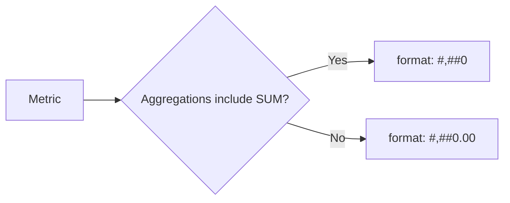
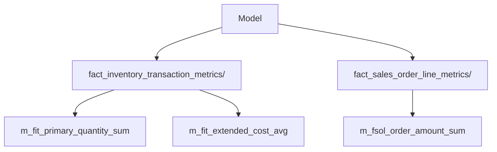
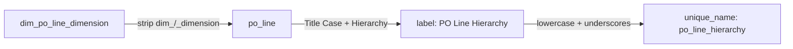

# AtScale SML Naming Conventions

> Adapted from "Modeling Naming Conventions for Measures and Dimensions".
> Applies to AtScale SML files generated by `generate-sml-from-connection`,
> `generate-sml-from-ddl`, and `apply-style-to-sml`.

## Table of Contents

- [0. Label Style](#0-label-style)
- [1. Metrics (Measures)](#1-metrics-measures)
  - [1.1 Unique Name](#11-unique-name)
  - [1.2 Display Name (Label)](#12-display-name-label)
  - [1.3 Format](#13-format)
  - [1.4 Folders](#14-folders)
- [2. Dimensions](#2-dimensions)
  - [2.1 Display Name (Label)](#21-display-name-label)
- [3. Hierarchies](#3-hierarchies)
  - [3.1 Display Name (Label)](#31-display-name-label)
  - [3.2 Hierarchy Count Limits](#32-hierarchy-count-limits)
  - [3.3 Unique Name](#33-unique-name)
- [4. Levels](#4-levels)
  - [4.1 Unique Name](#41-unique-name)
  - [4.2 Display Name (Label)](#42-display-name-label)
  - [4.3 Visualize in BI Tool](#43-visualize-in-bi-tool)
- [5. Secondary Attributes](#5-secondary-attributes)
  - [5.1 Inclusion Rule](#51-inclusion-rule)
  - [5.2 Display Name](#52-display-name)
- [6. Additional Conventions](#6-additional-conventions)
  - [6.1 Dataset Labels](#61-dataset-labels)
  - [6.2 Model and Catalog Labels](#62-model-and-catalog-labels)
  - [6.3 Metric Description](#63-metric-description)
  - [6.4 Surrogate Key Level Attributes](#64-surrogate-key-level-attributes)
  - [6.5 Fact Table Abbreviation Collisions](#65-fact-table-abbreviation-collisions)
  - [6.6 Metric File Naming](#66-metric-file-naming)
  - [6.7 Dataset and Dimension File Naming](#67-dataset-and-dimension-file-naming)

---

## 0. Label Style

[↑ Table of Contents](#table-of-contents)

The `label-style` setting controls how display labels are derived from source
table and column names for **all** SML objects: datasets, dimensions, hierarchies,
level attributes, secondary attributes, and metrics.

| Value | Behaviour | Example source | Example label |
|---|---|---|---|
| `title-case` (default) | Strip `dim_`, `_dimension`, `_key`, etc., then Title Case | `dim_customer_dimension` | `Customer` |
| `camel-case` | Strip same affixes, then lowerCamelCase | `dim_customer_dimension` | `customer` |
| `none` | Use the raw source name with no transformation | `dim_customer_dimension` | `dim_customer_dimension` |

Configure via `label-style` in `sml.style.yaml` or `--label-style` on the CLI.

> **Note:** `camel-case-measures` is a legacy per-metric flag that predates
> `label-style`. When `label-style` is set, it overrides `camel-case-measures`.

---

## 1. Metrics (Measures)

### 1.1 Unique Name

**Pattern:** `m_<fact_abbrev>_<column>_<aggregation>`

The fact-table abbreviation is the initials of each word in the fact table name.

| Fact table | Abbreviation |
|---|---|
| `fact_inventory_transaction` | `fit` |
| `fact_sales_order_line` | `fsol` |
| `fact_purchase_order` | `fpo` |
| `fact_general_ledger` | `fgl` |

**Examples:**

| Column | Aggregation | Unique Name |
|---|---|---|
| `primary_quantity` | `sum` | `m_fit_primary_quantity_sum` |
| `extended_cost` | `avg` | `m_fit_extended_cost_avg` |
| `order_amount` | `sum` | `m_fsol_order_amount_sum` |

---

### 1.2 Display Name (Label)

**Pattern:** `<Column Title Case> <Aggregate>`

The aggregate suffix is appended (not prepended) using its full display form.

| Aggregation | Display suffix |
|---|---|
| `SUM` | `Sum` |
| `AVG` | `Avg` |
| `MIN` | `Min` |
| `MAX` | `Max` |
| `COUNT` | `Count` |

**Examples:**

| Column | Aggregation | Label |
|---|---|---|
| `primary_quantity` | `SUM` | `Primary Quantity Sum` |
| `extended_cost` | `AVG` | `Extended Cost Avg` |
| `line_amount` | `MIN` | `Line Amount Min` |

---

### 1.3 Format

All metrics default to `"#,##0"` (Standard — thousands separator, no decimals).
Rate/ratio metrics (those whose aggregation set contains only `AVG/MIN/MAX`) use
`"#,##0.00"` (two decimal places).

---

### 1.4 Folders

Group all metrics from the same fact table into a subfolder named after that table.

| Fact table | Folder |
|---|---|
| `fact_inventory_transaction` | `fact_inventory_transaction_metrics` |
| `fact_sales_order_line` | `fact_sales_order_line_metrics` |

---

## 2. Dimensions

### 2.1 Display Name (Label)

Strip the `dim_` prefix and `_dimension` suffix from the source table name, then convert
the remaining words to Title Case.

| Source table | Label |
|---|---|
| `dim_po_line_dimension` | `PO Line` |
| `dim_customer_dimension` | `Customer` |
| `dim_product_dimension` | `Product` |
| `dim_date` | `Date` |

---

## 3. Hierarchies

### 3.1 Display Name (Label)

Strip `dim_`/`_dimension`, Title Case the result, then append ` Hierarchy`.

| Source table | Hierarchy label |
|---|---|
| `dim_po_line_dimension` | `PO Line Hierarchy` |
| `dim_customer_dimension` | `Customer Hierarchy` |

### 3.2 Unique Name

Replace spaces with underscores and lowercase the full label.

| Hierarchy label | Hierarchy unique_name |
|---|---|
| `PO Line Hierarchy` | `po_line_hierarchy` |
| `Date Hierarchy` | `date_hierarchy` |
| `Geography Hierarchy` | `geography_hierarchy` |

---

## 4. Levels

### 4.1 Unique Name

Set the level's `unique_name` to the key column name (snake_case, as-is from the source
table). Do **not** append suffixes such as `_level` or `_attribute`.

| Key column | Level unique_name |
|---|---|
| `po_line_key` | `po_line_key` |
| `customer_key` | `customer_key` |
| `date_key` | `date_key` |

### 4.2 Display Name (Label)

Strip `dim_`, `_dimension`, `_key`, `_id`, `_sk`, and `_level` suffixes from the column
name, then Title Case.

| Key column | Level label |
|---|---|
| `po_line_key` | `PO Line` |
| `customer_key` | `Customer` |
| `date_key` | `Date` |

### 4.3 Visualize in BI Tool

The leaf (most granular) level of every hierarchy must have
`visualize_in_bi_tool: false` so that surrogate key values are not exposed to
end-users in BI tools.

---

## 5. Secondary Attributes

### 5.1 Inclusion Rule

Add **all** columns from the dimension's source table as secondary attributes **except**
columns whose names match any of the following patterns:

| Pattern | Rationale |
|---|---|
| `au_*` | AtScale system columns |
| `source_create*` | ETL audit columns |
| `source_update*` | ETL audit columns |
| `qlik_last*` | Qlik replication metadata |

The key/leaf column must also be included (as a secondary attribute on the leaf level
attribute).

### 5.2 Display Name

Replace underscores with spaces and capitalize each word.

| Column name | Secondary attribute label |
|---|---|
| `source_system_code` | `Source System Code` |
| `po_line_status_desc` | `Po Line Status Desc` |
| `created_date` | `Created Date` |

---

## 6. Additional Conventions

### 6.1 Dataset Labels

Dataset labels use Title Case derived from the source table name rather than the raw
snake_case name.

| Table name | Dataset label |
|---|---|
| `fact_inventory_transaction` | `Fact Inventory Transaction` |
| `dim_customer_dimension` | `Dim Customer Dimension` |

### 6.2 Model and Catalog Labels

The catalog label is the human-readable project name (configurable via `--catalog-name`).
The model `label` matches the catalog label, not the technical model unique_name.

### 6.3 Metric Description

Each metric carries an auto-generated `description` in the form:

> `<Aggregation display> of <Column human name> from <Fact table Title Case>`

Example: `Sum of Primary Quantity from Fact Inventory Transaction`

### 6.4 Surrogate Key Level Attributes

When a level attribute's key column ends in `_key`, `_sk`, or `_id` and its data type
is an integer **and** a companion display column exists (resolved by `findNameColumn`),
the level attribute is marked `is_hidden: true` so the raw surrogate key is not visible
in BI tool field lists.

### 6.5 Fact Table Abbreviation Collisions

Two fact tables may share the same abbreviation (e.g. `fact_item_type` and
`fact_invoice_total` both abbreviate to `fit`). When this occurs, metric unique_names
will collide. Verify that all fact table abbreviations are unique across the model;
disambiguate by renaming tables at the source or by adding the `--metric-prefix` option
with an explicit prefix.

### 6.6 Metric File Naming

Metric filenames use the full `unique_name` (including fact abbreviation) converted to
kebab-case, ensuring no collisions when multiple fact tables share measure column names.
