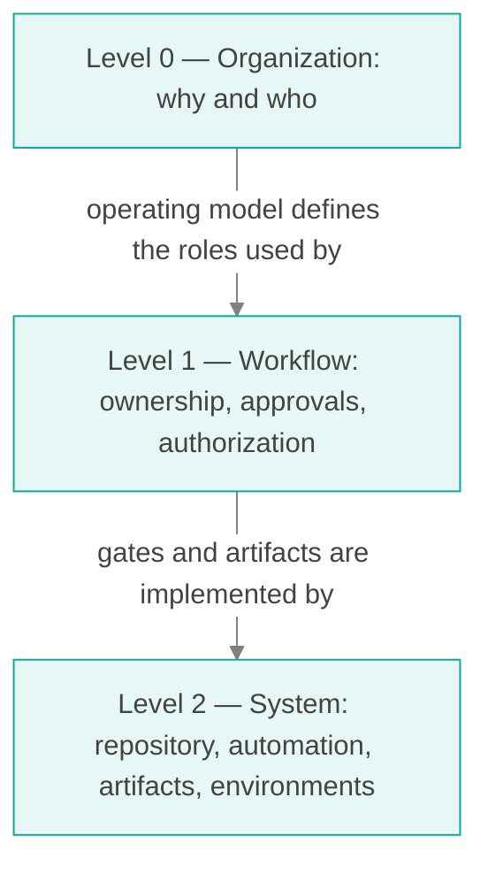
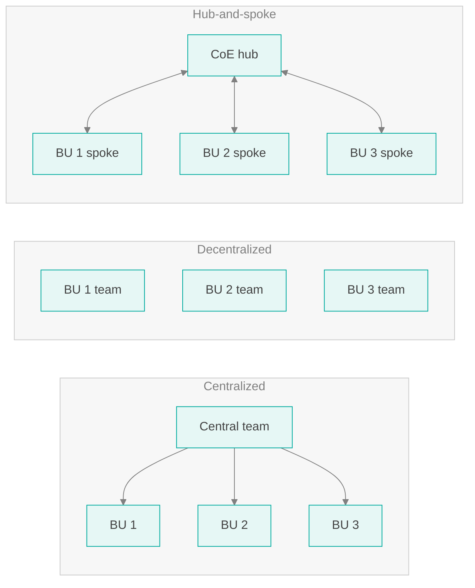
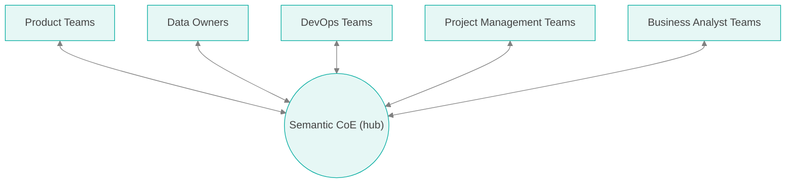
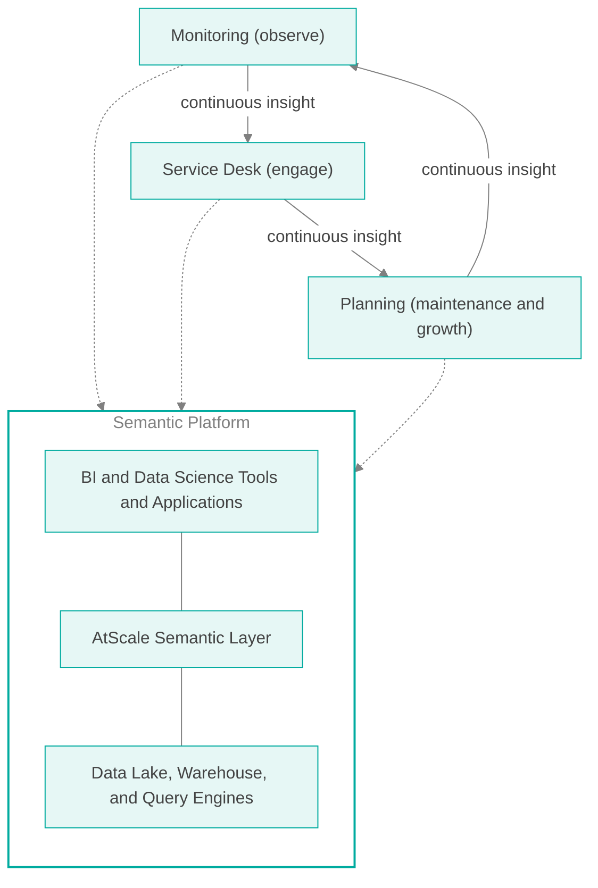

# Developing a Semantic Center of Excellence

Level 0 — Organization, operating model, and practices for running AtScale as an enterprise semantic layer

## Table of Contents

- [About This Document Set](#about-this-document-set)
- [Document Purpose](#document-purpose)
- [Document Assumptions](#document-assumptions)
- [What Is a Semantic Center of Excellence?](#what-is-a-semantic-center-of-excellence)
- [Choosing an Organization Structure](#choosing-an-organization-structure)
- [The Hub-and-Spoke Model](#the-hub-and-spoke-model)
- [Identifying Your Team](#identifying-your-team)
- [Pillars of a Semantic CoE](#pillars-of-a-semantic-coe)
- [How to Identify a Semantic Layer Use Case](#how-to-identify-a-semantic-layer-use-case)
- [Best Practices — Overview](#best-practices--overview)
- [Best Practices — Maintenance Schedule](#best-practices--maintenance-schedule)
- [Best Practices — Telemetry Program](#best-practices--telemetry-program)
- [Best Practices — Scale Planning and Testing](#best-practices--scale-planning-and-testing)
- [Best Practices — API Use Cases](#best-practices--api-use-cases)
- [Feedback Mechanisms (Voice of the Customer)](#feedback-mechanisms-voice-of-the-customer)
- [Validation Tests](#validation-tests)
- [Security Reviews](#security-reviews)
- [Next Steps](#next-steps)

## About This Document Set

This is the first of three documents that together describe how to implement a Semantic Center of Excellence (CoE) on AtScale. Each level answers a different question for a different audience.

| Level | Document | Question it answers | Primary audience |
|-------|----------|--------------------|------------------|
| 0 | **Developing a Semantic Center of Excellence** (this document) | Why a CoE, how it is organized, and what it does | Executive sponsors, CoE leads, business unit leaders |
| 1 | [CoE Workflows and Responsibilities](COE_WORKFLOWS_LEVEL1.md) | Who owns, approves, and authorizes each step of a model change | CoE leads, business unit model owners, release managers |
| 2 | [CoE System Structure](COE_SYSTEM_STRUCTURE_LEVEL2.md) | How the repository, automation, artifacts, and environments implement the workflow | Platform engineers, DevOps, model developers |
| Companion | [Validation Harness](VALIDATION_HARNESS.md) | How unit and scale validation work, what data they run against, and how an issue is reproduced anywhere | CoE engineers, model developers, performance engineers |

## Document Purpose

The purpose of this document is to recommend a comprehensive practice for organizations running AtScale as their semantic layer. It will continue to evolve as common, repeatable practices are collected. The intended outcome is a data-driven semantic layer culture that improves the return on the organization's semantic layer investment year over year.

A bold set of recommendations will see different levels of adoption. Adopting every recommendation does not by itself make a Center of Excellence. This document highlights best practices and also describes practices that apply only to some organizations. Ultimately, each organization decides which practices make the most sense for it.

A Center of Excellence is a way for an organization to group people, practices, and resources to support a business goal in an efficient, scalable manner. A universal semantic layer goes deeper than typical technical software because it encodes the business abstraction itself — the definitions of revenue, customer, fiscal period, and every other shared concept. That abstraction means a semantic CoE must manage the business processes that produce and change those definitions, not only the software that serves them.

## Document Assumptions

- **The platform is licensed.** This document makes no assumptions about what is or is not in a given contract. Some recommendations may call for licensable features or additional services; confirm those with your procurement and vendor-management owners before committing to them.
- **The platform is container-based.** AtScale is deployed on Kubernetes through Helm. Earlier guidance written for installer-based (single-host or multi-host VM) deployments does not apply; where a practice has changed because of containers, this document says so.
- **Initial deployment is complete or nearly complete.** At least one AtScale environment is running, connected to a data warehouse, and serving a first model.
- **Models are managed as code.** Semantic models are stored as SML (Semantic Modeling Language) YAML files in a Git repository. Level 2 describes the repository structure in detail.

## What Is a Semantic Center of Excellence?

A Center of Excellence is a team of people, processes, and tools that serves as the nexus of expertise for a given field. For a semantic layer, it is a small group of subject matter experts, platform administrators, architects, and modeling experts responsible for setup, administration, knowledge transfer, upgrades, and sharing information across the company and its communities of practice.

Organizations that succeed with a semantic layer tend to run a cross-functional group of technical and business experts in this role. The CoE is often related to business intelligence or data science teams, data platform teams, data governance, or data management.

The objective of the CoE is to **establish credibility, build a plan (roadmap), and demonstrate success.**

### Tactical Goals of a Successful Semantic CoE

- Make the case for the semantic layer in your organization. Identify:
  - Key business and custom use cases
  - The data you have
  - The data you need
- Identify all users and stakeholders
  - Establish an executive sponsor — a Chief Data Officer, CTO, or VP of Analytics is a good candidate
- Create a distribution list for easy organization-wide communication
  - Provide regular communication on core areas of interest
- Host a quarterly or bi-monthly meeting to share ideas across business units
- Build a repository of knowledge assets with a strong taxonomy
- Maintain a predictable, published schedule of outages and upgrades
- Promote success and innovation
  - Foresee and identify failure early enough to remediate it
- Document and publish the CoE vision and goals
- Own the vendor relationship on behalf of the organization
  - Be the single point of contact for support cases, roadmap input, and licensing
  - Know which vendor resource fits which situation, so business units do not each rebuild that knowledge

## Choosing an Organization Structure

How the CoE relates to the business units that consume the semantic layer is the most consequential decision a CoE makes. Three structures are common.

| | Centralized | Decentralized | Hub-and-spoke |
|---|---|---|---|
| Who builds models | Central team builds every model | Each BU builds its own | BUs build their models; the CoE builds shared ones |
| Who owns business logic | Central team, working from requirements | Each BU | Each BU, within CoE standards |
| Who owns the platform | Central team | Unclear, or every BU | CoE |
| Shared definitions (customer, calendar, product) | Consistent | Diverge across BUs | Consistent — owned by the CoE |
| Throughput | Limited by central team size | High | High |
| Domain accuracy | Depends on requirement quality | High | High |
| Risk to shared platform | Low | High — no one owns capacity | Low — the CoE controls promotion |
| Typical failure mode | Backlog; BUs route around the CoE | Conflicting numbers; unowned platform | Unclear boundaries if the contract is not written down |

### Why a Centralized Structure Stalls

A central team that builds every model becomes the bottleneck for every business question. It must learn each business unit's domain secondhand, so it builds from requirements documents rather than expertise, and each round of clarification adds weeks. Business units that cannot wait build extracts and shadow models outside the platform, which defeats the purpose of a single semantic layer.

### Why a Decentralized Structure Fragments

When every business unit builds independently, "revenue" and "active customer" acquire as many definitions as there are teams. Each team deploys onto shared infrastructure with no one accountable for capacity, so one team's model change can slow every other team's queries. No one owns upgrades, and the platform drifts.

## The Hub-and-Spoke Model

**Recommendation: adopt a hub-and-spoke structure.** The CoE is the hub. Each business unit that builds on the semantic layer is a spoke.

### Why Hub-and-Spoke Fits a Semantic Layer

A semantic layer has two properties that pull in opposite directions, and hub-and-spoke is the structure that satisfies both.

1. **Business knowledge is distributed.** The people who know what "net bookings" means in Finance, or how Supply Chain rolls up its locations, sit in those business units. Models are most accurate and fastest to build when those people build them. That argues for decentralized development.
2. **The platform and the shared vocabulary are common.** Every business unit's queries run on the same engines, draw on the same warehouse compute, and — ideally — share the same conformed dimensions for customer, product, geography, and time. A change in one model can consume capacity or change a number that another team relies on. That argues for central control.

Hub-and-spoke assigns each concern to the party best placed to own it:

| Concern | Owner | Why |
|---------|-------|-----|
| Business logic inside a model | Spoke (business unit) | Domain expertise lives there |
| Requirements, acceptance, and business sign-off | Spoke | Only the business can say a number is right |
| Shared (conformed) dimensions and enterprise metrics | Hub (CoE) | They must mean the same thing everywhere |
| Modeling standards and naming conventions | Hub | Consistency across business units |
| Platform operations, upgrades, capacity | Hub | One accountable owner for shared infrastructure |
| Promotion to shared environments (UAT, PROD) | Hub, with spoke approval | Protects every other spoke from one spoke's change |
| Performance and scale validation | Hub | Requires platform-wide visibility and tooling |

The boundary between hub and spoke is where most hub-and-spoke programs fail. A spoke that does not know what it is allowed to do on its own either waits on the hub for everything (and the model degrades to centralized) or ignores the hub (and it degrades to decentralized). The boundary must therefore be written down as a contract of ownership, approvals, and authorization. That contract is the subject of the [Level 1 document](COE_WORKFLOWS_LEVEL1.md).

### How Containers Reinforce Hub-and-Spoke

Container-based deployment maps directly onto hub-and-spoke. The CoE operates the Kubernetes platform, the Helm releases, and the promotion pipeline; spokes work inside boundaries the CoE provisions for them. Two infrastructure patterns are available, and the CoE chooses between them per environment:

| Pattern | Description | When to choose it |
|---------|-------------|-------------------|
| Shared namespace | All business units deploy models into one AtScale release. The CoE governs capacity through promotion gates and scale testing. | Few business units, heavily shared conformed dimensions, or a small platform team |
| Namespace per business unit | Each business unit receives its own Helm release in its own namespace, with isolated engines, aggregate build capacity, and configuration. The CoE operates every release. | Many business units, strong isolation or chargeback requirements, or independent upgrade schedules |

Either way, the hub owns the platform and the spokes own their models. Per-business-unit namespaces reduce the blast radius of a bad change but do not remove the need for shared standards, and they increase the number of releases the CoE must upgrade and monitor.

### Four Environments

The hub-and-spoke boundary is also an environment boundary. Four environments give each party a place to do its job without getting in the other's way:

```mermaid
%%{init: {"theme":"base","themeVariables":{"fontFamily":"Signika, Segoe UI, Helvetica, Arial, sans-serif","background":"#FFFFFF","primaryColor":"#E6F7F5","primaryBorderColor":"#00AB9F","primaryTextColor":"#434343","secondaryColor":"#F4F4F4","secondaryBorderColor":"#CCCCCC","secondaryTextColor":"#434343","tertiaryColor":"#FFFFFF","tertiaryBorderColor":"#CCCCCC","tertiaryTextColor":"#434343","lineColor":"#808080","textColor":"#808080","mainBkg":"#E6F7F5","nodeBorder":"#00AB9F","clusterBkg":"#F7F7F7","clusterBorder":"#CCCCCC","titleColor":"#808080","edgeLabelBackground":"#FFFFFF","actorBkg":"#E6F7F5","actorBorder":"#00AB9F","actorTextColor":"#434343","actorLineColor":"#808080","signalColor":"#808080","signalTextColor":"#808080","labelBoxBkgColor":"#E6F7F5","labelBoxBorderColor":"#00AB9F","labelTextColor":"#434343","loopTextColor":"#808080","noteBkgColor":"#F4F4F4","noteBorderColor":"#CCCCCC","noteTextColor":"#434343","activationBkgColor":"#E6F7F5","activationBorderColor":"#00AB9F","sequenceNumberColor":"#FFFFFF","git0":"#00AB9F","git1":"#A6A6A6","git2":"#7FD5CF","git3":"#BFBFBF","git4":"#00766E","git5":"#B3B3B3","git6":"#4DC4BC","git7":"#8C8C8C","gitBranchLabel0":"#FFFFFF","gitBranchLabel1":"#000000","gitBranchLabel2":"#000000","gitBranchLabel3":"#000000","gitBranchLabel4":"#FFFFFF","gitBranchLabel5":"#000000","gitBranchLabel6":"#000000","gitBranchLabel7":"#000000","commitLabelColor":"#000000","commitLabelBackground":"#FFFFFF","tagLabelColor":"#434343","tagLabelBackground":"#E6F7F5","tagLabelBorder":"#00AB9F"}}}%%
flowchart LR
    DEV["DEV — sandbox (spoke)"] -->|"BU approval"| TEST["TEST — unit validation"]
    TEST -->|"BU + CoE approval"| UAT["UAT — scale validation"]
    UAT -->|"BU + CoE approval"| PROD["PROD — live"]
```

| Environment | Purpose | Who changes it |
|-------------|---------|----------------|
| DEV (sandbox) | Where modelers explore, experiment, break things, and fix them. No gates, no evidence, no service level. | The spoke, self-service |
| TEST | Where evidence begins: every change the business unit approves is deployed and unit-tested automatically | Automation only |
| UAT | A production-like rehearsal: scale testing and aggregate impact | Automation only, after joint approval |
| PROD | Live business use | Automation only, after joint approval |

**Why a separate sandbox and test environment.** A single development environment has to serve two incompatible purposes: freedom to experiment, and trustworthy test results. If modelers experiment where tests run, a failing test may mean "the change is wrong" or "someone was trying something", and teams learn to ignore failures. If tests run where modelers cannot experiment, modelers experiment somewhere ungoverned, or not at all. Separating the sandbox from TEST gives the spokes real autonomy and gives the hub evidence it can rely on.

The sandbox belongs to the spoke — often one per business unit. TEST, UAT, and PROD are shared and governed by the hub.

### What the Hub Provides to Each Spoke

- A self-service DEV sandbox and credentials
- The model repository, templates, and naming standards
- Shared conformed dimensions and enterprise metrics to build on
- Automated validation and unit testing of every approved change in TEST
- Scale testing and aggregate management before production
- Production deployment, monitoring, and support escalation
- Training, office hours, and a community of practice

### What Each Spoke Commits to the Hub

- A named model owner accountable for the spoke's models
- Business requirements and acceptance criteria for each change
- Unit tests that prove the model returns correct numbers
- Business approval before any change is merged
- Participation in joint promotion decisions
- Adherence to CoE standards, or a documented exception

## Identifying Your Team

Listed below is a comprehensive set of roles that make up a semantic layer team. In many organizations one person fills several roles, and the entire team does not need to attend every CoE meeting.

| Role | Hub or spoke | Description |
|------|--------------|-------------|
| Executive Sponsor | Hub | Funds the CoE, resolves cross-business-unit priority conflicts, and champions adoption |
| Program / Project Manager or Owner | Hub | Runs the CoE roadmap, cadence, and communications |
| Platform Administrator | Hub | Operates the Kubernetes cluster and AtScale Helm releases. Depending on the organization, this role may be split across cluster administration, networking and load balancing, cloud administration, storage, and security administration. |
| Warehouse Administrator | Hub or spoke | Owns the data warehouse the semantic layer queries. May be split across DBA, data steward, and data engineering or ETL roles. |
| Semantic Data Architect | Hub | Owns modeling standards, shared dimensions, and platform performance. May be split across AtScale service administrator, organization administrator, lead engineer, performance specialist, and release (DevOps) administrator. |
| Model Developer | Spoke (and hub for shared models) | Builds and maintains semantic models |
| Model Owner | Spoke | Accountable for a business unit's models; approves changes on the business unit's behalf |
| Business Analyst | Spoke | Defines requirements and validates results. May be split across technical liaison, dashboard creator, BI developer, external data engineer, and data scientist. |

## Pillars of a Semantic CoE

With the team identified and executive sponsorship in place, organize CoE operations under three pillars that surround the platform and feed each other continuous insight.

- **Monitoring (observe)** — Tracking the health of the system. How many users are on the platform? How many queries is it processing, and how has that changed quarter over quarter? What is query performance like, and are we meeting service levels? How do our consumers feel about the service?
- **Service Desk (engage)** — Solving problems and taking in new requests. How do we triage an incident? How do we identify a good semantic layer use case? How does a new business unit onboard?
- **Planning (maintenance and growth)** — Keeping the platform current and ready for demand. When are upgrades scheduled? How much capacity will next quarter's use cases need? Which models should be retired?

## How to Identify a Semantic Layer Use Case

With the team and executive buy-in in place, the CoE can focus on which problems to tackle. A semantic layer is usually introduced to solve a particular problem, but broader success comes from broader use. Start use case by use case before undertaking a large program. In either case, knowing where the semantic layer will have the most impact — and where it makes the most sense — is critical to starting well.

The semantic layer flywheel illustrates the path from data to decisions, and how each decision generates the next round of demand.

```mermaid
%%{init: {"theme":"base","themeVariables":{"fontFamily":"Signika, Segoe UI, Helvetica, Arial, sans-serif","background":"#FFFFFF","primaryColor":"#E6F7F5","primaryBorderColor":"#00AB9F","primaryTextColor":"#434343","secondaryColor":"#F4F4F4","secondaryBorderColor":"#CCCCCC","secondaryTextColor":"#434343","tertiaryColor":"#FFFFFF","tertiaryBorderColor":"#CCCCCC","tertiaryTextColor":"#434343","lineColor":"#808080","textColor":"#808080","mainBkg":"#E6F7F5","nodeBorder":"#00AB9F","clusterBkg":"#F7F7F7","clusterBorder":"#CCCCCC","titleColor":"#808080","edgeLabelBackground":"#FFFFFF","actorBkg":"#E6F7F5","actorBorder":"#00AB9F","actorTextColor":"#434343","actorLineColor":"#808080","signalColor":"#808080","signalTextColor":"#808080","labelBoxBkgColor":"#E6F7F5","labelBoxBorderColor":"#00AB9F","labelTextColor":"#434343","loopTextColor":"#808080","noteBkgColor":"#F4F4F4","noteBorderColor":"#CCCCCC","noteTextColor":"#434343","activationBkgColor":"#E6F7F5","activationBorderColor":"#00AB9F","sequenceNumberColor":"#FFFFFF","git0":"#00AB9F","git1":"#A6A6A6","git2":"#7FD5CF","git3":"#BFBFBF","git4":"#00766E","git5":"#B3B3B3","git6":"#4DC4BC","git7":"#8C8C8C","gitBranchLabel0":"#FFFFFF","gitBranchLabel1":"#000000","gitBranchLabel2":"#000000","gitBranchLabel3":"#000000","gitBranchLabel4":"#FFFFFF","gitBranchLabel5":"#000000","gitBranchLabel6":"#000000","gitBranchLabel7":"#000000","commitLabelColor":"#000000","commitLabelBackground":"#FFFFFF","tagLabelColor":"#434343","tagLabelBackground":"#E6F7F5","tagLabelBorder":"#00AB9F"}}}%%
flowchart LR
    A["Raw data in the warehouse"] --> B["Semantic model: shared business definitions"]
    B --> C["Governed access from any BI tool"]
    C --> D["Consistent answers across teams"]
    D --> E["Trusted decisions"]
    E --> F["New questions and use cases"]
    F --> B
```

Successful organizations establish a mechanism to identify use cases, educate their constituents on the value of the semantic layer, and document and publish assets for communicating these ideas. The following mechanisms are recommended.

### Assets

Whether the CoE reviews inbound requests directly or publishes an internal self-service portal, the following assets help identify a business use case as supportable by the platform:

- **Value presentation** — A short deck that crisply illustrates the value of the semantic layer for one use case and for the wider organization.
- **Business case questionnaire** — A list of questions that both qualifies a use case and T-shirt sizes its scope: data sources, number of users, BI tools, query patterns, data volumes, freshness requirements, and security requirements.
- **Use case intake record** — The questionnaire answers, the sizing, the named model owner, and the target environment, kept in the CoE's knowledge repository.

### Promoting the Semantic Layer Internally

Communicating capabilities and updates on a regular cadence that is consistent with corporate norms builds understanding of the business's needs. It may require starting a new culture of promoting the service portfolio. Successful organizations run the following:

- **Recorded sessions** — Record and post internal demonstrations and vendor webinars in the knowledge repository.
- **On-demand lunch and learns** — Short, topic-focused sessions led by CoE members or experienced model developers from a spoke.
- **What's new** — A quarterly update aligned to the platform release schedule, covering new capabilities and planned upgrades.
- **Office hours** — A recurring, open session where any business unit can bring a modeling or performance question.

### Training

Offer training in both instructor-led and recorded formats. Train up front, and schedule refreshers according to the difficulty of the material and the time since the last session.

| Course | Audience | Cadence |
|--------|----------|---------|
| Administration | Platform administrators, organization administrators | Up front; refresher every two years or when a new administrator joins |
| Modeling essentials | Model developers, BI developers | Up front; recorded refresher for new members |
| Advanced model design | Model developers, semantic data architects | Up front; refresher every twelve months or when advanced content is added |
| Models as code | Model developers, model owners | Up front; covers the repository, branching, and promotion workflow in Levels 1 and 2 |
| Cross-training | All | Ongoing — internal experts train other internal members using CoE-maintained material |

Track completion in your learning management system where one exists.

## Best Practices — Overview

Maintain a CoE best practices collection in the knowledge repository, covering:

- **Administration** — platform operations, security, upgrades, and capacity
- **Development** — modeling standards, naming conventions, shared dimensions, testing, and the promotion workflow
- **Reporting** — BI tool connection patterns, query design, and performance expectations

## Best Practices — Maintenance Schedule

### Platform Maintenance

Keeping the platform healthy enough to meet service levels, and to encourage more use, requires maintenance at several cadences. On a container platform, much of what was manual on installer-based deployments is now declarative — the Helm values file is the configuration — but it still has to be owned, reviewed, and backed up.

| Cadence | Tasks |
|---------|-------|
| Initial deployment | Cluster and node pool sizing, namespaces, ingress and load balancer, TLS certificates, identity provider integration, external metadata database, secrets management, network policies, persistent storage |
| Daily | Metadata database backup verification, pod health and restart review, query monitoring, aggregate build monitoring, alert triage |
| Weekly | Issue and incident review, query performance review, aggregate growth review, log retention checks |
| Monthly | Telemetry validation, full aggregate refresh where required, license and capacity check, certificate expiry check, Helm values drift review |
| Quarterly | Roadmap and plan review, upgrade planning, scale and simulation testing, capacity planning, disaster recovery test, access recertification |

### Container-Specific Changes from Installer-Era Practice

| Installer-era practice | Container practice |
|------------------------|--------------------|
| Hot and cold backups of the host | Managed backups and point-in-time recovery of the external metadata database; configuration lives in version-controlled Helm values |
| Log rotation on the host | Centralized log collection from pods; retention set in the logging platform |
| Adding a node to a cluster by hand | Horizontal pod scaling and node pool autoscaling, bounded by resource quotas |
| In-place upgrade of an installation | Helm upgrade of a release, rehearsed in a lower environment and reversible by rollback |
| Separate instances per team | Namespace per business unit, or a shared release governed by promotion gates |

### Third-Party Maintenance

The semantic layer works in conjunction with the underlying data platforms and the front-end analytics tools (BI and data science). Changes in these technologies during major releases can be significant: BI tools may change their query patterns, and data platforms may release new capabilities or deprecate old ones. Keep a schedule of upgrades for the surrounding technologies and review it against the semantic layer's supported-version matrix. An organization may plan a BI tool upgrade before the semantic layer supports the new version, or may choose to remain on an end-of-life data platform version for another quarter. These are rarely production-down issues, but planning and communication prevent them from becoming so.

## Best Practices — Telemetry Program

Telemetry should be analyzed in-house, and shared with the vendor when doing so helps resolve issues or plan capacity.

- **Query history analysis** — Extract query history and query statistics on a schedule into a separate store for analysis: which models and measures are used, by whom, how fast, and whether queries hit aggregates. This is the primary input to the Monitoring pillar and to scale planning.
- **Platform metrics** — Collect cluster and pod metrics (CPU, memory, restarts, autoscaling events) and engine metrics into the organization's observability platform, alongside the data warehouse's own metrics.
- **Centralized logs** — Ship pod logs to the organization's logging platform, aggregated across namespaces when business units run separate releases.
- **Diagnostic bundles** — Diagnostic bundles of logs, configuration, and query statistics are usually gathered to resolve a support case. Gathering one on a regular schedule also provides a historical baseline for query analysis and a broader understanding of the configuration.
- **Usage reporting** — Publish a regular usage report to business units and the executive sponsor: active users, query volume, performance against service levels, and adoption by model.

## Best Practices — Scale Planning and Testing

Pre-emptive scale testing keeps the current environment stable and responsive, and it lets the CoE respond to a growing number of queries, users, developers, and use cases.

### Telemetry

Scale planning starts from telemetry. Query history shows real concurrency, peak periods, and the query shapes that matter; aggregate statistics show how much of the workload the platform serves from aggregates and how quickly the aggregate set is growing.

### Stress Testing

Replay representative query workloads at increasing concurrency against a production-like environment before each production promotion and each platform upgrade. Measure response times, error rates, and aggregate creation. Stress testing is a standing gate in the CoE workflow — see [Level 1](COE_WORKFLOWS_LEVEL1.md) — not a one-time exercise.

### Aggregate Growth

Every model change can change which aggregates the platform creates. A change that multiplies the aggregate count consumes warehouse storage and build time and can delay aggregate availability for every other model. Measure aggregate growth before production, and treat excessive growth as a design problem to solve in the model rather than a capacity problem to absorb.

### Horizontal Scaling

Container deployments scale query engines horizontally. Set autoscaling bounds and resource quotas deliberately, and confirm them under load during stress testing rather than discovering them in production.

### Scalable Query Engines

The semantic layer pushes queries down to the data warehouse. Warehouse sizing, concurrency limits, and workload isolation (for example, separate warehouses or resource pools for aggregate builds and for interactive queries) are part of the semantic layer's scale plan and must be tested together with it.

### Infrastructure

Size node pools for peak concurrency plus headroom for aggregate builds and rolling upgrades. Keep the metadata database on managed infrastructure with high availability, and keep production and non-production on separate clusters or, at minimum, separate node pools. The DEV sandbox can run on smaller, cheaper capacity than TEST and UAT, but on the same platform version.

### Instance Bifurcation

When one business unit's workload threatens another's service levels, or when business units need different upgrade schedules, split the workload onto separate releases — typically a namespace per business unit. Bifurcation isolates capacity and blast radius at the cost of more releases to operate. Decide it from telemetry, not in response to a single incident.

## Best Practices — API Use Cases

The platform exposes APIs for automation. A mature CoE uses them to:

- Deploy models from the Git repository through a CI/CD pipeline, rather than by hand
- Validate models and report errors automatically on every change
- Extract query history and statistics for telemetry
- List, export, import, and rebuild aggregates as part of promotion
- Manage data sources, repositories, and deployments consistently across environments

[Level 2](COE_SYSTEM_STRUCTURE_LEVEL2.md) describes the tooling that implements these use cases.

## Feedback Mechanisms (Voice of the Customer)

The CoE's customers are the business units and their analysts. Collect their feedback deliberately and act on it visibly.

- **Intake and request tracking** — A single intake channel for new use cases, model changes, and defects, with visible status.
- **Periodic surveys** — A short satisfaction survey each quarter covering performance, data trust, ease of onboarding, and support responsiveness.
- **Business unit reviews** — A recurring review with each spoke's model owner covering usage, open requests, upcoming changes, and service-level performance.
- **Community of practice** — A regular forum where spokes share patterns, reusable model components, and lessons learned.
- **Closing the loop** — Publish what changed as a result of feedback. Feedback that disappears stops arriving.

Feed the results into the Planning pillar and the CoE roadmap, and report them to the executive sponsor.

## Validation Tests

Maintain a validation test suite — a curated set of queries with known, business-approved results for each production model — and run it:

- Before and after every platform upgrade
- Before every production promotion
- After changes to the data warehouse, BI tools, or network that the semantic layer depends on

A validation suite turns "the numbers look right" into evidence. The same suite serves as the regression test in the promotion workflow; Level 1 defines when it runs and who reviews the result, and Level 2 describes how it is automated.

## Security Reviews

Review the platform's security posture on a regular schedule, and whenever a new business unit, data source, or BI tool is onboarded.

- **Identity and access** — Identity provider integration, group-based access, and least-privilege roles for administrators and model developers
- **Data access** — Row- and column-level security defined in models, tested as part of validation
- **Secrets** — Warehouse credentials and API tokens stored in a secrets manager, rotated on schedule, and never committed to the model repository
- **Network** — TLS on every endpoint, network policies between namespaces, and restricted access to the metadata database
- **Change control** — Every production change traceable to an approved pull request, as described in Levels 1 and 2
- **Access recertification** — Quarterly review of who holds administrative and approval rights

## Next Steps

1. Name the executive sponsor and the CoE lead.
2. Choose the organization structure. This document recommends hub-and-spoke.
3. Identify the first spokes and their model owners.
4. Adopt the workflow and responsibility contract in [Level 1 — CoE Workflows and Responsibilities](COE_WORKFLOWS_LEVEL1.md).
5. Build the repository, automation, and environments described in [Level 2 — CoE System Structure](COE_SYSTEM_STRUCTURE_LEVEL2.md).
