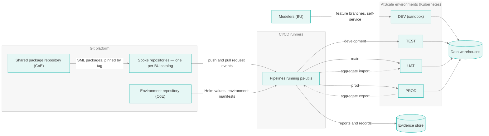
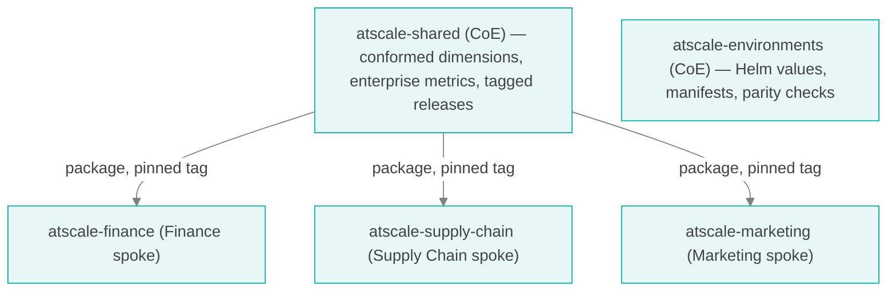
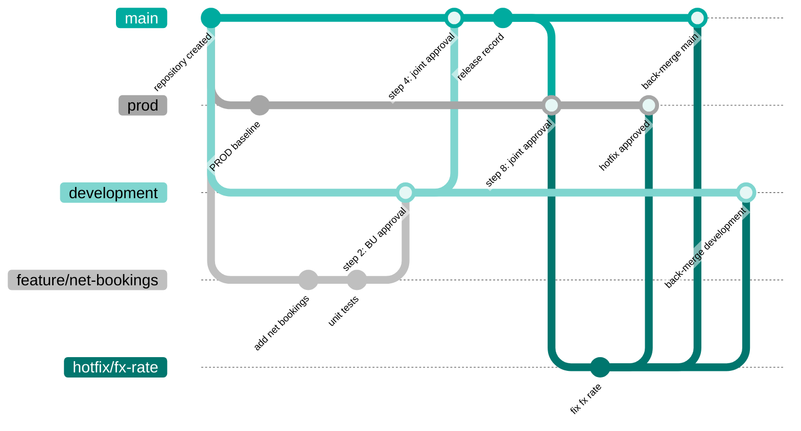
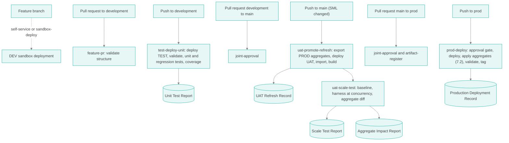
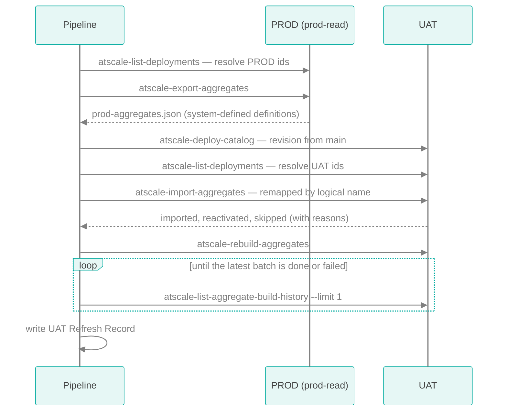
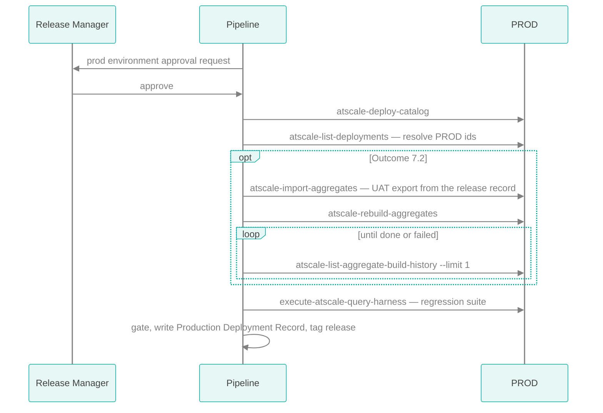

<style>
@import url('https://fonts.googleapis.com/css2?family=Signika:wght@300;400;600;700&display=swap');

body, .markdown-body {
  font-family: "Signika", "Segoe UI", Helvetica, Arial, sans-serif;
  font-weight: 300;
  color: #434343;
  background-color: #FFFFFF;
  line-height: 1.5;
  max-width: 800px;
  margin: 0 auto;
}
h1 { font-family: "Signika", sans-serif; font-weight: 700; color: #434343; font-size: 2em; }
h2 { font-family: "Signika", sans-serif; font-weight: 600; color: #00AB9F; margin-top: 1.6em; }
h3 { font-family: "Signika", sans-serif; font-weight: 700; color: #000000; }
h4, h5, h6 { font-family: "Signika", sans-serif; color: #434343; }
strong, b { color: #000000; }
a { color: #00AB9F; }
code, pre { font-family: "SFMono-Regular", Consolas, "Liberation Mono", monospace; background-color: #FFFFFF; color: #000000; }
ul { list-style-type: disc; }
ul ul { list-style-type: circle; }
li { margin: 0.25em 0; }
hr { display: none; }
blockquote { background-color: #FFFFFF; color: #434343; border-left: 3px solid #00AB9F; margin: 1em 0; padding: 0.25em 1em; }

table { border-collapse: collapse; width: 100%; margin: 1em 0; }
th, td { text-align: left; padding: 0.5em 0.75em; border: none; }
thead th { color: #000000; font-weight: 700; border-bottom: 2px solid #434343; }
tbody tr { border-bottom: 1px solid #CCCCCC; }
tbody tr:last-child { border-bottom: 1px solid #434343; }
</style>

# CoE System Structure

Level 2 — Repository structure, approval controls, automation, artifacts, and environment settings that implement the CoE workflow

## Table of Contents

- [About This Document](#about-this-document)
- [System Overview](#system-overview)
- [Tooling: ps-utils](#tooling-ps-utils)
- [Repository Topology](#repository-topology)
- [Spoke Repository Layout](#spoke-repository-layout)
- [Branch Model](#branch-model)
- [Approval Structures in Git](#approval-structures-in-git)
- [Environments, Credentials, and the Connections File](#environments-credentials-and-the-connections-file)
- [Pipelines](#pipelines)
- [Artifacts](#artifacts)
- [Aggregate Export and Import](#aggregate-export-and-import)
- [Testing Harness](#testing-harness)
- [Synthetic Data for UAT](#synthetic-data-for-uat)
- [Environment Settings to Capture](#environment-settings-to-capture)
- [Known Limitations and Required Glue](#known-limitations-and-required-glue)
- [Workflow-to-Tooling Map](#workflow-to-tooling-map)
- [Related Documentation](#related-documentation)

## About This Document

[Level 0](COE_IMPLEMENTATION_LEVEL0.md) establishes a hub-and-spoke Semantic CoE. [Level 1](COE_WORKFLOWS_LEVEL1.md) defines the contract between hub and spokes: nine steps, who owns, approves, and is authorized for each, and the artifacts each step produces. This document describes the system that enforces that contract:

- how the Git repositories are organized and who owns which paths,
- which approval controls the Git platform provides, and how they map to Level 1's approval and authorization matrices,
- the pipelines that deploy, test, refresh, and promote,
- every artifact in detail, and the ps-utils operations that produce it,
- aggregate export and import between environments, and
- the environment settings that must be captured and kept in parity.

Examples use GitHub. [Approval Structures in Git](#approval-structures-in-git) gives GitLab and Azure DevOps equivalents.

## System Overview



| Environment | Purpose | Deployed by | Deployed from |
|-------------|---------|-------------|---------------|
| DEV (sandbox) | Modelers experiment, break, and fix; no gates and no evidence | Modelers, self-service (or the optional `sandbox-deploy` pipeline) | Any feature branch, each under its own deployment name |
| TEST | Unit validation of every approved change | Automation only | `development` |
| UAT | Scale validation; production-like | Automation only | `main` |
| PROD | Live business use | Automation, after Release Manager approval | `prod` |

| Component | Owner | Purpose |
|-----------|-------|---------|
| Shared package repository | CoE | Conformed dimensions and enterprise metrics, consumed by spoke repositories as an SML package |
| Spoke repositories | BU (content), CoE (pipelines and controls) | One AtScale catalog per repository: the BU's models, datasets, tests, and release records |
| Environment repository | CoE | Helm values (without secrets), environment manifests, and parity checks for DEV, TEST, UAT, and PROD |
| CI/CD runners | CoE | Execute pipelines; hold environment credentials |
| Evidence store | CoE | Durable storage for reports and records beyond CI artifact retention |

## Tooling: ps-utils

ps-utils is a command-line toolkit whose operations cover model validation, deployment, aggregate management, query testing, and synthetic data. Every automated step in this document is a ps-utils operation or a small script around one.

```bash
npm install -g @atscale-ps/ps-utils      # Node.js 18 or later
atscale-utils version                    # record this in every report
atscale-utils <operation> --flag value ...
```

The same operations are available as a GitHub composite action (`uses: AtScaleInc/ps-utils@v1`) — see the [GitHub Actions reference](../reference/ACTIONS.md). The composite action does not expose operation output as step outputs, so **pipeline gates that inspect results call the CLI directly** in a `run:` step, as the examples below do. The operations are also available as a Node.js library ([reference](../reference/NODE.md)) and as a GraphQL or REST service ([GraphQL](../reference/GRAPHQL.md), [REST](../reference/REST.md)).

Three behaviors shape every pipeline in this document:

1. **Operations report findings; they do not enforce thresholds.** An operation exits non-zero only when it cannot run (bad parameters, connection or HTTP failure). Validation errors, failed queries, and skipped aggregates are reported in the output with exit code 0. Every gate therefore parses the output. The gate scripts below show how.
2. **TLS verification is off by default for AtScale REST operations** (`--insecure` defaults to `true`). Pass `--insecure false` in every pipeline against properly certified environments.
3. **Catalog and model identifiers differ per environment.** Aggregate operations need `--catalog-id` and `--model-id`; without them they prompt interactively, which fails in CI. Resolve the identifiers per environment with `atscale-list-deployments` and pass them explicitly.

## Repository Topology



**Recommendation: one repository per spoke catalog, one shared package repository, and one environment repository.**

- **Spoke repositories** make ownership trivial to express: the BU owns the repository's content, and the CoE owns its pipeline and control files. A promotion carries one BU's changes only, so a joint approval involves exactly one BU and the CoE.
- **The shared package repository** holds objects every spoke must agree on. SML packages let a spoke reference another repository's objects, pinned to a branch, tag, or commit (`package.yml`). Spokes pin to a tag, so a change to a shared dimension reaches a spoke only when that spoke updates its pin — and that update goes through the spoke's own workflow and scale test.
- **The environment repository** separates platform configuration from model content. Changing an engine setting or a Helm value is a CoE change with its own review, not a side effect of a model release.

**Alternative — a single catalog repository shared by several BUs.** Use it only when business units genuinely share one catalog. Ownership is then expressed by path (for example `sml/models/finance/`), and a promotion may carry several BUs' changes at once, so the joint approval check must require an approval from every BU whose paths changed. The rest of this document assumes spoke repositories. The differences are noted where they matter.

## Spoke Repository Layout

```text
atscale-finance/
├── sml/                          # SML root — the only directory deployed
│   ├── catalog.yml               # catalog settings, including aggregate settings
│   ├── package.yml               # pinned reference to atscale-shared
│   ├── connections/
│   ├── datasets/
│   ├── dimensions/
│   ├── metrics/
│   ├── calculations/
│   ├── row_security/
│   └── models/                   # model files, including user-defined aggregates
├── tests/
│   ├── unit/                     # BU-owned
│   │   ├── queries.csv           # unit test queries (harness CSV ingest format)
│   │   └── expected.csv          # approved harness results: the expected values
│   ├── regression/               # CoE-owned standard regression suite
│   │   ├── queries.csv
│   │   └── expected.csv
│   └── scale/                    # CoE-owned
│       └── workload.json         # scale test workload (see Testing Harness)
├── releases/                     # release records, one directory per release
│   └── 2026.10.14-1/
│       ├── register.yaml         # the Level 1 step 8 artifact register
│       ├── go-no-go.md
│       ├── aggregate-plan.yaml   # outcome 7.2 only
│       └── rollback.md
├── coe/
│   ├── thresholds.yaml           # published go / no-go thresholds (CoE-owned)
│   └── environments.yaml         # catalog and model ids per environment
├── sml.style.yaml                # naming standard (see apply-style-to-sml)
└── .github/
    ├── CODEOWNERS
    └── workflows/
```

Keep everything that is not SML outside `sml/`. Pipelines deploy with `--sml-dir sml`, so test data, release records, and pipeline files never reach AtScale. Credentials never appear anywhere in the repository.

### catalog.yml Settings That Matter to the Workflow

The catalog file carries repository-level aggregate behavior. Because it lives in the spoke repository, a change to it is reviewed and scale-tested like any other change.

| Setting | Effect | Workflow relevance |
|---------|--------|--------------------|
| `build_speculative_aggs` | Enables prediction-defined (speculative) aggregates | Can raise aggregate counts sharply; a change to it always warrants a close look at the Aggregate Impact Report |
| `aggressive_agg_promotion` | Considers all aggregates referenced by a query for promotion | Affects aggregate reuse and build load |
| `dataset_properties` → `allow_aggregates`, `allow_preferred_aggs` | Allows or restricts aggregates per dataset | Primary lever for containing aggregate growth without a UDA |
| `hidden_models` | Excludes component models from deployment | Changes what users see; call it out in release notes |

## Branch Model

Three permanent branches, one per governed environment (TEST, UAT, PROD). Two short-lived branch types. The DEV sandbox is not tied to a permanent branch: modelers deploy their feature branches to it.

| Branch | Lifetime | Created from | Deploys to | Receives merges from |
|--------|----------|--------------|------------|---------------------|
| `development` | Permanent | `main`, once | TEST | `feature/*`; back-merges from `hotfix/*` |
| `main` | Permanent | Repository creation | UAT | `development`; `release/*` records-only branches; back-merges from `hotfix/*` |
| `prod` | Permanent | `main`, once | PROD | `main`; `hotfix/*` |
| `feature/<name>` | One change | `development` | DEV sandbox, under a deployment name unique to the branch | — |
| `hotfix/<name>` | One incident | `prod` | TEST under a hotfix deployment name; UAT optionally | — |



| Level 1 step | Git event | Pipeline |
|--------------|-----------|----------|
| 1. Develop and unit test | Commits to `feature/*`; self-service deployments to the DEV sandbox; pull request to `development` | `sandbox-deploy` (optional), `feature-pr` |
| 2. Merge to development | Pull request `feature/*` → `development` approved and merged | — |
| 3. Automated tests | Push to `development` | `test-deploy-unit` |
| 4. Approval to promote | Pull request `development` → `main` jointly approved | `joint-approval` check |
| 5. Promote to UAT and refresh | Push to `main` | `uat-promote-refresh` |
| 6. Scale test | Completion of `uat-promote-refresh`, or manual dispatch | `uat-scale-test` |
| 7. Go / no-go | Release record committed to `main` through a `release/*` pull request | — |
| 8. Pre-production approval | Pull request `main` → `prod` jointly approved with complete register | `joint-approval`, `artifact-register` checks |
| 9. Promote to production | Push to `prod`, then environment approval | `prod-deploy` |

### Merge Strategy

- **Feature and hotfix pull requests: squash merge.** One commit per change keeps history readable.
- **Promotion pull requests between permanent branches (`development` → `main`, `main` → `prod`) and back-merges: merge commit, never squash.** Squashing a promotion rewrites the promoted commits as a new commit, so the permanent branches stop sharing history. Every later promotion then conflicts, and Git can no longer show which development commits have reached production.

### Identifying a Tested Revision

Committing release records to `main` (step 7) moves the head of `main` without changing the model. Records identify the tested model by the **Git tree hash of `sml/`**, which only changes when SML changes:

```bash
git rev-parse HEAD:sml      # e.g. 4b825dc642cb6eb9a060e54bf8d69288fbee4904
```

Every report records this value, and the `artifact-register` check confirms that the `sml/` tree being promoted to production is the one that was tested.

## Approval Structures in Git

Level 1 separates **approval** (a recorded decision) from **authorization** (a permission the system enforces). The Git platform provides both. This section maps each Level 1 control to a platform feature.

### Controls Available

| Control | What it enforces | Level 1 use |
|---------|------------------|-------------|
| Branch protection or rulesets | Pull request required; required approvals; required status checks; no direct pushes; no force pushes or deletion | All three permanent branches |
| Required approvals count | Minimum number of approving reviews | 1 on `development`; 2 on `main` and `prod` |
| Dismiss stale approvals | New commits invalidate existing approvals | All permanent branches |
| Require approval of the most recent push | The person who pushed the last commit cannot supply the approving review | Enforces "no one approves their own change" |
| CODEOWNERS with required code owner review | Changes to a path need approval from that path's owners. The file is read from the pull request's **base** branch. | BU owns `sml/` and `tests/unit/`; CoE owns pipelines, `coe/`, `tests/regression/`, `tests/scale/` |
| Required status checks | Named CI jobs must pass | Validation, joint approval, artifact register |
| Environments with required reviewers | A deployment job waits for approval from named people or teams; self-review can be prevented | PROD deployment (Release Manager) |
| Environment deployment branch rules | An environment accepts deployments only from named branches | DEV from `feature/*`; TEST from `development` and `hotfix/*`; UAT from `main` and `hotfix/*`; PROD from `prod` |
| Environment secrets | Credentials available only to jobs that target that environment | One connections file per environment |
| Tag protection | Only authorized actors create or delete matching tags | Production release tags created by the pipeline only |

### Branch Rules

| Rule | `development` | `main` | `prod` |
|------|---------------|--------|--------|
| Require pull request | Yes | Yes | Yes |
| Required approvals | 1 | 2 | 2 |
| Require code owner review | Yes (BU Model Owners) | Yes | Yes |
| Dismiss stale approvals | Yes | Yes | Yes |
| Require approval of most recent push | Yes | Yes | Yes |
| Required status checks | `validate` | `validate`, `joint-approval` | `joint-approval`, `artifact-register` |
| Require branch up to date | Yes | Yes | Yes |
| Allowed merge method | Squash | Merge commit | Merge commit |
| Direct push, force push, deletion | Blocked for everyone | Blocked for everyone | Blocked for everyone |
| Bypass list | None | None | None |

### CODEOWNERS

```text
# .github/CODEOWNERS — identical on all three permanent branches
*                       @example-org/finance-model-owners
/tests/regression/      @example-org/coe-release
/tests/scale/           @example-org/coe-release
/coe/                   @example-org/coe-release
/releases/              @example-org/coe-release
/.github/               @example-org/coe-platform
```

Later lines take precedence, so the BU owns everything except the listed CoE paths.

### Joint Approval Check

Level 1 steps 4 and 8 require an approval from **both** the owning BU and the CoE. CODEOWNERS cannot express that: a path with several owners is satisfied by any one of them, and a required approval count of 2 can be met by two members of the same team. A small required status check closes the gap. It passes only when the latest commit has approvals from two different people, one in each team.

```yaml
# .github/workflows/joint-approval.yml
name: joint-approval
on:
  pull_request:
    branches: [main, prod]
    types: [opened, synchronize, reopened]
  pull_request_review:
    types: [submitted, dismissed]
jobs:
  joint-approval:
    if: github.event.pull_request.base.ref == 'main' || github.event.pull_request.base.ref == 'prod'
    runs-on: ubuntu-latest
    steps:
      - uses: actions/checkout@v4
        with:
          fetch-depth: 0
      - name: Records-only pull requests need CoE approval only
        id: scope
        run: |
          base=${{ github.event.pull_request.base.sha }}
          head=${{ github.event.pull_request.head.sha }}
          if git diff --name-only "$base" "$head" | grep -qv '^releases/'; then
            echo "records_only=false" >> "$GITHUB_OUTPUT"
          else
            echo "records_only=true" >> "$GITHUB_OUTPUT"
          fi
      - name: Require BU and CoE approvals of the latest commit
        env:
          GH_TOKEN: ${{ secrets.ORG_READ_TOKEN }}   # read access to org team membership
          PR: ${{ github.event.pull_request.number }}
          HEAD: ${{ github.event.pull_request.head.sha }}
          ORG: ${{ github.repository_owner }}
          BU_TEAM: finance-model-owners
          COE_TEAM: coe-release
          RECORDS_ONLY: ${{ steps.scope.outputs.records_only }}
        run: |
          approvers=$(gh api "repos/$GITHUB_REPOSITORY/pulls/$PR/reviews" --paginate \
            --jq ".[] | select(.state == \"APPROVED\" and .commit_id == \"$HEAD\") | .user.login" | sort -u)
          in_team() {
            [ "$(gh api "orgs/$ORG/teams/$1/memberships/$2" --jq .state 2>/dev/null)" = "active" ]
          }
          bu=(); coe=()
          for u in $approvers; do
            in_team "$BU_TEAM" "$u" && bu+=("$u")
            in_team "$COE_TEAM" "$u" && coe+=("$u")
          done
          echo "BU approvers: ${bu[*]:-none}   CoE approvers: ${coe[*]:-none}"
          if [ "$RECORDS_ONLY" = "true" ]; then
            [ ${#coe[@]} -gt 0 ] && exit 0
            echo "Records-only change needs a CoE approval"; exit 1
          fi
          for b in "${bu[@]}"; do for c in "${coe[@]}"; do
            [ "$b" != "$c" ] && exit 0
          done; done
          echo "Needs approvals from two different people: one BU Model Owner and one CoE Release Manager"
          exit 1
```

In a shared catalog repository, derive the set of BU teams from the changed paths and require an approval from each.

### Environment Protection

| Environment | Deployment branches | Required reviewers | Secrets |
|-------------|--------------------|--------------------|---------|
| `dev` | `feature/*` | None | `CONNECTIONS_FILE` for the DEV sandbox. Modelers also hold their own DEV credentials for self-service deployment. |
| `test` | `development`, `hotfix/*` | None — approval happened at step 2 | `CONNECTIONS_FILE` for TEST |
| `uat` | `main`, `hotfix/*` | None — approval happened at step 4. The manual hotfix-to-UAT deployment is a dispatch restricted to the CoE. | `CONNECTIONS_FILE` for UAT |
| `prod-read` | `main` | None | `CONNECTIONS_FILE` for PROD, with a least-privilege service account used only for aggregate export and settings capture |
| `prod` | `prod` | CoE Release Manager team; self-review prevented | `CONNECTIONS_FILE` for PROD, deployment account |

`prod-read` exists so that the UAT refresh can export production aggregate definitions from a job running on `main` without that job being able to deploy to production.

### Mapping to the Level 1 Authorization Matrix

| Level 1 authorization | Enforced by |
|-----------------------|-------------|
| Only the Model Owner approves merges to `development` | CODEOWNERS (BU team) + required code owner review + approval of most recent push |
| Promotion to UAT requires Model Owner **and** Release Manager | `joint-approval` required check on `main` |
| Production requires Model Owner **and** Release Manager, with a complete artifact set | `joint-approval` and `artifact-register` required checks on `prod` |
| Only the Release Manager authorizes the production deployment | `prod` environment required reviewers |
| No direct pushes to permanent branches | Branch rules with an empty bypass list |
| Only automation deploys to governed environments | TEST, UAT, and PROD credentials exist only as environment secrets; people hold deployment credentials for the DEV sandbox only |
| Pipeline and control changes need CoE platform approval | CODEOWNERS on `/.github/` |

### Equivalent Controls on Other Platforms

| Control | GitHub | GitLab | Azure DevOps |
|---------|--------|--------|--------------|
| Protected branches | Branch protection, rulesets | Protected branches | Branch policies |
| Path ownership | CODEOWNERS | CODEOWNERS with code owner approval | Automatically included reviewers by path |
| Joint approval from two groups | Custom required check (above) | Native: merge request approval rules, each requiring approvals from a named group | Native: several required reviewer policies, one per group |
| Required checks | Required status checks | Pipelines must succeed; external status checks | Build validation policies; status policies |
| Deployment approval | Environments with required reviewers | Protected environments with deployment approvals | Environments with approvals and checks |
| Environment-scoped secrets | Environment secrets | Protected, environment-scoped CI/CD variables | Variable groups linked to environments |

## Environments, Credentials, and the Connections File

ps-utils reads connection details from a connections file (format: [README — Connection YAML](../../README.md#connection-yaml-connectionsyaml)). Store **one connections file per environment** as that environment's `CONNECTIONS_FILE` secret, and use the **same connection names in every file**. The same pipeline code then targets whichever environment the job runs in, and a job can only reach the environment whose secret it was given.

```yaml
# Contents of the uat environment's CONNECTIONS_FILE secret (illustrative)
users:
  atscale_ci:
    apiToken: "<service account API token>"
    username: "<service account>"          # needed by atscale-deploy-catalog
    password: "<password>"
connections:
  atscale:                                  # AtScale REST and SQL endpoints for this environment
    atscale:
      url: https://atscale-uat.example.com
      user: atscale_ci
      insecure: false
    sql:
      dialect: postgres                     # AtScale's SQL endpoint, used by the query harness
      server: atscale-uat.example.com
      port: 15432
      database: finance_catalog
      user: atscale_ci
  atscale_metadata:                         # AtScale's internal metadata database, for query history and enrichment
    sql:
      dialect: postgres
      server: atscale-uat-db.example.com
      port: 5432
      database: atscale
      user: atscale_metadata_ro
```

Write the secret to a file at the start of each job and delete it at the end:

```yaml
- name: Write connections file
  run: printf '%s' "$CONNECTIONS_FILE" > connections.yaml
  env:
    CONNECTIONS_FILE: ${{ secrets.CONNECTIONS_FILE }}
```

### Catalog and Model Identifiers

Aggregate operations need the catalog and model identifiers of the target environment, and those differ per environment. Resolve them after each deployment rather than hard-coding them:

```bash
atscale-utils atscale-list-deployments --connection-file connections.yaml \
  --atscale-connection-name atscale --insecure false > deployments.json
CATALOG_ID=$(jq -r '.[] | select(.name == "finance") | .id' deployments.json)
MODEL_ID=$(jq -r '.[] | select(.name == "finance") | .models[] | select(.name == "Finance") | .id' deployments.json)
```

Check the field names against the `atscale-list-deployments` output for your deployment names. Record the resolved identifiers in each report and in `coe/environments.yaml`.

## Pipelines



| Pipeline | Trigger | Environment | Level 1 step | Produces |
|----------|---------|-------------|--------------|----------|
| `sandbox-deploy` | Manual dispatch or push to `feature/*` (optional) | `dev` | 1 | A sandbox deployment of the branch; no evidence |
| `feature-pr` | Pull request to `development` | `dev` | 1–2 | Structural validation check |
| `test-deploy-unit` | Push to `development` | `test` | 3 | Unit Test Report |
| `joint-approval` | Pull request to `main` or `prod`; review events | none | 4, 8 | Required check |
| `uat-promote-refresh` | Push to `main`, ignoring `releases/**` | `prod-read`, then `uat` | 5 | UAT Refresh Record |
| `uat-scale-test` | Completion of `uat-promote-refresh`; manual dispatch | `uat` | 6 | Scale Test Report, Aggregate Impact Report |
| `artifact-register` | Pull request to `prod` | none | 8 | Required check |
| `prod-deploy` | Push to `prod` | `prod` | 9 | Production Deployment Record |
| `hotfix-pr` | Pull request from `hotfix/*` to `prod` | `test` | Exception | Validation and unit tests in TEST under a hotfix deployment name |
| `hotfix-uat` | Manual dispatch (CoE only) | `uat` | Exception | UAT validation deployment |
| `capture-settings` | Schedule, and before step 8 | `prod-read`, `uat`, `test` | 8 | Environment settings manifest |

### feature-pr — Structural Validation

Fast feedback on every push to a feature pull request, without an AtScale deployment:

```bash
atscale-utils atscale-list-model-errors --connection-file connections.yaml \
  --atscale-connection-name atscale --sml-dir sml \
  --skip-engine-checks --insecure false > model-errors.json
jq -e '(.summary.errors // 0) == 0' model-errors.json
```

`--skip-engine-checks` limits validation to the local structural pass (cross-references between datasets, dimensions, metrics, and models), which needs no reachable AtScale instance. The connections file is still read, so provide the DEV file. The operation exits 0 even when it finds errors — the `jq -e` line is the gate.

### sandbox-deploy — DEV Sandbox (Step 1)

Modelers deploy to the DEV sandbox as often as they like, from their workstation or through this optional pipeline. Each feature branch gets its own deployment name, so several modelers can work in one sandbox without overwriting each other:

```bash
BRANCH_SLUG=$(git rev-parse --abbrev-ref HEAD | tr '/' '-')
atscale-utils atscale-deploy-catalog --connection-file connections.yaml \
  --atscale-connection-name atscale --sml-dir sml --repo-name atscale-finance \
  --project-name "finance_${BRANCH_SLUG}" --insecure false

# Run the unit tests in the sandbox while working — same commands as step 3, no gate
atscale-utils execute-atscale-query-harness --connection-file connections.yaml \
  --connection-name atscale --protocol sql --ingest-file tests/unit/queries.csv \
  --run-id "sandbox-${BRANCH_SLUG}" --output-dir sandbox-results
```

Nothing produced in the sandbox is evidence. Remove stale branch deployments periodically; the sandbox may be reset at any time.

### test-deploy-unit — Step 3

Only automation deploys to TEST, and only from `development`:

```bash
# 1. Deploy the development branch to TEST
atscale-utils atscale-deploy-catalog --connection-file connections.yaml \
  --atscale-connection-name atscale --sml-dir sml --repo-name atscale-finance \
  --insecure false > deploy.json

# 2. Full validation, including the engine checks against the warehouse
atscale-utils atscale-list-model-errors --connection-file connections.yaml \
  --atscale-connection-name atscale --sml-dir sml --insecure false > model-errors.json

# 3. Unit tests (BU) and regression suite (CoE)
SML_TREE=$(git rev-parse HEAD:sml)
for suite in unit regression; do
  atscale-utils execute-atscale-query-harness --connection-file connections.yaml \
    --connection-name atscale --protocol sql \
    --ingest-file "tests/$suite/queries.csv" \
    --run-id "$suite-${SML_TREE:0:10}" --output-dir "reports/$suite" --redact true
  atscale-utils execute-run-analysis \
    --file-a "tests/$suite/expected.csv" \
    --file-b "reports/$suite/$suite-${SML_TREE:0:10}_atscale.csv" \
    --duration-variance-pct 100000 \
    --summary-file "reports/$suite/summary.txt" \
    --comparison-file "reports/$suite/comparison.csv" \
    --outliers-file "reports/$suite/outliers.csv"
done

# 4. Coverage universe: every metric and hierarchy level in the model
atscale-utils generate-queries-from-sml --sml-dir sml \
  --sql-output-file reports/generated_sql.json --xmla-output-file reports/generated_xmla.json

# 5. Gates
jq -e '(.summary.errors // 0) == 0' model-errors.json
python3 coe/gates/unit_test_gate.py reports/unit/comparison.csv reports/regression/comparison.csv
python3 coe/gates/coverage.py reports/generated_sql.json tests/unit/queries.csv
```

`coverage.py` rejects the change if any metric or hierarchy level has no unit test. It is listed in full in the [Validation Harness](VALIDATION_HARNESS.md#15-coverage-analysis).

The gate script fails on any query that errored, changed row count, or returned a different result checksum than the approved expected results:

```python
# coe/gates/unit_test_gate.py
import csv, sys
failures = []
for path in sys.argv[1:]:
    for row in csv.DictReader(open(path, newline="")):
        reasons = []
        if row["b_status"] != "SUCCEEDED":
            reasons.append("query failed")
        if row["row_count_mismatch"] == "true":
            reasons.append(f"row count {row['a_row_count']} -> {row['b_row_count']}")
        if row["a_checksum"] != row["b_checksum"]:
            reasons.append("result checksum changed")
        if reasons:
            failures.append(f"{path}: {row['query_name']}: {', '.join(reasons)}")
print("\n".join(failures) or "All unit and regression tests match expected results")
sys.exit(1 if failures else 0)
```

Notes:

- `atscale-deploy-catalog` deploys the local directory it is given and records no Git revision. The pipeline records `SML_TREE` and the commit in the Unit Test Report. It deploys the first model file it finds, so keep one deployable model per spoke catalog or deploy each model's directory separately.
- `--duration-variance-pct` is set very high because timing is not a unit-test criterion. Performance is judged at step 6.
- Queries present in only one file are listed in `summary.txt` as unmatched. Treat an unmatched unit test as a failure: either the test was removed, or its expected result was never approved.

### uat-promote-refresh — Step 5



```bash
# Job 1 — environment: prod-read
atscale-utils atscale-export-aggregates --connection-file connections.yaml \
  --atscale-connection-name atscale --catalog-id "$PROD_CATALOG_ID" --model-id "$PROD_MODEL_ID" \
  --output-file prod-aggregates.json --insecure false
# upload prod-aggregates.json as a pipeline artifact

# Job 2 — environment: uat (needs job 1)
atscale-utils atscale-deploy-catalog --connection-file connections.yaml \
  --atscale-connection-name atscale --sml-dir sml --repo-name atscale-finance --insecure false
atscale-utils atscale-import-aggregates --connection-file connections.yaml \
  --atscale-connection-name atscale --catalog-id "$UAT_CATALOG_ID" --model-id "$UAT_MODEL_ID" \
  --input-file prod-aggregates.json --insecure false > import-result.json
atscale-utils atscale-rebuild-aggregates --connection-file connections.yaml \
  --atscale-connection-name atscale --catalog-id "$UAT_CATALOG_ID" --model-id "$UAT_MODEL_ID" \
  --full-build true --insecure false

# The rebuild call only starts a build. Wait for it.
while :; do
  status=$(atscale-utils atscale-list-aggregate-build-history --connection-file connections.yaml \
    --atscale-connection-name atscale --catalog-id "$UAT_CATALOG_ID" --model-id "$UAT_MODEL_ID" \
    --limit 1 --insecure false | jq -r '.batches[0].status')
  [ "$status" = "done" ] && break
  [ "$status" = "failed" ] && { echo "UAT aggregate build failed"; exit 1; }
  sleep 60
done
```

Add a job timeout that matches your longest acceptable build. `import-result.json` lists every skipped definition with its reason; carry it into the UAT Refresh Record unchanged.

### uat-scale-test — Step 6

See [Testing Harness](#testing-harness) for the workload and [Aggregate Growth Measurement](#aggregate-growth-measurement) for the aggregate comparison.

```bash
# 1. Aggregate baseline: UAT after the production refresh
atscale-utils atscale-list-aggregates --connection-file connections.yaml \
  --atscale-connection-name atscale --catalog-id "$UAT_CATALOG_ID" --model-id "$UAT_MODEL_ID" \
  --limit 10000 --output-file reports/scale/aggs-baseline.csv --insecure false \
  > reports/scale/aggs-baseline.json

# 2. Workload at each agreed concurrency level
for users in 10 25 50; do
  atscale-utils execute-atscale-query-harness --connection-file connections.yaml \
    --connection-name atscale --protocol sql --query-file tests/scale/workload.json \
    --concurrent-users "$users" --duration-minutes 20 --throttle-ms 0 \
    --run-id "scale-$users-${SML_TREE:0:10}" --output-dir reports/scale --redact true
done

# 3. Aggregates after the workload
atscale-utils atscale-list-aggregates --connection-file connections.yaml \
  --atscale-connection-name atscale --catalog-id "$UAT_CATALOG_ID" --model-id "$UAT_MODEL_ID" \
  --limit 10000 --output-file reports/scale/aggs-after.csv --insecure false \
  > reports/scale/aggs-after.json

# 4. Compare with the previous release's scale run at target concurrency
atscale-utils execute-run-analysis \
  --file-a baseline/scale-50.csv --file-b "reports/scale/scale-50-${SML_TREE:0:10}_atscale.csv" \
  --duration-variance-pct 25 \
  --summary-file reports/scale/vs-previous.txt \
  --comparison-file reports/scale/vs-previous.csv \
  --outliers-file reports/scale/vs-previous-outliers.csv

# 5. Reports and classification against coe/thresholds.yaml
python3 coe/gates/scale_report.py reports/scale coe/thresholds.yaml
python3 coe/gates/aggregate_impact.py reports/scale/aggs-baseline.json reports/scale/aggs-after.json \
  import-result.json coe/thresholds.yaml
```

This pipeline does not fail on a threshold breach. It publishes the reports and a proposed classification (7.1, 7.2, 7.3, or concurrency failure); the decision belongs to the Level 1 step 7 approvers.

### artifact-register — Step 8

A required check on pull requests to `prod`. It reads `releases/<release-id>/register.yaml` from the head of `main` and fails unless:

- every artifact required for the recorded outcome is listed with an evidence location and a SHA-256 of the evidence file,
- the register's `sml_tree` equals `git rev-parse HEAD:sml` on the pull request head — the model being promoted is the model that was tested,
- the go / no-go outcome is 7.1 or 7.2, and
- for 7.2, `aggregate-plan.yaml` is present.

```yaml
# releases/2026.10.14-1/register.yaml
release_id: 2026.10.14-1
catalog: finance
sml_tree: 4b825dc642cb6eb9a060e54bf8d69288fbee4904
outcome: "7.2"
artifacts:
  change_description:     { uri: "https://git.example.com/org/atscale-finance/pull/212" }
  unit_test_report:       { uri: "s3://coe-evidence/finance/2026.10.14-1/unit-test-report.zip",       sha256: "…" }
  uat_refresh_record:     { uri: "s3://coe-evidence/finance/2026.10.14-1/uat-refresh-record.zip",     sha256: "…" }
  scale_test_report:      { uri: "s3://coe-evidence/finance/2026.10.14-1/scale-test-report.zip",      sha256: "…" }
  aggregate_impact:       { uri: "s3://coe-evidence/finance/2026.10.14-1/aggregate-impact.zip",       sha256: "…" }
  go_no_go:               { uri: "releases/2026.10.14-1/go-no-go.md" }
  aggregate_plan:         { uri: "releases/2026.10.14-1/aggregate-plan.yaml" }
  environment_manifest:   { uri: "https://git.example.com/org/atscale-environments/blob/<sha>/prod/manifest.yaml" }
  deployment_schedule:    { uri: "releases/2026.10.14-1/go-no-go.md#schedule" }
  rollback_plan:          { uri: "releases/2026.10.14-1/rollback.md" }
```

The Model Owner's and Release Manager's approvals of the pull request to `prod` are the step 8 signatures. Because stale approvals are dismissed, any change to `main` after approval requires approval again.

### prod-deploy — Step 9



For outcome 7.2, the UAT aggregate definitions exported after the scale test (see [Promotion from UAT to Production](#promotion-from-uat-to-production-outcome-72)) are imported immediately after deployment. The pipeline then waits for the build before running validation, and the Model Owner announces the release only after the Production Deployment Record shows a completed build. The pipeline finishes by creating the protected tag `release/<release-id>` on the deployed commit.

**Rollback** re-runs `prod-deploy` for the previous release tag. It needs the Release Manager's environment approval and nothing else, as Level 1 specifies.

### Hotfix Pipelines

| Stage | Mechanism |
|-------|-----------|
| Branch | `hotfix/<name>` from `prod` |
| Validate | `hotfix-pr` on the pull request to `prod`: structural validation, then deploy to TEST under a hotfix deployment name (`--project-name finance_hotfix_<name>`) and run the unit and regression tests. The `development` deployment in TEST is untouched. |
| Optional UAT | `hotfix-uat`, dispatched by the CoE: deploys the hotfix branch to UAT and runs the regression suite. It temporarily replaces the promoted revision in UAT; announce the window, and re-run `uat-promote-refresh` afterwards to restore UAT. |
| Approve | `joint-approval` on the pull request to `prod`. For a hotfix, the register may be reduced to the change description, test reports, and rollback plan; the reduced list is published in `coe/thresholds.yaml`. |
| Deploy | `prod-deploy`, with environment approval |
| Back-merge | Pull requests from `hotfix/<name>` to `main` and to `development`, opened immediately, merged with merge commits |

## Artifacts

Each artifact is listed with its contents, the operations that produce it, and where it is kept. CI artifacts expire (GitHub's default is 90 days), so the pipeline also copies every report to the evidence store with at least the retention Level 1 specifies, and the release register references the evidence store copy.

### Unit Test Report (Step 3)

| Field | Content |
|-------|---------|
| Identity | Repository, commit, `sml/` tree hash, TEST catalog and model identifiers, `atscale-utils version`, run time |
| Deployment | `atscale-deploy-catalog` response |
| Model validation | `atscale-list-model-errors` JSON: every problem with phase (structural or engine), severity, message, and location; error and warning counts |
| Unit tests | `execute-atscale-query-harness` results CSV for `tests/unit/`; `execute-run-analysis` summary, comparison, and outliers against `tests/unit/expected.csv` |
| Coverage | Metrics and hierarchy levels without a unit test (from `generate-queries-from-sml` and `coverage.py`); any gap fails the report |
| Regression suite | The same, for `tests/regression/` |
| Verdict | Gate output: pass, or the list of failing queries with reasons |

**Expected results.** `tests/unit/expected.csv` is a harness results file whose values the Business Analyst has verified. It is the BU's statement of correct numbers. When a change is meant to alter a result, the developer regenerates the expected file in the same pull request, and the Model Owner's approval at step 2 is approval of the new expected values. Reviewers see the changed checksums and row counts in the diff.

**Coverage.** `generate-queries-from-sml` generates a query per metric and per hierarchy level. It is both the coverage universe for the gate and a good starting point for `queries.csv`. Generated queries do not cover calculations or business edge cases, and they prove the model runs, not that it is right. BU-authored queries for the cases the business cares about are what make the suite a unit test.

### UAT Refresh Record (Step 5)

| Field | Content |
|-------|---------|
| Identity | Commit, `sml/` tree hash, UAT and PROD catalog and model identifiers, `atscale-utils version` |
| Deployment | `atscale-deploy-catalog` response for UAT |
| Production export | `prod-aggregates.json` and its SHA-256; export time; definition count |
| Import result | `atscale-import-aggregates` JSON: definitions imported, ignored, reactivated, and **skipped with reasons** |
| Build | `atscale-list-aggregate-build-history` for the refresh batch: status, duration, estimated time, sum of instance build times |
| Data refresh | Method (none, production copy, or synthetic), source, time, and — for synthetic — the data-shape file and seed |

Skipped reasons to expect: `Not on target model: <names>` (the change removed or renamed objects that production aggregates used), `Duplicate on target`, `Inactive on source`, and connection-mapping failures. The first is part of the change's impact and belongs in the Aggregate Impact Report.

### Scale Test Report (Step 6)

| Field | Content |
|-------|---------|
| Identity | Commit, `sml/` tree hash, UAT identifiers, harness parameters (concurrency levels, duration, throttle, protocol), workload file and its SHA-256 |
| Per concurrency level | Query count; succeeded and failed counts; response time median, 95th, and 99th percentile; throughput (queries per minute); error and timeout rate |
| Aggregate usage | Share of queries answered from aggregates, from `generate-enhanced-query-results` (`run_used_agg`) |
| Comparison | `execute-run-analysis` against the previous release's run at target concurrency: queries outside the duration variance, row-count mismatches, new errors |
| Classification | Pass or fail against the concurrency thresholds in `coe/thresholds.yaml` |

The harness records one row per query execution with `status`, `duration_ms`, `row_count`, and `checksum`. It does not compute percentiles or throughput; `coe/gates/scale_report.py` derives them from the results CSV. The harness measures client-side, from sending the query to receiving the full result, which is what users experience.

### Aggregate Impact Report (Step 6)

| Field | Content |
|-------|---------|
| Baseline | `atscale-list-aggregates` after the production refresh: total, active count, type and status breakdown, total rows, total build time |
| After | The same, after the scale workload |
| Growth | New aggregate count (identifiers present after and absent from the baseline); growth as a share of the baseline; new rows; new build time |
| Invalidated | Production definitions skipped at step 5 as `Not on target model` |
| Attribution | For new aggregates, the workload queries that used them (from enhanced results) |
| Health | `atscale-list-aggregates` health: inactive aggregates, zero-row aggregates, slow builds |
| Classification | Band 7.1, 7.2, or 7.3 against `coe/thresholds.yaml` |

### Go / No-Go Decision Record (Step 7)

`releases/<release-id>/go-no-go.md`, committed through a `release/<release-id>` pull request to `main`: outcome; thresholds applied (a copy of `coe/thresholds.yaml` at decision time); links to the Scale Test and Aggregate Impact Reports; approvers; and, for 7.3, the user-defined aggregate recommendation — metrics, attributes, partitioning, and the queries it serves — written so the BU can add it to the model's `aggregates` section.

### Aggregate Application Plan (Step 7.2)

`releases/<release-id>/aggregate-plan.yaml`: the UAT aggregate export to apply (evidence location and SHA-256), the target production catalog and model, the release window, the expected build duration from the UAT build history, the completion check, and the fallback if the build does not complete in the window.

### Environment Settings Manifest (Step 8)

Produced by `capture-settings`; see [Environment Settings to Capture](#environment-settings-to-capture). Step 8 reviews the production manifest and its differences from UAT.

### Production Deployment Record (Step 9)

Commit, `sml/` tree hash, release tag, environment approver and time, `atscale-deploy-catalog` response, PROD identifiers, for 7.2 the import result and build history, and the regression suite results against production.

## Aggregate Export and Import

### What the Operations Do

| Operation | Behavior |
|-----------|----------|
| `atscale-export-aggregates` | Exports a model's **system-defined** aggregate definitions to JSON. ps-utils adds a `_psUtils` block mapping the source environment's internal key identifiers to logical object names, so the file can be imported into a different environment. User-defined aggregates are not exported. They are defined in the model's `aggregates` section in SML and travel with the model through Git. |
| `atscale-import-aggregates` | Imports an export into a target catalog and model. When the target differs from the source, it rewrites catalog and model identifiers, translates internal key identifiers through logical names to the target's identifiers, and remaps connection identifiers to the target model's connection. |
| `atscale-list-aggregates` | Lists aggregate instances with a summary (counts, rows, build durations, type and status breakdowns) and a health assessment. Optional CSV. |
| `atscale-rebuild-aggregates` | Starts a full (default) or incremental aggregate build and returns immediately. |
| `atscale-list-aggregate-build-history` | Lists build batches with status (`done`, `failed`, `running`), durations, and a summary. |

### How Import Decides What to Apply

Import matches each exported definition to the target by a **plan fingerprint** — a hash of the aggregate's selected columns and aggregation types expressed in logical names, independent of environment-specific identifiers.

| Situation | Result |
|-----------|--------|
| Definition is blocked in the source | Skipped: `Inactive on source` |
| An active equivalent already exists in the target | Skipped: `Duplicate on target` |
| The only equivalent in the target is blocked | Reuses it and unblocks it |
| The definition references objects that do not exist in the target model | Skipped: `Not on target model: <names>` |
| The source connection has no unambiguous match in the target | Skipped: connection has no unambiguous match |
| Otherwise | Imported |

### Preconditions

- **The model must already be deployed in the target.** Import attaches definitions to an existing catalog and model. This is why, for outcome 7.2, the model and its aggregates are applied in the same window.
- **Version order.** Importing an export from a newer platform version into an older one is not supported. Keep UAT and PROD on the same platform version; the environment manifest parity check enforces it.
- **No preview.** Neither operation has a dry-run mode, and import writes to the target directly. To preview, inspect the export file. To limit an import, edit a copy of the export and import the copy.
- **Pass explicit identifiers.** Resolve target identifiers with `atscale-list-deployments` after deployment and pass `--catalog-id` and `--model-id`.
- **Exit code 0 does not mean everything was applied.** Always carry `skipped` and `numberOfDefinitionsIgnored` from the import output into the record.

### Refresh from Production (Step 5)

Export from PROD through the `prod-read` environment, deploy the new revision to UAT, import, build, and wait — see [uat-promote-refresh](#uat-promote-refresh--step-5). The new revision is deployed before the import, so production definitions that the change invalidates surface as `Not on target model` skips, which is exactly the evidence the Aggregate Impact Report needs.

### Promotion from UAT to Production (Outcome 7.2)

At the end of a scale test classified 7.2, export UAT's aggregate definitions — now the production baseline plus the definitions the change created — and store the export with the release record. In the production window, `prod-deploy` deploys the model, then imports that export. Definitions production already has are skipped as duplicates, so only the new ones are applied. Then it builds and waits.

```bash
atscale-utils atscale-export-aggregates --connection-file connections.yaml \
  --atscale-connection-name atscale --catalog-id "$UAT_CATALOG_ID" --model-id "$UAT_MODEL_ID" \
  --output-file "uat-aggregates-$RELEASE_ID.json" --insecure false
```

### Aggregate Growth Measurement

No single operation compares aggregate sets between two points in time. The CoE maintains `coe/gates/aggregate_impact.py`, which compares two `atscale-list-aggregates` outputs:

```python
# coe/gates/aggregate_impact.py (core of the comparison)
import json, sys
base  = json.load(open(sys.argv[1]))
after = json.load(open(sys.argv[2]))
base_ids = {a["id"] for a in base["aggregates"]}
new = [a for a in after["aggregates"] if a["id"] not in base_ids]
growth_pct = 100.0 * len(new) / max(base["total"], 1)
new_rows = sum(a.get("rows") or 0 for a in new)
new_build_ms = sum(a.get("buildDurationMs") or 0 for a in new)
print(json.dumps({
    "baseline_total": base["total"], "after_total": after["total"],
    "new_aggregates": len(new), "growth_pct": round(growth_pct, 1),
    "new_rows": new_rows, "new_build_ms": new_build_ms,
}, indent=2))
```

Set `--limit` on `atscale-list-aggregates` above the model's aggregate count. The operation's `summary` covers only the aggregates returned, while `total` is the full count. A result where `total` exceeds the number returned means the limit was too low.

## Testing Harness

`execute-atscale-query-harness` runs a list of queries against an AtScale environment, with a configurable number of concurrent users, for one pass or for a fixed duration, and writes one CSV row per query execution. The full parameter reference is in the [README](../../README.md#execute-atscale-query-harness).

### Query Sources

| Suite | Source | Operation |
|-------|--------|-----------|
| Unit tests (BU) | Queries the BU writes for its business cases; optionally seeded from generated queries | `generate-queries-from-sml` |
| Regression suite (CoE) | Curated queries with approved results for each production model | Maintained by the CoE |
| Scale workload (CoE) | Real production query history, deduplicated, plus queries that exercise the change | `extract-queries-from-atscale` (from the metadata database), `generate-queries-from-sml` for new objects |
| Usage analysis | Which attributes and measures are queried together, and how often | `extract-query-stats-from-atscale` |

Build the scale workload from recent production history so that the scale test reflects what users actually run:

```bash
atscale-utils extract-queries-from-atscale --connection-file connections.yaml \
  --connection-name atscale_metadata --models Finance --days 30 --min-executions 3 \
  --protocol sql --output-dir tests/scale/history
```

Refresh the workload quarterly, or when usage changes materially. A workload that no longer resembles production makes the scale test a formality.

### Load Model

| Parameter | Meaning |
|-----------|---------|
| `--concurrent-users` | Number of workers pulling from a shared query queue. Each SQL worker holds its own connection. |
| `--duration-minutes` | 0 runs the list once; a positive value loops the list until time expires |
| `--throttle-ms` | Pause after each query, per worker. Use 0 for scale tests. |
| `--protocol` | `sql` (AtScale's SQL endpoint) or `xmla` |
| `--annotate-queries` | Default on. Tags each query so results can be joined to AtScale's query log by `generate-enhanced-query-results`. |
| `--redact` | Removes query text from the results file, for evidence that leaves the team |

Load is closed-loop: each worker sends its next query when the previous one returns. There is no arrival-rate control, so express target concurrency as a number of concurrent users, and run the agreed levels one after another.

### Enrichment and Comparison

- `generate-enhanced-query-results` joins harness results to AtScale's query log and adds, per query, whether an aggregate was used and the time spent in planning, the warehouse, and fetching results. It needs the metadata database connection.
- `execute-run-analysis` compares two runs query by query, flagging row-count changes, errors, and duration changes beyond a percentage. It carries result checksums into its comparison file but does not flag differences between them; the unit test gate above does that.

## Synthetic Data for UAT

Level 1 step 5 allows UAT data to be refreshed when volume or distribution matters to the scale test. Where production data cannot be copied to UAT, ps-utils can generate synthetic data that reproduces production's statistical shape without reproducing its values:

| Operation | Purpose |
|-----------|---------|
| `extract-data-shape-from-connection` | Profiles production through the model and writes a statistical fingerprint: cardinalities, hierarchy fan-out, fact density, measure distributions. No data values are included, and names are obfuscated unless `--preserve-meta-data` is set. |
| `generate-ddl-from-data-shape` | Creates matching table definitions for a target dialect |
| `generate-data-from-data-shape` | Generates CSV files at a chosen scale factor and seed |
| `generate-data-from-data-shape-to-connection` | Loads generated data directly into the UAT warehouse |

The algorithm, the fingerprint format, and the security and compliance controls are described in [STATISTICS.md](../system/STATISTICS.md). Record the fingerprint file and seed in the UAT Refresh Record so that the data state is reproducible. `--drop-if-exists` on the load operation is destructive; restrict it to UAT schemas. Synthetic data supports performance and aggregate testing. It does not replace business validation against real data.

## Environment Settings to Capture

A scale test in UAT predicts production only if UAT and PROD are configured alike, and a unit test in TEST carries forward only if TEST runs the same platform version as UAT. Keep the DEV sandbox on the same platform version as TEST, so that what works in the sandbox works in TEST. The `capture-settings` pipeline records each environment's settings in the environment repository (`<env>/manifest.yaml`), on a schedule and before every step 8 review. A parity check compares UAT with PROD.

| Category | Setting | How it is captured | Why it matters |
|----------|---------|--------------------|----------------|
| Platform version | AtScale release and Helm chart version | `helm list` / `helm get metadata` for the release | Aggregate import does not go from newer to older versions; behavior differs between versions |
| Helm values | Engine and service replicas, resource requests and limits, autoscaling bounds, feature flags | `helm get values`, with secrets removed | Concurrency results depend on engine capacity. `generate-atscale-install-yaml` produces a starting `values.yaml`; its output contains the TLS private key and license key and is itself a secret. |
| Cluster | Node pool sizes and types, resource quotas, namespace | Kubernetes API | Headroom for aggregate builds and rolling upgrades |
| Metadata database | Engine type and version, instance size, high availability | Cloud provider or database inventory | Query planning and history performance |
| Data sources | Registered data warehouses, connection identifiers, aggregate schema | `atscale-list-data-sources` | SML `connection_id` values must resolve to a data source in every environment; aggregate import remaps connections |
| Repositories | AtScale-connected repositories and default branches | `atscale-list-repos` | Deployments target the right repository |
| Deployments | Catalogs, models, identifiers, publish time and publisher | `atscale-list-deployments` | Identifiers for aggregate operations; confirms what is live |
| Aggregate state | Aggregate count, health, recent build history per model | `atscale-list-aggregates`, `atscale-list-aggregate-build-history` | The baseline for the next Aggregate Impact Report |
| Catalog settings | `build_speculative_aggs`, `aggressive_agg_promotion`, `dataset_properties` | `catalog.yml` in the spoke repository at the deployed revision | Changes aggregate behavior |
| Warehouse | Warehouse size, concurrency limits, workload isolation for aggregate builds | Warehouse administration | The warehouse is half of every query |
| Identity | Identity provider integration, realm, groups used for access | Identity platform configuration export | Security parity; row security testing |
| Tooling | ps-utils version | `atscale-utils version` | Reproducibility of every report |
| Workflow configuration | Thresholds, harness parameters, workload file hash | `coe/thresholds.yaml`, pipeline definitions | The criteria a release was judged against |

```yaml
# atscale-environments/prod/manifest.yaml (illustrative excerpt)
captured_at: 2026-10-13T06:00:00Z
atscale:
  chart_version: "2026.5.0"
  namespace: atscale-finance
  values_sha256: "…"                 # hash of sanitized helm values in this directory
engine:
  replicas: { min: 3, max: 8 }
  resources: { cpu: "8", memory: 32Gi }
data_sources:                        # from atscale-list-data-sources
  - { name: snowflake_prod, connection_id: sf_finance, aggregate_schema: ATSCALE_AGGS }
deployments:                         # from atscale-list-deployments
  - { catalog: finance, catalog_id: "…", model: Finance, model_id: "…", published_at: "…" }
aggregates:
  Finance: { total: 412, active: 405, health_score: 96 }
tooling:
  ps_utils: "@atscale-ps/ps-utils@3.0.0"
```

The parity check fails step 8 when UAT and PROD differ in chart version, engine resources, or data source mapping, unless the difference is listed as an accepted exception in the release record.

## Known Limitations and Required Glue

These gaps are covered by the scripts and conventions above. Revisit them as the tooling evolves.

| Limitation | Consequence | Mitigation in this design |
|------------|-------------|---------------------------|
| Operations exit 0 when they report problems | A pipeline step can "pass" while reporting errors | Every gate parses output (`jq -e`, gate scripts) |
| `--insecure` defaults to `true` | TLS certificates not verified | Pass `--insecure false` everywhere |
| `atscale-deploy-catalog` records no Git revision and deploys the first model file | No built-in link between deployment and commit | Pipeline records commit and `sml/` tree hash; one deployable model per catalog |
| No aggregate growth operation | Growth must be computed | `aggregate_impact.py` over `atscale-list-aggregates` |
| Harness writes per-query rows only | No percentiles or throughput | `scale_report.py` derives them |
| `execute-run-analysis` does not flag checksum differences | Changed results with unchanged row counts would pass | Unit test gate compares `a_checksum` and `b_checksum` |
| Aggregate import has no dry run; export excludes user-defined aggregates | Import writes immediately; UDAs are not in the export | Inspect or edit exports before import; UDAs are defined in SML |
| `atscale-rebuild-aggregates` does not wait | A pipeline could proceed before aggregates exist | Poll `atscale-list-aggregate-build-history` until `done` or `failed` |
| Aggregate operations prompt for identifiers when omitted | Interactive prompt fails in CI | Resolve and pass `--catalog-id` and `--model-id` |

## Workflow-to-Tooling Map

| Level 1 step | Pipeline | ps-utils operations | Artifact |
|--------------|----------|---------------------|----------|
| 1. Develop and unit test | `sandbox-deploy` (optional), `feature-pr` | `atscale-deploy-catalog --project-name` (DEV sandbox); `execute-atscale-query-harness` (informal); `atscale-list-model-errors --skip-engine-checks`; `generate-queries-from-sml`; `apply-style-to-sml`; `generate-report-from-sml`; `generate-sml-docs`; `clean-unused-sml-objects` (preview) | Unit test definitions; change description |
| 2. Merge to development | — | — | Merge approval record |
| 3. Automated tests | `test-deploy-unit` | `atscale-deploy-catalog`; `atscale-list-model-errors`; `execute-atscale-query-harness`; `execute-run-analysis`; `generate-queries-from-sml` (coverage) | Unit Test Report |
| 4. Approval to promote | `joint-approval` | — | Promotion approval record |
| 5. Promote to UAT and refresh | `uat-promote-refresh` | `atscale-list-deployments`; `atscale-export-aggregates`; `atscale-deploy-catalog`; `atscale-import-aggregates`; `atscale-rebuild-aggregates`; `atscale-list-aggregate-build-history`; optionally the synthetic data operations | UAT Refresh Record |
| 6. Scale test | `uat-scale-test` | `extract-queries-from-atscale`; `atscale-list-aggregates`; `execute-atscale-query-harness`; `generate-enhanced-query-results`; `execute-run-analysis` | Scale Test Report; Aggregate Impact Report |
| 7. Go / no-go | — | `atscale-export-aggregates` (7.2) | Go / No-Go Decision Record; Aggregate Application Plan |
| 8. Pre-production approval | `joint-approval`; `artifact-register`; `capture-settings` | `atscale-list-data-sources`; `atscale-list-repos`; `atscale-list-deployments`; `atscale-utils version` | Signed register; Environment Settings Manifest |
| 9. Promote to production | `prod-deploy` | `atscale-deploy-catalog`; `atscale-list-deployments`; `atscale-import-aggregates`, `atscale-rebuild-aggregates`, `atscale-list-aggregate-build-history` (7.2); `execute-atscale-query-harness` | Production Deployment Record |

## Related Documentation

| Document | Content |
|----------|---------|
| [Level 0 — Developing a Semantic Center of Excellence](COE_IMPLEMENTATION_LEVEL0.md) | Organization structure and practices |
| [Level 1 — CoE Workflows and Responsibilities](COE_WORKFLOWS_LEVEL1.md) | Ownership, approval, and authorization contract |
| [Validation Harness](VALIDATION_HARNESS.md) | Unit and scale validation workflows, data strategies, and portable issue packages |
| [README](../../README.md) | Every ps-utils operation and parameter; the connections file format |
| [GitHub Actions reference](../reference/ACTIONS.md) | Running operations as workflow steps |
| [Node.js library reference](../reference/NODE.md) | Calling operations from Node.js |
| [STATISTICS.md](../system/STATISTICS.md) | Synthetic data fingerprint algorithm and controls |
| [ARCHITECTURE.md](../system/ARCHITECTURE.md) | Container architecture and deployment decisions, including namespace per business unit |
| [STYLE.md](../system/STYLE.md) and [sml.style.yaml](../system/sml.style.yaml) | Naming standard enforced by `apply-style-to-sml` |
| [Git branching and PR strategy](GIT.md) | Background on SML Git workflows, personas, and hotfix handling |
