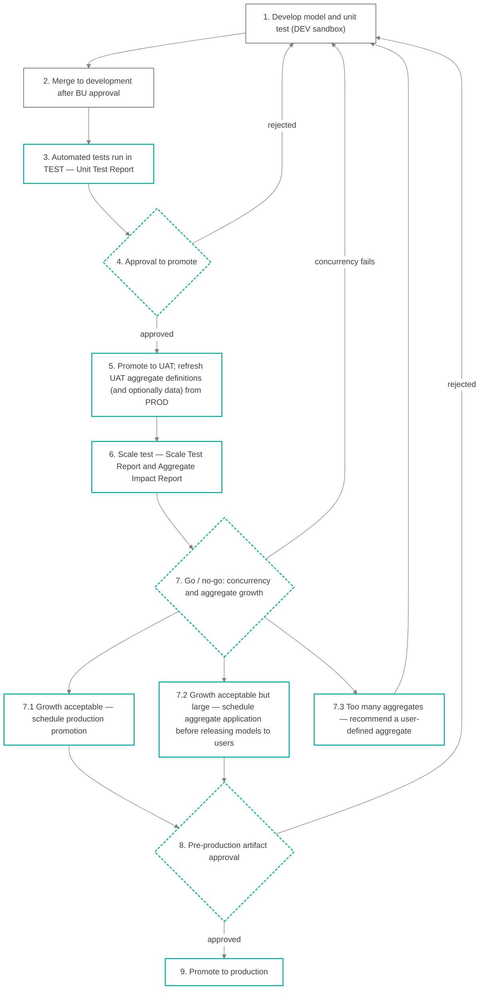
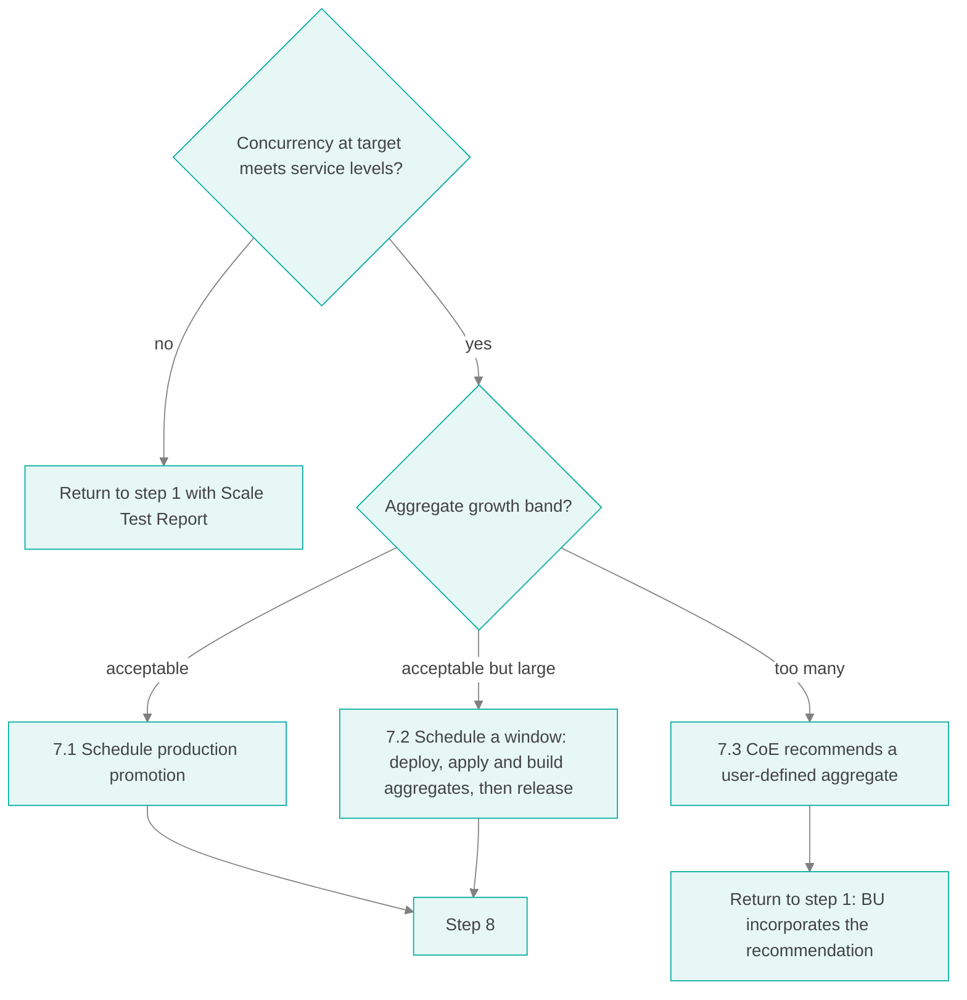

# CoE Workflows and Responsibilities

Level 1 — The ownership, approval, and authorization contract between the Semantic CoE and its business units

## Table of Contents

- [About This Document](#about-this-document)
- [Terms of the Contract](#terms-of-the-contract)
- [Parties and Roles](#parties-and-roles)
- [Environments and Their Owners](#environments-and-their-owners)
- [Business Process and Technical Subsystems](#business-process-and-technical-subsystems)
- [The Promotion Workflow](#the-promotion-workflow)
- [Step 1 — Develop the Model and Unit Test](#step-1--develop-the-model-and-unit-test)
- [Step 2 — Merge to the Development Branch](#step-2--merge-to-the-development-branch)
- [Step 3 — Automated Tests](#step-3--automated-tests)
- [Step 4 — Approval to Promote](#step-4--approval-to-promote)
- [Step 5 — Promote to UAT and Refresh from Production](#step-5--promote-to-uat-and-refresh-from-production)
- [Step 6 — Scale Test](#step-6--scale-test)
- [Step 7 — Go / No-Go Decision](#step-7--go--no-go-decision)
- [Step 8 — Pre-Production Artifact Approval](#step-8--pre-production-artifact-approval)
- [Step 9 — Promote to Production](#step-9--promote-to-production)
- [Artifact Register](#artifact-register)
- [Responsibility Matrix](#responsibility-matrix)
- [Authorization Matrix](#authorization-matrix)
- [Exceptions](#exceptions)
- [Service Levels and Escalation](#service-levels-and-escalation)

## About This Document

[Level 0](COE_IMPLEMENTATION_LEVEL0.md) recommends a hub-and-spoke structure: business units (the spokes) build their own semantic models, and the Semantic Center of Excellence (the hub) owns the shared platform, standards, and promotion to shared environments. It also warns that hub-and-spoke fails when the boundary between hub and spoke is not written down.

This document writes that boundary down. For every step between a model change and production, it states:

- **who owns the step** — who performs it and is accountable for its outcome,
- **who approves it** — whose decision allows the change to move forward,
- **who is authorized** — who holds the technical permission to carry it out, and
- **what evidence it produces** — the artifact that proves the step happened and what it found.

[Level 2](COE_SYSTEM_STRUCTURE_LEVEL2.md) describes how the repository, automation, and environments enforce this contract.

## Terms of the Contract

The contract rests on three distinct ideas. Keeping them separate is what makes the workflow auditable.

| Term | Meaning | Example |
|------|---------|---------|
| **Ownership** | The party that performs a step and is accountable for its outcome | The business unit owns the business logic of its model |
| **Approval** | A recorded decision, by a named role, that a step's exit criteria are met and the change may proceed | The model owner approves a merge to the development branch |
| **Authorization** | The technical permission, enforced by the system, to execute a step | Only the CoE release manager can deploy to production |

Five principles follow from these terms:

1. **Nothing reaches a governed environment (TEST, UAT, PROD) without an approval on record.** Approvals are recorded in the source control system, not in email or chat. The DEV sandbox is deliberately ungoverned.
2. **Ownership does not imply authorization.** A business unit owns its model's content but is not authorized to deploy it to UAT or production. The CoE is authorized to deploy but does not change a business unit's business logic.
3. **Joint decisions require both parties.** Where this document says "BU + CoE", neither party can proceed alone.
4. **Every gate produces an artifact.** A gate that leaves no evidence did not happen.
5. **Thresholds are agreed before testing, not after.** The concurrency and aggregate-growth limits used in the go / no-go decision are set in advance and published.

## Parties and Roles

| Party | Role | Responsibility in this workflow |
|-------|------|--------------------------------|
| Business unit (BU) | **Model Developer** | Builds and changes models; writes and runs unit tests |
| Business unit | **Model Owner** | Accountable for the BU's models; approves merges and co-approves promotion |
| Business unit | **Business Analyst** | Supplies requirements and expected results; validates numbers |
| CoE | **Semantic Data Architect** | Owns standards and shared dimensions; reviews model design; recommends user-defined aggregates |
| CoE | **Release Manager** | Runs promotions; co-approves promotion; authorizes production deployment |
| CoE | **Performance Engineer** | Runs scale tests; analyzes aggregate growth |
| CoE | **Platform Administrator** | Operates environments; maintains automation, credentials, and environment settings |

One person may hold several roles, but **the same person may not both author a change and be its only approver** at any gate.

## Environments and Their Owners

| Environment | Purpose | Content owner | Operated by | Deployed from |
|-------------|---------|---------------|-------------|---------------|
| DEV (sandbox) | Experimentation: authoring, trying, breaking, and fixing a change; running unit tests informally | BU | Platform: CoE. Deployments: BU, self-service | Feature branches, each under its own deployment name |
| TEST | Unit validation: every change merged to `development` is deployed and tested automatically | BU | CoE | `development` branch |
| UAT | Production-like validation; scale testing | CoE | CoE | `main` branch |
| PROD | Live business use | CoE (platform), BU (model meaning) | CoE | `prod` branch |

```mermaid
%%{init: {"theme":"base","themeVariables":{"fontFamily":"Signika, Segoe UI, Helvetica, Arial, sans-serif","background":"#FFFFFF","primaryColor":"#E6F7F5","primaryBorderColor":"#00AB9F","primaryTextColor":"#434343","secondaryColor":"#F4F4F4","secondaryBorderColor":"#CCCCCC","secondaryTextColor":"#434343","tertiaryColor":"#FFFFFF","tertiaryBorderColor":"#CCCCCC","tertiaryTextColor":"#434343","lineColor":"#808080","textColor":"#808080","mainBkg":"#E6F7F5","nodeBorder":"#00AB9F","clusterBkg":"#F7F7F7","clusterBorder":"#CCCCCC","titleColor":"#808080","edgeLabelBackground":"#FFFFFF","actorBkg":"#E6F7F5","actorBorder":"#00AB9F","actorTextColor":"#434343","actorLineColor":"#808080","signalColor":"#808080","signalTextColor":"#808080","labelBoxBkgColor":"#E6F7F5","labelBoxBorderColor":"#00AB9F","labelTextColor":"#434343","loopTextColor":"#808080","noteBkgColor":"#F4F4F4","noteBorderColor":"#CCCCCC","noteTextColor":"#434343","activationBkgColor":"#E6F7F5","activationBorderColor":"#00AB9F","sequenceNumberColor":"#FFFFFF","git0":"#00AB9F","git1":"#A6A6A6","git2":"#7FD5CF","git3":"#BFBFBF","git4":"#00766E","git5":"#B3B3B3","git6":"#4DC4BC","git7":"#8C8C8C","gitBranchLabel0":"#FFFFFF","gitBranchLabel1":"#000000","gitBranchLabel2":"#000000","gitBranchLabel3":"#000000","gitBranchLabel4":"#FFFFFF","gitBranchLabel5":"#000000","gitBranchLabel6":"#000000","gitBranchLabel7":"#000000","commitLabelColor":"#000000","commitLabelBackground":"#FFFFFF","tagLabelColor":"#434343","tagLabelBackground":"#E6F7F5","tagLabelBorder":"#00AB9F"}}}%%
flowchart LR
    DEV["DEV (sandbox) — BU self-service, no gates"] -->|"step 2: merge to development (BU approval)"| TEST["TEST — unit validation"]
    TEST -->|"step 4: joint approval"| UAT["UAT — scale validation"]
    UAT -->|"step 8: joint approval"| PROD["PROD"]
```

The four environments separate four different jobs:

- **DEV is a sandbox.** Modelers deploy to it freely, as often as they like, to explore data, try designs, and fix problems before anyone reviews anything. It produces no evidence and carries no service level; it may be reset at any time. Because nothing is approved there, nothing that happens there counts toward promotion.
- **TEST is where evidence begins.** Only automation deploys to it, and only what the Model Owner has approved into `development`. Keeping it free of experiments is what makes a failing test mean "the approved change is wrong" rather than "someone was trying something".
- **UAT is deliberately owned by the CoE.** It is a shared, production-like environment whose value depends on nobody changing it outside the workflow.
- **PROD** serves the business.

Each business unit may have its own DEV sandbox (for example, its own namespace or project), while TEST, UAT, and PROD are shared and governed. Where possible, DEV and TEST run on the same synthetic dataset, so unit tests that pass in a modeler's sandbox are testing against the same data the automated run will use — see the [Validation Harness](VALIDATION_HARNESS.md).

## Business Process and Technical Subsystems

Every step has a business side (a decision someone makes) and a technical side (a system that does something). This document keeps both visible so that neither is mistaken for the other: a passing automated test is not a business approval, and a business approval does not deploy anything.

```mermaid
%%{init: {"theme":"base","themeVariables":{"fontFamily":"Signika, Segoe UI, Helvetica, Arial, sans-serif","background":"#FFFFFF","primaryColor":"#E6F7F5","primaryBorderColor":"#00AB9F","primaryTextColor":"#434343","secondaryColor":"#F4F4F4","secondaryBorderColor":"#CCCCCC","secondaryTextColor":"#434343","tertiaryColor":"#FFFFFF","tertiaryBorderColor":"#CCCCCC","tertiaryTextColor":"#434343","lineColor":"#808080","textColor":"#808080","mainBkg":"#E6F7F5","nodeBorder":"#00AB9F","clusterBkg":"#F7F7F7","clusterBorder":"#CCCCCC","titleColor":"#808080","edgeLabelBackground":"#FFFFFF","actorBkg":"#E6F7F5","actorBorder":"#00AB9F","actorTextColor":"#434343","actorLineColor":"#808080","signalColor":"#808080","signalTextColor":"#808080","labelBoxBkgColor":"#E6F7F5","labelBoxBorderColor":"#00AB9F","labelTextColor":"#434343","loopTextColor":"#808080","noteBkgColor":"#F4F4F4","noteBorderColor":"#CCCCCC","noteTextColor":"#434343","activationBkgColor":"#E6F7F5","activationBorderColor":"#00AB9F","sequenceNumberColor":"#FFFFFF","git0":"#00AB9F","git1":"#A6A6A6","git2":"#7FD5CF","git3":"#BFBFBF","git4":"#00766E","git5":"#B3B3B3","git6":"#4DC4BC","git7":"#8C8C8C","gitBranchLabel0":"#FFFFFF","gitBranchLabel1":"#000000","gitBranchLabel2":"#000000","gitBranchLabel3":"#000000","gitBranchLabel4":"#FFFFFF","gitBranchLabel5":"#000000","gitBranchLabel6":"#000000","gitBranchLabel7":"#000000","commitLabelColor":"#000000","commitLabelBackground":"#FFFFFF","tagLabelColor":"#434343","tagLabelBackground":"#E6F7F5","tagLabelBorder":"#00AB9F"}}}%%
flowchart LR
    subgraph BP["Business process"]
        direction TB
        B1["Requirement and acceptance criteria"]
        B2["BU approval to merge"]
        B3["Joint approval to promote"]
        B4["Go / no-go decision"]
        B5["Pre-production artifact approval"]
        B1 --> B2 --> B3 --> B4 --> B5
    end
    subgraph TS["Technical subsystems"]
        direction TB
        T1["Source control: branches, pull requests, protections"]
        T2["CI pipeline: validation and automated tests"]
        T3["Deployment automation"]
        T4["Aggregate export and import"]
        T5["Query harness: scale testing"]
        T1 --> T2 --> T3 --> T4 --> T5
    end
    B2 -.->|"recorded as PR approval in"| T1
    T2 -.->|"produces evidence for"| B3
    B3 -.->|"triggers"| T3
    T5 -.->|"produces evidence for"| B4
```

## The Promotion Workflow

Grey outline: business unit owns the step. Teal outline: CoE owns the step. Dashed teal outline: joint decision.

### Summary

| Step | Name | Owner | Approver | Authorized to execute | Artifact |
|------|------|-------|----------|----------------------|----------|
| 1 | Develop model and unit test | BU | — | Model Developer | Unit test definitions; change description |
| 2 | Merge to development | BU | Model Owner | Model Owner | Merge approval record |
| 3 | Automated tests | CoE | — (automated) | CI pipeline | **Unit Test Report** |
| 4 | Approval to promote | BU + CoE | Model Owner and Release Manager | Release Manager | Promotion approval record |
| 5 | Promote to UAT; refresh from PROD | CoE | — | Release Manager, Platform Administrator | UAT Refresh Record |
| 6 | Scale test | CoE | — | Performance Engineer | **Scale Test Report**; **Aggregate Impact Report** |
| 7 | Go / no-go | CoE, consulting BU | Release Manager and Semantic Data Architect | — | Go / No-Go Decision Record |
| 8 | Pre-production artifact approval | BU + CoE | Model Owner and Release Manager | — | Signed artifact register |
| 9 | Promote to production | CoE | — (approved at step 8) | Release Manager | Production Deployment Record |

## Step 1 — Develop the Model and Unit Test

**Owner:** Business unit. **Approver:** none — this step ends when the developer requests a merge. **Authorized:** Model Developer, on a feature branch and in the DEV sandbox.

| | |
|---|---|
| Business process | The Business Analyst supplies the requirement and the expected results — the numbers a correct model must return. The Model Developer implements the change within CoE standards, building on shared dimensions rather than redefining them. |
| Technical subsystem | Feature branch in the model repository; the DEV sandbox, where the developer deploys the branch under its own deployment name and runs the unit tests as often as needed; local validation tooling. |
| Entry criteria | A tracked requirement with acceptance criteria and a named Model Owner. |
| Exit criteria | Model validates without errors; unit tests written and passing in the DEV sandbox; change description complete. |
| Artifacts | Unit test definitions (queries with expected results), committed with the model. Change description: what changed, why, which reports are affected, and any breaking changes. |

**Unit tests are the BU's statement of correctness.** They are queries whose expected results the business has agreed to. The CoE does not write them, because only the business unit can say what a correct number is. The developer runs them in DEV while working; the CoE runs them, the same way every time, in TEST from step 3 onward.

**The CoE's role here** is advisory: office hours, design review on request, and — when a change is returning from step 7.3 — the user-defined aggregate recommendation.

## Step 2 — Merge to the Development Branch

**Owner:** Business unit. **Approver:** Model Owner. **Authorized:** Model Owner, through a pull request.

| | |
|---|---|
| Business process | The Model Owner reviews the change against the requirement and approves it on the BU's behalf. This is the BU's commitment that the change is what the business asked for. |
| Technical subsystem | Pull request from the feature branch to `development`. Branch protection requires the Model Owner's approval and a passing validation check. The author cannot approve their own pull request. |
| Entry criteria | Step 1 exit criteria met. |
| Exit criteria | Pull request approved by the Model Owner and merged. |
| Artifact | Merge approval record — the approved pull request, with reviewer, time, and the exact change. |

The CoE does not approve merges to `development`. `development` is the BU's integration branch, and requiring hub approval here would recreate the centralized bottleneck that Level 0 warns against. The CoE's protection comes at steps 3 and 4.

## Step 3 — Automated Tests

**Owner:** CoE. **Approver:** none — the automated result is the evidence for step 4. **Authorized:** the CI pipeline, using credentials the CoE controls.

| | |
|---|---|
| Business process | None. This step converts the BU's claims into evidence. |
| Technical subsystem | On merge, the pipeline deploys `development` to TEST, validates the deployed models, runs every unit test and the CoE's standard regression suite, checks that every metric and hierarchy level is covered by a unit test, and publishes the results. |
| Entry criteria | Merge to `development`. |
| Exit criteria | Unit Test Report published. A failing report does not block the pipeline from recording it, but it blocks step 4. |
| Artifact | **Unit Test Report** — model validation results, per-test pass or fail with expected and actual values, regression suite results, coverage of metrics and levels, and the exact revision tested. |

The [Validation Harness](VALIDATION_HARNESS.md#workflow-1--unit-validation) describes this step, including coverage and comparison analysis, in detail. The CoE owns this step because it owns the test automation, the TEST credentials, and the regression suite that protects every other business unit. The BU owns the content of its unit tests; the CoE owns running them the same way every time.

## Step 4 — Approval to Promote

**Owner:** BU + CoE, jointly. **Approvers:** Model Owner **and** Release Manager. **Authorized:** Release Manager, through a pull request from `development` to `main`.

| | |
|---|---|
| Business process | The Model Owner confirms the change is complete and wanted in UAT. The Release Manager confirms the Unit Test Report is clean, the change meets CoE standards, and UAT capacity is available. Either party may reject. |
| Technical subsystem | Pull request from `development` to `main`. Branch protection requires two approvals from two groups: the owning BU and the CoE release group. |
| Entry criteria | Passing Unit Test Report for the exact revision being promoted. |
| Exit criteria | Both approvals recorded. |
| Artifact | Promotion approval record — the approved pull request, with both approvers and the linked Unit Test Report. |

**Why joint:** the BU knows whether the change is right; only the CoE knows whether UAT is ready for it and whether it meets standards. Promotion to a shared environment affects every business unit, so neither party decides alone.

**Rejection** returns the change to step 1 with the reason recorded on the pull request.

## Step 5 — Promote to UAT and Refresh from Production

**Owner:** CoE. **Approver:** none — approved at step 4. **Authorized:** Release Manager and Platform Administrator.

| | |
|---|---|
| Business process | None. The CoE prepares a faithful rehearsal of production. |
| Technical subsystem | Merge to `main` deploys to UAT. Before the scale test, the CoE refreshes UAT's aggregate definitions from production so that UAT starts from the same aggregate state production is in. Where data volume or distribution matters to the test, the CoE also refreshes UAT data — from production, or from synthetic data that is statistically faithful to production. |
| Entry criteria | Promotion approval recorded. |
| Exit criteria | UAT running the promoted revision, with production aggregate definitions applied and built. |
| Artifact | UAT Refresh Record — the revision deployed, the production aggregate export applied (source, time, count), and the data refresh method used. |

**Why refresh aggregates from production:** the purpose of the scale test is to measure what *this change* will do to production. If UAT starts with no aggregates, every aggregate looks new, and the test measures a cold start rather than the change. If UAT's aggregates have drifted from production's, the growth measurement is meaningless. Starting from production's aggregate definitions isolates the effect of the change.

**Production aggregates the change invalidates.** Production aggregate definitions that reference objects the change removed or renamed cannot be applied to the new revision and are skipped. The UAT Refresh Record lists them. They are part of the change's impact: those queries will need new aggregates in production.

**Why data may also need refreshing:** aggregate creation and query performance depend on data volume and distribution. A UAT warehouse with a small fraction of production volume can pass a scale test that production would fail.

## Step 6 — Scale Test

**Owner:** CoE. **Approver:** none — the reports are the evidence for step 7. **Authorized:** Performance Engineer.

| | |
|---|---|
| Business process | None. The CoE measures. |
| Technical subsystem | The query harness replays a representative workload — production query history plus queries covering the change — against UAT at the agreed concurrency levels. The CoE records response times and errors, then compares UAT's aggregate set after the test with the production baseline applied at step 5. |
| Entry criteria | UAT Refresh Record complete. |
| Exit criteria | Both reports published. |
| Artifacts | **Scale Test Report** — concurrency levels tested; response time distribution (median, 95th, and 99th percentile) at each level; error and timeout rates; comparison with the previous release's baseline. **Aggregate Impact Report** — aggregate count in the production baseline and after the test, the growth by model, estimated build time and storage, and the queries responsible for new aggregates. |

The [Validation Harness](VALIDATION_HARNESS.md#workflow-2--scale-validation) describes steps 5 and 6 in detail, including data strategies for UAT.

## Step 7 — Go / No-Go Decision

**Owner:** CoE, consulting the BU. **Approvers:** Release Manager **and** Semantic Data Architect. **Authorized:** — (a decision, not an execution).

A change must pass **both** tests to proceed.

1. **Concurrency.** At the agreed target concurrency, response times meet the published service levels and errors are within tolerance. A concurrency failure returns the change to step 1 with the Scale Test Report attached.
2. **Aggregate growth.** The change's aggregate growth falls into one of three bands.

### 7.1 Growth Acceptable — Schedule Production Promotion

The change adds few enough aggregates that production can create them in normal operation without affecting other models. The Release Manager schedules the production promotion in the next release window.

### 7.2 Growth Acceptable but Large — Apply Aggregates First

The change is sound but creates enough new aggregates that building them on demand in production would load the warehouse and leave users with slow queries until the aggregates exist. The CoE schedules **aggregate application before the model is released to users**. The aggregate definitions validated in UAT are exported. In a scheduled low-traffic window, the model revision is deployed to production, the UAT aggregate definitions are applied immediately, and the aggregates are built. The release is announced, and the business unit directs users to the change, only after the build has completed and been verified. Users meet the new model with its aggregates already in place.

The platform accepts aggregate definitions only for a model that is already deployed, so the model and its aggregates land in the same window. What is scheduled ahead is the window itself, the build capacity, and the verification — not a separate earlier deployment.

### 7.3 Too Many Aggregates — Recommend a User-Defined Aggregate

The change would create more aggregates than the platform should carry. This is a design problem, not a capacity problem. The Semantic Data Architect analyzes the queries that produced the growth and recommends a **user-defined aggregate (UDA)**: a deliberately designed aggregate that serves those queries with one structure instead of many system-generated ones. The change returns to step 1. The BU incorporates the recommendation — the model is the BU's — and the change goes through the full workflow again.

A user-defined aggregate is part of the model definition itself, so it is reviewed, tested, and promoted with the model like any other change. The system-generated aggregates it replaces stop being created once it is in place.

### Thresholds

The CoE publishes the thresholds that define each band and the target concurrency, and reviews them quarterly. Set them from production telemetry, not intuition. The values below are **illustrative starting points only**:

| Measure | Acceptable (7.1) | Acceptable but large (7.2) | Too many (7.3) |
|---------|------------------|----------------------------|----------------|
| New aggregates from the change, as a share of the production baseline | Under 5% | 5% to 20% | Over 20% |
| New aggregates from the change, absolute | Under 25 | 25 to 150 | Over 150 |
| Estimated build time for new aggregates | Within normal build schedule | Needs a dedicated window | Exceeds the available window |

| Measure | Pass |
|---------|------|
| Target concurrency | Observed production peak concurrency, multiplied by an agreed growth factor (for example 1.5) |
| 95th percentile response time at target concurrency | Within the published service level for the model |
| Error and timeout rate at target concurrency | Under an agreed tolerance (for example 0.5%) |

Whichever measure falls in the worst band determines the outcome.

| | |
|---|---|
| Artifact | **Go / No-Go Decision Record** — the outcome (7.1, 7.2, 7.3, or concurrency failure), the thresholds applied, the evidence referenced, both approvers, and, for 7.3, the user-defined aggregate recommendation. |

## Step 8 — Pre-Production Artifact Approval

**Owner:** BU + CoE, jointly. **Approvers:** Model Owner **and** Release Manager. **Authorized:** — (a decision recorded on the production pull request).

Before anything reaches production, both parties review and approve the complete artifact set. This is the final gate, and its purpose is to make the production decision on evidence that has been gathered and reviewed in one place.

| # | Artifact | Produced at | Reviewed by | Required |
|---|----------|-------------|-------------|----------|
| 1 | Change description and release notes, including breaking changes | Step 1, updated at step 8 | Model Owner, Release Manager | Always |
| 2 | Merge approval record | Step 2 | Release Manager | Always |
| 3 | Unit Test Report | Step 3 | Model Owner, Release Manager | Always |
| 4 | Promotion approval record | Step 4 | — (record only) | Always |
| 5 | UAT Refresh Record | Step 5 | Release Manager | Always |
| 6 | Scale Test Report | Step 6 | Release Manager, Model Owner | Always |
| 7 | Aggregate Impact Report | Step 6 | Semantic Data Architect | Always |
| 8 | Go / No-Go Decision Record | Step 7 | Model Owner | Always |
| 9 | Aggregate application plan: the aggregate export, target, build window, and completion check | Step 7.2 | Release Manager, Platform Administrator | Outcome 7.2 only |
| 10 | Environment settings manifest for production | Step 8 | Platform Administrator | Always |
| 11 | Deployment schedule and communication plan | Step 8 | Model Owner, Release Manager | Always |
| 12 | Rollback plan | Step 8 | Release Manager, Platform Administrator | Always |

**Exit criteria:** every required artifact is present, reviewed, and approved by both the Model Owner and the Release Manager on the production pull request. A missing artifact is a rejection, not a waiver.

## Step 9 — Promote to Production

**Owner:** CoE. **Approver:** none — approved at step 8. **Authorized:** Release Manager only.

| | |
|---|---|
| Business process | The Model Owner communicates the change to the business unit's users according to the communication plan. |
| Technical subsystem | The pull request from `main` to `prod` is merged, and the deployment to production waits for the Release Manager's approval in the deployment system before it runs. For outcome 7.2, the approved aggregate definitions are applied immediately after deployment and built, and the build must complete before release is announced. After deployment, the validation suite runs against production. |
| Entry criteria | Step 8 approval; release window reached. |
| Exit criteria | Deployment succeeded; for 7.2, aggregate build complete; post-deployment validation passed. |
| Artifact | Production Deployment Record — the revision deployed, the time, the approver, post-deployment validation results, and, for 7.2, the aggregate build confirmation. |

If post-deployment validation fails, the Release Manager executes the rollback plan and notifies the Model Owner.

## Artifact Register

| Artifact | Step | Producer | Owner | Retained for |
|----------|------|----------|-------|--------------|
| Unit test definitions | 1 | Model Developer | BU | Life of the model (in the repository) |
| Change description / release notes | 1, 8 | Model Developer | BU | Life of the repository |
| Merge approval record | 2 | Source control | BU | Life of the repository |
| Unit Test Report | 3 | CI pipeline | CoE | At least one year |
| Promotion approval record | 4 | Source control | CoE | Life of the repository |
| UAT Refresh Record | 5 | Release Manager | CoE | At least one year |
| Scale Test Report | 6 | Performance Engineer | CoE | At least one year; the latest is the baseline for the next release |
| Aggregate Impact Report | 6 | Performance Engineer | CoE | At least one year |
| Go / No-Go Decision Record | 7 | Release Manager | CoE | Life of the repository |
| Aggregate application plan | 7.2 | Release Manager | CoE | At least one year |
| Environment settings manifest | 8 | Platform Administrator | CoE | Life of the repository |
| Rollback plan | 8 | Release Manager | CoE | Until the next release |
| Production Deployment Record | 9 | Deployment automation | CoE | Life of the repository |

## Responsibility Matrix

R = responsible (does the work), A = accountable (one per step), C = consulted, I = informed.

| Step | Model Developer | Model Owner | Business Analyst | Semantic Data Architect | Release Manager | Performance Engineer | Platform Administrator |
|------|:---:|:---:|:---:|:---:|:---:|:---:|:---:|
| 1. Develop and unit test | R | A | C | C | | | |
| 2. Merge to development | R | A | C | | I | | |
| 3. Automated tests | I | I | | | A | | R |
| 4. Approval to promote | I | R | | C | A | | |
| 5. Promote to UAT and refresh | | I | | | A | | R |
| 6. Scale test | | I | | C | A | R | C |
| 7. Go / no-go | | C | | R | A | C | |
| 7.3 UDA recommendation | C | I | | A | I | C | |
| 8. Pre-production approval | | R | | C | A | C | C |
| 9. Promote to production | | I | I | | A | | R |

## Authorization Matrix

Authorization is enforced by the system, not by agreement. Level 2 describes the enforcement.

| Action | Model Developer | Model Owner | Release Manager | Platform Administrator | CI / deployment automation |
|--------|:---:|:---:|:---:|:---:|:---:|
| Push to a feature branch | Yes | Yes | | | |
| Approve a merge to `development` | | Yes | | | |
| Approve a merge to `main` (promote to UAT) | | Yes, and | Yes | | |
| Approve a merge to `prod` (production) | | Yes, and | Yes | | |
| Push directly to `development`, `main`, or `prod` | | | | | |
| Deploy to DEV (sandbox) | Yes, self-service | Yes, self-service | | | Optional |
| Deploy to TEST | | | | | Yes, on merge to `development` |
| Deploy to UAT | | | | | Yes, on merge to `main` |
| Deploy to PROD | | | Approves the deployment | | Yes, after approval |
| Export or import aggregates in UAT or PROD | | | Yes | Yes | Yes |
| Change environment settings in UAT or PROD | | | | Yes | |
| Change the pipeline or branch protections | | | | Yes, with CoE lead approval | |

"Yes, and" means both approvals are required. Nobody pushes directly to a permanent branch.

## Exceptions

### Production Hotfix

A defect in production that cannot wait for the next release follows a shortened path. A hotfix branch is cut from `prod`, tested automatically in TEST under its own deployment name (so the `development` deployment there is undisturbed), and — for anything beyond a minimal, targeted fix — validated in UAT. It requires the same joint approval as step 8, then merges to `prod`, and is immediately merged back into `main` and `development` so the fix is not lost at the next release. Hotfixes are for confirmed production defects only; improvements, however small, take the normal path. Level 2 describes the branch mechanics.

### Standards Exceptions

A BU that needs to depart from a CoE standard requests an exception from the Semantic Data Architect before step 4. Approved exceptions are recorded with the change and reviewed quarterly.

### Rejected Promotions

A change rejected at steps 4, 7, or 8 returns to step 1. The rejecting party records the reason and the evidence on the pull request. A BU that disagrees with a rejection escalates as described below. The change does not proceed while the escalation is open.

### Rollback

Production rollback is authorized for the Release Manager without further approval, because restoring the last approved state is always within policy. The Release Manager notifies the Model Owner, and the change re-enters the workflow at step 1.

## Service Levels and Escalation

The hub commits to turnaround times so that the spokes can plan. Publish targets such as the following and report against them:

| Step | CoE commitment (illustrative) |
|------|-------------------------------|
| 3. Automated tests in TEST | Report published within one hour of merge |
| 4. Approval to promote | CoE decision within two business days of request |
| 5–6. UAT refresh and scale test | Complete within five business days of promotion approval |
| 7. Go / no-go | Decision within one business day of the reports |
| 7.3 UDA recommendation | Within five business days of the decision |
| 9. Production promotion | In the next scheduled release window |

Disagreements escalate in this order: Model Owner and Release Manager; then the BU leader and the CoE lead; then the executive sponsor, whose decision is final.
