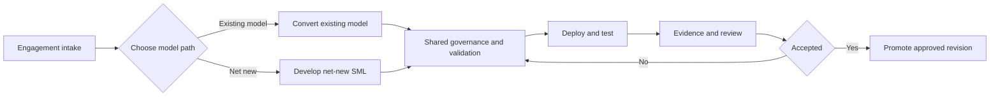

# AtScale Professional Services SML Delivery Workflows

## Purpose and audience

This collection gives Professional Services consultants, technical reviewers, and customer stakeholders a repeatable, evidence-based process for delivering an AtScale SML semantic model. It supports two paths:

- [Workflow 01 — Existing Semantic Model Conversion to SML](workflow-01-existing-model-conversion.md)
- [Workflow 02 — Net-New SML Development](workflow-02-net-new-sml-development.md)

The paths begin with different inputs, then converge on the same governance, validation, deployment, testing, evidence, acceptance, and promotion gates. These runbooks define delivery controls; they do not claim that PS-Utils or AtScale enforces every control automatically.

## Workflow selection

Choose Workflow 01 only when the source type is supported by a verified converter. Otherwise use Workflow 02 and treat any source model as requirements and comparison evidence rather than as converter input.

## Workflow comparison

| Workflow 01 — Conversion | Workflow 02 — Net-new |
| --- | --- |
| Inventory an existing semantic model | Capture requirements and metric contracts |
| Select and run a supported converter | Profile warehouse structures and source data |
| Reconcile source objects to generated SML | Design and author the semantic model |
| Remediate unsupported or changed objects | Trace requirements to SML objects |
| Demonstrate conversion parity and exceptions | Trace metrics to validation tests |

## Shared lifecycle

**Commit → Synchronize and reconcile → Validate → Review exact revision → Deploy and compile → Runtime test → BI test → Report → Accept → Promote**

| Term | Meaning |
| --- | --- |
| Commit | Record model-source changes in Git history. |
| Synchronize/Pull | Retrieve and reconcile changes made by other contributors. |
| Validate | Evaluate a revision at a named structural, semantic, compilation, runtime, BI, or acceptance gate. |
| Deploy | Publish a selected revision into an AtScale environment. |
| Promote | Advance an approved and identified revision to another controlled environment. |

These terms are not interchangeable. In particular, a local commit is not proof of synchronization, static validation is not deployment, and deployment is not runtime or business acceptance.

## Shared governance controls

The following are recommended delivery controls. They are process requirements unless the engagement's approved environment policy states otherwise:

- Work on an independent feature branch.
- Use unique development deployment or model names when concurrent work could collide.
- Permit isolated development deployment and testing only when environment policy allows it.
- Synchronize and reconcile incoming changes before shared validation, review, acceptance, or promotion.
- Resolve Git conflicts before promotion.
- Review and deploy an exact Git commit SHA.
- Ensure the deployed revision is traceable to the approved commit.
- Include version-controlled settings changes in the reviewed diff.
- Do not promote an unidentified local working state.
- Stop shared validation or promotion when the branch, commit, working tree, or AtScale Source Control state is inconsistent.

### Enforcement boundary

Git branch protections, required reviews, deployment-environment protections, and customer environment policy may enforce some controls. Current PS-Utils operations can validate SML, publish a catalog, and produce test evidence, but the operations do not prove that a working tree was synchronized or bind every deployment automatically to an approved commit SHA. No evidence in this repository establishes that AtScale automatically synchronizes before every deployment.

Do not infer a default or required behavior for `catalog.deployment.uncommitted.enabled` from these runbooks. If AtScale Source Control appears stale, inconsistent, or to contain phantom state, stop shared validation and promotion. Capture reproducible evidence, including branch, commit, working-tree status, AtScale repository state, timestamps, and logs, then request Product or Support review. Do not clear an index or internal database as a routine corrective step.

## Shared validation boundaries

Each gate answers a different question and must be reported separately:

| Gate | Question answered | Typical evidence |
| --- | --- | --- |
| 1. Input completeness | Are required source artifacts, requirements, access, owners, and acceptance criteria present? | Intake checklist and approved scope |
| 2. Structural/YAML validation | Can the YAML be parsed and do local object references resolve? | Local structural results from [`atscale-list-model-errors`](../../README.md#atscale-list-model-errors) or another approved parser |
| 3. Static semantic SML validation | Are detectable semantic references and engine rules valid? | Named static or engine validation result |
| 4. Pull-request and Git-diff review | Is the intended exact revision reviewed, including settings? | PR or equivalent review record and commit SHA |
| 5. AtScale compilation | Does AtScale compile the selected revision without blocking errors? | AtScale compile or model-error output tied to the revision |
| 6. Deployment to an AtScale environment | Was that revision published to the named environment? | Deployment response, environment, model name, and timestamp |
| 7. Warehouse-connected query execution | Does the deployed model execute against the intended warehouse and data? | Query results and errors |
| 8. Golden-query or regression testing | Do results match an approved expected result or comparison basis? | Baseline, comparison, tolerances, and exceptions |
| 9. BI-tool validation | Do in-scope BI tools connect and behave correctly? | Tool-specific test record |
| 10. Performance or scale testing when required | Does the model meet agreed nonfunctional expectations? | Load profile, timings, data state, and thresholds |
| 11. Customer/UAT review | Has the authorized stakeholder accepted the documented result and exceptions? | Acceptance record |
| 12. Promotion approval | May the exact accepted revision advance to the target environment? | Approval, source SHA, target, and promoted revision |

For every result, state what was tested, which tool performed the test, which Git revision was tested, which environment was used, where the evidence is retained, and what the result does not prove. Never use “validation passed” as a blanket statement for multiple gates.

## Common evidence contract

Retained evidence must include, at minimum:

- Customer-neutral engagement or model identifier
- Workflow type
- Repository and branch
- Exact Git commit SHA
- AtScale environment
- AtScale version
- PS-Utils version or commit
- Operation and parameters used, with secrets removed
- Execution timestamp
- Evidence location
- Result at the named gate
- Known limitations and exceptions
- Reviewer and approval status
- Promoted revision and target environment, when applicable
- Test-data fingerprint and seed, when available

Generated files alone are insufficient if this metadata is absent. Store evidence according to the engagement's approved retention and data-handling policy.

## Improvement backlog

These are improvement opportunities, not claims that a defect has been confirmed.

| Finding | Classification | Current evidence | Current state | Proposed next action |
| --- | --- | --- | --- | --- |
| Complete source-to-output reconciliation | **PS-Utils enhancement** | Source and SML report operations exist, and Tabular emits `CONVERSION_REPORT.md`/`.json`, but no common cross-format object-reconciliation manifest covers every converter. | Partially automated | Define a stable source-object manifest and object-level reconciliation schema shared by all converters. |
| Explicit skipped-calculation reporting | **PS-Utils enhancement** | Tabular writes `DEFERRED_MEASURES.md`; AtScale XML and Multidimensional use different omission/notes reporting. | Partially automated | Standardize reason-coded calculation dispositions across converters. |
| Calculation-reference and runtime-compatible expression validation | **PS-Utils enhancement** | Local validation checks structural references; converter-emitted expressions still require compilation and runtime testing. | Gap | Add static reference checks and version-aware expression diagnostics. |
| Generated test-query coverage for calculated metrics | **PS-Utils enhancement** | `generate-queries-from-sml` creates metric-total and level-breakdown queries, but does not provide approved expected results. | Partially automated | Publish coverage metadata and support expected-result associations. |
| Consistent customer evidence-package generation | **PS-Utils enhancement** | Individual operations emit reports and CSV files; no operation assembles the common evidence contract. | Manual today | Define a versioned evidence manifest and package generator. |
| Requirements-to-SML and metric-to-test traceability automation | **PS-Utils enhancement** | No registered operation manages either traceability matrix. | Manual today | Define machine-readable traceability records and validation rules. |
| Synthetic-data generation without an existing model | **PS-Utils enhancement** | Data-shape extraction requires an SML directory or model file. | Not supported by the current workflow | Investigate a DDL- or contract-first fingerprint path. |
| Improved test-harness diagnostics | **PS-Utils enhancement** | Harness, enrichment, and comparison outputs exist, but result triage and business assertions remain separate. | Partially automated | Add clearer failure categories and links to traceability records. |
| Unique development deployment naming | **Best practice or workflow** | `atscale-deploy-catalog` accepts `--project-name`; collision policy is not automated. | Recommended control | Standardize an engagement-safe naming convention. |
| Synchronization before shared validation | **Best practice or workflow** | Current operations do not verify local/remote Git synchronization. | Recommended control | Add a preflight checklist or non-mutating guard. |
| Optional synchronization enforcement before deployment | **Product or feature request** | No repository evidence confirms automatic synchronization before every deployment. | Proposal requiring product review | Define desired policy, override model, and audit behavior. |
| Source Control integrity anomalies | **Product or feature request** | No reproducible case was established during this documentation review. | Potential product defect — reproduction and Product/Support confirmation required | Capture a minimal reproduction and diagnostic bundle; do not clear internal state routinely. |
| Commit versus synchronize versus validate versus deploy versus promote training | **Training or enablement** | Existing guides use the terms across different procedures; the controls are not interchangeable. | Training opportunity | Build role-based enablement from the approved runbooks. |

## Related documentation

| Reference | Boundary |
| --- | --- |
| [Conversion algorithm](../CONVERSION.md) | Implementation details for converting AtScale `project_2_0` XML to SML; it is not the complete PS delivery or acceptance workflow. |
| [Git and promotion strategy](../GIT.md) | Branching, review, and environment-promotion guidance. Example operation names must be checked against the current registry before use. |
| [Specialized migration guide](../MIGRATE.md) | Installer/XML migration, environment setup, BI cutover, and promotion guidance for that migration scenario. |
| [Migration management plan](../MIGRATE_PLAN.md) | Programme-level milestones, risks, decisions, and sign-off responsibilities. |
| [GitHub Actions operation guide](../ACTIONS.md) | How registered operations are invoked through the composite action; it does not replace the lifecycle gates in these runbooks. |
| [Root CLI operation reference](../../README.md#operations) | Current user-facing operation names, parameters, and outputs. Registration and implementation remain authoritative if older examples diverge. |

## Proposed Follow-On Work — Not Included in This Change

The following proposals require committee agreement and are not Patrick requirements for these runbooks.

## Repo-scoped consumer skills

Potential future skills:

- `$atscale-existing-model-conversion`
- `$atscale-net-new-sml-development`

The approved runbooks would remain the authoritative process. Skills would guide consumers through those approved steps, use only verified PS-Utils operations, preserve every evidence and approval boundary, and never silently deploy or promote. Create skills only after the workflows are reviewed and piloted.

## Workflow execution visualization

Proposed order:

1. Native GitHub Actions or Jenkins execution visualization after real CI/CD jobs exist
2. A standard machine-readable workflow-status and evidence manifest
3. An optional cross-repository control tower, possibly Streamlit, after the workflow contract is stable

No skill, CI/CD workflow, dashboard, or live-monitoring implementation is part of this documentation change.
