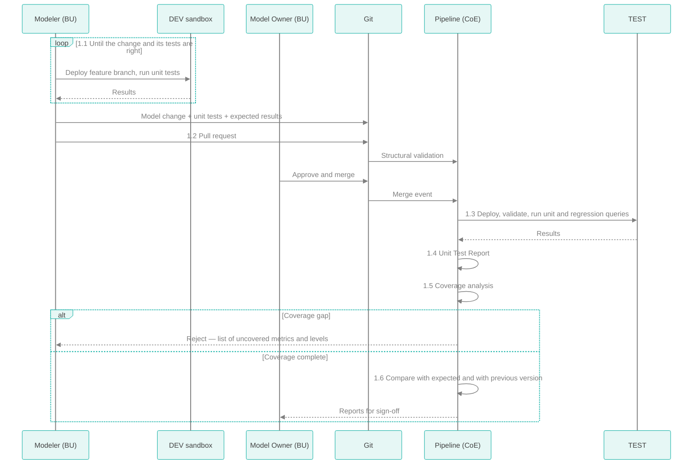
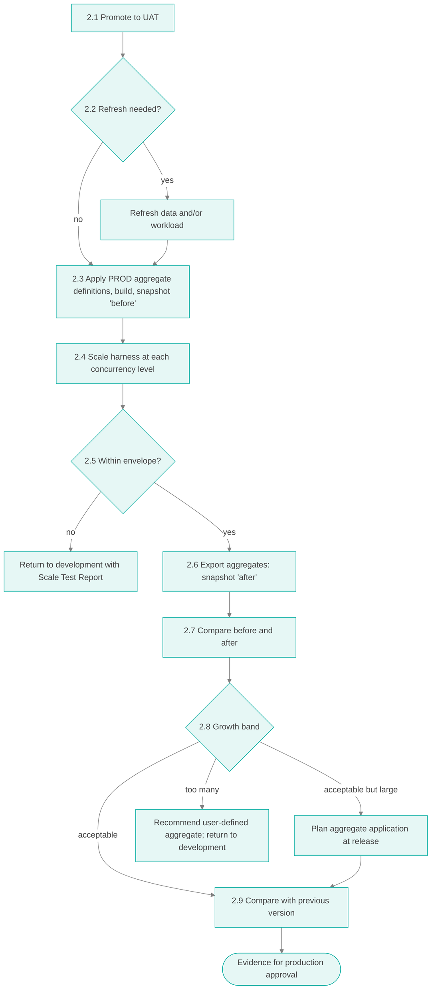
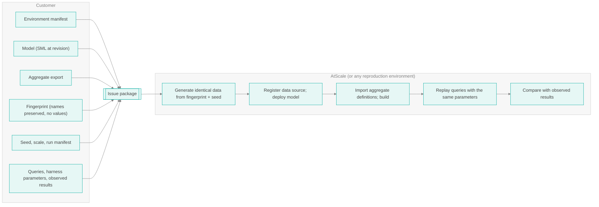

<style>
@import url('https://fonts.googleapis.com/css2?family=Signika:wght@300;400;600;700&display=swap');

body, .markdown-body {
  font-family: "Signika", "Segoe UI", Helvetica, Arial, sans-serif;
  font-weight: 300;
  color: #434343;
  background-color: #FFFFFF;
  line-height: 1.5;
  max-width: 800px;
  margin: 0 auto;
}
h1 { font-family: "Signika", sans-serif; font-weight: 700; color: #434343; font-size: 2em; }
h2 { font-family: "Signika", sans-serif; font-weight: 600; color: #00AB9F; margin-top: 1.6em; }
h3 { font-family: "Signika", sans-serif; font-weight: 700; color: #000000; }
h4, h5, h6 { font-family: "Signika", sans-serif; color: #434343; }
strong, b { color: #000000; }
a { color: #00AB9F; }
code, pre { font-family: "SFMono-Regular", Consolas, "Liberation Mono", monospace; background-color: #FFFFFF; color: #000000; }
ul { list-style-type: disc; }
ul ul { list-style-type: circle; }
li { margin: 0.25em 0; }
hr { display: none; }
blockquote { background-color: #FFFFFF; color: #434343; border-left: 3px solid #00AB9F; margin: 1em 0; padding: 0.25em 1em; }

table { border-collapse: collapse; width: 100%; margin: 1em 0; }
th, td { text-align: left; padding: 0.5em 0.75em; border: none; }
thead th { color: #000000; font-weight: 700; border-bottom: 2px solid #434343; }
tbody tr { border-bottom: 1px solid #CCCCCC; }
tbody tr:last-child { border-bottom: 1px solid #434343; }
</style>

# Validation Harness

Unit validation and scale validation for semantic models — from the case for testing down to the command line

> **This document is incomplete.** It covers validating models through queries issued directly against the semantic layer. It does not yet address **dashboard automation** (validating BI dashboards and reports end to end) or **LLM integration** (validating natural-language and AI-agent access to the semantic layer). Both will be addressed shortly in a revision of this document. Until then, treat BI and LLM validation as manual activities outside the harness.

## Table of Contents

- [About This Document](#about-this-document)
- [Why Validate a Semantic Model](#why-validate-a-semantic-model)
- [The Two Workflows at a Glance](#the-two-workflows-at-a-glance)
- [Workflow 1 — Unit Validation](#workflow-1--unit-validation)
- [Workflow 2 — Scale Validation](#workflow-2--scale-validation)
- [Common Hurdles](#common-hurdles)
- [Choosing a Data Strategy](#choosing-a-data-strategy)
- [Portable, Reproducible Issue Packages](#portable-reproducible-issue-packages)
- [Unit Validation at the Command Line](#unit-validation-at-the-command-line)
- [Scale Validation at the Command Line](#scale-validation-at-the-command-line)
- [Artifacts](#artifacts)
- [Scope and Open Items](#scope-and-open-items)
- [Related Documentation](#related-documentation)

## About This Document

The Semantic Center of Excellence documents define *who* approves a model change and *which* gates it passes: [Level 1](COE_WORKFLOWS_LEVEL1.md) sets out the ownership and approval contract, and [Level 2](COE_SYSTEM_STRUCTURE_LEVEL2.md) the repository and pipelines. This document goes deep on the two gates that produce evidence — **unit validation** and **scale validation** — and on the data those gates run against.

The narrative deepens as it goes:

1. **Why** — the case for testing semantic models, in software engineering terms.
2. **What** — both workflows as diagrams, with owners, artifacts, and value.
3. **With what data** — the hurdles of real data and telemetry, and three data strategies, including a portable synthetic package that reproduces an issue anywhere.
4. **How** — every step at the command line, using ps-utils operations.

### Environments

| Environment | Role in this document |
|-------------|----------------------|
| DEV (sandbox) | Where the modeler builds the change and its unit tests, deploying and running tests freely. No gates, no evidence. |
| TEST | Runs unit validation automatically for every change the Model Owner approves |
| UAT | Runs scale validation; production-like |
| PROD | Source of aggregate definitions, telemetry, and data statistics |

The sandbox and TEST are separate on purpose: experimentation never contaminates test evidence, and test gates never slow down experimentation. See [Level 1 — Environments and Their Owners](COE_WORKFLOWS_LEVEL1.md#environments-and-their-owners).

## Why Validate a Semantic Model

A semantic model is code. Its YAML files define what "net revenue", "active customer", and "fiscal quarter" mean for every dashboard, notebook, and AI agent that queries it. A one-line change to a join, a filter, or an aggregation type changes numbers that executives act on, and nothing in the change itself reveals that the numbers moved.

Semantic modeling is also iterative. Business units change their models continuously, often several at once, against shared dimensions they do not own. That is an agile development process, and agile software engineering solved its version of this problem decades ago: **every change is tested automatically, against expectations written down in advance, before it reaches a shared environment.** Validating semantic models this way is not a new discipline. It is the standard software engineering workflow applied to a new kind of code.

| Software engineering practice | Semantic layer equivalent |
|-------------------------------|---------------------------|
| Function or class | Metric, dimension, hierarchy level |
| Unit test with an assertion | Query with an approved expected result |
| Test-driven development | Writing the expected result before changing the model |
| Code coverage | Every metric and every hierarchy level exercised by at least one test |
| Continuous integration | Every merged change deployed to TEST and tested automatically |
| Regression suite | Previously approved results re-checked on every change |
| Load and performance testing | Scale test at agreed concurrency against a production-like environment |
| Performance regression tracking | Comparison of each release's scale results with the previous release |
| Build artifacts and test reports | Unit Test Report, Scale Test Report, Aggregate Impact Report |
| Minimal reproducible example for a bug report | Portable synthetic issue package |

Two kinds of failure motivate the two workflows:

- **Wrong answers.** The model returns a number, but the wrong one. Only a test that knows the right number catches this. That is unit validation.
- **Right answers, unacceptably.** The model is correct but slow under load, or multiplies aggregates, warehouse spend, and build time. Only a test at production scale catches this. That is scale validation.

## The Two Workflows at a Glance

```mermaid
%%{init: {"theme":"base","themeVariables":{"fontFamily":"Signika, Segoe UI, Helvetica, Arial, sans-serif","background":"#FFFFFF","primaryColor":"#E6F7F5","primaryBorderColor":"#00AB9F","primaryTextColor":"#434343","secondaryColor":"#F4F4F4","secondaryBorderColor":"#CCCCCC","secondaryTextColor":"#434343","tertiaryColor":"#FFFFFF","tertiaryBorderColor":"#CCCCCC","tertiaryTextColor":"#434343","lineColor":"#808080","textColor":"#808080","mainBkg":"#E6F7F5","nodeBorder":"#00AB9F","clusterBkg":"#F7F7F7","clusterBorder":"#CCCCCC","titleColor":"#808080","edgeLabelBackground":"#FFFFFF","actorBkg":"#E6F7F5","actorBorder":"#00AB9F","actorTextColor":"#434343","actorLineColor":"#808080","signalColor":"#808080","signalTextColor":"#808080","labelBoxBkgColor":"#E6F7F5","labelBoxBorderColor":"#00AB9F","labelTextColor":"#434343","loopTextColor":"#808080","noteBkgColor":"#F4F4F4","noteBorderColor":"#CCCCCC","noteTextColor":"#434343","activationBkgColor":"#E6F7F5","activationBorderColor":"#00AB9F","sequenceNumberColor":"#FFFFFF","git0":"#00AB9F","git1":"#A6A6A6","git2":"#7FD5CF","git3":"#BFBFBF","git4":"#00766E","git5":"#B3B3B3","git6":"#4DC4BC","git7":"#8C8C8C","gitBranchLabel0":"#FFFFFF","gitBranchLabel1":"#000000","gitBranchLabel2":"#000000","gitBranchLabel3":"#000000","gitBranchLabel4":"#FFFFFF","gitBranchLabel5":"#000000","gitBranchLabel6":"#000000","gitBranchLabel7":"#000000","commitLabelColor":"#000000","commitLabelBackground":"#FFFFFF","tagLabelColor":"#434343","tagLabelBackground":"#E6F7F5","tagLabelBorder":"#00AB9F"}}}%%
flowchart LR
    subgraph U["Workflow 1 — Unit validation (TEST)"]
        direction TB
        U1["1.1 Develop model and unit tests (DEV sandbox)"] --> U2["1.2 Submit for testing"]
        U2 --> U3["1.3 Run unit tests on TEST"]
        U3 --> U4["1.4 Generate report"]
        U4 --> U5{"1.5 Coverage complete?"}
        U5 -->|"yes"| U6["1.6 Comparison analysis"]
    end
    SIGN{"BU and CoE sign-off"}
    subgraph S["Workflow 2 — Scale validation (UAT)"]
        direction TB
        S1["2.1 Promote to UAT"] --> S2["2.2 Refresh data and queries"]
        S2 --> S3["2.3 Refresh aggregate definitions from PROD"]
        S3 --> S4["2.4 Run scale harness"]
        S4 --> S5{"2.5 Within performance envelope?"}
        S5 -->|"yes"| S6["2.6 Export system aggregates"]
        S6 --> S7["2.7 Compare before and after definitions"]
        S7 --> S8{"2.8 Definitions acceptable?"}
        S8 -->|"yes"| S9["2.9 Compare with previous version"]
    end
    U5 -->|"no — reject"| U1
    U6 --> SIGN
    SIGN --> S1
    S5 -->|"no"| U1
    S8 -->|"no"| U1
    S9 --> PROD(["Production promotion"])
```



| | Unit validation | Scale validation |
|---|---|---|
| Question answered | Does the model return the right numbers? | Can production afford this model? |
| Runs | On every change | On every promotion to UAT |
| Environment | TEST | UAT |
| Owner of expectations | Business unit (expected results) | CoE (performance envelope, aggregate thresholds) |
| Owner of execution | CoE automation | CoE |
| Primary artifacts | Unit Test Report, Coverage Report, Comparison Report | Scale Test Report, Aggregate Impact Report, Version Comparison |
| Maps to CoE Level 1 | Steps 1–4 | Steps 5–7 |

## Workflow 1 — Unit Validation

### Purpose

Prove, on every change, that the model returns the numbers the business has approved — for every metric and every hierarchy level — before the change can be considered for promotion.

### Steps

| Step | Name | Owner | What happens | Output |
|------|------|-------|--------------|--------|
| 1.1 | Develop model and unit tests | Modeler (BU) | In the DEV sandbox, the modeler changes the model and writes or updates unit tests — queries paired with results the business has verified — deploying and running them as often as needed | Model change; unit test queries; expected results |
| 1.2 | Submit for testing | Modeler (BU) | The change is submitted through a pull request and, after the Model Owner's approval, merged to the development branch. Structural validation runs first. | Merge record; structural validation result |
| 1.3 | Run unit tests on TEST | CoE automation | The merged revision is deployed to TEST, validated against the warehouse, and every unit test and regression query is executed | Harness results |
| 1.4 | Generate report | CoE automation | Results, validation findings, and identity (revision, environment, tool version) are assembled into the Unit Test Report | **Unit Test Report** |
| 1.5 | Coverage analysis | CoE automation | Every metric and every hierarchy level in the model is checked for at least one unit test. **Any gap flags the change and rejects it.** | **Coverage Report** |
| 1.6 | Comparison analysis | CoE automation | Results are compared with the approved expected results — status, row counts, and result checksums — and with the previous version's results | **Comparison Report** |



### Why Coverage Is a Rejection, Not a Warning

An untested metric is a metric whose correctness nobody has asserted. If coverage were advisory, coverage would decay with every change, and the suite would stop protecting the model precisely where it changes most. Requiring a test for every metric and level makes adding a metric and adding its test one act.

### Value

- **Rapid identification of problem areas.** A failing unit test names the metric, the level, and the expected versus actual result within minutes of a merge, instead of a user finding it on a dashboard weeks later.
- **Exposure of hidden breakage.** A change to a shared dimension, a join, or an aggregation type that silently alters numbers elsewhere in the model surfaces as a changed checksum on an unrelated test.
- **Defects stay out of shared environments.** Wrong answers are caught in TEST, so UAT time is spent on scale and acceptance rather than on arithmetic.
- **Business intent is written down.** Expected results record what the business agreed a number should be. They outlive the people who agreed it.
- **Safe change.** Modelers can refactor and reorganize with confidence, because the suite tells them immediately if a number moved.
- **Evidence for approvers.** The Model Owner and the CoE sign off on reports, not on assurances.

## Workflow 2 — Scale Validation

### Purpose

Prove, before production, that the change performs within the agreed envelope at production concurrency, and measure what it will do to production's aggregate set — so that the production decision is made on evidence.

### Steps

| Step | Name | Owner | What happens | Output |
|------|------|-------|--------------|--------|
| 2.1 | Promote to UAT | CoE, after BU and CoE sign-off | The signed-off revision is deployed to UAT | Deployment record |
| 2.2 | Refresh data and queries | CoE | Where appropriate, UAT data and the harness workload are refreshed so the test reflects current production — see [Choosing a Data Strategy](#choosing-a-data-strategy) | Refreshed workload; data refresh record |
| 2.3 | Refresh aggregate definitions from PROD | CoE | Production's system-defined aggregate definitions are applied to UAT and built, so the test starts from production's aggregate state. A "before" snapshot is taken. | Import result; before snapshot |
| 2.4 | Run scale harness | CoE | The workload runs at each agreed concurrency level | Harness results per level |
| 2.5 | Validate performance envelope | CoE | Response-time percentiles and error rates at each level are checked against the published envelope | **Scale Test Report** |
| 2.6 | Export system aggregates | CoE | UAT's system-defined aggregate definitions are exported after the test | After snapshot |
| 2.7 | Compare before and after definitions | CoE | New, removed, and changed definitions are identified and sized | **Aggregate Impact Report** |
| 2.8 | Decide whether definitions are acceptable | CoE, consulting the BU | Growth is classified: acceptable; acceptable but large (apply aggregates at release); too many (recommend a user-defined aggregate and return to development) | **Go / No-Go Decision Record** |
| 2.9 | Compare with previous version | CoE | This release's results are compared with the previous release's, noting performance differences query by query | **Version Comparison Report** |



### Value

- **Hardware and data source testing.** The scale test exercises the whole path — engines, cluster capacity, network, and the data warehouse — under production concurrency. It validates infrastructure sizing and warehouse configuration, not only the model.
- **Identifying new areas that exacerbate performance.** The version comparison shows exactly which queries got slower and whether they stopped using aggregates, so a regression is traced to the change that caused it.
- **Catching cost overruns for data sources.** New aggregates cost warehouse storage and build compute, and queries that miss aggregates cost warehouse query compute. The Aggregate Impact Report and per-query warehouse timing expose spend growth before it reaches the production bill.
- **Capacity planning.** A series of scale results, release over release, shows the trend in response time and aggregate count against concurrency — the evidence for when to add capacity or split workloads.

## Common Hurdles

Both workflows depend on data and queries, and the obvious sources — production data and production telemetry — have problems that are easy to underestimate.

### Using Real Data

- **Security.** Copying production data into DEV, TEST, or UAT extends production's access controls, audit, and data-residency obligations to lower environments. Many organizations cannot do it at all for regulated data.
- **Query alignment.** A unit test that filters on a date, a customer, or a product assumes that member exists and holds a known value. When data is refreshed, the member moves, disappears, or changes value.
- **Refreshes break expected output.** Every data refresh changes totals, so every expected result that depends on them is invalidated. The suite fails on data movement rather than on model defects, and teams learn to ignore it.

### Pulling Telemetry as Test Coverage

Production query history is an excellent picture of what users actually ask, and an excellent basis for scale workloads. As a coverage source for unit tests it has the same alignment problem as real data: logged queries contain literal filters (dates, members, ranges) that reflect the data at the moment they ran. Replayed later, or against a different environment, they return different results or no rows at all. Telemetry also covers only what users already ask, so new metrics — the ones most in need of tests — have no history.

### The Synthetic Data Alternative

Synthetic data generated from a statistical fingerprint of production solves the alignment problem at the root:

- **Stable.** The same fingerprint and seed produce identical data every time, so expected results never drift.
- **Consistent.** Cardinalities, hierarchy fan-out, fact density, and measure distributions match production's shape, so the model behaves realistically, including its aggregate behavior.
- **Safe.** The fingerprint contains statistics, not values. No production record reaches DEV, TEST, UAT, or anyone the package is shared with.
- **Traceable and recreatable.** Every generation run records the fingerprint hash, seed, scale factor, and an output digest. Anyone can regenerate the data and prove it is identical.

The trade-off: synthetic members are synthetic. Unit tests are written against the synthetic dataset's members and values, and business verification of expected results is performed against that dataset. Synthetic data supports correctness and performance testing; it does not replace final business acceptance against real data.

## Choosing a Data Strategy

Three strategies are in common use. Each is a complete workflow; organizations often combine them — synthetic data for unit validation, production data and queries for scale validation.

| | A. Production data | B. Production data and production queries | C. Synthetic data |
|---|---|---|---|
| Unit validation | Poor — expected results drift on every refresh | Poor — replayed literals misalign | **Best** — stable expected results |
| Scale validation | Good — real volumes | **Best realism** — real data, real workload | Good — production-shaped volumes, generated or curated workload |
| Security exposure | High — production data in lower environments | High | **Minimal** — statistics only |
| Reproducibility | Low — data changes | Low | **Exact** — fingerprint and seed |
| Portable to a vendor or partner | No | No | **Yes** |
| Upkeep | Re-baseline expected results after each refresh | Re-baseline; refresh workload | Refresh fingerprint when production's shape changes |

### Strategy A — Production Data

```mermaid
%%{init: {"theme":"base","themeVariables":{"fontFamily":"Signika, Segoe UI, Helvetica, Arial, sans-serif","background":"#FFFFFF","primaryColor":"#E6F7F5","primaryBorderColor":"#00AB9F","primaryTextColor":"#434343","secondaryColor":"#F4F4F4","secondaryBorderColor":"#CCCCCC","secondaryTextColor":"#434343","tertiaryColor":"#FFFFFF","tertiaryBorderColor":"#CCCCCC","tertiaryTextColor":"#434343","lineColor":"#808080","textColor":"#808080","mainBkg":"#E6F7F5","nodeBorder":"#00AB9F","clusterBkg":"#F7F7F7","clusterBorder":"#CCCCCC","titleColor":"#808080","edgeLabelBackground":"#FFFFFF","actorBkg":"#E6F7F5","actorBorder":"#00AB9F","actorTextColor":"#434343","actorLineColor":"#808080","signalColor":"#808080","signalTextColor":"#808080","labelBoxBkgColor":"#E6F7F5","labelBoxBorderColor":"#00AB9F","labelTextColor":"#434343","loopTextColor":"#808080","noteBkgColor":"#F4F4F4","noteBorderColor":"#CCCCCC","noteTextColor":"#434343","activationBkgColor":"#E6F7F5","activationBorderColor":"#00AB9F","sequenceNumberColor":"#FFFFFF","git0":"#00AB9F","git1":"#A6A6A6","git2":"#7FD5CF","git3":"#BFBFBF","git4":"#00766E","git5":"#B3B3B3","git6":"#4DC4BC","git7":"#8C8C8C","gitBranchLabel0":"#FFFFFF","gitBranchLabel1":"#000000","gitBranchLabel2":"#000000","gitBranchLabel3":"#000000","gitBranchLabel4":"#FFFFFF","gitBranchLabel5":"#000000","gitBranchLabel6":"#000000","gitBranchLabel7":"#000000","commitLabelColor":"#000000","commitLabelBackground":"#FFFFFF","tagLabelColor":"#434343","tagLabelBackground":"#E6F7F5","tagLabelBorder":"#00AB9F"}}}%%
flowchart LR
    P[("PROD warehouse")] -->|"copy or governed read access"| W[("TEST / UAT warehouse")]
    W --> T["Harness: authored unit tests and generated queries"]
    T --> R["Results compared with expected results"]
    P -.->|"each refresh"| X["Re-baseline expected results"]
```



TEST or UAT reads production data, either as a governed copy or through read access to production tables. Unit tests use generated coverage queries (metric totals and level breakdowns) plus authored business cases. Because totals move with every refresh, expected results must be re-baselined after each refresh and re-verified by the Business Analyst — or unit tests must be written against a frozen snapshot that is refreshed deliberately.

**Use when:** security policy allows production data in lower environments, and the organization accepts the re-baselining cost. **Controls:** the same access controls, masking, and audit as production; a documented refresh schedule; re-baselining as a tracked task after each refresh.

### Strategy B — Production Data and Production Queries

```mermaid
%%{init: {"theme":"base","themeVariables":{"fontFamily":"Signika, Segoe UI, Helvetica, Arial, sans-serif","background":"#FFFFFF","primaryColor":"#E6F7F5","primaryBorderColor":"#00AB9F","primaryTextColor":"#434343","secondaryColor":"#F4F4F4","secondaryBorderColor":"#CCCCCC","secondaryTextColor":"#434343","tertiaryColor":"#FFFFFF","tertiaryBorderColor":"#CCCCCC","tertiaryTextColor":"#434343","lineColor":"#808080","textColor":"#808080","mainBkg":"#E6F7F5","nodeBorder":"#00AB9F","clusterBkg":"#F7F7F7","clusterBorder":"#CCCCCC","titleColor":"#808080","edgeLabelBackground":"#FFFFFF","actorBkg":"#E6F7F5","actorBorder":"#00AB9F","actorTextColor":"#434343","actorLineColor":"#808080","signalColor":"#808080","signalTextColor":"#808080","labelBoxBkgColor":"#E6F7F5","labelBoxBorderColor":"#00AB9F","labelTextColor":"#434343","loopTextColor":"#808080","noteBkgColor":"#F4F4F4","noteBorderColor":"#CCCCCC","noteTextColor":"#434343","activationBkgColor":"#E6F7F5","activationBorderColor":"#00AB9F","sequenceNumberColor":"#FFFFFF","git0":"#00AB9F","git1":"#A6A6A6","git2":"#7FD5CF","git3":"#BFBFBF","git4":"#00766E","git5":"#B3B3B3","git6":"#4DC4BC","git7":"#8C8C8C","gitBranchLabel0":"#FFFFFF","gitBranchLabel1":"#000000","gitBranchLabel2":"#000000","gitBranchLabel3":"#000000","gitBranchLabel4":"#FFFFFF","gitBranchLabel5":"#000000","gitBranchLabel6":"#000000","gitBranchLabel7":"#000000","commitLabelColor":"#000000","commitLabelBackground":"#FFFFFF","tagLabelColor":"#434343","tagLabelBackground":"#E6F7F5","tagLabelBorder":"#00AB9F"}}}%%
flowchart LR
    P[("PROD warehouse")] -->|"copy or governed read access"| W[("UAT warehouse")]
    H[("PROD query history")] -->|"extract-queries-from-atscale"| Q["Workload: real user queries"]
    Q --> T["Scale harness at target concurrency"]
    W --> T
    T --> R["Performance envelope and aggregate impact"]
```



Strategy A plus a workload extracted from production query history, filtered to queries run often enough to matter. This is the most realistic scale test available: real volumes, real query shapes, real mix. It is a weak basis for unit validation, because replayed queries carry literal filters that no longer align with refreshed data.

**Use when:** scale realism is the priority and security policy allows it. **Controls:** as Strategy A; review extracted query text before sharing results outside the team, since it can contain literal business values (use the harness's redaction option for reports).

### Strategy C — Synthetic Data

```mermaid
%%{init: {"theme":"base","themeVariables":{"fontFamily":"Signika, Segoe UI, Helvetica, Arial, sans-serif","background":"#FFFFFF","primaryColor":"#E6F7F5","primaryBorderColor":"#00AB9F","primaryTextColor":"#434343","secondaryColor":"#F4F4F4","secondaryBorderColor":"#CCCCCC","secondaryTextColor":"#434343","tertiaryColor":"#FFFFFF","tertiaryBorderColor":"#CCCCCC","tertiaryTextColor":"#434343","lineColor":"#808080","textColor":"#808080","mainBkg":"#E6F7F5","nodeBorder":"#00AB9F","clusterBkg":"#F7F7F7","clusterBorder":"#CCCCCC","titleColor":"#808080","edgeLabelBackground":"#FFFFFF","actorBkg":"#E6F7F5","actorBorder":"#00AB9F","actorTextColor":"#434343","actorLineColor":"#808080","signalColor":"#808080","signalTextColor":"#808080","labelBoxBkgColor":"#E6F7F5","labelBoxBorderColor":"#00AB9F","labelTextColor":"#434343","loopTextColor":"#808080","noteBkgColor":"#F4F4F4","noteBorderColor":"#CCCCCC","noteTextColor":"#434343","activationBkgColor":"#E6F7F5","activationBorderColor":"#00AB9F","sequenceNumberColor":"#FFFFFF","git0":"#00AB9F","git1":"#A6A6A6","git2":"#7FD5CF","git3":"#BFBFBF","git4":"#00766E","git5":"#B3B3B3","git6":"#4DC4BC","git7":"#8C8C8C","gitBranchLabel0":"#FFFFFF","gitBranchLabel1":"#000000","gitBranchLabel2":"#000000","gitBranchLabel3":"#000000","gitBranchLabel4":"#FFFFFF","gitBranchLabel5":"#000000","gitBranchLabel6":"#000000","gitBranchLabel7":"#000000","commitLabelColor":"#000000","commitLabelBackground":"#FFFFFF","tagLabelColor":"#434343","tagLabelBackground":"#E6F7F5","tagLabelBorder":"#00AB9F"}}}%%
flowchart LR
    P[("PROD warehouse")] -->|"extract-data-shape-from-connection (statistics only)"| F["Fingerprint: data-shape.yaml"]
    F -->|"generate ... --seed N"| W[("DEV / TEST / UAT warehouses: identical synthetic data")]
    W --> T["Harness: unit tests written against synthetic members"]
    T --> R["Stable expected results"]
    F --> K["Portable package"]
```



A statistical fingerprint is extracted from production through the model: cardinalities per hierarchy level, rollup ratios, fact densities, measure distributions and correlations, and conformed-dimension overlap. No values are written. Synthetic data is generated from the fingerprint with a fixed seed and loaded into DEV, TEST, and UAT. Unit tests and expected results are written against the synthetic data, and because regeneration is exact, they stay valid until the model changes. Loading the same seed into the DEV sandbox and TEST means expected results a modeler produces in the sandbox hold unchanged when the automated run repeats them in TEST. For scale testing, generate at scale factor 1.0 so volumes match production.

**Use when:** always for unit validation where possible; for scale validation when production data cannot leave production; and whenever an issue must be shared outside the organization. **Controls:** extract the fingerprint with names preserved only when the package will be used with the real model (see below); review the generator's security reports; restrict destructive load options to non-production schemas.

## Portable, Reproducible Issue Packages

Synthetic data makes something possible that production data never can: **an issue that reproduces anywhere, exactly, without sharing a single production record.** When a performance problem, an incorrect result, or an aggregate anomaly needs vendor support, the customer ships a package; the vendor rebuilds the customer's environment from it and sees the same behavior.

### What Makes an Issue Portable

| Component | Produced by | What it pins down |
|-----------|-------------|-------------------|
| Environment settings | Environment settings manifest (see [Level 2](COE_SYSTEM_STRUCTURE_LEVEL2.md#environment-settings-to-capture)) | Platform version, engine resources, catalog aggregate settings, data source mapping |
| Model | SML directory at the affected revision, with its `sml/` tree hash | Exact semantic definitions, including user-defined aggregates |
| Aggregate definitions | `atscale-export-aggregates` | The system-defined aggregates in place when the issue occurred |
| Synthetic fingerprint | `extract-data-shape-from-connection --preserve-meta-data true` | The statistical shape of the data, with table and column names that match the model |
| Seed and scale factor | Generation run manifest | The exact dataset: same fingerprint + same seed = identical data, verified by output digest |
| Queries and harness parameters | Query file, concurrency, duration, protocol | The exact workload |
| Observed results | Harness results (redacted), optionally enhanced results | The behavior to reproduce |
| Tool version | `atscale-utils version` | The exact tooling |

**Environment settings + model + aggregate definitions + synthetic fingerprint + seed = a portable, reproducible issue.**



### What the Package Discloses

| Disclosed | Not disclosed |
|-----------|---------------|
| Table and column names (required so the model binds to the synthetic tables) | Any data value, key, or label from production |
| The model's semantic definitions | Production row counts beyond the fingerprint's statistics (small tables are flagged by the generator) |
| Statistical shape: cardinalities, distributions (rounded and bucketed), correlations | Absolute dates (rejected by the fingerprint validator) |
| Aggregate definitions (column selections) | Credentials — the package contains no connections file |
| Query text | — |

Review two items before shipping: **query text**, which can contain literal business values if the queries came from production history (prefer generated queries, or queries written against the synthetic data), and **the model**, whose business logic the organization may consider confidential. The fingerprint's automatic hardening controls are described in [STATISTICS.md](../system/STATISTICS.md#security--compliance-controls).

### Package Layout

```text
issue-2026-10-14-finance-slow-region/
├── README.md                     # symptom, expected vs observed, steps to reproduce
├── environment/manifest.yaml     # environment settings (no secrets)
├── model/                        # SML directory at the affected revision
├── model.sha                     # commit and sml/ tree hash
├── aggregates/export.json        # atscale-export-aggregates output
├── data/
│   ├── data-shape.yaml           # fingerprint, --preserve-meta-data true
│   └── generation_manifest.json  # fingerprint SHA-256, seed, scale, output digest
├── workload/
│   ├── queries.csv               # queries in harness ingest format
│   └── harness.env               # protocol, concurrency, duration, throttle
├── observed/
│   ├── results.csv               # harness results, --redact true
│   └── results_enhanced.csv      # optional: timing phases and aggregate usage
└── tooling.txt                   # atscale-utils version
```

The build and reproduction commands are in [Building an Issue Package](#building-an-issue-package) and [Reproducing an Issue Package](#reproducing-an-issue-package).

## Unit Validation at the Command Line

Every step below uses the ps-utils CLI (`npm install -g @atscale-ps/ps-utils`, binary `atscale-utils`). Connection details come from a connections file whose format is described in the [README](../../README.md#connection-yaml-connectionsyaml); the examples assume connections named `dev` (the modeler's sandbox) and `test`, each with an `atscale:` block pointing at that AtScale instance and a `sql:` block pointing at its SQL endpoint.

Operations report findings in their output and exit 0 unless they cannot run, so every gate below parses output rather than relying on exit codes. Pass `--insecure false` to AtScale REST operations against properly certified instances.

### 1.1 Develop the Model and Unit Tests

Scaffold coverage queries from the model. The generator emits one metric-total query per metric and one breakdown query per hierarchy level, in SQL and MDX:

```bash
atscale-utils generate-queries-from-sml \
  --sml-dir sml \
  --sql-output-file  tests/unit/generated_sql.json \
  --xmla-output-file tests/unit/generated_xmla.json
```

Write business test cases in the harness's CSV ingest format — a header row, then a test name and the query. The harness computes each query's hash itself, so the file is easy to author and review:

```csv
sampler_name,sql_text
Net Revenue | Total,"SELECT ""net_revenue"" FROM ""Finance"""
Net Revenue | FY2025 by Region,"SELECT ""region"", ""net_revenue"" FROM ""Finance"" WHERE ""fiscal_year"" = 'FY2025' GROUP BY ""region"" ORDER BY ""region"""
Margin % | Returns excluded,"SELECT ""margin_pct"" FROM ""Finance"" WHERE ""order_status"" <> 'RETURNED'"
```

Deploy the feature branch to the DEV sandbox under its own deployment name, and iterate — change, deploy, run — as often as needed:

```bash
BRANCH_SLUG=$(git rev-parse --abbrev-ref HEAD | tr '/' '-')
atscale-utils atscale-deploy-catalog \
  --connection-file connections.yaml --atscale-connection-name dev \
  --sml-dir sml --repo-name atscale-finance --project-name "finance_${BRANCH_SLUG}" --insecure false

atscale-utils execute-atscale-query-harness \
  --connection-file connections.yaml --connection-name dev --protocol sql \
  --ingest-file tests/unit/queries.csv \
  --run-id expected --output-dir tests/unit/baseline --redact true
```

When the Business Analyst has verified the results, commit them as the expected results:

```bash
cp tests/unit/baseline/expected_dev.csv tests/unit/expected.csv
```

This is valid in TEST only if the sandbox holds the same data as TEST — which is what loading the same synthetic dataset (same fingerprint, same seed) into both guarantees.

When a change is *meant* to alter a result, regenerate `expected.csv` in the same pull request. The changed row counts and checksums are visible in review, and the Model Owner's approval is approval of the new expected values.

Validate structure locally before submitting:

```bash
atscale-utils atscale-list-model-errors \
  --connection-file connections.yaml --atscale-connection-name dev \
  --sml-dir sml --skip-engine-checks > model-errors.json
jq '.summary' model-errors.json
```

### 1.2 Submit for Testing

Open a pull request. The pipeline repeats the structural validation as a gate:

```bash
jq -e '(.summary.errors // 0) == 0' model-errors.json
```

After the Model Owner approves and merges, the merge event starts steps 1.3 to 1.6 in TEST. Nobody deploys to TEST by hand.

### 1.3 Run Unit Tests on TEST

```bash
SML_TREE=$(git rev-parse HEAD:sml)
RUN="unit-${SML_TREE:0:10}"

# Deploy the merged revision to TEST
atscale-utils atscale-deploy-catalog \
  --connection-file connections.yaml --atscale-connection-name test \
  --sml-dir sml --repo-name atscale-finance --insecure false > reports/deploy.json

# Full validation, including engine checks against the warehouse
atscale-utils atscale-list-model-errors \
  --connection-file connections.yaml --atscale-connection-name test \
  --sml-dir sml --insecure false > reports/model-errors.json

# Unit tests (BU-authored) and generated coverage queries
atscale-utils execute-atscale-query-harness \
  --connection-file connections.yaml --connection-name test --protocol sql \
  --ingest-file tests/unit/queries.csv \
  --run-id "$RUN" --output-dir reports/unit --redact true

atscale-utils execute-atscale-query-harness \
  --connection-file connections.yaml --connection-name test --protocol sql \
  --query-file tests/unit/generated_sql.json \
  --run-id "gen-${SML_TREE:0:10}" --output-dir reports/generated --redact true
```

### 1.4 Generate the Report

The Unit Test Report is the set of files the pipeline assembles and stores as one artifact:

| File | Content |
|------|---------|
| `identity.json` | Commit, `sml/` tree hash, TEST catalog and model, `atscale-utils version`, run time |
| `deploy.json` | Deployment response |
| `model-errors.json` | Structural and engine validation problems with severity and location |
| `unit/<run>_test.csv` | One row per unit test: status, duration, row count, result checksum, error |
| `generated/<run>_test.csv` | The same, for generated coverage queries |
| `coverage.json` | Step 1.5 output |
| `comparison/` | Step 1.6 output |
| `verdict.txt` | Pass, or each failure with its reason |

A model validation error fails the report:

```bash
jq -e '(.summary.errors // 0) == 0' reports/model-errors.json
```

### 1.5 Coverage Analysis

The generated query file is the coverage universe: it names every metric the model exposes (metric-total queries select `"<metric>"`) and every hierarchy level (breakdown queries group by `"<level column>"`). A metric or level is covered when at least one unit test references it. Any gap rejects the change.

```python
# coe/gates/coverage.py  —  usage: coverage.py generated_sql.json unit_queries.csv
import csv, json, re, sys

generated = json.load(open(sys.argv[1]))
metrics, levels = set(), set()
for q in generated:
    text = q["originalText"]
    if q["queryName"].endswith(" | Total"):
        metrics.add(re.search(r'SELECT "([^"]+)"', text).group(1))
    else:
        levels.add(re.search(r'GROUP BY "([^"]+)"', text).group(1))

tests = [row["sql_text"] for row in csv.DictReader(open(sys.argv[2], newline=""))]
covered = lambda ident: any(f'"{ident}"' in t for t in tests)

missing_metrics = sorted(m for m in metrics if not covered(m))
missing_levels = sorted(l for l in levels if not covered(l))
report = {
    "metrics_total": len(metrics), "metrics_covered": len(metrics) - len(missing_metrics),
    "levels_total": len(levels), "levels_covered": len(levels) - len(missing_levels),
    "missing_metrics": missing_metrics, "missing_levels": missing_levels,
}
json.dump(report, open("reports/coverage.json", "w"), indent=2)
print(json.dumps(report, indent=2))
sys.exit(1 if missing_metrics or missing_levels else 0)
```

```bash
python3 coe/gates/coverage.py tests/unit/generated_sql.json tests/unit/queries.csv
```

Coverage is structural: it proves every metric and level is exercised, not that each test asserts something meaningful. Review of the tests themselves remains part of the Model Owner's approval. The check matches level columns by name, so two levels that share a column name are counted together; name columns distinctly or cover both explicitly.

### 1.6 Comparison Analysis

Compare this run with the approved expected results. `execute-run-analysis` pairs queries by their text hash and flags status, error, and row-count differences. The gate adds the result-checksum comparison, so a changed number with an unchanged row count is still caught:

```bash
atscale-utils execute-run-analysis \
  --file-a tests/unit/expected.csv \
  --file-b "reports/unit/${RUN}_test.csv" \
  --duration-variance-pct 100000 \
  --summary-file    reports/comparison/summary.txt \
  --comparison-file reports/comparison/comparison.csv \
  --outliers-file   reports/comparison/outliers.csv

python3 coe/gates/unit_test_gate.py reports/comparison/comparison.csv
```

```python
# coe/gates/unit_test_gate.py
import csv, sys
failures = []
for path in sys.argv[1:]:
    for row in csv.DictReader(open(path, newline="")):
        reasons = []
        if row["b_status"] != "SUCCEEDED":
            reasons.append("query failed")
        if row["row_count_mismatch"] == "true":
            reasons.append(f"row count {row['a_row_count']} -> {row['b_row_count']}")
        if row["a_checksum"] != row["b_checksum"]:
            reasons.append("result changed")
        if reasons:
            failures.append(f"{row['query_name']}: {', '.join(reasons)}")
print("\n".join(failures) or "All unit tests match expected results")
sys.exit(1 if failures else 0)
```

Timing is deliberately excluded (`--duration-variance-pct` set very high): performance is judged in scale validation. Tests present in only one file are listed as unmatched in `summary.txt`; treat an unmatched test as a failure. Run the same comparison against the previous version's results file to show the Model Owner which results the change moved.

## Scale Validation at the Command Line

The examples assume a connection named `uat` for UAT, `prod` for production's REST API, and `prod_metadata` for production's AtScale metadata database (used to read query history). In a pipeline, production access uses a read-only credential, as [Level 2](COE_SYSTEM_STRUCTURE_LEVEL2.md#environment-protection) describes.

Aggregate operations need catalog and model identifiers, which differ per environment. Resolve them after each deployment:

```bash
ids() {  # usage: ids <connection> <catalog name> <model name>
  atscale-utils atscale-list-deployments --connection-file connections.yaml \
    --atscale-connection-name "$1" --insecure false |
  jq -r --arg c "$2" --arg m "$3" \
    '.[] | select(.name == $c) | "\(.id) \(.models[] | select(.name == $m) | .id)"'
}
read UAT_CAT UAT_MODEL   < <(ids uat  finance Finance)
read PROD_CAT PROD_MODEL < <(ids prod finance Finance)
```

Check the field names against your `atscale-list-deployments` output.

### 2.1 Promote to UAT

After the joint BU and CoE sign-off, the promotion deploys the signed-off revision:

```bash
atscale-utils atscale-deploy-catalog \
  --connection-file connections.yaml --atscale-connection-name uat \
  --sml-dir sml --repo-name atscale-finance --insecure false > reports/scale/deploy.json
```

### 2.2 Refresh Data and Queries

Refresh the workload from recent production history (strategies B and C can both use it for scale testing):

```bash
atscale-utils extract-queries-from-atscale \
  --connection-file connections.yaml --connection-name prod_metadata \
  --models Finance --days 30 --min-executions 3 --protocol sql \
  --output-dir tests/scale/history
```

Add generated queries so new metrics and levels are exercised even though they have no history:

```bash
atscale-utils generate-queries-from-sml --sml-dir sml \
  --sql-output-file tests/scale/generated_sql.json \
  --xmla-output-file tests/scale/generated_xmla.json
```

For strategy C, regenerate UAT's synthetic data at production scale with the recorded seed. Refresh the fingerprint itself only when production's shape has changed materially:

```bash
# Occasionally: refresh the fingerprint from production (statistics only)
atscale-utils extract-data-shape-from-connection \
  --connection-file connections.yaml --connection-name prod_warehouse \
  --sml-path sml --output-file data/data-shape.yaml --preserve-meta-data true

# Every refresh: load identical synthetic data into UAT's schema
atscale-utils generate-data-from-data-shape-to-connection \
  --connection-file connections.yaml --connection-name uat_warehouse \
  --input-file data/data-shape.yaml --preserve-meta-data true \
  --scale-factor 1.0 --seed 20261014 \
  --drop-if-exists true --schema FINANCE_UAT \
  --reports-dir reports/scale/synthetic
```

`--drop-if-exists` replaces the tables; point it only at UAT schemas. The reports directory receives the run manifest (fingerprint hash, seed, scale, output digest) — keep it with the scale evidence.

### 2.3 Refresh Aggregate Definitions from PROD

```bash
# Production's system-defined aggregate definitions
atscale-utils atscale-export-aggregates \
  --connection-file connections.yaml --atscale-connection-name prod \
  --catalog-id "$PROD_CAT" --model-id "$PROD_MODEL" \
  --output-file reports/scale/prod-aggregates.json --insecure false

# Apply to UAT: identifiers are remapped by logical name; definitions the
# change invalidated are skipped with the reason "Not on target model"
atscale-utils atscale-import-aggregates \
  --connection-file connections.yaml --atscale-connection-name uat \
  --catalog-id "$UAT_CAT" --model-id "$UAT_MODEL" \
  --input-file reports/scale/prod-aggregates.json --insecure false \
  > reports/scale/import-result.json

# Build, then wait: the rebuild call only starts the build
atscale-utils atscale-rebuild-aggregates \
  --connection-file connections.yaml --atscale-connection-name uat \
  --catalog-id "$UAT_CAT" --model-id "$UAT_MODEL" --full-build true --insecure false
until status=$(atscale-utils atscale-list-aggregate-build-history \
    --connection-file connections.yaml --atscale-connection-name uat \
    --catalog-id "$UAT_CAT" --model-id "$UAT_MODEL" --limit 1 --insecure false |
    jq -r '.batches[0].status'); [ "$status" = "done" ] || [ "$status" = "failed" ]; do
  sleep 60
done
[ "$status" = "done" ] || { echo "UAT aggregate build failed"; exit 1; }

# "Before" snapshot, taken in UAT so identifiers are comparable with step 2.6
atscale-utils atscale-export-aggregates \
  --connection-file connections.yaml --atscale-connection-name uat \
  --catalog-id "$UAT_CAT" --model-id "$UAT_MODEL" \
  --output-file reports/scale/aggs-before.json --insecure false
```

Import requires the model to be deployed on the target first, which is why step 2.1 precedes it. It has no dry-run mode; inspect the export file if in doubt. Keep UAT on the same platform version as production — import does not go from a newer version to an older one.

### 2.4 Run the Scale Harness

```bash
for users in 10 25 50; do
  atscale-utils execute-atscale-query-harness \
    --connection-file connections.yaml --connection-name uat --protocol sql \
    --query-file tests/scale/workload.json \
    --concurrent-users "$users" --duration-minutes 20 --throttle-ms 0 \
    --run-id "scale-$users-${SML_TREE:0:10}" --output-dir reports/scale --redact true
done

# Join results to AtScale's query log: per-query aggregate usage and timing phases
atscale-utils generate-enhanced-query-results \
  --connection-file connections.yaml --connection-name uat_metadata \
  --results-file "reports/scale/scale-50-${SML_TREE:0:10}_uat.csv" \
  --output-file  reports/scale/scale-50-enhanced.csv
```

`tests/scale/workload.json` combines the extracted history and generated queries from step 2.2. Each worker sends its next query as soon as the previous one returns, so concurrency is expressed as a number of concurrent users; run the agreed levels in sequence. Query annotation is on by default and is what lets enhanced results join the harness to the query log.

### 2.5 Validate the Performance Envelope

The envelope is published by the CoE per model — for example, 95th-percentile response time and error rate at each concurrency level. The harness writes one row per query; the envelope check derives the percentiles:

```python
# coe/gates/envelope.py  —  usage: envelope.py envelope.json results_10.csv results_25.csv ...
import csv, json, re, sys
envelope = json.load(open(sys.argv[1]))      # {"10": {"p95_ms": 1500, "error_pct": 0.5}, ...}
breaches = []
for path in sys.argv[2:]:
    users = re.search(r"scale-(\d+)-", path).group(1)
    rows = list(csv.DictReader(open(path, newline="")))
    ok = sorted(int(r["duration_ms"]) for r in rows if r["status"] == "SUCCEEDED")
    pct = lambda p: ok[min(len(ok) - 1, int(p / 100 * len(ok)))] if ok else None
    error_pct = 100.0 * (len(rows) - len(ok)) / max(len(rows), 1)
    stats = {"queries": len(rows), "p50_ms": pct(50), "p95_ms": pct(95), "p99_ms": pct(99),
             "error_pct": round(error_pct, 2)}
    print(users, "users:", json.dumps(stats))
    limit = envelope[users]
    if stats["p95_ms"] is None or stats["p95_ms"] > limit["p95_ms"]:
        breaches.append(f"{users} users: p95 {stats['p95_ms']} ms > {limit['p95_ms']} ms")
    if error_pct > limit["error_pct"]:
        breaches.append(f"{users} users: errors {error_pct:.2f}% > {limit['error_pct']}%")
print("\n".join(breaches) or "Within performance envelope")
sys.exit(1 if breaches else 0)
```

```bash
python3 coe/gates/envelope.py coe/envelope.json reports/scale/scale-*-"${SML_TREE:0:10}"_uat.csv
```

Add the share of queries answered from aggregates (the `run_used_agg` column of the enhanced results) and the warehouse time per query to the Scale Test Report: a rising warehouse time is the early signal of a data source cost overrun.

### 2.6 Export System Aggregates after the Scale Test

```bash
atscale-utils atscale-export-aggregates \
  --connection-file connections.yaml --atscale-connection-name uat \
  --catalog-id "$UAT_CAT" --model-id "$UAT_MODEL" \
  --output-file reports/scale/aggs-after.json --insecure false

# Instance-level statistics: rows, build durations, health
atscale-utils atscale-list-aggregates \
  --connection-file connections.yaml --atscale-connection-name uat \
  --catalog-id "$UAT_CAT" --model-id "$UAT_MODEL" --limit 10000 \
  --output-file reports/scale/aggs-after.csv --insecure false > reports/scale/aggs-after-stats.json
```

The export contains system-defined aggregate definitions only; user-defined aggregates are defined in the model and are compared through the model's own diff.

### 2.7 Compare Before and After Definitions

Both snapshots come from UAT, so definition identifiers are directly comparable. New definitions are the aggregates the change's workload caused the engine to create:

```python
# coe/gates/aggregate_diff.py  —  usage: aggregate_diff.py aggs-before.json aggs-after.json import-result.json
import json, sys
defs = lambda path: {a["id"]: a for a in json.load(open(path))["aggregates"]["values"]}
before, after = defs(sys.argv[1]), defs(sys.argv[2])
imported = json.load(open(sys.argv[3]))
new = [after[i] for i in after.keys() - before.keys()]
removed = [before[i] for i in before.keys() - after.keys()]
invalidated = [s for s in imported.get("skipped", []) if s.get("reason", "").startswith("Not on target model")]
report = {
    "before": len(before), "after": len(after),
    "new": len(new), "removed": len(removed),
    "growth_pct": round(100.0 * len(new) / max(len(before), 1), 1),
    "invalidated_prod_definitions": len(invalidated),
    "new_definition_ids": sorted(a["id"] for a in new),
}
json.dump(report, open("reports/scale/aggregate-impact.json", "w"), indent=2)
print(json.dumps(report, indent=2))
```

```bash
python3 coe/gates/aggregate_diff.py reports/scale/aggs-before.json reports/scale/aggs-after.json \
  reports/scale/import-result.json
```

Each new definition's `planJson` lists the columns it selects; include those in the Aggregate Impact Report so the Semantic Data Architect can see which dimensions and metrics drove the growth. Join the new identifiers to `aggs-after.csv` for their rows and build durations — the storage and build cost of the change.

### 2.8 Decide Whether the Definitions Are Acceptable

Classify the growth against the CoE's published thresholds, as [Level 1, step 7](COE_WORKFLOWS_LEVEL1.md#step-7--go--no-go-decision) defines:

| Band | Outcome | Next action |
|------|---------|-------------|
| Acceptable | Schedule production promotion | Continue to 2.9 |
| Acceptable but large | Apply aggregates at release | Export UAT's definitions now for the release window; continue to 2.9 |
| Too many | Recommend a user-defined aggregate | Return to development with the recommendation |

```bash
# Outcome "acceptable but large": keep UAT's definitions for the production window
atscale-utils atscale-export-aggregates \
  --connection-file connections.yaml --atscale-connection-name uat \
  --catalog-id "$UAT_CAT" --model-id "$UAT_MODEL" \
  --output-file "releases/$RELEASE_ID/uat-aggregates.json" --insecure false
```

### 2.9 Compare with the Previous Version

Compare this release's run at target concurrency with the previous release's run. Pairs are matched by query text hash; queries whose duration moved by more than the variance, whose row count changed, or whose errors differ are listed as outliers:

```bash
atscale-utils execute-run-analysis \
  --file-a baseline/previous/scale-50-enhanced.csv \
  --file-b reports/scale/scale-50-enhanced.csv \
  --duration-variance-pct 25 \
  --summary-file    reports/scale/vs-previous.txt \
  --comparison-file reports/scale/vs-previous.csv \
  --outliers-file   reports/scale/vs-previous-outliers.csv
```

Comparing enhanced results carries the timing phases (planning, warehouse, fetch) into the comparison, so a slower query can be attributed: more warehouse time usually means the query stopped using an aggregate. Summarize in the Version Comparison Report: overall percentile changes per concurrency level, the outlier queries with their deltas, aggregate usage before and after, and the aggregate count change from 2.7. After approval, the current run becomes `baseline/previous/` for the next release.

### Building an Issue Package

```bash
PKG=issue-2026-10-14-finance-slow-region
mkdir -p $PKG/{environment,aggregates,data,workload,observed}

cp -r sml "$PKG/model"
{ git rev-parse HEAD; git rev-parse HEAD:sml; } > "$PKG/model.sha"
cp environments/uat/manifest.yaml "$PKG/environment/manifest.yaml"      # no secrets

atscale-utils atscale-export-aggregates \
  --connection-file connections.yaml --atscale-connection-name uat \
  --catalog-id "$UAT_CAT" --model-id "$UAT_MODEL" \
  --output-file "$PKG/aggregates/export.json" --insecure false

cp data/data-shape.yaml "$PKG/data/"                                    # extracted with --preserve-meta-data true
cp reports/scale/synthetic/generation_manifest.json "$PKG/data/"        # seed, scale, output digest

cp tests/scale/issue_queries.csv "$PKG/workload/queries.csv"
printf 'PROTOCOL=sql\nCONCURRENT_USERS=50\nDURATION_MINUTES=20\nTHROTTLE_MS=0\n' > "$PKG/workload/harness.env"
cp "reports/scale/scale-50-${SML_TREE:0:10}_uat.csv" "$PKG/observed/results.csv"   # produced with --redact true
atscale-utils version > "$PKG/tooling.txt"
```

Write `README.md` last: the symptom, what was expected, what was observed, and the reproduction commands below with the recorded seed.

### Reproducing an Issue Package

```bash
set -a; . workload/harness.env; set +a
SEED=$(jq -r '.seed' data/generation_manifest.json)
SCALE=$(jq -r '.scaleFactor' data/generation_manifest.json)

# 1. Identical synthetic data
atscale-utils generate-data-from-data-shape-to-connection \
  --connection-file connections.yaml --connection-name repro_warehouse \
  --input-file data/data-shape.yaml --preserve-meta-data true \
  --seed "$SEED" --scale-factor "$SCALE" --create-tables true \
  --reports-dir repro/_reports
# Prove the data is identical: the output digests must match
[ "$(jq -r .outputDigest repro/_reports/generation_manifest.json)" = "$(jq -r .outputDigest data/generation_manifest.json)" ] \
  || { echo "Synthetic data differs from the customer's"; exit 1; }

# 2. Register the warehouse under the model's connection identifier, then deploy the model
atscale-utils atscale-create-data-source \
  --connection-file connections.yaml --atscale-connection-name repro \
  --new-connection-name repro_warehouse --connection-id <connection_id from model/connections/> \
  --aggregate-schema REPRO_AGGS --insecure false
atscale-utils atscale-deploy-catalog \
  --connection-file connections.yaml --atscale-connection-name repro \
  --sml-dir model --repo-name repro-models --insecure false

# 3. The customer's aggregate definitions, built
atscale-utils atscale-import-aggregates \
  --connection-file connections.yaml --atscale-connection-name repro \
  --catalog-id "$REPRO_CAT" --model-id "$REPRO_MODEL" \
  --input-file aggregates/export.json --insecure false
atscale-utils atscale-rebuild-aggregates \
  --connection-file connections.yaml --atscale-connection-name repro \
  --catalog-id "$REPRO_CAT" --model-id "$REPRO_MODEL" --insecure false

# 4. The same workload, then compare with what the customer observed
atscale-utils execute-atscale-query-harness \
  --connection-file connections.yaml --connection-name repro --protocol "$PROTOCOL" \
  --ingest-file workload/queries.csv \
  --concurrent-users "$CONCURRENT_USERS" --duration-minutes "$DURATION_MINUTES" \
  --throttle-ms "$THROTTLE_MS" --run-id repro --output-dir repro --redact true
atscale-utils execute-run-analysis \
  --file-a observed/results.csv --file-b repro/repro_repro.csv \
  --duration-variance-pct 25 \
  --summary-file repro/summary.txt --comparison-file repro/comparison.csv \
  --outliers-file repro/outliers.csv
```

Match the reproduction environment to `environment/manifest.yaml` — platform version, engine resources, and catalog aggregate settings — before drawing conclusions about performance.

## Artifacts

| Artifact | Workflow step | Produced from | Gate |
|----------|---------------|---------------|------|
| Unit Test Report | 1.4 | `atscale-deploy-catalog`, `atscale-list-model-errors`, `execute-atscale-query-harness` | No model validation errors; every test succeeded |
| Coverage Report | 1.5 | `generate-queries-from-sml`, `coverage.py` | Every metric and level covered — otherwise reject |
| Comparison Report | 1.6 | `execute-run-analysis`, `unit_test_gate.py` | No failed, changed, or unmatched tests |
| Data refresh record | 2.2 | `extract-queries-from-atscale`; synthetic run manifest | — |
| UAT refresh record | 2.3 | `atscale-export-aggregates`, `atscale-import-aggregates`, build history | Build completed |
| Scale Test Report | 2.4–2.5 | `execute-atscale-query-harness`, `generate-enhanced-query-results`, `envelope.py` | Within envelope at every level |
| Aggregate Impact Report | 2.6–2.7 | `atscale-export-aggregates`, `atscale-list-aggregates`, `aggregate_diff.py` | Growth band |
| Go / No-Go Decision Record | 2.8 | Thresholds and the reports above | Decision by the approvers in Level 1 |
| Version Comparison Report | 2.9 | `execute-run-analysis` on enhanced results | Reviewed; regressions explained |
| Issue package | On demand | See [Building an Issue Package](#building-an-issue-package) | Reviewed before shipping |

## Scope and Open Items

This document is incomplete. The following are known gaps and will be addressed shortly:

| Open item | Status |
|-----------|--------|
| **Dashboard automation** — validating BI dashboards and reports end to end, including rendering, filters, and the queries BI tools generate | Not yet covered. BI validation remains a manual step in the CoE workflow. |
| **LLM integration** — validating natural-language questions, AI agents, and model context served from the semantic layer, including answer correctness and the queries LLMs generate | Not yet covered. |

Two current tooling limitations are worked around above and are worth tracking: operations report problems without failing, so every gate parses output; and aggregate growth, coverage, and response-time percentiles are computed by small CoE-maintained scripts rather than by single operations.

## Related Documentation

| Document | Content |
|----------|---------|
| [Level 0 — Developing a Semantic Center of Excellence](COE_IMPLEMENTATION_LEVEL0.md) | Organization and practices |
| [Level 1 — CoE Workflows and Responsibilities](COE_WORKFLOWS_LEVEL1.md) | Ownership, approvals, and the go / no-go decision |
| [Level 2 — CoE System Structure](COE_SYSTEM_STRUCTURE_LEVEL2.md) | Repository, pipelines, aggregate export and import, environment settings |
| [README — execute-atscale-query-harness](../../README.md#execute-atscale-query-harness) | Full harness parameter reference |
| [README — Connection YAML](../../README.md#connection-yaml-connectionsyaml) | Connections file format |
| [STATISTICS.md](../system/STATISTICS.md) | Synthetic data fingerprint algorithm, generation, and security controls |
