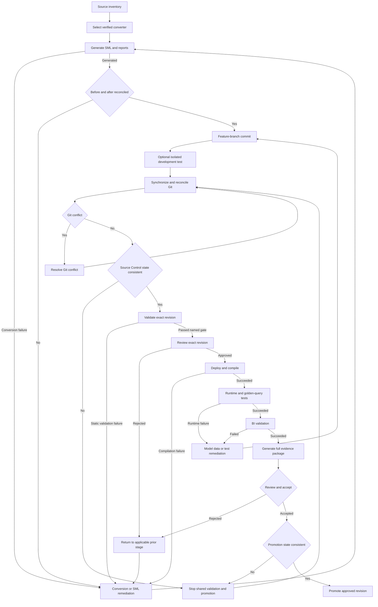

# Workflow 01 — Existing Semantic Model Conversion to SML

## Purpose and scope

Use this workflow when an engagement starts with an existing semantic model and a current PS-Utils converter supports its source format. It converts the source, reconciles source intent to generated SML, remediates gaps, and carries one identified revision through compilation, runtime and BI testing, acceptance, and promotion.

### Current support boundary

The current development registry supports these existing-model sources:

| Source | Verified converter | Required source artifact | Important boundary |
| --- | --- | --- | --- |
| AtScale XML | [`generate-sml-from-xml`](../../README.md#generate-sml-from-xml) | AtScale `project_2_0` XML export | Emits detectable SML objects and a generated `README.md`; source/report comparison is still required. |
| SSAS Tabular | [`generate-sml-from-tabular`](../../README.md#generate-sml-from-tabular) | TMSL/XMLA `createOrReplace` JSON export | Pass 1 structural migration. Only mechanically supported calculations convert; deferred measures require design. |
| SSAS Multidimensional | [`generate-sml-from-ssas-multidimensional`](../../README.md#generate-sml-from-ssas-multidimensional) | XMLA `Create`/`ObjectDefinition`/`Database` export | Pass 1 structural migration. Detected many-to-many, reference, and parent-child dimensions are reported for manual design rather than converted. |

[`analyze-powerbi-dax-gaps`](../../README.md#analyze-powerbi-dax-gaps) analyzes report-scoped measures in a Power BI `.pbix`; it is not a PBIX semantic-model converter. Import/composite model content requires a supported external extraction method before the Tabular converter can be considered. Route any other source through [Workflow 02](workflow-02-net-new-sml-development.md) unless a separately reviewed converter is registered.

Converter output does not imply that every calculation, role-played dimension, security definition, shared object, front-end calculation, or source behavior converted automatically.

### Entry criteria

- The source is a complete, readable artifact accepted by the selected converter, with source type, product version, export method, and export date recorded.
- The in-scope cubes/models, objects, calculations, security rules, BI assets, settings, and exclusions have owners.
- Required warehouse, AtScale development, and BI-tool access is approved.
- Golden queries or another approved comparison basis and acceptance criteria are defined.
- The repository, target branch, environment policy, evidence location, and reviewers are identified.

### Expected outputs and roles

Expected outputs are reviewed SML, a before report, a generated-SML after report, an object-level difference/reconciliation report, named-gate validation and test evidence, a full SML documentation report, accepted exceptions, and the exact revision eligible for promotion.

| Role | Manual responsibility |
| --- | --- |
| PS consultant or model developer | Inventory the source, run verified operations, remediate SML, retain evidence, and avoid exposing secrets. |
| Model reviewer or Model Administrator | Review the exact diff and SHA, verify named gates, and control deployment/promotion according to policy. |
| Data and BI owners | Confirm source mappings, calculation behavior, warehouse data, security, BI compatibility, and test expectations. |
| Customer/UAT approver | Accept results, documented exceptions, and the identified revision. |

### Exit criteria

The source and generated model are fully reconciled, all required named gates have evidence, known exceptions have disposition, the customer handoff includes the full SML documentation report, and the exact accepted revision is eligible for promotion.

### Out of scope

This workflow does not add support for unregistered source formats, prove business equivalence from generated YAML alone, build CI/CD, create skills or dashboards, change customer infrastructure, or authorize production promotion.

## Core workflow

The optional isolated test is permitted only by environment policy. It can accelerate feedback but cannot replace synchronization, exact-revision review, or any shared gate.

## Verified operation map

| Stage | Purpose | Inputs | Verified PS-Utils operation/reference | Output/evidence | Exit gate | Manual responsibility |
| --- | --- | --- | --- | --- | --- | --- |
| Inventory | Establish the source baseline and test basis. | Supported source export, source docs, BI inventory, settings, security, approved queries | For AtScale XML, [`generate-report-from-xml`](../../README.md#generate-report-from-xml) creates a read-only full-object Markdown inventory. Other sources use their converter reports plus manual source review. | Before report and scope checklist | All in-scope objects and exclusions identified | Inspect source artifacts and obtain owner approval. |
| Select converter and assess DAX | Use only the converter matching the verified source format; assess Power BI report-scoped DAX when in scope. | Source export and optional PBIX | [`generate-sml-from-xml`](../../README.md#generate-sml-from-xml), [`generate-sml-from-tabular`](../../README.md#generate-sml-from-tabular), [`generate-sml-from-ssas-multidimensional`](../../README.md#generate-sml-from-ssas-multidimensional), optional [`analyze-powerbi-dax-gaps`](../../README.md#analyze-powerbi-dax-gaps) | SML tree, converter-specific reports/context, optional `PBIX_GAP_REPORT.md`, `.json`, and `.csv` | Operation completed; outputs and failures retained | Record version, sanitized parameters, log, source fingerprint, guesses, and unsupported constructs. |
| Reconcile and remediate | Compare source and output inventories; review omissions, naming, bindings, calculations, security, and style. | Before report, SML, converter reports | [`generate-report-from-sml`](../../README.md#generate-report-from-sml) creates the after report; [`generate-sml-docs`](../../README.md#generate-sml-docs) creates full SML documentation; [`apply-style-to-sml`](../../README.md#apply-style-to-sml) can update labels and create `STYLE.md` and `STYLE_CHANGES.md`. | After report, difference matrix, SML documentation, reviewed changes | Every source object has a disposition | Complete object mapping; remediate unsupported behavior and review every in-place change. |
| Commit and synchronize | Identify and reconcile the deliverable revision. | SML, reports, settings, feature branch | [Git and promotion strategy](../GIT.md) | Commit SHA, clean-tree status, remote relationship, reviewed diff | No unresolved conflict or inconsistent Source Control state | Use Git; current PS-Utils has no synchronization guard. |
| Structural and semantic validation | Parse YAML, check local references, and request engine model validation. | Exact SML revision and approved AtScale connection | [`atscale-list-model-errors`](../../README.md#atscale-list-model-errors) | JSON problem list with structural and engine phases | Named validation gate has no unaccepted blocking problem | Tie output to SHA/environment and state what was not tested. |
| Test-query preparation | Create representative smoke queries across metrics and hierarchy levels. | Exact SML revision | [`generate-queries-from-sml`](../../README.md#generate-queries-from-sml) | XMLA and SQL query JSON | Coverage reviewed and approved expectations added | Add golden queries and expected results; generated queries alone do not prove correctness. |
| Deploy and compile | Publish SML to a controlled AtScale development environment. | Exact reviewed SML revision, repository identity, environment connection | [`atscale-deploy-catalog`](../../README.md#atscale-deploy-catalog); inspect with [`atscale-list-deployments`](../../README.md#atscale-list-deployments) and model errors with [`atscale-list-model-errors`](../../README.md#atscale-list-model-errors) | Deployment response, deployed identity, compilation/model-error evidence | Selected revision is deployed and compiles | Verify deployed content is traceable to SHA; the deploy operation does not establish that association by itself. |
| Runtime test | Execute generated and golden queries against AtScale and the warehouse. | Approved query files and deployed model | [`execute-atscale-query-harness`](../../README.md#execute-atscale-query-harness) | Run-results CSV with status, duration, row count, checksum, error, and timestamp | Required queries execute; failures dispositioned | Control test data, redact sensitive text when required, and review business results. |
| Enrich and compare | Correlate runs and compare results or performance. | Harness CSVs and approved baseline | [`generate-enhanced-query-results`](../../README.md#generate-enhanced-query-results), [`execute-run-analysis`](../../README.md#execute-run-analysis) | Enhanced CSV; caller-named summary, comparison, and outlier files | Approved thresholds and expected results satisfied | Explain unmatched queries and assess checksum, row-count, timing, and semantic differences. |
| BI, acceptance, and promotion | Validate consumption, package evidence, accept, then advance the approved revision. | Deployed revision and evidence contract | Manual today; follow [Git governance](../GIT.md) and [migration guidance](../MIGRATE.md) where applicable. | BI record, full SML documentation, acceptance, promoted SHA/target | Authorized approval for the exact revision | BI/customer reviewers approve; promoter rechecks revision and Source Control integrity. |

## Source-to-SML inventory and reconciliation

Create the source inventory before conversion and the generated-SML inventory afterward. Reconcile every applicable object detectable in the source, including models or cubes, datasets/source tables, dimensions, attributes, hierarchies, levels, relationships, base metrics, calculated metrics, expressions, role-playing objects, security definitions, shared objects or packages, model settings, and other constructs detected during inspection.

Each applicable source object must have exactly one disposition:

- Converted
- Converted with modification
- Unsupported
- Skipped with documented reason
- Failed
- Intentionally excluded with approval

Silently omitted objects do not count as successful conversion. Use an object-level record such as:

| Source object and type | Source identifier | Generated SML object/file | Disposition | Difference or limitation | Required test | Owner/approval |
| --- | --- | --- | --- | --- | --- | --- |
| _Populate per engagement_ |  |  |  |  |  |  |

### Current detection boundaries

| Concern | Current repository evidence | Required treatment |
| --- | --- | --- |
| Deferred or skipped calculations | Tabular conversion writes `DEFERRED_MEASURES.md` and `CONVERSION_REPORT.md`/`.json`; AtScale XML and Multidimensional converters report converter-specific omissions/notes. | Inspect every source calculation and record one disposition; do not assume one converter's report covers another format. |
| Unsupported DAX or MDX | Tabular conversion classifies supported base metrics, server-side DAX, MDX translations, and deferred expressions. PBIX gap analysis reports client/server DAX verdicts for readable report-scoped measures. Neither proves runtime compatibility. | Review translations and deferred items, compile, and execute every required expression. |
| Display labels versus unique-name references | Converters normalize names and have collision handling, but conversion reports do not replace source-to-output review for every business reference. | Reconcile identifiers, labels, and references explicitly. |
| Identifier normalization and duplicate unique names | Current converters include deterministic normalization/collision handling for known paths; a reviewer must still confirm business identity and downstream references. | Review the converter report/mappings and run structural/engine validation. |
| Missing or broken object references | Some local relationships are checked by `atscale-list-model-errors`; converter coverage is not a complete source-reference proof. | Retain structural and engine results and inspect unresolved source references. |
| Calculated metrics referencing missing objects | No dedicated converter report verifies all expression references. | Review expressions, compile, and run representative queries. |
| Declared-versus-generated counts | Converter reports contain output/issue counts, and Tabular provides a machine-readable conversion report, but cross-format completeness still requires the before/after reconciliation. | Build and approve object counts and mappings. |
| Role-playing relationships | Supported converters detect format-specific role-play patterns; detection does not prove that every semantic role or query behavior is preserved. | Reconcile every role and test representative queries. |
| Security and permissions | The converter reports detected source security roles as not converted; enforcement must be recreated and tested separately. | Trace each requirement to AtScale/environment controls and retain security test evidence. |

## Meaning of before, after, and difference

- **Before:** an inventory and report of the source semantic model, its settings, dependencies, calculations, security, and in-scope BI behavior. Use `generate-report-from-xml` for AtScale XML; supplement converter reports with manual inventory for other formats.
- **After:** an inventory and full documentation of the generated and remediated SML. Use `generate-report-from-sml` for the comparison report and `generate-sml-docs` for the customer-readable SML reference.
- **Difference:** object-level reconciliation showing parity, modifications, exclusions, failures, and unresolved gaps.

Do not claim byte-for-byte equality between XML and SML. State “equivalent” or “parity achieved” only after applicable source objects, required calculations, relationships, and security are accounted for; compilation succeeds; required runtime and BI tests support the statement; and authorized reviewers accept all exceptions.

## Validation boundaries

| Gate | Required evidence | Passing this gate does not prove |
| --- | --- | --- |
| 1. Source parsing | Converter log identifies a readable XML source. | Complete or correct conversion |
| 2. Converter execution | Operation completed and emitted files/report. | Source-to-SML parity |
| 3. Source-to-SML reconciliation | Approved object disposition matrix. | Valid YAML or runtime behavior |
| 4. YAML/structural validation | Parser/local-reference result tied to SHA. | Engine compilation |
| 5. Static semantic validation | Named static/engine checks and problem disposition. | Deployment or correct results |
| 6. Git review | Reviewed diff and exact commit SHA. | AtScale accepted the model |
| 7. AtScale compilation | Compile/model-error evidence from the target version. | Successful deployment or queries |
| 8. AtScale deployment | Environment, model identity, response, and SHA trace. | Warehouse-connected correctness |
| 9. Warehouse-connected runtime queries | Query results, errors, data context, and revision. | Agreement with an approved baseline |
| 10. Golden-query or regression comparison | Expected/comparison basis, tolerances, and result. | BI-tool compatibility |
| 11. BI-tool validation | Tool/version, assets tested, result, and limitations. | Performance at scale unless tested |
| 12. Performance testing | Workload, concurrency, data state, thresholds, and result. | Customer acceptance |
| 13. Customer/UAT acceptance | Authorized acceptance and exceptions. | Promotion occurred |
| 14. Promotion approval | Approved source SHA, target, and control record. | A later target deployment succeeded |

## Conversion evidence package

| Artifact | Current status | Repository-supported evidence or required action |
| --- | --- | --- |
| Source-model inventory | Partially automated | `generate-report-from-xml` automates AtScale XML inventory; Tabular/Multidimensional reports and source artifacts still require manual completeness review. |
| Generated-SML inventory | Automated by current tooling | Retain `generate-report-from-sml` output; converter `README.md`, reports, and optional `model.yaml` are supporting evidence. |
| Before-versus-after reconciliation | Partially automated | Source/after reports exist, and Tabular emits `CONVERSION_REPORT.md`/`.json`; complete and approve the cross-format object matrix manually. |
| Converted/modified/unsupported/skipped/failed-object report | Partially automated | Retain converter-specific reports and extend them to every in-scope source object and required status. |
| Conversion logs | Automated by current tooling | Retain sanitized operation output or the configured log file. |
| Deferred-calculation or unsupported-expression report | Partially automated | Tabular writes `DEFERRED_MEASURES.md`; PBIX analysis writes `PBIX_GAP_REPORT.md`/`.json`/`.csv`; complete other formats and accepted remediations manually. |
| Static SML validation output | Automated by current tooling | Retain `atscale-list-model-errors` JSON and its exact source/environment context. |
| Git branch and exact commit SHA | Manual today | Record from Git after committing the evidence-ready revision. |
| Reviewed Git diff | Manual today | Retain PR/equivalent review evidence, including settings. |
| Converter and PS-Utils version or commit | Manual today | Record the package version or repository SHA with sanitized parameters. |
| AtScale version | Manual today | Record from the tested environment. |
| AtScale compilation and deployment evidence | Partially automated | Retain deploy response, model-error/compile result, deployment identity, and manual SHA trace. |
| Warehouse-connected query results | Automated by current tooling | Retain harness run-results CSV and query inputs. |
| Golden-query or regression results | Partially automated | `execute-run-analysis` creates comparison artifacts; people must approve the baseline, thresholds, and semantic outcome. |
| BI-tool results when in scope | Manual today | Record tool/version, asset coverage, test result, and exceptions. |
| Full SML documentation report | Automated by current tooling | Generate with `generate-sml-docs`, review it, and add engagement-specific lineage, limitations, evidence links, and approvals required for the handoff. |
| Known-gap and remediation log | Manual today | Assign owner, target, risk, and disposition. |
| Test-data fingerprint and seed when available | Partially automated | Data-shape and synthetic-data operations can record inputs/seed when that optional module is used; retain them with data-policy approval. |
| Reviewer and customer/UAT acceptance record | Manual today | Capture authorized decisions and accepted exceptions. |
| Promoted revision and target environment | Manual today | Record the exact source SHA, target, time, result, and approver. |

## Completion criteria

Conversion is complete only when:

- The source inventory exists.
- Every applicable source object has a reconciliation status.
- Unsupported, modified, failed, and intentionally excluded items are documented.
- Required static validation succeeded with retained evidence.
- The reviewed and tested revision is identified by Git SHA.
- Git conflicts and Source Control integrity issues are resolved.
- Required AtScale compilation and deployment gates succeeded.
- Required runtime tests succeeded.
- Required BI tests succeeded or are explicitly outside scope.
- Known exceptions have an owner and disposition.
- The full SML documentation report exists.
- The evidence package is complete.
- Required review and customer/UAT acceptance occurred.
- The approved revision is eligible for promotion.

Generating SML alone is not completion.

## References

- [Shared workflow index and governance](README.md)
- [Conversion algorithm details](../CONVERSION.md)
- [Git and promotion strategy](../GIT.md)
- [Specialized XML migration guidance](../MIGRATE.md)
- [GitHub Actions operation guide](../ACTIONS.md)
- [Root CLI operation reference](../../README.md#operations)
