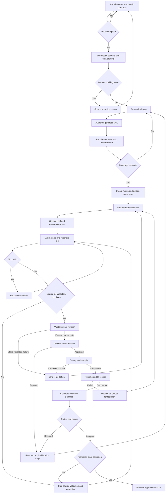

# Workflow 02 — Net-New SML Development

## Purpose and scope

Use this workflow when Professional Services must design an SML model from business requirements and warehouse structures rather than convert a supported semantic-model format. It also applies when an existing source is unsupported by current converters and therefore serves only as requirements or comparison evidence.

“Workflow 02” is the documentation sequence for the second required path. Patrick explicitly numbered conversion as Workflow 01; net-new development was identified as the other minimum path.

### Required starting inputs

- Business use cases, decisions, consumers, and priorities
- Metric contracts with business definitions, grain, filters, aggregation behavior, ownership, and expected results
- Dimension, attribute, hierarchy, role-playing, and shared-object requirements
- Source-system and warehouse ownership
- DDL or an approved warehouse-access method
- Data-quality, freshness, and representative-data expectations
- Security and row-level security requirements
- BI-tool consumption and compatibility requirements
- Nonfunctional expectations such as concurrency, latency, scale, and refresh windows
- Acceptance criteria, reviewers, environments, and evidence-retention location

### Entry criteria

The engagement has an approved scope, identified owners, warehouse metadata/access, a working feature branch, an allowed development environment, and enough test data or an approved synthetic-data plan to evaluate the required behavior. Blocked or deferred requirements have explicit owners and reasons.

### Expected outputs and roles

Expected outputs are reviewed SML, source and design evidence, requirements-to-SML and metric-to-test traceability, generated and golden queries, named-gate results, a full SML documentation report, accepted exceptions, and an exact revision eligible for promotion.

| Role | Manual responsibility |
| --- | --- |
| Business or metric owner | Approve definitions, expected results, scope, and exceptions. |
| PS consultant or model developer | Profile sources, design and author SML, maintain traceability, run verified operations, and retain evidence. |
| Warehouse/data owner | Confirm source grain, joins, quality, access, freshness, and representative test data. |
| Model reviewer or Model Administrator | Review the exact diff/SHA, validate gate evidence, and control deployment/promotion. |
| BI and security reviewers | Validate consumption, security/RLS, and tool-specific behavior. |
| Customer/UAT approver | Accept results, limitations, and the identified revision. |

### Exit criteria

All in-scope requirements are traced and dispositioned, critical metrics are tied to approved tests, required gates have retained evidence, the full SML documentation report is complete, and the exact accepted revision is eligible for promotion.

### Out of scope

This workflow does not infer business correctness from warehouse metadata, treat generated queries as approved expected results, replace customer DEV/UAT data when it is required, build CI/CD or dashboards, create skills, or authorize production promotion.

## Core workflow

The optional isolated test is permitted only by environment policy and cannot replace synchronization, exact-revision review, or the shared gates.

## Verified operation map

| Stage | Purpose | Inputs | Verified PS-Utils operation/reference | Output/evidence | Exit gate | Manual responsibility |
| --- | --- | --- | --- | --- | --- | --- |
| Discover and contract | Define use cases, metrics, dimensions, security, BI behavior, nonfunctional needs, and acceptance. | Stakeholder inputs and source ownership | No current requirements-management operation | Approved requirements and metric contracts | Required inputs complete or dispositioned | Facilitate decisions, assign owners, and approve expected behavior. |
| Capture warehouse schema | Create a reviewable schema snapshot from an approved connection. | Connection, schema, optional table filter | [`extract-ddl-from-connection`](../../README.md#extract-ddl-from-connection) | DDL file or stdout with tables, columns, and available foreign keys | Schema scope reviewed by data owner | Verify grain and missing/implicit relationships. |
| Profile data shape | Record statistical shape after an initial SML model exists. | Connection and SML/model path | [`extract-data-shape-from-connection`](../../README.md#extract-data-shape-from-connection) | `data-shape.yaml` fingerprint | Profile reviewed and data-quality findings dispositioned | This operation requires SML/model input; assess sampling, privacy, and representativeness. |
| Generate initial SML from a live source | Infer a candidate semantic model from warehouse metadata and samples. | Approved connection, model/style settings | [`generate-sml-from-connection`](../../README.md#generate-sml-from-connection) | SML tree, `REPORT.md`, `STYLE.md`, and `sml.style.yaml` | Candidate output inspected, not accepted automatically | Confirm classifications, joins, measures, exclusions, and inference warnings. |
| Generate initial SML from DDL | Infer a candidate model offline from declared DDL/FKs. | DDL and model/style settings | [`generate-sml-from-ddl`](../../README.md#generate-sml-from-ddl) | SML tree, `REPORT.md`, `STYLE.md`, and `sml.style.yaml` | Candidate output inspected, not accepted automatically | Supply missing business semantics and validate against real data later. |
| Author and style | Add or correct semantic objects and apply approved labels. | Candidate/hand-authored SML and style config | Manual authoring; optional [`apply-style-to-sml`](../../README.md#apply-style-to-sml) | Reviewed YAML; `STYLE.md` and `STYLE_CHANGES.md` when style operation is used | Requirements coverage complete | Review in-place edits and preserve business meaning. |
| Inventory and document SML | Produce human-readable object documentation and an optional normalized model representation. | SML directory | [`generate-report-from-sml`](../../README.md#generate-report-from-sml), [`generate-sml-docs`](../../README.md#generate-sml-docs), optional [`extract-model-from-sml`](../../README.md#extract-model-from-sml) | Read-only report, full SML Markdown documentation, optional `model.yaml` | Inventory and customer documentation reviewed | Add engagement-specific lineage, limitations, and evidence links. |
| Review structurally unused objects | Identify objects no model reaches before review. | Exact SML revision | [`clean-unused-sml-objects`](../../README.md#clean-unused-sml-objects) in preview mode | Markdown report or stdout | Every finding reviewed | This is not a live usage audit; do not use `--apply true` without separate review and explicit intent. |
| Commit and synchronize | Identify and reconcile the deliverable revision. | SML, requirements, tests, settings, feature branch | [Git and promotion strategy](../GIT.md) | Commit SHA, clean-tree status, remote relationship, reviewed diff | No unresolved conflict or inconsistent Source Control state | Use Git; current PS-Utils has no synchronization guard. |
| Structural and semantic validation | Parse YAML, check local references, and request engine validation. | Exact SML revision and approved AtScale connection | [`atscale-list-model-errors`](../../README.md#atscale-list-model-errors) | JSON problem list with structural and engine phases | Named validation gate has no unaccepted blocking problem | Tie output to SHA/environment and report the gate boundary. |
| Test-query preparation | Create broad metric and hierarchy-level smoke coverage. | Exact SML revision | [`generate-queries-from-sml`](../../README.md#generate-queries-from-sml) | XMLA and SQL query JSON | Coverage mapped to metric contracts and golden tests | Add approved expected results; generated queries alone do not prove business correctness. |
| Deploy and compile | Publish SML to a controlled AtScale environment. | Exact reviewed SML revision and AtScale repository identity | [`atscale-deploy-catalog`](../../README.md#atscale-deploy-catalog); inspect with [`atscale-list-deployments`](../../README.md#atscale-list-deployments) and model errors with [`atscale-list-model-errors`](../../README.md#atscale-list-model-errors) | Deployment response, deployed identity, compilation/model-error evidence | Selected revision is deployed and compiles | Verify deployed content is traceable to SHA. |
| Runtime and regression test | Execute approved queries and compare runs where applicable. | Query files, expected basis, deployed model | [`execute-atscale-query-harness`](../../README.md#execute-atscale-query-harness), [`generate-enhanced-query-results`](../../README.md#generate-enhanced-query-results), [`execute-run-analysis`](../../README.md#execute-run-analysis) | Run CSV, optional enhanced CSV, comparison summary/CSV/outliers | Approved correctness and nonfunctional thresholds satisfied | Assess actual values, data state, mismatches, performance, and limitations. |
| BI, acceptance, and promotion | Validate consumption/security, document, accept, and advance exact revision. | Deployed revision, traceability, evidence contract | Manual today; follow [Git governance](../GIT.md) | BI/security record, full SML documentation, acceptance, promoted SHA/target | Authorized approval for exact revision | Customer and control owners approve; promoter rechecks revision and Source Control integrity. |

## Requirements-to-SML traceability

Maintain one row for every in-scope requirement, including business use cases, dimensions and hierarchies, base and calculated metrics, relationships, security/RLS, shared semantic objects, BI-tool requirements, performance-sensitive use cases, and acceptance tests.

| Requirement/metric | Business definition | SML object | Source datasets/columns | Test/query | Evidence | Status | Owner |
| --- | --- | --- | --- | --- | --- | --- | --- |
| _Populate per engagement_ |  |  |  |  |  |  |  |

Each requirement must have exactly one status:

- Implemented and tested
- Implemented, test pending
- Partially implemented with documented limitation
- Blocked
- Deferred with owner and reason
- Intentionally excluded with approval

Generation reports and inference warnings support review but do not replace this matrix.

## Metric-to-test traceability

For every critical metric, record:

- Business definition and owner
- Source datasets, columns, grain, filters, and mapping
- SML object name
- Expected aggregation and calculation behavior
- At least one representative validation query when practical
- Expected result, tolerance, or approved comparison method
- Runtime evidence tied to revision and environment
- BI-tool evidence when in scope
- Reviewer or owner

Use a compact record such as:

| Metric contract | Source mapping | SML object | Query/test | Expected basis | Runtime evidence | BI evidence | Reviewer/status |
| --- | --- | --- | --- | --- | --- | --- | --- |
| _Populate per critical metric_ |  |  |  |  |  |  |  |

[`generate-queries-from-sml`](../../README.md#generate-queries-from-sml) produces a total query for each metric and level-breakdown queries across the model. That verifies useful execution coverage only after the queries run; it does not prove business correctness without an approved expected result or comparison basis.

## Synthetic-data and QA module

Synthetic data is an optional enabling module, not the net-new workflow itself. Use it for isolated development, repeatable performance experiments, privacy-preserving troubleshooting, or cases where representative customer data cannot be shared and synthetic limitations are acceptable. Use approved customer DEV/UAT data when acceptance depends on actual distributions, data quality, security entitlements, late-arriving data, production-specific SQL, or known business totals.

| Step | Verified operation | Current output/capability | Boundary and manual work |
| --- | --- | --- | --- |
| Extract data shape | [`extract-data-shape-from-connection`](../../README.md#extract-data-shape-from-connection) | `data-shape.yaml` with statistical shape; original values are not written. | Requires an existing SML directory or model file and a live source; review sampling and whether metadata is preserved. |
| Generate synthetic DDL | [`generate-ddl-from-data-shape`](../../README.md#generate-ddl-from-data-shape) | Dialect-aware DDL from a fingerprint. | Original names require a fingerprint captured with metadata preservation; dialect limitations still require review. |
| Generate synthetic data | [`generate-data-from-data-shape`](../../README.md#generate-data-from-data-shape) | CSV files; optional scale factor and reproducible seed. | Record fingerprint, scale, seed, generator version, and limitations. |
| Load generated data | [`generate-data-from-data-shape-to-connection`](../../README.md#generate-data-from-data-shape-to-connection) | Generates and loads data; can create or drop tables when explicitly selected. | Use only in an authorized disposable/test schema; destructive flags require deliberate review. |
| Generate model queries | [`generate-queries-from-sml`](../../README.md#generate-queries-from-sml) | XMLA and SQL query JSON covering model metrics and hierarchy levels. | Add business expectations and targeted edge cases. |
| Execute harness | [`execute-atscale-query-harness`](../../README.md#execute-atscale-query-harness) | CSV with statuses, timings, row counts, checksums, and errors. | Interpret results, protect query text, and distinguish synthetic from customer-data evidence. |

Current data-shape extraction cannot start from requirements alone because it requires an existing SML/model input. No repository evidence establishes these capabilities as a substitute for production data, customer UAT, security tests, or production-hardened load generation.

## Net-new evidence package

| Artifact | Current status | Repository-supported evidence or required action |
| --- | --- | --- |
| Requirements and metric contracts | Manual today | Obtain owner-approved definitions and acceptance criteria. |
| Warehouse schema or DDL inventory | Automated by current tooling | Retain output from `extract-ddl-from-connection` or the approved source DDL. |
| Data-profiling evidence | Partially automated | Retain approved profiles, sampling parameters, source context, and data-quality review; `data-shape.yaml` is available after SML exists. |
| Semantic design decisions | Manual today | Record grain, relationships, shared objects, security, naming, and rejected alternatives. |
| Generated or authored SML inventory | Automated by current tooling | Retain `generate-report-from-sml` output; generation `REPORT.md` and optional `model.yaml` are supporting evidence. |
| Requirements-to-SML traceability | Manual today | Maintain and approve the matrix. |
| Metric-to-test traceability | Manual today | Maintain critical metric records and approved expected bases. |
| Static SML validation output | Automated by current tooling | Retain `atscale-list-model-errors` JSON and exact context. |
| Git branch and exact commit SHA | Manual today | Record from Git after committing the evidence-ready revision. |
| Reviewed Git diff | Manual today | Retain PR/equivalent review evidence, including version-controlled settings. |
| PS-Utils version or commit | Manual today | Record package version or repository SHA and sanitized parameters. |
| AtScale version | Manual today | Record from the tested environment. |
| AtScale compilation and deployment evidence | Partially automated | Retain deploy response, model-error/compile result, deployment identity, and manual SHA trace. |
| Warehouse-connected query results | Automated by current tooling | Retain harness CSV and query inputs. |
| Golden-query or regression results | Partially automated | Retain comparison outputs; owners approve expectations, tolerances, and semantic result. |
| BI-tool validation results | Manual today | Record tool/version, assets, connection behavior, results, and exceptions. |
| Full SML documentation report | Automated by current tooling | Generate with `generate-sml-docs`, review it, and add engagement-specific lineage, limitations, evidence links, and approvals required for the handoff. |
| Known-gap and remediation log | Manual today | Assign owner, target, risk, and disposition. |
| Test-data fingerprint and seed when available | Partially automated | Retain `data-shape.yaml`, generator seed, scale factor, version, and data classification when synthetic data is used. |
| Customer/UAT acceptance record | Manual today | Capture authorized decisions and exceptions. |
| Promoted revision and target environment | Manual today | Record exact source SHA, target, time, result, and approver. |

## Completion criteria

Net-new development is complete only when:

- In-scope requirements and metric contracts are documented.
- Required source schema and data profiling are complete.
- Requirements-to-SML reconciliation is complete.
- Critical metrics have test traceability.
- Required static validation succeeded with retained evidence.
- The reviewed and tested revision is identified by Git SHA.
- Required compilation and deployment gates succeeded.
- Required runtime and BI tests succeeded.
- Security/RLS requirements are tested when in scope.
- Exceptions have owners and disposition.
- The full SML documentation report exists.
- The evidence package is complete.
- Required review and customer/UAT acceptance occurred.
- The approved revision is eligible for promotion.
- A rollback path to the last accepted promoted revision is identified.

Authored or generated YAML alone is not completion.

## References

- [Shared workflow index and governance](README.md)
- [Git and promotion strategy](../GIT.md)
- [Specialized migration guidance](../MIGRATE.md)
- [GitHub Actions operation guide](../ACTIONS.md)
- [Root CLI operation reference](../../README.md#operations)
- [Synthetic-data statistical algorithm](../STATISTICS.md)
