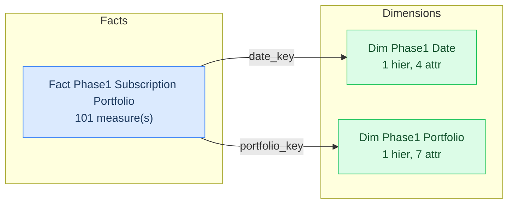

# SML Generation Report

| Property | Value |
|---|---|
| **Model** | `SkyDryRun04Phase1Hypothesis` |
| **Generated** | 2026-08-06T04:28:02.667Z |
| **Connection** | `sky_ps_utils_dryrun_04_postgres` |
| **Catalog** | SkyDryRun04Phase1Hypothesis |
| **Schema** | `sky_ps_utils_dryrun_04_phase1_hypothesis` |
| **Dialect** | postgresql |
| **Facts** | 1 |
| **Dimensions** | 2 |
| **Metrics** | 101 |
| **Secondary Attributes** | 18 |
| **Relationships** | 2 |
| **Files generated** | 109 |

## Table of Contents

1. [Model Diagram](#model-diagram)
2. [Generated Files](#generated-files)
3. [Fact Table Detail](#fact-table-detail)
4. [Inference Decisions](#inference-decisions)
   - [Table Classification](#table-classification)
   - [Relationship Inference](#relationship-inference)
   - [Column Omissions](#column-omissions)

---

## Model Diagram

Solid arrows (→) are fact-to-dimension joins. Dashed arrows (-.->) are dimension-to-dimension (snowflake) joins. Bridge/junction tables are shown in yellow.

---

## Generated Files

| File | Type | Description |
|---|---|---|
| `catalog.yml` | Catalog | AtScale catalog labeled "SkyDryRun04Phase1Hypothesis" |
| `connections/sky-ps-utils-dryrun-04-postgres.yml` | Connection | Database connection definition |
| `datasets/dim_phase1_date.yml` | Dataset | Source table mapping for dimension `dim_phase1_date` (4 attribute(s)) |
| `datasets/dim_phase1_portfolio.yml` | Dataset | Source table mapping for dimension `dim_phase1_portfolio` (7 attribute(s)) |
| `datasets/fact_phase1_subscription_portfolio.yml` | Dataset | Source table mapping for fact `fact_phase1_subscription_portfolio` (101 measure column(s)) |
| `dimensions/dim_phase1_date.yml` | Dimension | Dimension "Dim Phase1 Date" — 1 hierarchy(s), 4 attribute(s) |
| `dimensions/dim_phase1_portfolio.yml` | Dimension | Dimension "Dim Phase1 Portfolio" — 1 hierarchy(s), 7 attribute(s) |
| `metrics/m-fpsp-activated-portfolio-count-avg.yml` | Metric | AVG of `activated_portfolio_count` from `fact_phase1_subscription_portfolio` (folder: `fact_phase1_subscription_portfolio_metrics`) |
| `metrics/m-fpsp-activated-portfolio-count-max.yml` | Metric | MAX of `activated_portfolio_count` from `fact_phase1_subscription_portfolio` (folder: `fact_phase1_subscription_portfolio_metrics`) |
| `metrics/m-fpsp-activated-portfolio-count-min.yml` | Metric | MIN of `activated_portfolio_count` from `fact_phase1_subscription_portfolio` (folder: `fact_phase1_subscription_portfolio_metrics`) |
| `metrics/m-fpsp-activated-portfolio-count-sum.yml` | Metric | SUM of `activated_portfolio_count` from `fact_phase1_subscription_portfolio` (folder: `fact_phase1_subscription_portfolio_metrics`) |
| `metrics/m-fpsp-churned-portfolio-count-avg.yml` | Metric | AVG of `churned_portfolio_count` from `fact_phase1_subscription_portfolio` (folder: `fact_phase1_subscription_portfolio_metrics`) |
| `metrics/m-fpsp-churned-portfolio-count-max.yml` | Metric | MAX of `churned_portfolio_count` from `fact_phase1_subscription_portfolio` (folder: `fact_phase1_subscription_portfolio_metrics`) |
| `metrics/m-fpsp-churned-portfolio-count-min.yml` | Metric | MIN of `churned_portfolio_count` from `fact_phase1_subscription_portfolio` (folder: `fact_phase1_subscription_portfolio_metrics`) |
| `metrics/m-fpsp-churned-portfolio-count-sum.yml` | Metric | SUM of `churned_portfolio_count` from `fact_phase1_subscription_portfolio` (folder: `fact_phase1_subscription_portfolio_metrics`) |
| `metrics/m-fpsp-customer-continuous-tenure-months-avg.yml` | Metric | AVG of `customer_continuous_tenure_months` from `fact_phase1_subscription_portfolio` (folder: `fact_phase1_subscription_portfolio_metrics`) |
| `metrics/m-fpsp-customer-continuous-tenure-months-max.yml` | Metric | MAX of `customer_continuous_tenure_months` from `fact_phase1_subscription_portfolio` (folder: `fact_phase1_subscription_portfolio_metrics`) |
| `metrics/m-fpsp-customer-continuous-tenure-months-min.yml` | Metric | MIN of `customer_continuous_tenure_months` from `fact_phase1_subscription_portfolio` (folder: `fact_phase1_subscription_portfolio_metrics`) |
| `metrics/m-fpsp-customer-continuous-tenure-months-sum.yml` | Metric | SUM of `customer_continuous_tenure_months` from `fact_phase1_subscription_portfolio` (folder: `fact_phase1_subscription_portfolio_metrics`) |
| `metrics/m-fpsp-eod-active-portfolio-count-avg.yml` | Metric | AVG of `eod_active_portfolio_count` from `fact_phase1_subscription_portfolio` (folder: `fact_phase1_subscription_portfolio_metrics`) |
| `metrics/m-fpsp-eod-active-portfolio-count-max.yml` | Metric | MAX of `eod_active_portfolio_count` from `fact_phase1_subscription_portfolio` (folder: `fact_phase1_subscription_portfolio_metrics`) |
| `metrics/m-fpsp-eod-active-portfolio-count-min.yml` | Metric | MIN of `eod_active_portfolio_count` from `fact_phase1_subscription_portfolio` (folder: `fact_phase1_subscription_portfolio_metrics`) |
| `metrics/m-fpsp-eod-active-portfolio-count-sum.yml` | Metric | SUM of `eod_active_portfolio_count` from `fact_phase1_subscription_portfolio` (folder: `fact_phase1_subscription_portfolio_metrics`) |
| `metrics/m-fpsp-eod-broadband-base-avg.yml` | Metric | AVG of `eod_broadband_base` from `fact_phase1_subscription_portfolio` (folder: `fact_phase1_subscription_portfolio_metrics`) |
| `metrics/m-fpsp-eod-broadband-base-max.yml` | Metric | MAX of `eod_broadband_base` from `fact_phase1_subscription_portfolio` (folder: `fact_phase1_subscription_portfolio_metrics`) |
| `metrics/m-fpsp-eod-broadband-base-min.yml` | Metric | MIN of `eod_broadband_base` from `fact_phase1_subscription_portfolio` (folder: `fact_phase1_subscription_portfolio_metrics`) |
| `metrics/m-fpsp-eod-broadband-base-sum.yml` | Metric | SUM of `eod_broadband_base` from `fact_phase1_subscription_portfolio` (folder: `fact_phase1_subscription_portfolio_metrics`) |
| `metrics/m-fpsp-eod-cinema-base-avg.yml` | Metric | AVG of `eod_cinema_base` from `fact_phase1_subscription_portfolio` (folder: `fact_phase1_subscription_portfolio_metrics`) |
| `metrics/m-fpsp-eod-cinema-base-max.yml` | Metric | MAX of `eod_cinema_base` from `fact_phase1_subscription_portfolio` (folder: `fact_phase1_subscription_portfolio_metrics`) |
| `metrics/m-fpsp-eod-cinema-base-min.yml` | Metric | MIN of `eod_cinema_base` from `fact_phase1_subscription_portfolio` (folder: `fact_phase1_subscription_portfolio_metrics`) |
| `metrics/m-fpsp-eod-cinema-base-sum.yml` | Metric | SUM of `eod_cinema_base` from `fact_phase1_subscription_portfolio` (folder: `fact_phase1_subscription_portfolio_metrics`) |
| `metrics/m-fpsp-eod-dtv-base-avg.yml` | Metric | AVG of `eod_dtv_base` from `fact_phase1_subscription_portfolio` (folder: `fact_phase1_subscription_portfolio_metrics`) |
| `metrics/m-fpsp-eod-dtv-base-max.yml` | Metric | MAX of `eod_dtv_base` from `fact_phase1_subscription_portfolio` (folder: `fact_phase1_subscription_portfolio_metrics`) |
| `metrics/m-fpsp-eod-dtv-base-min.yml` | Metric | MIN of `eod_dtv_base` from `fact_phase1_subscription_portfolio` (folder: `fact_phase1_subscription_portfolio_metrics`) |
| `metrics/m-fpsp-eod-dtv-base-sum.yml` | Metric | SUM of `eod_dtv_base` from `fact_phase1_subscription_portfolio` (folder: `fact_phase1_subscription_portfolio_metrics`) |
| `metrics/m-fpsp-eod-glass-base-avg.yml` | Metric | AVG of `eod_glass_base` from `fact_phase1_subscription_portfolio` (folder: `fact_phase1_subscription_portfolio_metrics`) |
| `metrics/m-fpsp-eod-glass-base-max.yml` | Metric | MAX of `eod_glass_base` from `fact_phase1_subscription_portfolio` (folder: `fact_phase1_subscription_portfolio_metrics`) |
| `metrics/m-fpsp-eod-glass-base-min.yml` | Metric | MIN of `eod_glass_base` from `fact_phase1_subscription_portfolio` (folder: `fact_phase1_subscription_portfolio_metrics`) |
| `metrics/m-fpsp-eod-glass-base-sum.yml` | Metric | SUM of `eod_glass_base` from `fact_phase1_subscription_portfolio` (folder: `fact_phase1_subscription_portfolio_metrics`) |
| `metrics/m-fpsp-eod-mobile-base-avg.yml` | Metric | AVG of `eod_mobile_base` from `fact_phase1_subscription_portfolio` (folder: `fact_phase1_subscription_portfolio_metrics`) |
| `metrics/m-fpsp-eod-mobile-base-max.yml` | Metric | MAX of `eod_mobile_base` from `fact_phase1_subscription_portfolio` (folder: `fact_phase1_subscription_portfolio_metrics`) |
| `metrics/m-fpsp-eod-mobile-base-min.yml` | Metric | MIN of `eod_mobile_base` from `fact_phase1_subscription_portfolio` (folder: `fact_phase1_subscription_portfolio_metrics`) |
| `metrics/m-fpsp-eod-mobile-base-sum.yml` | Metric | SUM of `eod_mobile_base` from `fact_phase1_subscription_portfolio` (folder: `fact_phase1_subscription_portfolio_metrics`) |
| `metrics/m-fpsp-eod-product-count-avg.yml` | Metric | AVG of `eod_product_count` from `fact_phase1_subscription_portfolio` (folder: `fact_phase1_subscription_portfolio_metrics`) |
| `metrics/m-fpsp-eod-product-count-max.yml` | Metric | MAX of `eod_product_count` from `fact_phase1_subscription_portfolio` (folder: `fact_phase1_subscription_portfolio_metrics`) |
| `metrics/m-fpsp-eod-product-count-min.yml` | Metric | MIN of `eod_product_count` from `fact_phase1_subscription_portfolio` (folder: `fact_phase1_subscription_portfolio_metrics`) |
| `metrics/m-fpsp-eod-product-count-sum.yml` | Metric | SUM of `eod_product_count` from `fact_phase1_subscription_portfolio` (folder: `fact_phase1_subscription_portfolio_metrics`) |
| `metrics/m-fpsp-eod-smart-home-base-avg.yml` | Metric | AVG of `eod_smart_home_base` from `fact_phase1_subscription_portfolio` (folder: `fact_phase1_subscription_portfolio_metrics`) |
| `metrics/m-fpsp-eod-smart-home-base-max.yml` | Metric | MAX of `eod_smart_home_base` from `fact_phase1_subscription_portfolio` (folder: `fact_phase1_subscription_portfolio_metrics`) |
| `metrics/m-fpsp-eod-smart-home-base-min.yml` | Metric | MIN of `eod_smart_home_base` from `fact_phase1_subscription_portfolio` (folder: `fact_phase1_subscription_portfolio_metrics`) |
| `metrics/m-fpsp-eod-smart-home-base-sum.yml` | Metric | SUM of `eod_smart_home_base` from `fact_phase1_subscription_portfolio` (folder: `fact_phase1_subscription_portfolio_metrics`) |
| `metrics/m-fpsp-eod-sports-base-avg.yml` | Metric | AVG of `eod_sports_base` from `fact_phase1_subscription_portfolio` (folder: `fact_phase1_subscription_portfolio_metrics`) |
| `metrics/m-fpsp-eod-sports-base-max.yml` | Metric | MAX of `eod_sports_base` from `fact_phase1_subscription_portfolio` (folder: `fact_phase1_subscription_portfolio_metrics`) |
| `metrics/m-fpsp-eod-sports-base-min.yml` | Metric | MIN of `eod_sports_base` from `fact_phase1_subscription_portfolio` (folder: `fact_phase1_subscription_portfolio_metrics`) |
| `metrics/m-fpsp-eod-sports-base-sum.yml` | Metric | SUM of `eod_sports_base` from `fact_phase1_subscription_portfolio` (folder: `fact_phase1_subscription_portfolio_metrics`) |
| `metrics/m-fpsp-net-product-movement-avg.yml` | Metric | AVG of `net_product_movement` from `fact_phase1_subscription_portfolio` (folder: `fact_phase1_subscription_portfolio_metrics`) |
| `metrics/m-fpsp-net-product-movement-max.yml` | Metric | MAX of `net_product_movement` from `fact_phase1_subscription_portfolio` (folder: `fact_phase1_subscription_portfolio_metrics`) |
| `metrics/m-fpsp-net-product-movement-min.yml` | Metric | MIN of `net_product_movement` from `fact_phase1_subscription_portfolio` (folder: `fact_phase1_subscription_portfolio_metrics`) |
| `metrics/m-fpsp-net-product-movement-sum.yml` | Metric | SUM of `net_product_movement` from `fact_phase1_subscription_portfolio` (folder: `fact_phase1_subscription_portfolio_metrics`) |
| `metrics/m-fpsp-portfolio-count-avg.yml` | Metric | AVG of `portfolio_count` from `fact_phase1_subscription_portfolio` (folder: `fact_phase1_subscription_portfolio_metrics`) |
| `metrics/m-fpsp-portfolio-count-max.yml` | Metric | MAX of `portfolio_count` from `fact_phase1_subscription_portfolio` (folder: `fact_phase1_subscription_portfolio_metrics`) |
| `metrics/m-fpsp-portfolio-count-min.yml` | Metric | MIN of `portfolio_count` from `fact_phase1_subscription_portfolio` (folder: `fact_phase1_subscription_portfolio_metrics`) |
| `metrics/m-fpsp-portfolio-count-sum.yml` | Metric | SUM of `portfolio_count` from `fact_phase1_subscription_portfolio` (folder: `fact_phase1_subscription_portfolio_metrics`) |
| `metrics/m-fpsp-product-additions-avg.yml` | Metric | AVG of `product_additions` from `fact_phase1_subscription_portfolio` (folder: `fact_phase1_subscription_portfolio_metrics`) |
| `metrics/m-fpsp-product-additions-max.yml` | Metric | MAX of `product_additions` from `fact_phase1_subscription_portfolio` (folder: `fact_phase1_subscription_portfolio_metrics`) |
| `metrics/m-fpsp-product-additions-min.yml` | Metric | MIN of `product_additions` from `fact_phase1_subscription_portfolio` (folder: `fact_phase1_subscription_portfolio_metrics`) |
| `metrics/m-fpsp-product-additions-sum.yml` | Metric | SUM of `product_additions` from `fact_phase1_subscription_portfolio` (folder: `fact_phase1_subscription_portfolio_metrics`) |
| `metrics/m-fpsp-product-removals-avg.yml` | Metric | AVG of `product_removals` from `fact_phase1_subscription_portfolio` (folder: `fact_phase1_subscription_portfolio_metrics`) |
| `metrics/m-fpsp-product-removals-max.yml` | Metric | MAX of `product_removals` from `fact_phase1_subscription_portfolio` (folder: `fact_phase1_subscription_portfolio_metrics`) |
| `metrics/m-fpsp-product-removals-min.yml` | Metric | MIN of `product_removals` from `fact_phase1_subscription_portfolio` (folder: `fact_phase1_subscription_portfolio_metrics`) |
| `metrics/m-fpsp-product-removals-sum.yml` | Metric | SUM of `product_removals` from `fact_phase1_subscription_portfolio` (folder: `fact_phase1_subscription_portfolio_metrics`) |
| `metrics/m-fpsp-snapshot-id-count.yml` | Metric | COUNT of `snapshot_id` from `fact_phase1_subscription_portfolio` (folder: `fact_phase1_subscription_portfolio_metrics`) |
| `metrics/m-fpsp-sod-active-portfolio-count-avg.yml` | Metric | AVG of `sod_active_portfolio_count` from `fact_phase1_subscription_portfolio` (folder: `fact_phase1_subscription_portfolio_metrics`) |
| `metrics/m-fpsp-sod-active-portfolio-count-max.yml` | Metric | MAX of `sod_active_portfolio_count` from `fact_phase1_subscription_portfolio` (folder: `fact_phase1_subscription_portfolio_metrics`) |
| `metrics/m-fpsp-sod-active-portfolio-count-min.yml` | Metric | MIN of `sod_active_portfolio_count` from `fact_phase1_subscription_portfolio` (folder: `fact_phase1_subscription_portfolio_metrics`) |
| `metrics/m-fpsp-sod-active-portfolio-count-sum.yml` | Metric | SUM of `sod_active_portfolio_count` from `fact_phase1_subscription_portfolio` (folder: `fact_phase1_subscription_portfolio_metrics`) |
| `metrics/m-fpsp-sod-broadband-base-avg.yml` | Metric | AVG of `sod_broadband_base` from `fact_phase1_subscription_portfolio` (folder: `fact_phase1_subscription_portfolio_metrics`) |
| `metrics/m-fpsp-sod-broadband-base-max.yml` | Metric | MAX of `sod_broadband_base` from `fact_phase1_subscription_portfolio` (folder: `fact_phase1_subscription_portfolio_metrics`) |
| `metrics/m-fpsp-sod-broadband-base-min.yml` | Metric | MIN of `sod_broadband_base` from `fact_phase1_subscription_portfolio` (folder: `fact_phase1_subscription_portfolio_metrics`) |
| `metrics/m-fpsp-sod-broadband-base-sum.yml` | Metric | SUM of `sod_broadband_base` from `fact_phase1_subscription_portfolio` (folder: `fact_phase1_subscription_portfolio_metrics`) |
| `metrics/m-fpsp-sod-cinema-base-avg.yml` | Metric | AVG of `sod_cinema_base` from `fact_phase1_subscription_portfolio` (folder: `fact_phase1_subscription_portfolio_metrics`) |
| `metrics/m-fpsp-sod-cinema-base-max.yml` | Metric | MAX of `sod_cinema_base` from `fact_phase1_subscription_portfolio` (folder: `fact_phase1_subscription_portfolio_metrics`) |
| `metrics/m-fpsp-sod-cinema-base-min.yml` | Metric | MIN of `sod_cinema_base` from `fact_phase1_subscription_portfolio` (folder: `fact_phase1_subscription_portfolio_metrics`) |
| `metrics/m-fpsp-sod-cinema-base-sum.yml` | Metric | SUM of `sod_cinema_base` from `fact_phase1_subscription_portfolio` (folder: `fact_phase1_subscription_portfolio_metrics`) |
| `metrics/m-fpsp-sod-dtv-base-avg.yml` | Metric | AVG of `sod_dtv_base` from `fact_phase1_subscription_portfolio` (folder: `fact_phase1_subscription_portfolio_metrics`) |
| `metrics/m-fpsp-sod-dtv-base-max.yml` | Metric | MAX of `sod_dtv_base` from `fact_phase1_subscription_portfolio` (folder: `fact_phase1_subscription_portfolio_metrics`) |
| `metrics/m-fpsp-sod-dtv-base-min.yml` | Metric | MIN of `sod_dtv_base` from `fact_phase1_subscription_portfolio` (folder: `fact_phase1_subscription_portfolio_metrics`) |
| `metrics/m-fpsp-sod-dtv-base-sum.yml` | Metric | SUM of `sod_dtv_base` from `fact_phase1_subscription_portfolio` (folder: `fact_phase1_subscription_portfolio_metrics`) |
| `metrics/m-fpsp-sod-glass-base-avg.yml` | Metric | AVG of `sod_glass_base` from `fact_phase1_subscription_portfolio` (folder: `fact_phase1_subscription_portfolio_metrics`) |
| `metrics/m-fpsp-sod-glass-base-max.yml` | Metric | MAX of `sod_glass_base` from `fact_phase1_subscription_portfolio` (folder: `fact_phase1_subscription_portfolio_metrics`) |
| `metrics/m-fpsp-sod-glass-base-min.yml` | Metric | MIN of `sod_glass_base` from `fact_phase1_subscription_portfolio` (folder: `fact_phase1_subscription_portfolio_metrics`) |
| `metrics/m-fpsp-sod-glass-base-sum.yml` | Metric | SUM of `sod_glass_base` from `fact_phase1_subscription_portfolio` (folder: `fact_phase1_subscription_portfolio_metrics`) |
| `metrics/m-fpsp-sod-mobile-base-avg.yml` | Metric | AVG of `sod_mobile_base` from `fact_phase1_subscription_portfolio` (folder: `fact_phase1_subscription_portfolio_metrics`) |
| `metrics/m-fpsp-sod-mobile-base-max.yml` | Metric | MAX of `sod_mobile_base` from `fact_phase1_subscription_portfolio` (folder: `fact_phase1_subscription_portfolio_metrics`) |
| `metrics/m-fpsp-sod-mobile-base-min.yml` | Metric | MIN of `sod_mobile_base` from `fact_phase1_subscription_portfolio` (folder: `fact_phase1_subscription_portfolio_metrics`) |
| `metrics/m-fpsp-sod-mobile-base-sum.yml` | Metric | SUM of `sod_mobile_base` from `fact_phase1_subscription_portfolio` (folder: `fact_phase1_subscription_portfolio_metrics`) |
| `metrics/m-fpsp-sod-product-count-avg.yml` | Metric | AVG of `sod_product_count` from `fact_phase1_subscription_portfolio` (folder: `fact_phase1_subscription_portfolio_metrics`) |
| `metrics/m-fpsp-sod-product-count-max.yml` | Metric | MAX of `sod_product_count` from `fact_phase1_subscription_portfolio` (folder: `fact_phase1_subscription_portfolio_metrics`) |
| `metrics/m-fpsp-sod-product-count-min.yml` | Metric | MIN of `sod_product_count` from `fact_phase1_subscription_portfolio` (folder: `fact_phase1_subscription_portfolio_metrics`) |
| `metrics/m-fpsp-sod-product-count-sum.yml` | Metric | SUM of `sod_product_count` from `fact_phase1_subscription_portfolio` (folder: `fact_phase1_subscription_portfolio_metrics`) |
| `metrics/m-fpsp-sod-smart-home-base-avg.yml` | Metric | AVG of `sod_smart_home_base` from `fact_phase1_subscription_portfolio` (folder: `fact_phase1_subscription_portfolio_metrics`) |
| `metrics/m-fpsp-sod-smart-home-base-max.yml` | Metric | MAX of `sod_smart_home_base` from `fact_phase1_subscription_portfolio` (folder: `fact_phase1_subscription_portfolio_metrics`) |
| `metrics/m-fpsp-sod-smart-home-base-min.yml` | Metric | MIN of `sod_smart_home_base` from `fact_phase1_subscription_portfolio` (folder: `fact_phase1_subscription_portfolio_metrics`) |
| `metrics/m-fpsp-sod-smart-home-base-sum.yml` | Metric | SUM of `sod_smart_home_base` from `fact_phase1_subscription_portfolio` (folder: `fact_phase1_subscription_portfolio_metrics`) |
| `metrics/m-fpsp-sod-sports-base-avg.yml` | Metric | AVG of `sod_sports_base` from `fact_phase1_subscription_portfolio` (folder: `fact_phase1_subscription_portfolio_metrics`) |
| `metrics/m-fpsp-sod-sports-base-max.yml` | Metric | MAX of `sod_sports_base` from `fact_phase1_subscription_portfolio` (folder: `fact_phase1_subscription_portfolio_metrics`) |
| `metrics/m-fpsp-sod-sports-base-min.yml` | Metric | MIN of `sod_sports_base` from `fact_phase1_subscription_portfolio` (folder: `fact_phase1_subscription_portfolio_metrics`) |
| `metrics/m-fpsp-sod-sports-base-sum.yml` | Metric | SUM of `sod_sports_base` from `fact_phase1_subscription_portfolio` (folder: `fact_phase1_subscription_portfolio_metrics`) |
| `models/skydryrun04phase1hypothesis.yml` | Model | Model "SkyDryRun04Phase1Hypothesis" — 2 relationship(s), 101 metric(s) |

---

## Fact Table Detail

Each column in every fact table is listed with how it was treated during inference.

### `fact_phase1_subscription_portfolio`

| Column | Type | Decision | Detail |
|---|---|---|---|
| `snapshot_id` | `TEXT` | Metric | Generated: `m_fpsp_snapshot_id_count` |
| `date_key` | `INTEGER` | Foreign Key | → `Dim Phase1 Date` via `date_key` (declared FK) |
| `portfolio_key` | `INTEGER` | Foreign Key | → `Dim Phase1 Portfolio` via `portfolio_key` (declared FK) |
| `sod_trading_base_flag` | `TEXT` | Attribute | Kept as degenerate dimension (non-numeric, non-key) |
| `eod_trading_base_flag` | `TEXT` | Attribute | Kept as degenerate dimension (non-numeric, non-key) |
| `sod_holdings_type` | `TEXT` | Attribute | Kept as degenerate dimension (non-numeric, non-key) |
| `eod_holdings_type` | `TEXT` | Attribute | Kept as degenerate dimension (non-numeric, non-key) |
| `sod_product_holdings` | `TEXT` | Attribute | Kept as degenerate dimension (non-numeric, non-key) |
| `eod_product_holdings` | `TEXT` | Attribute | Kept as degenerate dimension (non-numeric, non-key) |
| `sod_primary_viewing_type` | `TEXT` | Attribute | Kept as degenerate dimension (non-numeric, non-key) |
| `eod_primary_viewing_type` | `TEXT` | Attribute | Kept as degenerate dimension (non-numeric, non-key) |
| `sod_dtv_base` | `INTEGER` | Metric | Generated: `m_fpsp_sod_dtv_base_sum`, `m_fpsp_sod_dtv_base_avg`, `m_fpsp_sod_dtv_base_min`, `m_fpsp_sod_dtv_base_max` |
| `eod_dtv_base` | `INTEGER` | Metric | Generated: `m_fpsp_eod_dtv_base_sum`, `m_fpsp_eod_dtv_base_avg`, `m_fpsp_eod_dtv_base_min`, `m_fpsp_eod_dtv_base_max` |
| `sod_glass_base` | `INTEGER` | Metric | Generated: `m_fpsp_sod_glass_base_sum`, `m_fpsp_sod_glass_base_avg`, `m_fpsp_sod_glass_base_min`, `m_fpsp_sod_glass_base_max` |
| `eod_glass_base` | `INTEGER` | Metric | Generated: `m_fpsp_eod_glass_base_sum`, `m_fpsp_eod_glass_base_avg`, `m_fpsp_eod_glass_base_min`, `m_fpsp_eod_glass_base_max` |
| `sod_broadband_base` | `INTEGER` | Metric | Generated: `m_fpsp_sod_broadband_base_sum`, `m_fpsp_sod_broadband_base_avg`, `m_fpsp_sod_broadband_base_min`, `m_fpsp_sod_broadband_base_max` |
| `eod_broadband_base` | `INTEGER` | Metric | Generated: `m_fpsp_eod_broadband_base_sum`, `m_fpsp_eod_broadband_base_avg`, `m_fpsp_eod_broadband_base_min`, `m_fpsp_eod_broadband_base_max` |
| `sod_mobile_base` | `INTEGER` | Metric | Generated: `m_fpsp_sod_mobile_base_sum`, `m_fpsp_sod_mobile_base_avg`, `m_fpsp_sod_mobile_base_min`, `m_fpsp_sod_mobile_base_max` |
| `eod_mobile_base` | `INTEGER` | Metric | Generated: `m_fpsp_eod_mobile_base_sum`, `m_fpsp_eod_mobile_base_avg`, `m_fpsp_eod_mobile_base_min`, `m_fpsp_eod_mobile_base_max` |
| `sod_sports_base` | `INTEGER` | Metric | Generated: `m_fpsp_sod_sports_base_sum`, `m_fpsp_sod_sports_base_avg`, `m_fpsp_sod_sports_base_min`, `m_fpsp_sod_sports_base_max` |
| `eod_sports_base` | `INTEGER` | Metric | Generated: `m_fpsp_eod_sports_base_sum`, `m_fpsp_eod_sports_base_avg`, `m_fpsp_eod_sports_base_min`, `m_fpsp_eod_sports_base_max` |
| `sod_cinema_base` | `INTEGER` | Metric | Generated: `m_fpsp_sod_cinema_base_sum`, `m_fpsp_sod_cinema_base_avg`, `m_fpsp_sod_cinema_base_min`, `m_fpsp_sod_cinema_base_max` |
| `eod_cinema_base` | `INTEGER` | Metric | Generated: `m_fpsp_eod_cinema_base_sum`, `m_fpsp_eod_cinema_base_avg`, `m_fpsp_eod_cinema_base_min`, `m_fpsp_eod_cinema_base_max` |
| `sod_smart_home_base` | `INTEGER` | Metric | Generated: `m_fpsp_sod_smart_home_base_sum`, `m_fpsp_sod_smart_home_base_avg`, `m_fpsp_sod_smart_home_base_min`, `m_fpsp_sod_smart_home_base_max` |
| `eod_smart_home_base` | `INTEGER` | Metric | Generated: `m_fpsp_eod_smart_home_base_sum`, `m_fpsp_eod_smart_home_base_avg`, `m_fpsp_eod_smart_home_base_min`, `m_fpsp_eod_smart_home_base_max` |
| `portfolio_count` | `INTEGER` | Metric | Generated: `m_fpsp_portfolio_count_sum`, `m_fpsp_portfolio_count_avg`, `m_fpsp_portfolio_count_min`, `m_fpsp_portfolio_count_max` |
| `sod_active_portfolio_count` | `INTEGER` | Metric | Generated: `m_fpsp_sod_active_portfolio_count_sum`, `m_fpsp_sod_active_portfolio_count_avg`, `m_fpsp_sod_active_portfolio_count_min`, `m_fpsp_sod_active_portfolio_count_max` |
| `eod_active_portfolio_count` | `INTEGER` | Metric | Generated: `m_fpsp_eod_active_portfolio_count_sum`, `m_fpsp_eod_active_portfolio_count_avg`, `m_fpsp_eod_active_portfolio_count_min`, `m_fpsp_eod_active_portfolio_count_max` |
| `activated_portfolio_count` | `INTEGER` | Metric | Generated: `m_fpsp_activated_portfolio_count_sum`, `m_fpsp_activated_portfolio_count_avg`, `m_fpsp_activated_portfolio_count_min`, `m_fpsp_activated_portfolio_count_max` |
| `churned_portfolio_count` | `INTEGER` | Metric | Generated: `m_fpsp_churned_portfolio_count_sum`, `m_fpsp_churned_portfolio_count_avg`, `m_fpsp_churned_portfolio_count_min`, `m_fpsp_churned_portfolio_count_max` |
| `product_additions` | `INTEGER` | Metric | Generated: `m_fpsp_product_additions_sum`, `m_fpsp_product_additions_avg`, `m_fpsp_product_additions_min`, `m_fpsp_product_additions_max` |
| `product_removals` | `INTEGER` | Metric | Generated: `m_fpsp_product_removals_sum`, `m_fpsp_product_removals_avg`, `m_fpsp_product_removals_min`, `m_fpsp_product_removals_max` |
| `net_product_movement` | `INTEGER` | Metric | Generated: `m_fpsp_net_product_movement_sum`, `m_fpsp_net_product_movement_avg`, `m_fpsp_net_product_movement_min`, `m_fpsp_net_product_movement_max` |
| `sod_product_count` | `INTEGER` | Metric | Generated: `m_fpsp_sod_product_count_sum`, `m_fpsp_sod_product_count_avg`, `m_fpsp_sod_product_count_min`, `m_fpsp_sod_product_count_max` |
| `eod_product_count` | `INTEGER` | Metric | Generated: `m_fpsp_eod_product_count_sum`, `m_fpsp_eod_product_count_avg`, `m_fpsp_eod_product_count_min`, `m_fpsp_eod_product_count_max` |
| `customer_continuous_tenure_months` | `NUMERIC` | Metric | Generated: `m_fpsp_customer_continuous_tenure_months_sum`, `m_fpsp_customer_continuous_tenure_months_avg`, `m_fpsp_customer_continuous_tenure_months_min`, `m_fpsp_customer_continuous_tenure_months_max` |

---

## Inference Decisions

### Table Classification

Classification priority: explicit bridge/dim/lookup naming patterns → explicit fact naming patterns → FK topology (FKs present + numeric payload columns) → dimension fallback.

| Table | Classification | Signal |
|---|---|---|
| `fact_phase1_subscription_portfolio` | **Fact** | Has FK references to other tables and at least one numeric measure column |
| `dim_phase1_date` | **Dimension** | No qualifying fact-table signals |
| `dim_phase1_portfolio` | **Dimension** | No qualifying fact-table signals |

### Relationship Inference

Relationships are built from declared FK constraints first. When a column named `<stem>_id`, `<stem>_key`, or `<stem>_sk` exists without a declared FK, the engine searches for a table named `<stem>` or `<stem>s` with a matching single-column primary key and synthesises the join.

| From Dataset | Join Columns | To Dimension | Source |
|---|---|---|---|
| `Fact Phase1 Subscription Portfolio` | `date_key` | `Dim Phase1 Date` | Declared `FOREIGN KEY` |
| `Fact Phase1 Subscription Portfolio` | `portfolio_key` | `Dim Phase1 Portfolio` | Declared `FOREIGN KEY` |

### Column Omissions

_No column omissions detected._

---

*See [STYLE.md](./STYLE.md) for the naming conventions applied during generation.*
