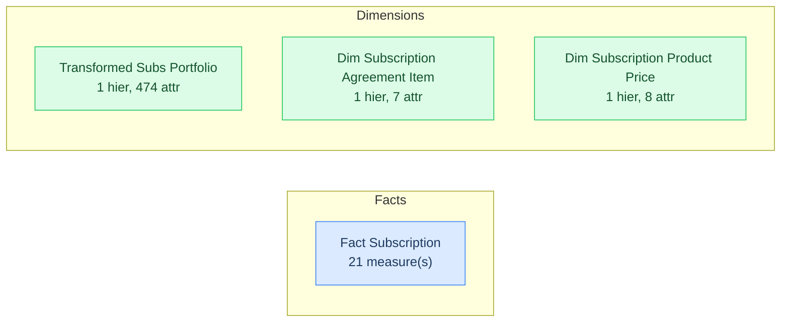

# SML Generation Report

| Property | Value |
|---|---|
| **Model** | `SkyDryRun04TrackA` |
| **Generated** | 2026-08-06T04:28:02.700Z |
| **Connection** | `sky_ps_utils_dryrun_04_postgres` |
| **Catalog** | SkyDryRun04TrackA |
| **Schema** | `sky_ps_utils_dryrun_04_track_a` |
| **Dialect** | postgresql |
| **Facts** | 1 |
| **Dimensions** | 3 |
| **Metrics** | 21 |
| **Secondary Attributes** | 542 |
| **Relationships** | 0 |
| **Files generated** | 10 |

## Table of Contents

1. [Model Diagram](#model-diagram)
2. [Generated Files](#generated-files)
3. [Fact Table Detail](#fact-table-detail)
4. [Inference Decisions](#inference-decisions)
   - [Table Classification](#table-classification)
   - [Relationship Inference](#relationship-inference)
   - [Column Omissions](#column-omissions)
   - [Structural Notes](#structural-notes)

---

## Model Diagram

Solid arrows (→) are fact-to-dimension joins. Dashed arrows (-.->) are dimension-to-dimension (snowflake) joins. Bridge/junction tables are shown in yellow.

---

## Generated Files

| File | Type | Description |
|---|---|---|
| `catalog.yml` | Catalog | AtScale catalog labeled "SkyDryRun04TrackA" |
| `connections/sky-ps-utils-dryrun-04-postgres.yml` | Connection | Database connection definition |
| `datasets/dim_subscription_agreement_item.yml` | Dataset | Source table mapping for dimension `dim_subscription_agreement_item` (7 attribute(s)) |
| `datasets/dim_subscription_product_price.yml` | Dataset | Source table mapping for dimension `dim_subscription_product_price` (8 attribute(s)) |
| `datasets/fact_subscription.yml` | Dataset | Source table mapping for fact `fact_subscription` (21 measure column(s)) |
| `datasets/transformed_subs_portfolio.yml` | Dataset | Source table mapping for dimension `transformed_subs_portfolio` (474 attribute(s)) |
| `dimensions/dim_subscription_agreement_item.yml` | Dimension | Dimension "Dim Subscription Agreement Item" — 1 hierarchy(s), 7 attribute(s) |
| `dimensions/dim_subscription_product_price.yml` | Dimension | Dimension "Dim Subscription Product Price" — 1 hierarchy(s), 8 attribute(s) |
| `dimensions/transformed_subs_portfolio.yml` | Dimension | Dimension "Transformed Subs Portfolio" — 1 hierarchy(s), 474 attribute(s) |
| `models/skydryrun04tracka.yml` | Model | Model "SkyDryRun04TrackA" — 0 relationship(s), 21 metric(s) |

---

## Fact Table Detail

Each column in every fact table is listed with how it was treated during inference.

### `fact_subscription`

| Column | Type | Decision | Detail |
|---|---|---|---|
| `id` | `TEXT` | Metric | Generated: `m_fs_id_count` |
| `dw_created_dt` | `TIMESTAMP` | Attribute | Kept as degenerate dimension (non-numeric, non-key) |
| `dw_last_modified_dt` | `TIMESTAMP` | Attribute | Kept as degenerate dimension (non-numeric, non-key) |
| `created_dt` | `TIMESTAMP` | Attribute | Kept as degenerate dimension (non-numeric, non-key) |
| `created_by_id` | `TEXT` | Attribute | Kept as degenerate dimension (non-numeric, non-key) |
| `account_type` | `TEXT` | Attribute | Kept as degenerate dimension (non-numeric, non-key) |
| `portfolio_id` | `TEXT` | Attribute | Kept as degenerate dimension (non-numeric, non-key) |
| `account_number` | `TEXT` | Omitted | see Column Omissions section |
| `billing_account_id` | `TEXT` | Attribute | Kept as degenerate dimension (non-numeric, non-key) |
| `currency_code` | `TEXT` | Attribute | Kept as degenerate dimension (non-numeric, non-key) |
| `service_instance_id` | `TEXT` | Attribute | Kept as degenerate dimension (non-numeric, non-key) |
| `type_id` | `TEXT` | Attribute | Kept as degenerate dimension (non-numeric, non-key) |
| `type` | `TEXT` | Attribute | Kept as degenerate dimension (non-numeric, non-key) |
| `sub_type` | `TEXT` | Attribute | Kept as degenerate dimension (non-numeric, non-key) |
| `start_dt` | `TIMESTAMP` | Attribute | Kept as degenerate dimension (non-numeric, non-key) |
| `first_activation_dt` | `TIMESTAMP` | Attribute | Kept as degenerate dimension (non-numeric, non-key) |
| `first_enablement_dt` | `TIMESTAMP` | Attribute | Kept as degenerate dimension (non-numeric, non-key) |
| `subscription_tenure` | `BIGINT` | Metric | Generated: `m_fs_subscription_tenure_sum`, `m_fs_subscription_tenure_avg`, `m_fs_subscription_tenure_min`, `m_fs_subscription_tenure_max` |
| `product_count` | `BIGINT` | Metric | Generated: `m_fs_product_count_sum`, `m_fs_product_count_avg`, `m_fs_product_count_min`, `m_fs_product_count_max` |
| `active_blocked_count` | `BIGINT` | Metric | Generated: `m_fs_active_blocked_count_sum`, `m_fs_active_blocked_count_avg`, `m_fs_active_blocked_count_min`, `m_fs_active_blocked_count_max` |
| `post_active_count` | `BIGINT` | Metric | Generated: `m_fs_post_active_count_sum`, `m_fs_post_active_count_avg`, `m_fs_post_active_count_min`, `m_fs_post_active_count_max` |
| `terminated_count` | `BIGINT` | Metric | Generated: `m_fs_terminated_count_sum`, `m_fs_terminated_count_avg`, `m_fs_terminated_count_min`, `m_fs_terminated_count_max` |
| `churn_flag` | `BOOLEAN` | Attribute | Kept as degenerate dimension (non-numeric, non-key) |
| `active_flag` | `BOOLEAN` | Attribute | Kept as degenerate dimension (non-numeric, non-key) |

---

## Inference Decisions

### Table Classification

Classification priority: explicit bridge/dim/lookup naming patterns → explicit fact naming patterns → FK topology (FKs present + numeric payload columns) → dimension fallback.

| Table | Classification | Signal |
|---|---|---|
| `fact_subscription` | **Fact** | Has FK references to other tables and at least one numeric measure column |
| `transformed_subs_portfolio` | **Dimension** | No qualifying fact-table signals |
| `dim_subscription_agreement_item` | **Dimension** | No qualifying fact-table signals |
| `dim_subscription_product_price` | **Dimension** | No qualifying fact-table signals |

### Relationship Inference

Relationships are built from declared FK constraints first. When a column named `<stem>_id`, `<stem>_key`, or `<stem>_sk` exists without a declared FK, the engine searches for a table named `<stem>` or `<stem>s` with a matching single-column primary key and synthesises the join.

| From Dataset | Join Columns | To Dimension | Source |
|---|---|---|---|

### Column Omissions

_No column omissions detected._

### Structural Notes

- **[WARNING]** Dimension table "transformed_subs_portfolio" has no primary key — inferring composite key from NOT NULL columns: []
- **[WARNING]** Dimension table "dim_subscription_status" has no primary key — inferring composite key from NOT NULL columns: [id, subscription_id, dw_created_dt, dw_last_modified_dt, effective_from_dt, effective_from_dt_csn_seq, effective_from_dt_seq, effective_to_dt, created_dt, created_by_id, last_modified_dt, last_modified_by_id, status_code]
- **[WARNING]** Dimension table "dim_subscription_agreement_item" has no primary key — inferring composite key from NOT NULL columns: [id, subscription_id, dw_last_modified_dt, created_dt, created_by_id, last_modified_dt, last_modified_by_id, minimum_term_months, subscription_agreement_id, contract_code]
- **[WARNING]** Dimension table "dim_subscription_change_attempt" has no primary key — inferring composite key from NOT NULL columns: [id, dw_last_modified_dt, created_dt, created_by_id, last_modified_dt, last_modified_by_id, type, change_attempt_dt]
- **[WARNING]** Dimension table "dim_subscription_entitlement" has no primary key — inferring composite key from NOT NULL columns: [id, subscription_id, dw_created_dt, dw_last_modified_dt, effective_from_dt, effective_from_dt_csn_seq, effective_from_dt_seq, effective_to_dt, created_dt, created_by_id, last_modified_dt, last_modified_by_id, entitlement_id, entitlement_code, entitlement]
- **[WARNING]** Dimension table "dim_subscription_product_price" has no primary key — inferring composite key from NOT NULL columns: [id, subscription_id, dw_created_dt, dw_last_modified_dt, effective_from_dt, effective_to_dt, entitlement_id, catalogue_product_id, catalogue_product_name, catalogue_product_description, catalogue_product_type, catalogue_product_transaction_code, catalogue_product_price, free_trial_flag, bundled_flag]

---

*See [STYLE.md](./STYLE.md) for the naming conventions applied during generation.*
